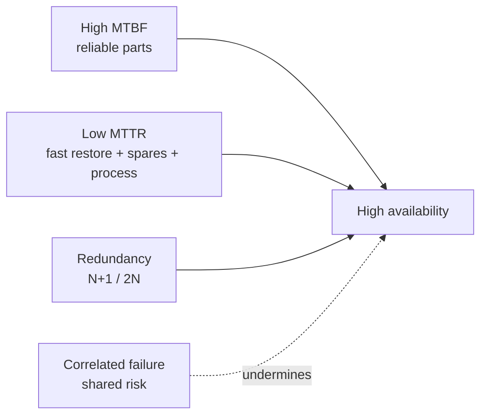

# The Mission-Critical Site

**Module ID:** `01-mission-critical`  
**Depth:** Standard (interview-ready)  
**Audience:** Career-changers with network deploy experience; facilities terms are defined on first use.

---

## Learning objectives

By the end of this module you can:

- Explain how a data centre (DC) sits in **business continuity** and revenue/risk language—not only “IT.”
- Name who typically owns **facilities vs IT vs finance vs TPM**, and how an **org-split** outage starts; point at **Module 15** for the 2.1 organizational-structure heading.
- Differentiate the six classic **types of data centres** (enterprise, colocation, hyperscale/cloud, edge, modular, telco/central office) as the 2018–2020 baseline, **and** name 2026 types (**neocloud**, **GPU colo**, **AI factory**, **behind-the-meter generation campus**) and how they differ from retail/wholesale colo.
- List the primary **elements of a data centre** (white space, grey space, MEP, network, security, operations) and who typically owns them.
- Frame **facility unavailability** in 2026 terms: the **power path** (UPS / ATS / generator) leads facility events; **cooling is usually a cascade** (Modules 09 and 10); **human/process is a contributing factor**, not a third of the pie (**Module 15** by name). Refuse an invented outage percentage.
- Distinguish **availability** from **reliability**, relate “nines” to annual downtime with a **scope drill** (per service vs per site vs per component; planned vs unplanned; whose clock), and explain why five-nines is expensive and hard.
- State that at **40–100 kW** a UPS without cooling collapses thermal ride-through from **minutes to seconds**, and point at **Module 09** rather than teaching the plant.
- Frame a site as **mission-critical**: what must stay up, for whom, and at what cost of failure.

---

## Why it matters (ops / design / TPM interview angle)

If you come from **network deployment** (cabling, switches, WAN, change windows), you already understand uptime pressure. Facilities language is the same problem one layer down: electricity, heat rejection, water, fire, and people can take the whole network offline even when every packet design is correct.

Interviewers (ops leads, design engineers, technical program managers) use this domain to test whether you:

1. **Think in business impact**, not device health. “The core went down” is incomplete; “checkout and payments stopped for 47 minutes during peak” is the language that drives budget and SLA.
2. **See the site as a system.** Power, cooling, network, and process are coupled. A UPS works until the room overheats because chillers lost power on a shared feed—that is a *site* failure mode, not a “network” or “power” silo. In 2026 language: start at the **power path**; treat cooling as a **cascade**; treat people/process as **contributing**, not as a third peer bucket.
3. **Know the vocabulary of criticality.** *Mission-critical* means the workload’s failure has unacceptable impact (safety, legal, revenue, brand, national infrastructure). Not every rack is mission-critical; treating everything as Tier-max is a design and cost error.
4. **Name the 2026 site** sitting in front of you. Enterprise / colo / hyperscale is the 2018–2020 baseline. A Fluidstack-style oral will also ask whether this hall is a **neocloud**, a **GPU colo**, an **AI factory**, or a **behind-the-meter campus**.

For TPM / hybrid roles: you will schedule maintenance, negotiate change freezes, and triage incidents across vendors (utility, UPS OEM, colo provider, NOC). This module is the mental model those conversations assume. **Who sits in which seat** (facilities, IT, finance, you as TPM) is part of that model—see **Business organization** below, then **Module 15** for the 2.1 org heading.

---

## Core concepts

### What is a data centre?

A **data centre** is a facility purpose-built (or purpose-adapted) to house IT equipment—servers, storage, network gear—under controlled environmental, power, security, and operational conditions. It is not “a room with servers”; it is a **supporting infrastructure stack** whose job is continuous, predictable service delivery.

**Mission-critical site** (in this syllabus sense): a facility whose sustained outage would cause severe organizational harm—lost revenue, regulatory breach, safety impact, or inability to run core operations. Banks, hospitals, exchanges, cloud regions, and many enterprise hubs qualify; a lab closet usually does not.

### Types of data centres

The six rows below are the **2018–2020 baseline**. Keep them. A 2026 oral still uses them; it then asks a second question the baseline cannot answer.

| Type | Who owns / operates | Typical drivers | Notes for network people |
|---|---|---|---|
| **Enterprise** | The business owns the facility or leases the building | Control, compliance, latency to campus, sunk cost | You may own copper/fiber plant end-to-end; facilities may be a different org. |
| **Colocation (colo)** | Provider owns building/power/cooling; customer owns IT in cages/suites | Speed to deploy, shared capital cost, multi-carrier | Cross-connects, MMR (meet-me room), remote hands, SLA boundaries matter. |
| **Hyperscale / cloud** | Cloud or large web operators | Extreme density, automation, cost at scale | You consume regions/AZs; design assumes multi-site failure domains. |
| **Edge** | Telco, content, enterprise, or specialist providers | Low latency, local processing, constrained footprint | Smaller rooms, fewer staff, higher relative risk of single points of failure. |
| **Modular / prefab** | Often enterprise or colo using factory-built modules | Speed, repeatable design, capacity steps | Power/cooling packaged with IT volume; integrate carefully with site utilities. |
| **Telco / central office** | Carriers | Five-nines culture, NEBS-class equipment norms, long-lived plant | Overlaps DC practices; different standards history (telecom vs IT DC). |

**Retail colo** vs **wholesale colo:** retail = cages/cabinets with shared hall infrastructure; wholesale = larger private suites or pods with more customer control over fit-out. **Multi-tenant** sites mix customers; **single-tenant** (or dedicated) sites serve one organization.

There is no single “best” type. Choice is a function of capital, control, latency, compliance, staffing, and growth model.

#### 2026 types (add these; do not replace the baseline)

A 2026 Fluidstack-style interviewer who asks “what kind of site is this?” is not asking you to recycle the six-row brochure.

| Type | What it is | How it differs from retail / wholesale colo |
|---|---|---|
| **Neocloud** | A GPU-as-a-service / AI-cloud operator. They typically **consume** wholesale halls or dedicated campuses and **sell** GPU hours, clusters, or reserved capacity. | A *business model*, not a building product. The customer of the colo is the neocloud, not the end user of the model. Cluster interconnect, liquid, and high kW are first-class; mixed 5–10 kW retail cages are the wrong mental model. |
| **GPU colo** | A colo *product*: halls or suites sold as GPU-ready (density, liquid / RDHx landing, busway, often private suite rather than a shared 5 kW cage). Customer still owns the IT. | Still colo (provider MEP, customer IT, a demarc). The SKU is the **hall**, not the cage: kW/rack, liquid path, and fabric landing are in the brochure. Do not call a 40–100 kW liquid row “retail colo with more power.” |
| **AI factory** | An owner-operator campus (hyperscaler or large AI lab) built as a **production plant** for training / inference at hall-to-campus scale. | Not a colo product. Single-tenant or few-tenant; campus-level power, water, and fiber; treated as industrial plant. You are not buying a cage. |
| **Behind-the-meter (BTM) generation campus** | A site whose **energization path** is on-site or co-located generation (gas turbines, large BESS, fuel cells; sometimes sited at a power plant) because the utility **interconnect queue** is years. | An *energization model*, not a tenancy model. It can sit under wholesale, AI-factory, or neocloud. The old story is “utility, then standby generator.” BTM makes the plant a **primary** path. Queue, curtailment, and on-site generation as a *new* failure class live in **Module 03** (siting) and **Module 06** (path)—do not steal them here. |

**Speakable one-liners**

- “Neocloud sells GPU time; it usually *rents* the hall.”
- “GPU colo is wholesale-class colo whose product is density and liquid, not a shared cage.”
- “AI factory is an owner-operator plant, not a tenancy.”
- “BTM is how the campus gets watts when the interconnect queue will not.”

### Business organization

Public heading, taught thin. **Module 15** owns the 2.1 catalog: organizational structure, service catalog, SLM / OLA, training, safety roles, security matrix.

Four seats show up in every incident bridge. They are not the same budget, the same ticket queue, or the same “green” dashboard.

| Seat | Typically owns | Outage sentence they say first |
|---|---|---|
| **Facilities / critical facilities** | Building, grey-space MEP, plant vendors (UPS, chiller, generator), many colo-provider obligations | “The plant is in alarm / the transfer failed.” |
| **IT / infrastructure** | White-space compute, network, OS, apps, often in-rack PDUs | “The service is down / the fabric partitioned.” |
| **Finance / real estate** | Capex, lease, insurance, SLA credits, who pays for the second utility or the extra hall | “What did the hour cost, and whose contract pays.” |
| **TPM / program** | Cross-org change windows, vendor coordination, the bridge itself | “Who owns this breaker, and is the freeze in effect.” |

**How an org-split outage starts.** Each seat is green on *its* object. Facilities sees a healthy UPS. IT sees dual PSUs. Finance sees an SLA that assumed those two facts were the same path. The TPM discovers during the bridge that **no one owned the transfer switch**, or that the change window was approved in IT and never landed in facilities. That is the same failure as the colo **demarc** oral below—“I thought *they* owned that breaker”—one layer up, inside a single company.

Do not grow this into Module 15’s org heading, OLA, or training matrix. Name the four seats, name the split, point at **Module 15**.

### Business impact of downtime

Downtime is not only “servers off.” From a business view:

- **Direct revenue loss** — transactions, ads, streaming, trading not completed.
- **Productivity loss** — staff idle, partners blocked, support queues explode.
- **Contractual / SLA cost** — credits, penalties, breach of customer SLAs you sold.
- **Regulatory / legal** — uptime and data-availability obligations in finance, healthcare, government.
- **Reputation and churn** — public outages are permanent marketing for competitors.
- **Secondary damage** — failed failovers, data inconsistency, corrupted pipelines, security posture changes during recovery chaos.

**Cost of downtime** is often expressed as \$/hour or \$/minute for a service class. Published industry averages vary wildly by sector and methodology—treat any single “average cost” number as a **planning conversation starter**, not a law. What *does* matter in interviews:

- Map **critical services** → **supporting infrastructure dependencies** (power path, cooling zone, network path, DNS, identity).
- Distinguish **planned** downtime (maintenance window) from **unplanned** (incident). Both cost; only one is usually scheduled. Whether planned work counts against the nines is a **contract** question—see the scope drill below.
- Recovery is not free: RTO (recovery time objective) and RPO (recovery point objective) are business requirements that drive dual-site design, backup power duration, and runbooks.

**Business continuity (BC)** is the organizational program to keep critical functions running through disruption. **Disaster recovery (DR)** is the IT/facilities subset for restoring systems after major failure. The mission-critical *site* is one continuity lever; multi-site architecture is another. Site-level perfection does not replace geographic diversity when the risk is regional (storm, grid event, fiber cut on a shared route).

### Elements of a data centre

Think in layers and spaces. Network deploy veterans already know “core / distribution / access”; facilities has analogous structure.

**Spaces**

- **White space** — the IT equipment floor (racks, cabinets, cold/hot aisles). The “product” surface customers tour.
- **Grey space** (sometimes called support or mechanical space) — UPS rooms, battery rooms, switchgear, chillers, CRAH/CRAC plants, generators, fuel systems. Not where servers live, but where availability is manufactured.
- **Ancillary spaces** — NOC, security operations, staging/receiving, storage, workshops, admin, loading docks, meeting rooms.

**MEP** — Mechanical, Electrical, Plumbing (industry shorthand for the building services that make white space viable): power distribution, cooling, piping, drains, sometimes fire-suppression water/agent systems.

**Primary element groups**

1. **Power infrastructure** — utility intake → transformers → switchgear → UPS → PDUs / busway → rack. Plus generators, ATS/STS, grounding/bonding. (Deep dive: **Module 06**. This file keeps a labeled N / N+1 / 2N preview only.)
2. **Cooling infrastructure** — heat removal from IT load to outdoor rejection (air or liquid paths, CRAC/CRAH, chillers, economizers, containment). (Deep dive: **Module 09**. Water as the hidden input: **Module 10**.)
3. **IT and network infrastructure** — servers, storage, LAN/WAN, structured cabling, meet-me rooms, demarcation. The MDA / HDA / EDA diagram below is a **preview**; **Module 11** owns the hierarchy.
4. **Physical security and safety** — perimeter, access control, CCTV, mantraps, visitor process; life safety (egress, lighting, signage). (**Module 13**.)
5. **Fire detection and suppression** — early warning (e.g. aspirating smoke detection in many designs), clean agent / water-based systems per design and code. (**Module 12**.)
6. **Environmental and building monitoring** — BMS (building management system), DCIM (data centre infrastructure management), EMS (environmental monitoring): temperature, humidity, leak, power metrics, alarms. This file names the three. **Module 14** owns the element list (what each one is, is not, and who trusts which screen).
7. **Operations** — procedures, change management, capacity planning, maintenance contracts, staffing (24×7 vs lights-out + remote hands). **MOPs** and the human-error *mechanism* live in **Module 15**—do not treat “write a better procedure” as the finished answer here.

**Ownership split (colo example):** provider typically owns building, shell MEP up to a demarcation (e.g. cage power feeds, cooling to the hall); customer owns IT gear, in-rack PDUs sometimes, and application SLAs. **Know your demarc**—most multi-party outages start as “I thought *they* owned that breaker.”

### Availability vs reliability

These terms are related but **not interchangeable**.

**Reliability**  
How long a component or system tends to operate without failure. Often discussed via **MTBF** (mean time between failures) for repairable systems, or failure rates. High reliability means failures are rare.

**Availability**  
The proportion of time a system is in a functioning state when needed. Classically:

\[
\text{Availability} = \frac{\text{Uptime}}{\text{Uptime} + \text{Downtime}}
\]

or, using reliability-engineering averages:

\[
A = \frac{\text{MTBF}}{\text{MTBF} + \text{MTTR}}
\]

where **MTTR** is mean time to repair (or more broadly, mean time to restore service).

**Key insight:** You can improve availability by making failures rare (**higher MTBF**) *or* by making recovery fast (**lower MTTR**)—or both. Redundancy (N+1, 2N) often targets *availability under single failure*, not infinite reliability of every part.

**Maintainability** (how easily/quickly you can repair) and **serviceability** affect MTTR. A highly reliable but unmaintainable design can still miss availability targets if a rare failure takes days to fix.

### Availability “nines” and annual downtime

Approximate **maximum downtime per year** if the percentage is continuous availability (order-of-magnitude interview numbers). Clock: a continuous year, **8760** hours.

| Availability | Common name | ~ Downtime / year |
|---|---|---|
| 99% | two nines | ~3.65 days |
| 99.9% | three nines | ~8.8 hours |
| 99.99% | four nines | ~52.6 minutes |
| 99.999% | five nines | ~5.3 minutes |

**Say the table.** The “9 hours / 1 hour” memory aid is sloppy oral. Three nines is **8.8 hours**; four nines is **52.6 minutes**, not “about an hour” as the number you lead with.

#### Scope drill (first-class — not a footnote)

A nines number without scope is marketing. Before you say “we are four nines,” pin all three:

1. **Per what?**
   - **Per service** — checkout was down 12 minutes; site power never dropped. The *customer* clock is red; the *hall* clock is green.
   - **Per site** — the hall / facility was unavailable (power path, cooling cascade, water, fire, evacuation).
   - **Per component** — this UPS string, this CRAH, this fiber lateral. A component can be four nines while the service is two, or the reverse.
2. **Planned vs unplanned.** Maintenance windows cost money either way. Whether they **count against the SLA** is a contract clause, not a law of physics. Read the contract. Do not assume “planned does not count.”
3. **Whose clock?** IT-service telemetry, the site/EPMS/BMS hall clock, and a public outage tracker are **different measurements**. They will disagree. Industry surveys that mix those clocks are still surveys—cite them as surveys; do not flatten them into one pie. **Module 15** adds the operator’s written log as a third facility clock; this file’s job is to make you *ask*.

**Independence caveat (keep this):** Parallel redundant paths do not multiply nines unless failure modes are independent. Shared fuel delivery, shared control software, or a single roof leak can correlate “independent” systems.

Five-nines at a single site is extremely hard and expensive; many organizations buy **multi-site** architecture instead of polishing one building forever. Nines are **math**, not a Tier or Rated plaque—**Module 02** owns Rated ≠ Tier. Do not crosswalk nines onto ratings.

### How unavailability actually starts (2026 structure)

Do **not** recite power, cooling, and human error as three peer **root-cause** buckets. That cartoon is retired here. Do **not** replace it with a memorized survey percentage. Public industry surveys (Uptime Institute annual outage analyses and peers) are useful as *surveys*—figures, methodology, and clocks change year to year. Cite the survey class; refuse a fake precise percentage. **Module 15** owns the stronger honesty rule: the most-repeated “human error is the large majority” claim is **not currently verifiable** from anything freely readable, and circulation is not corroboration. Teach the **mechanism**.

**1. Power path leads facility events.**  
For *facility* unavailability, start at the on-site path: **UPS**, **ATS / transfer switch**, **generator**—not “the utility died.” A resilient site is *supposed* to ride through a utility event. What actually drops the floor is fail-to-start, failed transfer, UPS overload or battery exhaustion, the wrong breaker, a single path where redundancy was assumed. **Module 06** owns the path grammar (ATS vs STS, generator-started ≠ load-saved). This file’s job is: **look at the path first.**

**2. Cooling is usually a cascade.**  
Chiller / CRAH / airflow / setpoint faults are real. In the 2026 picture they are more often the *next* failure after the power path or the water path moved: utility blip → UPS on battery → generator fails or transfer is late → load stays up → **fans and pumps do not** → thermal trip. “The ticket says cooling” is not the same as “cooling was a peer third of the pie.” **Module 09** owns the plant and “generators up ≠ cooling up.” **Module 10** owns water-as-the-hidden-input (losing makeup *looks* like a cooling failure).

**3. Human / process is contributing — not a third of the pie.**  
Mis-scheduled maintenance, incomplete MOPs, working the live path, change without rollback, undocumented tribal knowledge, the org-split above: these **turn a redundant design into an outage**. They are **contributing factors, plural**—never “root cause” singular. They are not fixed by “train harder.” Error-likely situations are designed (labeling, interlocks, isolation points, peer-reviewed MOPs, paid shift overlap). **Module 15** owns contributor-vs-root, MOP craft, and the unverifiable-majority refusal. Point there by name.

**4. Other clocks you must not flatten into the cartoon.**

- **Network / IT-layer** — core routing, DNS, identity, storage fabric, software. Facilities-green and service-red is a *per-service* clock. Fiber / connectivity as a first-class **IT-service availability path** is previewed here and owned in **Module 03** (diverse OSP) and **Module 11** (plant).
- **External / environmental** — flood, fire, seismic, storm, vehicle impact, civil unrest, fiber cuts, utility substation events, fuel delivery blocked.
- **Security and safety actions** — forced shutdowns for fire, hazardous conditions, or security incidents; false alarms that trigger suppression or evacuation.

**Frequency vs impact, without the cartoon.** Daily operational discipline (change control, MOPs, labeling) and geographic risk (regional storm, grid event, shared fiber route) are both real. Design for both. Do not rank them with an invented share.

### AI-density thermal ride-through (pointer — do not steal Module 09)

Network-era halls (roughly 5–10 kW/rack) gave you **minutes** of thermal inertia after cooling stopped while the UPS held the IT load. At **40–100 kW** (GPU / AI rows) that window collapses toward **seconds**. Inlet or cold-plate temperature is the clock, not the UPS runtime sticker.

Say this much, then stop:

- **UPS without cooling is not a cooling plan.** The batteries keep watts in the silicon; they do not reject heat.
- **Load variability** (training jobs spinning up, idle-to-full swings) and **operating near power limits** shrink the already-short window. A hall that is “fine” at 60% will not ride through the same event at 95%.
- The plant response (fans, pumps, CDU, liquid families, W-classes, STER) is **Module 09**. Water autonomy is **Module 10**. Sensing that has to page on a **seconds-scale rate-of-rise** is **Module 14**. This file only makes the *availability* point: density changes the clock.

### Water and interconnection as availability inputs (pointer — do not steal Modules 03 / 10)

Two inputs sit under the stack and are easy to forget if you only tour white space:

- **Water.** Evaporative and many hybrid plants need makeup. Losing the city main, the tank, or the chemistry program shows up as a “cooling” ticket. **Module 10** owns process vs fire water, tank hours, WUE, reclaim, and rights. Name water as an availability input; do not design the backup here.
- **Interconnection / grid.** Dual utility stickers do not energize a 2026 AI campus if the **interconnect queue** is years, or if the only path is a BTM plant you have not failure-mode’d. Diverse **fiber** is the same class of question on the IT-service clock. **Module 03** owns siting, queue-as-go/no-go, and “two carriers ≠ diverse OSP.” **Module 06** owns the electrical path once the site exists.

### How “mission-critical” is expressed in design

Without jumping ahead into full tier/rating schemes (later standards module):

- **Redundancy** — spare capacity so one failure does not stop IT load (N+1 generators, dual UPS, dual power supplies in servers).
- **Concurrent maintainability** — ability to service one path while the other carries load (a design goal of higher-class facilities).
- **Fault tolerance** — surviving a worst-case single failure without interruption (stronger claim; expensive).
- **Independence** — separate power trains, separate cooling, diverse fiber entrances so one event does not take both sides.

**N, N+1, 2N (preview — not Module 06’s path lesson):**  
- **N** = capacity exactly matching need (no spare).  
- **N+1** = need plus one spare unit.  
- **2N** = two full independent paths each able to carry the load.  
Details and trade-offs belong with power/cooling modules; the *mission* concept is: match topology to business criticality and budget.

---

## Key diagrams

### 1) Site dependency stack (power path leads; cooling cascades; people contribute)

People/ops is **not** a third peer pillar. Read top-down, then the contributing line at the bottom.

```text
                    ┌─────────────────────────────┐
                    │  Business services / users  │
                    └─────────────┬───────────────┘
                                  │ depends on
                    ┌─────────────▼───────────────┐
                    │  Apps / data / identity     │
                    └─────────────┬───────────────┘
                                  │
                    ┌─────────────▼───────────────┐
                    │  IT + network (white space) │
                    └─────────────┬───────────────┘
                                  │ needs a live power path
                    ┌─────────────▼───────────────┐
                    │  Power path (UPS / ATS /    │
                    │  generator) — leads most    │
                    │  facility events            │
                    └─────────────┬───────────────┘
                                  │ cascade when mechanical
                                  │ plant loses power or water
                    ┌─────────────▼───────────────┐
                    │  Cooling (usually cascade)  │
                    │  → Module 09 / 10           │
                    └─────────────┬───────────────┘
                                  │ inputs / constraints
          ┌───────────────────────┼───────────────────────┐
          ▼                       ▼                       ▼
   Utility / grid           Water / makeup          Fiber / interconnect
   interconnect             (Module 03 / 10)        (Module 03 / 11)
   (Module 03)

  Contributing — not a third of the pie:
  people / process / change / org-split
  (Module 15: contributor vs root;
   refuse an unverifiable "majority" statistic)
```

### 2) Simplified power path (IT load)

```text
  Utility ──► Transformer ──► Switchgear ──► UPS ──► PDU/Busway ──► Rack PSU
                 │                │           │
                 │                │           └──► Battery / energy storage
                 │                │
                 └──► Generator ◄─┴── ATS/STS (transfer) on loss of utility

  Legend: Any single box without a parallel path can be a SPOF (single point of failure).
  Depth: Module 06. This sketch is the "look at the path" oral, not the path lesson.
```

### 3) Simplified cooling loop (air-cooled hall mental model)

```text
  IT load (heat) ──► Room air ──► CRAC/CRAH ──► Chilled water / refrigerant
                                                      │
                                                      ▼
                                               Chiller / dry cooler
                                                      │
                                                      ▼
                                               Outdoor heat rejection

  Airflow:  Cold aisle ──► equipment ──► hot aisle ──► return to CRAC/CRAH
  (Containment reduces mixing; mixing reduces effective capacity.)
  Depth: Module 09. Water input: Module 10.
```

### 4) Cabling hierarchy (preview — Module 11 owns MDA / HDA / EDA)

```text
  Carrier / campus fiber
           │
           ▼
     Entrance / MMR (meet-me) ──► cross-connect
           │
           ▼
     MDA (main distribution area) ── core / spine
           │
           ▼
     HDA / IDA (horizontal / intermediate) ── aggregation
           │
           ▼
     EDA / rack (equipment distribution) ── servers, ToR/EoR

  Pathways: conduit, tray, underfloor, overhead — keep power and data separation rules.
  This file names the spaces so a tour has words. Module 11 is the hierarchy lesson.
```

### 5) Availability math (concept)



---

## Formulas / rules of thumb

**Availability**

\[
A = \frac{\text{MTBF}}{\text{MTBF} + \text{MTTR}}
\]

**Annual downtime (approx.)**

\[
\text{Downtime hours/year} \approx (1 - A) \times 8760
\]

(Use 8760 hours/year for rough interviews; leap years and exact SLA calendars differ.)

**Nines — say the table, not the slogan**

- 99.9% ≈ **8.8 hours**/year  
- 99.99% ≈ **52.6 minutes**/year  
- 99.999% ≈ **5.3 minutes**/year  

The “9 hours / 1 hour” memory aid is sloppy oral. Lead with **8.8 h** and **52.6 min**. Then immediately pin **scope**: per service vs per site vs per component; planned vs unplanned; whose clock.

**Series vs parallel (intuition only)**  
- Components **in series** (all must work): overall availability **worse** than the weakest link.  
- **Independent** parallel redundant paths: overall availability **better** than a single path.  
- If failures are **not** independent, parallel math lies—design for diversity, not just duplicate SKUs.

**Rules of thumb**

- **Business sets criticality; engineering sets topology.** Do not invent five-nines without a funded ops model.
- **Power path first** for facility events (UPS / ATS / generator). Cooling is usually a **cascade** (Modules 09 / 10). People/process is **contributing** (Module 15)—not a third of a pie, and not a majority statistic you can defend from a free source.
- **Know the demarc** in multi-party sites (colo, managed power, shared generators). Org-split inside one company is the same sentence.
- **Power and cooling are co-dependent:** UPS runtime without cooling only buys minutes at classic density and **seconds** at 40–100 kW. Point at Module 09; do not design the plant here.
- **Water and interconnect are availability inputs.** Point at Modules 03 and 10.
- **Edge sites fail differently:** less staff, fewer spares, longer MTTR—design and contracts must assume that.
- **2026 types are speakable:** neocloud / GPU colo / AI factory / BTM campus. Keep the six classic types as the baseline.

---

## Common failure modes and misconceptions

| Misconception | Reality |
|---|---|
| “We have dual power supplies, so we’re fine.” | Both PSUs may feed from the same upstream UPS or PDU panel—**trace the path**. |
| “Reliability = availability.” | Slow repair kills availability even if failures are rare. |
| “Five nines means we never go down.” | ~5.3 minutes/year budget; **scope** and planned work still matter. |
| “We are four nines.” | Four nines of *what*, on *whose clock*, counting *which* planned work? |
| “Cloud means no data centre risk.” | Risk moves to provider regions/AZs and *your* connectivity/identity design. |
| “The outage was cooling, so power is healthy.” | Cooling is usually a **cascade**. Contributing factors, **plural** (Module 15)—do not stop at one domain. |
| “Power, cooling, and people are three equal root causes.” | Retired cartoon. Power path leads facility events; cooling cascades; human/process contributes. No pie. No fake %. |
| “Human error is solved by more training only.” | Fallibility is not trained out (Module 15). Design error-proofing: labeling, interlocks, maintenance bypasses, peer review of MOPs. |
| “Most outages involve people and process.” | Unsourced majority. Refuse it. Teach the mechanism; point at Module 15’s unverifiable-majority rule. |
| “White space looks great on a tour = good DC.” | Grey-space capacity, single points of failure, and ops maturity are invisible on a walkthrough. |
| “Redundancy removes the need for maintenance.” | Redundancy *enables* maintenance; deferred maintenance turns N+1 into N-after-neglect. |
| “GPU colo is just retail colo with more kW.” | Different product: hall-level density, liquid landing, often wholesale-class suite—not a shared 5 kW cage. |
| “BMS / MDA / MOP — I can finish those here.” | **Module 14** (BMS/EMS/DCIM), **Module 11** (MDA/HDA/EDA), **Module 15** (MOPs). This file names and points. |

**Classic failure pattern:** concurrent maintenance on the “redundant” path while the primary is degraded—temporary **N-0** during the window. Change freezes and maintenance scheduling exist to prevent this. (Labeled preview: the path-trace that makes N-0 visible is **Module 06**.)

---

## Interview drills

**Q1. What makes a site “mission-critical”?**  
**A:** The business impact of sustained loss of the services it hosts is unacceptable—major revenue, safety, legal/regulatory, or core operational failure. Criticality is a **business classification** that then drives engineering (redundancy, staffing, multi-site), not a marketing label for every server room.

**Q2. Availability vs reliability—in one minute?**  
**A:** Reliability is about how rarely something fails (e.g. long MTBF). Availability is the fraction of time the service is usable, which also depends on how fast you restore (MTTR) and whether redundancy hides failures. A reliable but hard-to-repair system can still have poor availability.

**Q3. Where do facility outages actually start?**  
**A:** At the **power path**—UPS, transfer switch, generator—not “the utility died.” Cooling is usually a **cascade** (plant lost power or water; thermal ride-through ran out)—Modules 09 and 10. People and process show up as **contributing factors** (wrong breaker, skipped MOP, org-split ownership), not as a third of a pie. **Module 15** owns contributor-vs-root and the refusal to treat an unverifiable “majority human error” statistic as law. Cite surveys as surveys. Do not memorize a fake percentage. Do not say “power, cooling, and human error.”

**Q4. Enterprise DC vs colo—what changes for you as a network engineer?**  
**A:** In enterprise you may own more of the path end-to-end. In colo you own IT and often in-cage network; the provider owns building MEP and shared spaces. Cross-connects, SLA demarcation, remote hands, and multi-tenant security become first-class. Incident bridges include provider NOC early. **Know your demarc.** A **GPU colo** is still colo (provider MEP, customer IT) but the *product* is a dense / liquid hall, not a retail cage.

**Q5. Why is five-nines expensive?**  
**A:** Each additional nine cuts allowed downtime roughly by 10×, which forces redundancy, concurrent maintainability, rigorous process, spare inventory, and often multi-path utilities/fiber. Diminishing returns: many orgs get better business outcomes from **multi-site active designs** than from polishing a single hall to five-nines. Always pin **scope** before you say the number.

**Q6. “We are 99.99%.” What do you ask next?**  
**A:** Per **service**, per **site**, or per **component**? Does **planned** work count? **Whose clock**—IT-service telemetry, the hall / EPMS, or a public tracker? Then say the table: four nines on a continuous year is **~52.6 minutes**, not a Tier sticker.

**Q7. What kind of site is a GPU colo / neocloud / AI factory / BTM campus?**  
**A:** **GPU colo** = colo product sold as a GPU-ready hall (density + liquid), customer still owns IT. **Neocloud** = GPU-cloud *business*; usually rents wholesale / dedicated halls and sells GPU time. **AI factory** = owner-operator production campus, not a tenancy. **BTM campus** = energization path is on-site / co-located generation because the interconnect queue will not play; Module 03 / 06 own the queue and the path.

**Q8. Facilities says the UPS is green. IT says both PSUs are lit. The service is down. What failed?**  
**A:** An **org-split** until proven otherwise: two green objects on two dashboards, no owner of the path (or the transfer, or the demarc). Name the four seats (facilities, IT, finance, TPM). Trace the path. **Module 15** is where the 2.1 org heading and the postmortem “contributing factors, plural” live.

---

## Self-check quiz

1. **White space** primarily refers to:  
   a) Generator yards  
   b) Areas housing IT equipment (racks/cabinets)  
   c) Only the NOC  
   d) Utility substations off-site  

2. **Availability** is best described as:  
   a) How expensive the UPS is  
   b) How rarely a part fails, ignoring repair time  
   c) The proportion of time a system is functioning when required  
   d) The number of servers in a rack  

3. If MTBF is very high but MTTR is days (no spares, no staff), availability will likely be:  
   a) Perfect  
   b) Still poor when a failure finally occurs  
   c) Unaffected by MTTR  
   d) Equal to five-nines automatically  

4. **Colocation** typically means:  
   a) You own the building MEP and the cloud provider owns nothing  
   b) A provider supplies facility infrastructure; customers place IT in shared or private spaces  
   c) Only edge micro-sites  
   d) No SLAs exist  

5. Dual server power supplies guarantee dual utility paths:  
   a) Always  
   b) Never need checking  
   c) Only if upstream paths are actually diverse—you must trace them  
   d) Only for copper networks  

6. ~99.99% availability is on the order of:  
   a) A month of downtime per year  
   b) About an hour of downtime per year  
   c) Zero downtime forever  
   d) Ten days per year  

7. A common **cascade** after utility loss is:  
   a) DNS improves automatically  
   b) UPS carries load → generators must start → cooling must stay alive → thermal risk if any step fails  
   c) Fire systems disable power intentionally every time  
   d) Fiber latency doubles as a rule  

8. Business impact of downtime should be framed as:  
   a) Only the cost of a replacement PSU  
   b) Revenue, productivity, SLA credits, regulatory and reputation effects (as applicable)  
   c) Ping loss alone  
   d) Rack unit count  

9. A customer SLA of 99.99% is meaningful only after you pin:  
   a) The Tier plaque on the wall  
   b) Scope (service vs site vs component), planned vs unplanned, and whose clock  
   c) The UPS brand  
   d) Whether the hall is called white space  

10. A 2026-accurate sentence about *facility* unavailability is:  
    a) Power, cooling, and human error are three equal root-cause buckets  
    b) The power path (UPS / ATS / generator) leads facility events; cooling is usually a cascade; human/process is contributing — Module 15  
    c) Most outages are people, so train harder  
    d) Cooling is one-third of all outages  

11. A **neocloud** is best described as:  
    a) Another name for retail colo cages  
    b) A GPU-as-a-service business that typically consumes wholesale or dedicated halls and sells GPU time  
    c) A Tier rating  
    d) A BMS vendor  

12. Facilities’ UPS screen is green and IT’s dual PSUs are lit, but checkout is down. The first organizational question is:  
    a) Which of the four seats (facilities / IT / finance / TPM) owns the *path*, not just its object  
    b) Whether to buy a bigger generator first  
    c) Whether the hall is white space  
    d) Which survey percentage to recite  

### Answers

<details>
<summary>Click to reveal answers</summary>

1. **b** — White space is the IT equipment floor.  
2. **c** — Availability is uptime as a fraction of required time (function of failure *and* restore).  
3. **b** — Long MTTR destroys availability when rare failures happen.  
4. **b** — Colo: shared facility services; customer IT.  
5. **c** — Diversity is an end-to-end property; dual PSUs can share a single upstream failure domain.  
6. **b** — Four nines ≈ 52.6 minutes/year (order of one hour). Lead with **52.6 min**, not the slogan.  
7. **b** — Classic power→runtime→generator→cooling coupling (cooling as cascade).  
8. **b** — Multi-factor business impact, not only hardware cost.  
9. **b** — Nines without scope are marketing.  
10. **b** — 2026 structure. (a) is the retired cartoon; (c) and (d) are unsourced majority / invented share.  
11. **b** — Neocloud is a business model, not a building product.  
12. **a** — Org-split: two green objects, no owner of the path. Module 15 for the 2.1 org heading.

</details>

---

## Further free resources

Public standards and primers (names and free entry points—no paywalled EPI courseware):

- **ANSI/TIA-942** family — data centre telecommunications infrastructure; public overviews and standard summaries from TIA and reputable training partners’ *marketing* outlines (buy the standard for normative text).  
- **ISO/IEC 22237** series — data centre facilities and infrastructures (international; successor direction to earlier EN 50600 alignment discussions—check current national adoptions).  
- **EN 50600** — European data centre standards series (facilities and infrastructures).  
- **ASHRAE TC 9.9** — *Thermal Guidelines for Data Processing Environments* (widely cited environmental envelopes; ASHRAE publications).  
- **BICSI** — data centre design best-practice literature (e.g. BICSI 002 as a recognized design reference—obtain via BICSI).  
- **Uptime Institute** — public articles and annual outage analyses (Tier Standard is a **commercial rating system**, distinct from TIA “Rated” language—do not conflate blindly). Treat outage-analysis figures as **surveys**, not a pie to memorize.  
- **NFPA** — fire codes relevant to IT equipment rooms (e.g. NFPA 75 / 76 discussions in industry practice; enforceability is via **local AHJ** and adopted code editions).  
- **IEEE / IEC** — power quality and electrical distribution standards referenced by electrical engineers (e.g. grounding and power distribution practices).  
- **Vendor primers (free):** major UPS, cooling, and colo operators publish white papers on dual-cord design, containment, and SLA demarcation—use for intuition, not as law.  
- **National electrical and building codes** as adopted in your jurisdiction (NEC/NFPA 70 in the US, local equivalents elsewhere)—**code beats brochure**.

**Study tip:** Next module (**Data Centre Standards**) maps who governs what. This module’s job was *why the site exists*, *what is in it*, *how we talk about it staying up*, and *how 2026 talks about why it went down*. **Module 15** is where contributor-vs-root and the unverifiable-majority refusal are finished.

---

*Self-study reconstruction for interview and operational fluency. Not official EPI®/CDCP® training or exam content.*
