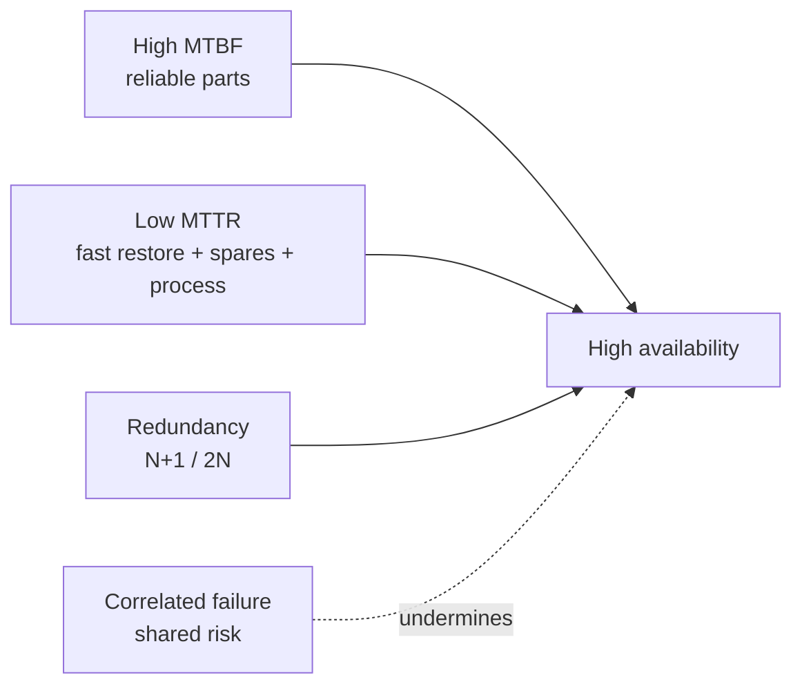

# The Mission-Critical Site

**Module ID:** `01-mission-critical`  
**Depth:** Standard (interview-ready)  
**Audience:** Career-changers with network deploy experience; facilities terms are defined on first use.

---

## Learning objectives

By the end of this module you can:

- Explain how a data centre (DC) sits in **business continuity** and revenue/risk language—not only “IT.”
- Differentiate major **types of data centres** (enterprise, colocation, hyperscale/cloud, edge, modular, telco/central office) and what each optimizes for.
- List the primary **elements of a data centre** (white space, grey space, MEP, network, security, operations) and who typically owns them.
- Name **primary causes of unavailability** (power, cooling, human error, cascading failures, external events) and discuss frequency vs impact.
- Distinguish **availability** from **reliability**, relate “nines” to annual downtime, and explain why five-nines is expensive and hard.
- Frame a site as **mission-critical**: what must stay up, for whom, and at what cost of failure.

---

## Why it matters (ops / design / TPM interview angle)

If you come from **network deployment** (cabling, switches, WAN, change windows), you already understand uptime pressure. Facilities language is the same problem one layer down: electricity, heat rejection, water, fire, and people can take the whole network offline even when every packet design is correct.

Interviewers (ops leads, design engineers, technical program managers) use this domain to test whether you:

1. **Think in business impact**, not device health. “The core went down” is incomplete; “checkout and payments stopped for 47 minutes during peak” is the language that drives budget and SLA.
2. **See the site as a system.** Power, cooling, network, and process are coupled. A UPS works until the room overheats because chillers lost power on a shared feed—that is a *site* failure mode, not a “network” or “power” silo.
3. **Know the vocabulary of criticality.** *Mission-critical* means the workload’s failure has unacceptable impact (safety, legal, revenue, brand, national infrastructure). Not every rack is mission-critical; treating everything as Tier-max is a design and cost error.

For TPM / hybrid roles: you will schedule maintenance, negotiate change freezes, and triage incidents across vendors (utility, UPS OEM, colo provider, NOC). This module is the mental model those conversations assume.

---

## Core concepts

### What is a data centre?

A **data centre** is a facility purpose-built (or purpose-adapted) to house IT equipment—servers, storage, network gear—under controlled environmental, power, security, and operational conditions. It is not “a room with servers”; it is a **supporting infrastructure stack** whose job is continuous, predictable service delivery.

**Mission-critical site** (in this syllabus sense): a facility whose sustained outage would cause severe organizational harm—lost revenue, regulatory breach, safety impact, or inability to run core operations. Banks, hospitals, exchanges, cloud regions, and many enterprise hubs qualify; a lab closet usually does not.

### Types of data centres

| Type | Who owns / operates | Typical drivers | Notes for network people |
|---|---|---|---|
| **Enterprise** | The business owns the facility or leases the building | Control, compliance, latency to campus, sunk cost | You may own copper/fiber plant end-to-end; facilities may be a different org. |
| **Colocation (colo)** | Provider owns building/power/cooling; customer owns IT in cages/suites | Speed to deploy, shared capital cost, multi-carrier | Cross-connects, MMR (meet-me room), remote hands, SLA boundaries matter. |
| **Hyperscale / cloud** | Cloud or large web operators | Extreme density, automation, cost at scale | You consume regions/AZs; design assumes multi-site failure domains. |
| **Edge** | Telco, content, enterprise, or specialist providers | Low latency, local processing, constrained footprint | Smaller rooms, fewer staff, higher relative risk of single points of failure. |
| **Modular / prefab** | Often enterprise or colo using factory-built modules | Speed, repeatable design, capacity steps | Power/cooling packaged with IT volume; integrate carefully with site utilities. |
| **Telco / central office** | Carriers | Five-nines culture, NEBS-class equipment norms, long-lived plant | Overlaps DC practices; different standards history (telecom vs IT DC). |

**Retail colo** vs **wholesale colo:** retail = cages/cabinets with shared hall infrastructure; wholesale = larger private suites or pods with more customer control over fit-out. **Multi-tenant** sites mix customers; **single-tenant** (or dedicated) sites serve one organization.

There is no single “best” type. Choice is a function of capital, control, latency, compliance, staffing, and growth model.

### Business impact of downtime

Downtime is not only “servers off.” From a business view:

- **Direct revenue loss** — transactions, ads, streaming, trading not completed.
- **Productivity loss** — staff idle, partners blocked, support queues explode.
- **Contractual / SLA cost** — credits, penalties, breach of customer SLAs you sold.
- **Regulatory / legal** — uptime and data-availability obligations in finance, healthcare, government.
- **Reputation and churn** — public outages are permanent marketing for competitors.
- **Secondary damage** — failed failovers, data inconsistency, corrupted pipelines, security posture changes during recovery chaos.

**Cost of downtime** is often expressed as \$/hour or \$/minute for a service class. Published industry averages vary wildly by sector and methodology—treat any single “average cost” number as a **planning conversation starter**, not a law. What *does* matter in interviews:

- Map **critical services** → **supporting infrastructure dependencies** (power path, cooling zone, network path, DNS, identity).
- Distinguish **planned** downtime (maintenance window) from **unplanned** (incident). Both cost; only one is usually scheduled.
- Recovery is not free: RTO (recovery time objective) and RPO (recovery point objective) are business requirements that drive dual-site design, backup power duration, and runbooks.

**Business continuity (BC)** is the organizational program to keep critical functions running through disruption. **Disaster recovery (DR)** is the IT/facilities subset for restoring systems after major failure. The mission-critical *site* is one continuity lever; multi-site architecture is another. Site-level perfection does not replace geographic diversity when the risk is regional (storm, grid event, fiber cut on a shared route).

### Elements of a data centre

Think in layers and spaces. Network deploy veterans already know “core / distribution / access”; facilities has analogous structure.

**Spaces**

- **White space** — the IT equipment floor (racks, cabinets, cold/hot aisles). The “product” surface customers tour.
- **Grey space** (sometimes called support or mechanical space) — UPS rooms, battery rooms, switchgear, chillers, CRAH/CRAC plants, generators, fuel systems. Not where servers live, but where availability is manufactured.
- **Ancillary spaces** — NOC, security operations, staging/receiving, storage, workshops, admin, loading docks, meeting rooms.

**MEP** — Mechanical, Electrical, Plumbing (industry shorthand for the building services that make white space viable): power distribution, cooling, piping, drains, sometimes fire-suppression water/agent systems.

**Primary element groups**

1. **Power infrastructure** — utility intake → transformers → switchgear → UPS → PDUs / busway → rack. Plus generators, ATS/STS, grounding/bonding. (Deep dive: module on power.)
2. **Cooling infrastructure** — heat removal from IT load to outdoor rejection (air or liquid paths, CRAC/CRAH, chillers, economizers, containment). (Deep dive: cooling module.)
3. **IT and network infrastructure** — servers, storage, LAN/WAN, structured cabling, meet-me rooms, demarcation.
4. **Physical security and safety** — perimeter, access control, CCTV, mantraps, visitor process; life safety (egress, lighting, signage).
5. **Fire detection and suppression** — early warning (e.g. aspirating smoke detection in many designs), clean agent / water-based systems per design and code.
6. **Environmental and building monitoring** — BMS (building management system), DCIM (data centre infrastructure management), EMS (environmental monitoring): temperature, humidity, leak, power metrics, alarms.
7. **Operations** — procedures, change management, capacity planning, maintenance contracts, staffing (24×7 vs lights-out + remote hands).

**Ownership split (colo example):** provider typically owns building, shell MEP up to a demarcation (e.g. cage power feeds, cooling to the hall); customer owns IT gear, in-rack PDUs sometimes, and application SLAs. **Know your demarc**—most multi-party outages start as “I thought *they* owned that breaker.”

### Availability vs reliability

These terms are related but **not interchangeable**.

**Reliability**  
How long a component or system tends to operate without failure. Often discussed via **MTBF** (mean time between failures) for repairable systems, or failure rates. High reliability means failures are rare.

**Availability**  
The proportion of time a system is in a functioning state when needed. Classically:

\[
\text{Availability} = \frac{\text{Uptime}}{\text{Uptime} + \text{Downtime}}
\]

or, using reliability-engineering averages:

\[
A = \frac{\text{MTBF}}{\text{MTBF} + \text{MTTR}}
\]

where **MTTR** is mean time to repair (or more broadly, mean time to restore service).

**Key insight:** You can improve availability by making failures rare (**higher MTBF**) *or* by making recovery fast (**lower MTTR**)—or both. Redundancy (N+1, 2N) often targets *availability under single failure*, not infinite reliability of every part.

**Maintainability** (how easily/quickly you can repair) and **serviceability** affect MTTR. A highly reliable but unmaintainable design can still miss availability targets if a rare failure takes days to fix.

### Availability “nines” and annual downtime

Approximate **maximum downtime per year** if the percentage is continuous availability (order-of-magnitude interview numbers):

| Availability | Common name | ~ Downtime / year |
|---|---|---|
| 99% | two nines | ~3.65 days |
| 99.9% | three nines | ~8.8 hours |
| 99.99% | four nines | ~52.6 minutes |
| 99.999% | five nines | ~5.3 minutes |

**Caveats (say these in interviews):**

- “Nines” may be measured per service, per site, or per component—**define the scope**.
- Planned maintenance may or may not count against the SLA—**read the contract**.
- Parallel redundant paths do not multiply nines unless failure modes are independent. Shared fuel delivery, shared control software, or a single roof leak can correlate “independent” systems.
- Five-nines at a single site is extremely hard and expensive; many organizations buy **multi-site** architecture instead of polishing one building forever.

### Primary causes of unavailability

Industry incident studies (e.g. long-running Uptime Institute surveys and similar industry reports—figures change year to year) consistently show that **power** and **cooling** issues, plus **human error / process**, dominate facility-driven outages. Exact percentages shift; the *categories* are stable for interview purposes.

**1. Power failures and power quality**  
Utility loss, generator fail-to-start, UPS overload or battery exhaustion, transfer switch failures, wrong breaker opened, phase imbalance, harmonic issues, single path where redundancy was assumed.

**2. Cooling failures**  
Chiller/CRAH failure, control logic faults, blocked airflow, containment breaches, extreme weather beyond design, water/glycol leaks, setpoints wrong after maintenance.

**3. Human error and process**  
Mis-scheduled maintenance, incomplete MOPs (method of procedure), skipped steps, working on the live path instead of the maintenance path, change without rollback, undocumented tribal knowledge.

**4. Cascading / correlated failures**  
One failure stresses the next: utility blip → UPS on battery → generator fails → load drops → cooling restarts late → thermal trip. Or software automation that simultaneously misconfigures many devices.

**5. Network and IT-layer failures** (still “unavailability” to the business)  
Core routing mistakes, DNS, identity, storage fabric, software bugs—even when power and cooling are green. Facilities-only thinking underestimates this; full-stack thinking includes it.

**6. External and environmental events**  
Flood, fire, seismic, storm, vehicle impact, civil unrest, fiber cuts, utility substation events, fuel delivery blocked.

**7. Security and safety actions**  
Forced shutdowns for fire, hazardous conditions, or security incidents; false alarms that trigger suppression or evacuation.

**Frequency vs impact:** human-process issues are often frequent and fixable with training and MOPs; rare regional disasters are infrequent but can exceed on-site redundancy. Design for both: daily operational discipline **and** geographic risk.

### How “mission-critical” is expressed in design

Without jumping ahead into full tier/rating schemes (later standards module):

- **Redundancy** — spare capacity so one failure does not stop IT load (N+1 generators, dual UPS, dual power supplies in servers).
- **Concurrent maintainability** — ability to service one path while the other carries load (a design goal of higher-class facilities).
- **Fault tolerance** — surviving a worst-case single failure without interruption (stronger claim; expensive).
- **Independence** — separate power trains, separate cooling, diverse fiber entrances so one event does not take both sides.

**N, N+1, 2N (preview):**  
- **N** = capacity exactly matching need (no spare).  
- **N+1** = need plus one spare unit.  
- **2N** = two full independent paths each able to carry the load.  
Details and trade-offs belong with power/cooling modules; the *mission* concept is: match topology to business criticality and budget.

---

## Key diagrams

### 1) Site dependency stack (why white space is not enough)

```text
                    ┌─────────────────────────────┐
                    │  Business services / users  │
                    └─────────────┬───────────────┘
                                  │ depends on
                    ┌─────────────▼───────────────┐
                    │  Apps / data / identity     │
                    └─────────────┬───────────────┘
                                  │
                    ┌─────────────▼───────────────┐
                    │  IT + network (white space) │
                    └─────────────┬───────────────┘
                                  │ needs
              ┌───────────────────┼───────────────────┐
              ▼                   ▼                   ▼
        ┌──────────┐       ┌──────────┐       ┌──────────────┐
        │  Power   │       │ Cooling  │       │ People/ops   │
        │  (MEP)   │       │  (MEP)   │       │ process/sec  │
        └────┬─────┘       └────┬─────┘       └──────────────┘
             │                  │
             └────────┬─────────┘
                      ▼
              Utility, fuel, water,
              weather, public safety
```

### 2) Simplified power path (IT load)

```text
  Utility ──► Transformer ──► Switchgear ──► UPS ──► PDU/Busway ──► Rack PSU
                 │                │           │
                 │                │           └──► Battery / energy storage
                 │                │
                 └──► Generator ◄─┴── ATS/STS (transfer) on loss of utility

  Legend: Any single box without a parallel path can be a SPOF (single point of failure).
```

### 3) Simplified cooling loop (air-cooled hall mental model)

```text
  IT load (heat) ──► Room air ──► CRAC/CRAH ──► Chilled water / refrigerant
                                                      │
                                                      ▼
                                               Chiller / dry cooler
                                                      │
                                                      ▼
                                               Outdoor heat rejection

  Airflow:  Cold aisle ──► equipment ──► hot aisle ──► return to CRAC/CRAH
  (Containment reduces mixing; mixing reduces effective capacity.)
```

### 4) Cabling hierarchy (structured cabling mental model)

```text
  Carrier / campus fiber
           │
           ▼
     Entrance / MMR (meet-me) ──► cross-connect
           │
           ▼
     MDA (main distribution area) ── core / spine
           │
           ▼
     HDA / IDA (horizontal / intermediate) ── aggregation
           │
           ▼
     EDA / rack (equipment distribution) ── servers, ToR/EoR

  Pathways: conduit, tray, underfloor, overhead — keep power and data separation rules.
```

### 5) Availability math (concept)



---

## Formulas / rules of thumb

**Availability**

\[
A = \frac{\text{MTBF}}{\text{MTBF} + \text{MTTR}}
\]

**Annual downtime (approx.)**

\[
\text{Downtime hours/year} \approx (1 - A) \times 8760
\]

(Use 8760 hours/year for rough interviews; leap years and exact SLA calendars differ.)

**Nines quick memory**

- 99.9% ≈ **9 hours**/year  
- 99.99% ≈ **1 hour**/year (actually ~53 min)  
- 99.999% ≈ **5 minutes**/year  

**Series vs parallel (intuition only)**  
- Components **in series** (all must work): overall availability **worse** than the weakest link.  
- **Independent** parallel redundant paths: overall availability **better** than a single path.  
- If failures are **not** independent, parallel math lies—design for diversity, not just duplicate SKUs.

**Rules of thumb**

- **Business sets criticality; engineering sets topology.** Do not invent five-nines without a funded ops model.
- **Most outages involve people and process**, even when the broken object is a breaker or valve—invest in MOPs, dual control, and training.
- **Know the demarc** in multi-party sites (colo, managed power, shared generators).
- **Power and cooling are co-dependent:** UPS runtime without cooling only buys minutes to thermal limits at high density.
- **Edge sites fail differently:** less staff, fewer spares, longer MTTR—design and contracts must assume that.

---

## Common failure modes and misconceptions

| Misconception | Reality |
|---|---|
| “We have dual power supplies, so we’re fine.” | Both PSUs may feed from the same upstream UPS or PDU panel—**trace the path**. |
| “Reliability = availability.” | Slow repair kills availability even if failures are rare. |
| “Five nines means we never go down.” | ~5 minutes/year budget; measurement scope and planned work still matter. |
| “Cloud means no data centre risk.” | Risk moves to provider regions/AZs and *your* connectivity/identity design. |
| “The outage was cooling, so power is healthy.” | Cascades cross domains; root cause analysis must be multi-system. |
| “Human error is solved by more training only.” | Design error-proofing: labeling, interlocks, maintenance bypasses, peer review of MOPs. |
| “White space looks great on a tour = good DC.” | Grey-space capacity, single points of failure, and ops maturity are invisible on a walkthrough. |
| “Redundancy removes the need for maintenance.” | Redundancy *enables* maintenance; deferred maintenance turns N+1 into N-after-neglect. |

**Classic failure pattern:** concurrent maintenance on the “redundant” path while the primary is degraded—temporary **N-0** during the window. Change freezes and maintenance scheduling exist to prevent this.

---

## Interview drills

**Q1. What makes a site “mission-critical”?**  
**A:** The business impact of sustained loss of the services it hosts is unacceptable—major revenue, safety, legal/regulatory, or core operational failure. Criticality is a **business classification** that then drives engineering (redundancy, staffing, multi-site), not a marketing label for every server room.

**Q2. Availability vs reliability—in one minute?**  
**A:** Reliability is about how rarely something fails (e.g. long MTBF). Availability is the fraction of time the service is usable, which also depends on how fast you restore (MTTR) and whether redundancy hides failures. A reliable but hard-to-repair system can still have poor availability.

**Q3. Where do most facility outages come from?**  
**A:** Industry reports repeatedly point to **power**, **cooling**, and **human/process error**, often interacting. Exact rankings vary by year and survey; what matters is designing and operating against those categories—not only buying bigger servers. Always cite “industry surveys (e.g. Uptime Institute and peers)” rather than memorizing a fake precise percentage.

**Q4. Enterprise DC vs colo—what changes for you as a network engineer?**  
**A:** In enterprise you may own more of the path end-to-end. In colo you own IT and often in-cage network; the provider owns building MEP and shared spaces. Cross-connects, SLA demarcation, remote hands, and multi-tenant security become first-class. Incident bridges include provider NOC early.

**Q5. Why is five-nines expensive?**  
**A:** Each additional nine cuts allowed downtime roughly by 10×, which forces redundancy, concurrent maintainability, rigorous process, spare inventory, and often multi-path utilities/fiber. Diminishing returns: many orgs get better business outcomes from **multi-site active designs** than from polishing a single hall to five-nines.

---

## Self-check quiz

1. **White space** primarily refers to:  
   a) Generator yards  
   b) Areas housing IT equipment (racks/cabinets)  
   c) Only the NOC  
   d) Utility substations off-site  

2. **Availability** is best described as:  
   a) How expensive the UPS is  
   b) How rarely a part fails, ignoring repair time  
   c) The proportion of time a system is functioning when required  
   d) The number of servers in a rack  

3. If MTBF is very high but MTTR is days (no spares, no staff), availability will likely be:  
   a) Perfect  
   b) Still poor when a failure finally occurs  
   c) Unaffected by MTTR  
   d) Equal to five-nines automatically  

4. **Colocation** typically means:  
   a) You own the building MEP and the cloud provider owns nothing  
   b) A provider supplies facility infrastructure; customers place IT in shared or private spaces  
   c) Only edge micro-sites  
   d) No SLAs exist  

5. Dual server power supplies guarantee dual utility paths:  
   a) Always  
   b) Never need checking  
   c) Only if upstream paths are actually diverse—you must trace them  
   d) Only for copper networks  

6. ~99.99% availability is on the order of:  
   a) A month of downtime per year  
   b) About an hour of downtime per year  
   c) Zero downtime forever  
   d) Ten days per year  

7. A common **cascade** after utility loss is:  
   a) DNS improves automatically  
   b) UPS carries load → generators must start → cooling must stay alive → thermal risk if any step fails  
   c) Fire systems disable power intentionally every time  
   d) Fiber latency doubles as a rule  

8. Business impact of downtime should be framed as:  
   a) Only the cost of a replacement PSU  
   b) Revenue, productivity, SLA credits, regulatory and reputation effects (as applicable)  
   c) Ping loss alone  
   d) Rack unit count  

### Answers

<details>
<summary>Click to reveal answers</summary>

1. **b** — White space is the IT equipment floor.  
2. **c** — Availability is uptime as a fraction of required time (function of failure *and* restore).  
3. **b** — Long MTTR destroys availability when rare failures happen.  
4. **b** — Colo: shared facility services; customer IT.  
5. **c** — Diversity is an end-to-end property; dual PSUs can share a single upstream failure domain.  
6. **b** — Four nines ≈ 52.6 minutes/year (order of one hour).  
7. **b** — Classic power→runtime→generator→cooling coupling.  
8. **b** — Multi-factor business impact, not only hardware cost.

</details>

---

## Further free resources

Public standards and primers (names and free entry points—no paywalled EPI courseware):

- **ANSI/TIA-942** family — data centre telecommunications infrastructure; public overviews and standard summaries from TIA and reputable training partners’ *marketing* outlines (buy the standard for normative text).  
- **ISO/IEC 22237** series — data centre facilities and infrastructures (international; successor direction to earlier EN 50600 alignment discussions—check current national adoptions).  
- **EN 50600** — European data centre standards series (facilities and infrastructures).  
- **ASHRAE TC 9.9** — *Thermal Guidelines for Data Processing Environments* (widely cited environmental envelopes; ASHRAE publications).  
- **BICSI** — data centre design best-practice literature (e.g. BICSI 002 as a recognized design reference—obtain via BICSI).  
- **Uptime Institute** — public articles and annual outage analyses (Tier Standard is a **commercial rating system**, distinct from TIA “Rated” language—do not conflate blindly).  
- **NFPA** — fire codes relevant to IT equipment rooms (e.g. NFPA 75 / 76 discussions in industry practice; enforceability is via **local AHJ** and adopted code editions).  
- **IEEE / IEC** — power quality and electrical distribution standards referenced by electrical engineers (e.g. grounding and power distribution practices).  
- **Vendor primers (free):** major UPS, cooling, and colo operators publish white papers on dual-cord design, containment, and SLA demarcation—use for intuition, not as law.  
- **National electrical and building codes** as adopted in your jurisdiction (NEC/NFPA 70 in the US, local equivalents elsewhere)—**code beats brochure**.

**Study tip:** Next module (**Data Centre Standards**) maps who governs what. This module’s job was *why the site exists*, *what is in it*, and *how we talk about it staying up*.

---

*Self-study reconstruction for interview and operational fluency. Not official EPI®/CDCP® training or exam content.*
