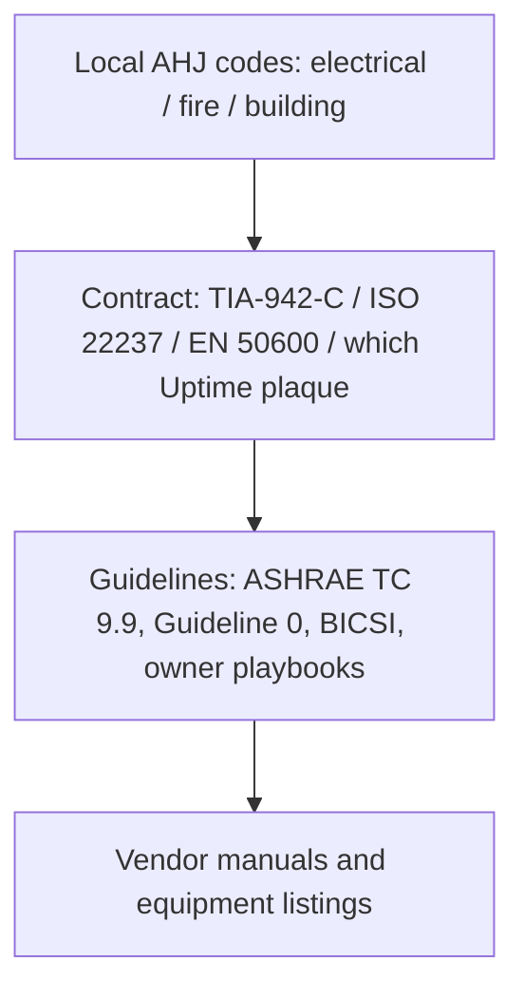

# Data Centre Standards and Guidelines

**Module ID:** `02-standards`  
**Depth:** Standard (interview-ready)  
**Audience:** Career-changers with network/deploy experience who need facilities-fluent language

---

## Learning objectives

By the end of this module you can:

- Explain what **ANSI/TIA-942-C (2024)** is for (facility design/classification language, cabling/pathways context) and how **Rated-1…4** (not “Tier”) relates to redundancy at a conceptual level.
- Describe **Uptime Institute Tier I–IV** concepts at **awareness** level as **topology**, not a nine, and name the **three certificates** — Design Documents (**TCCD**), Constructed Facility (**TCCF**), Operational Sustainability (**TCOS**) — as three plaques, not one sticker.
- Outline **ISO/IEC 22237** and **EN 50600** as first-class twins (international series and European series): what they cover, why they exist **alongside** TIA, and that they carry **Availability Class 1–4** plus separate **Protection Classes**.
- Hold the third noun in the lattice: **Rated ≠ Tier ≠ Availability Class**. Never collapse Class 3 = Rated-3 = Tier III.
- Name-and-kill **99.982% = Tier III** (and the I–IV downtime table). Do not replace it with a new percentage. Oral: *Tier is topology, not a nine.*
- Apply **ASHRAE thermal guidelines** (recommended ⊂ allowable envelopes, air class families) to white-space environmental design discussions. Name **W-classes** (W17 / W27 / W32 / W40 / W45 / W+) as a **loop decision** and point at Module 09 for application.
- Distinguish **standard vs guideline vs code vs certification scheme**, and **national vs international** instruments—and say **which wins** when they conflict (usually the local Authority Having Jurisdiction).
- Name which body/domain typically governs power, fire, cabling, environment, and access, and list what you would open before a white-space fit-out — **Tier last**, as a claim to verify.
- Name **ISO/IEC 30134** KPIs (**PUE**, **WUE**, **CUE**) without turning this file into an energy course (WUE depth is Module 10). Point at **ASHRAE Guideline 0** / commissioning as design vs as-built vs Cx, and at Module 15 for concurrent maintainability as a **legal isolation** constraint (HMI bypass ≠ isolation).

---

## Why it matters (ops/design/TPM interview angle)

If you come from networking, you already live in standards (IEEE, IETF RFCs, TIA cabling). Facilities work the same way—except many “standards” are **not interchangeable**, and some famous brand names are **commercial rating systems**, not laws.

In interviews and on the floor, standards fluency does three jobs:

1. **Design language.** “We need concurrent maintainability on the UPS path” is clearer than “make power not fail.” TIA, Tier, and EN/ISO **Availability Class** vocabularies encode that intent — **alongside**, not as a conversion table.
2. **Trade-off navigation.** An international owner may want **ISO/IEC 22237** / **EN 50600**-aligned design while the local **Authority Having Jurisdiction (AHJ)**—the fire marshal, building department, or electrical inspector—enforces **national electrical and fire codes**. You must know which document is mandatory and which is voluntary best practice.
3. **Avoiding false compliance.** Claiming “we’re Tier III” without saying **which plaque**, “we’re TIA-942 Rated-3” without a proper assessment against **942-C**, or “Availability Class 3, so we’re Tier III” is a common résumé and RFP red flag. Interviewers listen for whether you confuse **marketing language** with **auditable criteria**.

For a TPM or hybrid IT/facilities role: you will negotiate scope between IT (uptime SLAs, change windows) and facilities (codes, permits, cooling setpoints). Standards are the shared map. The map has **three classification nouns**, not two.

---

## Core concepts

### 0. Vocabulary: standard, guideline, code, rating

| Term | What it means | Enforceability |
|---|---|---|
| **Standard** | Consensus technical document (often voluntary unless adopted by contract or law) | Binding if referenced in law, contract, or AHJ adoption |
| **Guideline** | Recommended practice (e.g. ASHRAE thermal envelopes) | Usually not law; often becomes “de facto design” via RFP/SLA |
| **Code** | Legal requirements adopted by a jurisdiction (electrical, building, fire) | **Mandatory** for occupancy/permit; inspection-backed |
| **Certification / rating scheme** | Third-party program assessing design/facility against published criteria (e.g. Uptime Tiers) | Contractual/market signal—not a substitute for code compliance |

**Rule of thumb:** Codes keep people safe and buildings legal. Standards/guidelines shape availability and operability. Ratings sell confidence to customers and boards.

**Three classification nouns (hold this or the rest of the file will collapse):**

| Noun | Owner | What it is |
|---|---|---|
| **Rated-1…4** | ANSI/TIA-942 family, pin **942-C (2024)** | Consensus **standard** classification language |
| **Tier I–IV** | Uptime Institute | **Commercial** topology rating, issued as **three** certificates |
| **Availability Class 1–4** | **EN 50600** / **ISO/IEC 22237** | Classification language **inside those series**, used **alongside** TIA — not a synonym for Rated or Tier |

Never write **Class 3 = Rated-3 = Tier III**. The numbers rhyme on purpose. That is the trap.

### 1. ANSI/TIA-942-C (2024) — Rated, not Tier

**TIA** is the **Telecommunications Industry Association** (US-based). **ANSI/TIA-942** is the widely referenced **data centre infrastructure** standard family covering architecture relevant to IT facilities—spaces, pathways, cabling, redundancy concepts, and related facility infrastructure expectations.

**Pin the edition.** Cite **ANSI/TIA-942-C (2024)** unless a contract names an older edition. You will still hear “TIA-942,” “TIA-942-A,” and “TIA-942-B” in drawings and RFPs — that is why the edition-years-matter rule exists. Older text used **Tier** language for the same classification idea. The later editions, including **C**, say **Rated** so the document is not mistaken for Uptime’s program. If someone says “TIA Tier III,” ask which **edition** they have open. The rename is the point of pinning **C**.

**What it is good for:**

- **Structured approach** to data centre topology: computer room, entrance rooms, telecom rooms, equipment distribution areas, horizontal/backbone cabling concepts.
- **Facility classification language** using **Rated-1 through Rated-4**. Higher ratings generally imply more fault tolerance and concurrent maintainability of critical systems.
- **Cabling and pathway** discipline that network engineers already recognize (media, pathways, separation, documentation).

**Conceptual Rated progression (awareness—not audit checklists):**

| Concept level | Intent (simplified) |
|---|---|
| **Rated-1 / basic** | Single path; planned work often requires downtime |
| **Rated-2** | Some redundancy components; still limited concurrent maintainability |
| **Rated-3** | Concurrently maintainable critical paths—maintain one side without taking IT offline (design intent) |
| **Rated-4** | Fault-tolerant design intent—survives single failure events without IT impact (highest cost/complexity) |

**Important caveats:**

- TIA-942 is a **voluntary consensus standard** unless a contract or jurisdiction adopts it.
- “Rated-X” claims should be grounded in a real assessment against the **cited edition**—not self-declared marketing, and not a 2005 clause recited as if it were **942-C**.
- TIA language and **Uptime Tier** language are **related conceptually** (redundancy, concurrent maintainability) but are **not the same program**. Do not use the terms interchangeably. **Availability Class** (next sections) is the **third** noun, not a translator between the first two.

**When TIA-942 applies well:** US-influenced enterprise/colo designs, cabling RFP language, multi-tenant facility classification discussions, hybrid IT/facilities teams that already speak TIA structured cabling.

### 2. Uptime Institute Tier concepts (I–IV) — awareness only

The **Uptime Institute** is a private organization. Its **Tier Classification System** (Tier I–IV) is a well-known **commercial rating methodology** for data centre infrastructure **topology**. Details and certification rules are owned by Uptime; this module stays at **public awareness**.

**Tier ideas (simplified topology intent):**

| Tier | Public conceptual idea | Maintainability / fault focus |
|---|---|---|
| **I** | Basic capacity; single path | Downtime for maintenance is expected |
| **II** | Redundant capacity components | Better component resilience; path still limited |
| **III** | Concurrently maintainable | Can maintain critical equipment without shutting IT load (design intent) |
| **IV** | Fault tolerant | Survives single failure + concurrent maintainability (highest bar) |

#### Three certificates, not one plaque

Uptime does not hand you a single sticker that means “this building is Tier III forever.” Public programs split into **three** certificates. Name them:

| Certificate | Common letters | What it attests (awareness) |
|---|---|---|
| **Tier Certification of Design Documents** | **TCCD** | The **drawings and specifications** were reviewed against the Tier topology criteria. Paper can be right while the built plant is not. |
| **Tier Certification of Constructed Facility** | **TCCF** | The **as-built** facility was reviewed. Design cert is not a substitute. |
| **Tier Certification of Operational Sustainability** | **TCOS** | How the site is **run** — process, staffing, maintenance — not only how it was drawn or poured. |

An RFP that says “Tier III facility” and produces only a **TCCD** letter has answered a different question than “what is standing, and how is it operated?” Q2 below asks you to separate the three, not just “design vs facility.”

#### Name-and-kill: 99.982% = Tier III

A cargo-cult table still circulates as if it were the standard:

| Myth recited as “the Tier nines” | Do not say this |
|---|---|
| Tier I → 99.671% | Withdrawn. Not a topology fact. |
| Tier II → 99.741% | Withdrawn. Not a topology fact. |
| **Tier III → 99.982%** | **The one you will hear.** Kill it by name. |
| Tier IV → 99.995% | Withdrawn. Not a topology fact. |

Uptime **withdrew those downtime predictions in 2009**. They are not in the current topology standard. This file will not hand you a replacement percentage. **Tier is topology, not a nine.** Availability arithmetic (the 8760-hour review below) is **math**, not a rating crosswalk.

**Awareness-level truths interviewers want:**

- Tiers describe **infrastructure topology and capability**, not “better IT software” or “better security cameras.”
- Higher Tier ≠ automatically better for every business; cost, complexity, and human error risk rise sharply.
- **Certification** (if claimed) is a formal Uptime process, and it is **one of three plaques**. Saying “Tier III equivalent” is common in marketing and often **non-certified**—probe what that means in an RFP.
- Tiers do **not** replace local electrical/fire codes or life-safety systems.
- Tiers do **not** equal TIA **Rated** and do **not** equal EN/ISO **Availability Class**.

**When Uptime language applies:** customer RFPs, colo marketing, board-level availability conversations, comparing facility offers. Use it as a **shared vocabulary**, then verify actual single points of failure on drawings. A one-line diagram is evidence. A nine is not.

### 3. ISO/IEC 22237 and EN 50600 — twins, not clones

**ISO/IEC 22237** is an **international multi-part standard series** for data centre facilities and infrastructures. It sits in the ISO/IEC world (International Organization for Standardization / International Electrotechnical Commission) and is the modern international framework covering facility topics such as building construction, power distribution, environmental control, telecommunications cabling infrastructure, security systems, and management/operation aspects across its parts (exact part titles evolve—treat “22237 series” as the umbrella).

**EN 50600** is the **European** data centre facilities and infrastructures series (CENELEC). Write the number. “EN standards lineage” is not a name. **EN 50600** is the noun that already appears in Modules 01, 03, 07–10, and 12–14; this file is where it belongs as a **first-class twin** of 22237, not a footnote.

They are **related families** (international vs European). Structure is comparable. **Do not claim identical clauses** without the edition in your hand — full text is paid, and this course does not pirate it.

**Why they exist alongside TIA-942:**

- Global owners, multi-country portfolios, and European/Asian procurement often prefer **ISO/IEC** or **EN** references.
- They provide a **structured** way to specify DC facilities without assuming US TIA adoption.
- **Alongside** means you may **map** requirements across TIA and EN/ISO. It does **not** mean Class *N* converts to Rated-*N* or Tier *N*.

**What you need at standard depth:**

- Know the **names and roles**: international series (**22237**) and European series (**EN 50600**).
- Know each is **multi-part** (power, cooling/environment, cabling, security, etc.—do not pretend one thin pamphlet covers everything).
- Know **22237 is not** ISO 27001 (information security management) or ISO 20000 (IT service management)—those are complementary, not substitutes for facility topology standards.
- For compliance claims, cite the **specific part and edition** in contracts.

**When ISO/IEC 22237 / EN 50600 apply well:** international design packages, EU and multi-country programs, global enterprise standards libraries, projects where local codes are EN/IEC-centric, multi-region colocation procurement.

#### Availability Class and Protection Classes

Inside **EN 50600** and **ISO/IEC 22237**, **Availability Class 1–4** is the series’ own classification of infrastructure availability. That is the **third noun**. Say it here, in the lattice module, not only as a pointer from Module 14:

- **Availability Class** lives in the EN/ISO facility series.
- **Rated** lives in TIA-942-C.
- **Tier** lives in Uptime’s commercial program.

Use Availability Class **alongside** TIA Rated — as M14’s pointer already says — and never as a substitute. **Class 3 is not Rated-3 and is not Tier III.** If an RFP writes “Class 3 / Rated-3 / Tier III equivalent” as one bullet, that bullet is a **defect to probe**, not a translation you should finish for them.

The same series also defines **Protection Classes** — a **separate** axis about physical protection / unauthorized access, not a second name for Availability Class. Do not grade a hall’s locks by its power-path class, or its power path by its fence. Energy-enablement / KPI language is yet another job (see ISO/IEC 30134 below). If you remember only one split: **Availability Class ≠ Protection Class**, and **neither** is a Uptime plaque.

### 4. ASHRAE thermal guidelines

**ASHRAE** is the **American Society of Heating, Refrigerating and Air-Conditioning Engineers**. Its **Technical Committee 9.9** (Mission Critical Facilities) publishes **Thermal Guidelines for Data Processing Environments**—the de facto industry reference for **inlet air temperature, humidity/moisture, and environmental classes** for IT equipment.

**Core ideas:**

- **Recommended** envelope: tighter band where equipment is expected to operate efficiently and reliably under normal conditions.
- **Allowable** envelope: wider band the equipment is rated to tolerate for more extreme or short-duration conditions (still within manufacturer/class limits).
- **Recommended ⊂ allowable.** Do not collapse them into “the ASHRAE temperature.”
- **Equipment environmental classes** (you will hear class names such as A1–A4 and specialized classes for high-density/liquid-cooled or outdoor/telecom-like environments—class definitions evolve with editions). Higher-numbered “A” classes generally allow **warmer** inlet temperatures, enabling free cooling / economization in more climates at the cost of tighter coordination with IT hardware ratings.

**W-classes are a loop decision, not an air-setpoint trick.** ASHRAE’s liquid language now uses **W17 / W27 / W32 / W40 / W45 / W+**. The number is an **upper facility-water supply** bound (degrees Celsius), not a CRAH return setpoint you type on Tuesday. Choosing a W-class is choosing **which liquid plant you are building** — heat-rejection path, CDU approach, what the secondary loop is allowed to run. It is **not** “set the hall to 27.” Application — families, ride-through, containment vs liquid — lives in **Module 09**. This file only gives you the names so a 2026 interviewer does not meet a blank stare.

**Why network people should care:**

- Cooling setpoints are not arbitrary comfort settings; they are **risk and energy decisions** tied to ASHRAE guidance + vendor specs.
- Raising temperature setpoints can save energy but may reduce **psychrometric margin**, increase fan power in servers, and change failure modes if humidity control is weak.
- Liquid cooling and high-density racks push you into **updated ASHRAE guidance** and vendor thermal specifications—do not assume 2008 setpoints forever.

**When ASHRAE applies:** almost every modern white-space environmental design discussion worldwide, even when electrical codes are local. ASHRAE is typically **guideline**, not law—yet it is contractually powerful.

### 5. ISO/IEC 30134 KPIs (named, not taught as an energy course)

**ISO/IEC 30134** is the international **data-centre KPI** series. The three names you should be able to say in this module are:

| KPI | Everyday meaning (awareness) | Where this course goes deeper |
|---|---|---|
| **PUE** | Power Usage Effectiveness — facility energy relative to IT energy | Energy conversation lives with power/cooling, not here |
| **WUE** | Water Usage Effectiveness | **Module 10** |
| **CUE** | Carbon Usage Effectiveness | Named so you do not confuse it with a topology class |

These are **meters and ratios**, not Availability Classes and not Tiers. A good PUE does not make a hall concurrently maintainable. Do not turn M02 into an energy syllabus. If the interview moves to water rights, makeup, or WUE arithmetic, hand it to **Module 10**.

### 6. Commissioning / ASHRAE Guideline 0 — pointer, not a Cx course

**ASHRAE Guideline 0** names **the commissioning process**. The only split this module owns:

- **Design** — what the documents say (cousin of TCCD thinking, different owner).
- **As-built** — what was actually installed (cousin of TCCF thinking, different owner).
- **Cx** — whether the installed plant was **tested and handed over** as a process, not a signature on a brochure.

Do not fake a factory / field / integrated / seasonal syllabus here. “Commissioning” in Modules 07, 12, and 15 often means acceptance testing or handover. The finished answer on **concurrent maintainability** is not the topology oral in this file. **Module 15** owns it as a **legal isolation constraint**: putting a UPS into maintenance bypass from its **HMI is not isolation**. If the one-line has no physical isolation point that leaves the load served, lawful maintenance is an outage — regardless of the Rated / Tier / Class noun on the slide.

### 7. National vs international standards — and when each applies

Think in **layers**:

```text
┌─────────────────────────────────────────────────────────┐
│  Local LAW / CODES (AHJ) — electrical, building, fire   │  ← MUST comply
├─────────────────────────────────────────────────────────┤
│  Contract / owner standards (TIA-942-C, ISO/IEC 22237,  │  ← MUST if signed
│  EN 50600, corporate design guides, which Uptime plaque)│
├─────────────────────────────────────────────────────────┤
│  Industry guidelines (ASHRAE TC 9.9, Guideline 0,       │  ← should / de facto
│  BICSI best practice)                                   │
├─────────────────────────────────────────────────────────┤
│  Vendor installation manuals & equipment listings       │  ← warranty & listing
└─────────────────────────────────────────────────────────┘
```

**National / jurisdictional (examples of *types*, not exhaustive):**

- **Electrical codes** (e.g. NEC/NFPA 70 in the US; national wiring rules elsewhere)
- **Fire and life safety** (e.g. NFPA standards family in the US; national fire codes elsewhere)
- **Building codes**, accessibility, seismic, energy codes
- **Occupational safety** regulations

These are enforced by the **AHJ**. If TIA says one thing and the electrical code (as adopted) says another for life safety, **code wins**.

**International / industry voluntary:**

- **ISO/IEC 22237** series — DC facilities framework (Availability Class lives here)
- **EN 50600** series — European twin (Availability Class and Protection Classes live here)
- **TIA-942-C** family — especially strong in telecom/cabling-influenced DC design (Rated lives here)
- **IEC** power/quality related standards as referenced by design
- **ASHRAE** thermal guidelines — global engineering practice
- **ISO/IEC 30134** — KPIs (PUE / WUE / CUE), not topology

**Regional:**

- **EN 50600** may be adopted or referenced into national practice in Europe; treat it as a **named series**, not “Europe has no standard.”

**Decision guide — “which document do I open?”**

| Situation | Primary instruments |
|---|---|
| Building permit, generator install, fire suppression | Local building/electrical/fire **codes** + AHJ |
| Cabling pathways, room topology, Rated language | **TIA-942-C** (esp. US/cabling-heavy) and/or **ISO/IEC 22237** / **EN 50600** parts |
| Owner wrote “Availability Class 3” | **EN 50600** / **ISO/IEC 22237** — **alongside** TIA, not a Rated/Tier conversion |
| Customer wants “Tier III facility” | **Uptime** — ask **TCCD, TCCF, or TCOS** — then validate on one-line diagrams. Do not accept 99.982% as the proof. |
| Inlet temp / humidity / free cooling policy | **ASHRAE** thermal guidelines + IT OEM specs |
| “What W-class is this plant?” | Names in this file; **application in Module 09** |
| Water / WUE / carbon KPI | **ISO/IEC 30134** named here; **WUE depth in Module 10** |
| Multi-country portfolio standard | **ISO/IEC 22237** and/or **EN 50600** + local code annexes |
| Security cameras / access control | Local code + **Protection Class** language in EN/ISO + corporate policy (ISO 27001 is governance for information security—not physical topology alone) |
| “Is it commissioned?” | **Guideline 0** as the process name; do not fake a Cx syllabus. Isolation/HMI is **Module 15**. |

**Sub-component standards (awareness):** Power equipment may reference IEEE/IEC listing standards; cabling has TIA-568/ISO 11801 families; fire detection/suppression has NFPA/EN product standards. The DC “umbrella” standard does not replace component product standards.

---

## Key diagrams

### A. Standards stack (who overrides whom)



If layers conflict on **life safety or legal occupancy**, resolve upward toward the AHJ. If layers conflict on **availability topology** only, resolve via owner risk acceptance and contract hierarchy.

### B. Three nouns — family of ideas, not a crosswalk

```text
Business need              Facilities vocabulary
─────────────              ─────────────────────
"No downtime for maint." → Concurrent maintainability
                           (a path property, not a sticker)

"Survive a failure"      → Fault tolerance
                           (a path property, not a sticker)

"Cheapest viable"        → Single path + spares
```

Three owners, three nouns, **alongside** — never a conversion:

```text
  Rated-1…4            ANSI/TIA-942-C (2024)     consensus standard
  Tier I–IV            Uptime                    commercial rating
                       TCCD / TCCF / TCOS        three plaques, not one
  Availability Class   EN 50600 / ISO/IEC 22237  series classification
  1–4

  Protection Class     same EN/ISO series        different axis (access)
```

**Do not treat TIA Rated-N as mathematically equal to Uptime Tier N or to Availability Class N.** Interview answer: “Same family of ideas; different owners, criteria, and certification processes.” **Class 3 = Rated-3 = Tier III** is the sentence that fails the oral.

### C. Cabling hierarchy (TIA-oriented sketch)

```text
Campus / metro fiber
        │
   Entrance Room(s)  ── diverse paths ideally
        │
   Main Distribution Area (MDA) / core
        │
   Horizontal Distribution Area(s) (HDA)
        │
   Equipment Distribution Area (EDA) ── racks / cabinets
        │
   Equipment outlets / TOR-EOR as designed
```

Cooling and power have their own “hierarchies” (utility → switchgear → UPS → PDU → rack; chillers/CRAHs → containment → inlet). Standards bind these domains together so one discipline’s SPOF is not invisible to another.

### D. Thermal envelope (concept)

```text
            cooler ← temperature → warmer
  |---- ALLOWABLE (wider) ----|
     |-- RECOMMENDED (tighter) --|
              ▲
         design target
         (ops + energy + risk)
```

Humidity/dew point control matters as much as dry-bulb temperature—especially when economizing or changing setpoints.

W-class water loops are **not** this picture. Air recommended ⊂ allowable stays here; **W17…W+** is a supply-water plant choice, taught in **Module 09**.

---

## Formulas / rules of thumb

**Availability “nines” (review from mission-critical module):**

\[
\text{Annual downtime} \approx (1 - A) \times 8760\ \text{hours}
\]

Example: \(A = 0.999\) (three nines) → about **8.76 hours/year** theoretical. Standards/ratings **do not magically produce nines**; topology + operations + human factors do.

There is **no** nines-to-Tier crosswalk “for memory.” **99.982% is not Tier III.** Do not replace that myth with a different percentage.

**Rules of thumb:**

1. **Code > contract marketing.** Never “Tier your way” past fire or electrical inspection requirements.
2. **Concurrent maintainability is a path property**, not a sticker on a single UPS. Module 15 finishes the sentence: it is also a **legal isolation** constraint — **HMI bypass ≠ isolation**.
3. **+1 redundancy without diverse paths** is still a single path dressed up.
4. **ASHRAE recommended is not “the only legal temperature.”** It is a risk/energy trade space—document the policy. Recommended ⊂ allowable.
5. **Edition years matter.** “Per TIA-942” without a year is soft; pin **ANSI/TIA-942-C (2024)** unless the contract says otherwise. The Rated-not-Tier rename is why.
6. **Local climate + ASHRAE class + IT hardware generation** jointly decide free-cooling feasibility—not a slogan. **W-class** is a loop decision — **Module 09**.
7. **Rated ≠ Tier ≠ Availability Class.** Probe “Tier III equivalent.” Ask **which of the three plaques**.

---

## Common failure modes and misconceptions

| Misconception | Reality |
|---|---|
| “Tier III certified means code-compliant everywhere” | Tier rating ≠ building permit. Codes still bind. |
| “TIA-942 Rated-3 = Uptime Tier III” | Conceptual cousins, different systems. |
| “Availability Class 3 = Rated-3 = Tier III” | **Third noun, not a translator.** Alongside, never equal. |
| “99.982% availability is what Tier III means” | **Named and killed.** Uptime withdrew those I–IV downtime predictions in 2009. Tier is topology, not a nine. No replacement %. |
| “The site is Tier III — I saw a plaque” | Ask **TCCD, TCCF, or TCOS**. Design paper ≠ constructed facility ≠ how it is run. |
| “TIA-942 still says Tier, so TIA Tier III is fine” | Pin **942-C (2024)**. The Rated-not-Tier rename is the edition rule doing its job. |
| “ISO 22237 replaces ASHRAE” | Different jobs: facility series vs thermal guidelines for IT environments. |
| “EN 50600 is just ‘European lineage’ — no number to learn” | **EN 50600** is the name. Twin of 22237, not a vibe. |
| “Protection Class is another way to say Availability Class” | Separate axis (physical protection vs infrastructure availability). |
| “W27 means set the CRAH to 27 °C” | W-classes are **facility-water** bounds — a **loop** decision. Application in **Module 09**. |
| “Good PUE / WUE / CUE proves the rating” | **ISO/IEC 30134** KPIs are meters, not topology. WUE depth is **Module 10**. |
| “Higher rating always better” | Over-engineering burns CapEx/OpEx; complexity can hurt MTTR and human reliability. |
| “Guidelines aren’t important” | ASHRAE setpoints show up in SLAs, colocation handbooks, and OEM support positions. |
| “International standard overrides local fire code” | Almost never for life safety. AHJ wins. |
| “We’re compliant—we bought Tier-looking gear” | Topology, operations, and maintenance access define the class—not logo’d hardware alone. |
| “Network standards are enough for the DC” | Structured cabling is necessary but not sufficient; power/cooling/fire dominate outage stats. |
| “HMI maintenance bypass means we are concurrently maintainable” | Topology oral is not finished. **Module 15:** HMI bypass ≠ isolation. |

**Ops failure mode:** Designing to a rating on paper, then blocking concurrent maintenance with procedures, locked cross-connects, or “never touch the A side” culture. The standard’s intent dies in change management.

**Design failure mode:** Mixing criteria—claiming ISO/EN documentation package while drawings only mirror a US TIA template without local code adaptation (earthing, fire resistance, egress, fuel storage), or treating Availability Class as a drop-in replacement for a Rated or Tier claim.

---

## Interview drills

**Q1. TIA-942 vs local electrical code—who wins?**  
**A:** The **local electrical code as enforced by the AHJ** wins for legal compliance and energization/occupancy. TIA-942-C can drive design quality and contractual requirements, but it does not authorize violating code. Best practice: design to satisfy **both**—code minimums plus the owner’s TIA/ISO/EN availability goals.

**Q2. Which standards would you check before a white-space fit-out?**  
**A:** Keep this order. (1) Local building/electrical/fire **codes** and any **landlord** house rules; (2) owner standard — **TIA-942-C** and/or **ISO/IEC 22237** / **EN 50600** parts relevant to space, power, cooling, cabling, security (Availability Class lives here, **alongside** TIA, not instead of it); (3) **ASHRAE** thermal policy for inlet conditions (W-class names if the row is liquid — application in **Module 09**); (4) **cabling** standards (TIA-568 / ISO 11801 family) and pathway plans; (5) **fire** detection/suppression **listings** compatible with the room; (6) **OEM** environmental specs for the actual IT load; (7) **Tier last**, as a **claim to verify** — which of the **three plaques** (TCCD / TCCF / TCOS), and inspect one-lines for SPOFs. 99.982% is not the verification. Cx/as-built currency is a process question (**Guideline 0** named; **Module 15** owns isolation).

**Q3. Explain Tier III in one minute without reciting a brochure.**  
**A:** At awareness level, Tier III means the infrastructure is intended to be **concurrently maintainable**: you can take a redundant capacity component or distribution path out for maintenance **without shutting down the IT load**, because an alternate path remains. It is about **topology** and maintainability, **not a nine**. Certification is a separate commercial process, and it is **one of three plaques** — ask design documents, constructed facility, or operational sustainability. Many sites say “Tier III equivalent” without that process; treat the phrase as a **defect to probe**. This oral is not finished until **Module 15**: concurrent maintainability is also whether an electrician can **lawfully isolate** the path. HMI bypass is not isolation.

**Q4. What is ISO/IEC 22237, and when would you prefer it over TIA-942 language?**  
**A:** ISO/IEC 22237 is the **international multi-part data centre facilities** series. Prefer it when the owner portfolio, consultants, or authorities are ISO/IEC-centric (common in multi-country programs and many non-US procurements). In Europe, expect **EN 50600** by name as the twin series — Availability Class and Protection Classes live there. TIA-942-C remains excellent—especially where US practice and telecom cabling culture dominate. Mature global programs often **map** requirements across both rather than arguing brand loyalty. Mapping is **alongside**, not Class 3 = Rated-3.

**Q5. How do ASHRAE thermal guidelines change an ops conversation?**  
**A:** They turn “make it cold” into a documented **envelope**: recommended vs allowable conditions (recommended ⊂ allowable), humidity/dew point control, and equipment class assumptions. Raising setpoints may enable economization and lower cooling energy, but you must align with **IT hardware ratings**, containment design, and monitoring. ASHRAE is a guideline; OEM warranties and SLA metrics still matter. If someone asks the **W-class**, that is a **facility-water loop** decision, not a CRAH setpoint — take it to **Module 09**.

**Q6. Rated, Tier, Availability Class — same thing?**  
**A:** No. **Rated** is TIA-942-C. **Tier** is Uptime (three plaques). **Availability Class** is EN 50600 / ISO/IEC 22237. Same family of ideas; three owners. **Never Class 3 = Rated-3 = Tier III.**

**Q7. Someone says Tier III is 99.982%. What do you say?**  
**A:** That table (99.671 / 99.741 / 99.982 / 99.995) was **withdrawn in 2009**. I will not replace it with another percentage. **Tier is topology, not a nine.** Show me the path and which plaque.

---

## Self-check quiz

1. **Which is typically mandatory for legal occupancy of a data hall?**  
   a) ASHRAE recommended envelope  
   b) Uptime Tier brochure language  
   c) Adopted local building/electrical/fire codes  
   d) Vendor white paper on free cooling  

2. **ANSI/TIA-942 is best described as:**  
   a) A fire code  
   b) A US-origin consensus standard for data centre infrastructure/telecommunications facilities design language  
   c) An information security management system  
   d) A European law that overrides national codes  

3. **Concurrent maintainability most closely means:**  
   a) Two people must approve every change  
   b) Critical systems can be maintained without stopping the IT load, via redundant paths/components  
   c) Generators start in under 10 seconds  
   d) All cables are dual-labeled  

4. **Uptime Tier IV (awareness) emphasizes:**  
   a) Lowest CapEx  
   b) Fault-tolerant infrastructure intent plus high maintainability expectations  
   c) Only software high availability  
   d) Exemption from fire codes  

5. **ISO/IEC 22237 is:**  
   a) Only about cybersecurity controls  
   b) An international multi-part series for data centre facilities and infrastructures  
   c) A replacement name for ASHRAE TC 9.9  
   d) A Tier certification brand  

6. **ASHRAE “recommended” vs “allowable” envelopes:**  
   a) Recommended is wider than allowable  
   b) Allowable is typically wider; recommended is the tighter everyday target band  
   c) They are identical terms  
   d) Only humidity is covered, never temperature  

7. **If an international corporate standard and the local AHJ fire code conflict on suppression design:**  
   a) Corporate standard always wins  
   b) ISO always wins  
   c) Resolve to satisfy the AHJ (legal) while negotiating corporate deviations formally  
   d) Ignore both and follow the UPS vendor  

8. **Saying “TIA Rated-3 equals Uptime Tier III” is:**  
   a) Always precisely true by law  
   b) A common oversimplification; related ideas, different systems and criteria  
   c) Required exam wording worldwide  
   d) True only for liquid-cooled halls  

9. **Availability Class in EN 50600 / ISO/IEC 22237 is:**  
   a) A third classification noun, used alongside TIA Rated and Uptime Tier — never Class 3 = Rated-3 = Tier III  
   b) The official translator that makes Rated-3 = Tier III  
   c) Another name for Protection Class  
   d) A replacement percentage for 99.982%  

10. **Uptime’s public certificates are best described as:**  
    a) One plaque that covers drawings, the building, and operations forever  
    b) Three plaques: Design Documents (TCCD), Constructed Facility (TCCF), Operational Sustainability (TCOS)  
    c) TCCD only — constructed and operations are informal  
    d) The same thing as ISO/IEC 30134 PUE  

11. **“Tier III means 99.982% availability” is:**  
    a) The nines-to-Tier crosswalk you should memorize  
    b) A named myth: Uptime withdrew those I–IV downtime predictions in 2009; Tier is topology, not a nine  
    c) True for TCOS but not TCCD  
    d) True if you swap in a newer percentage from a blog  

12. **EN 50600 is:**  
    a) Informal “European lineage” with no number worth learning  
    b) The European data-centre facilities series — first-class twin of ISO/IEC 22237 — carrying Availability Class and separate Protection Classes  
    c) A fire code that overrides the AHJ  
    d) Uptime’s third plaque  

### Answers

<details>
<summary>Click to reveal answers</summary>

1. **c** — Codes adopted and enforced by the AHJ are mandatory for legal occupancy; ASHRAE/Tier/TIA are not substitutes.  
2. **b** — TIA-942 is the ANSI/TIA data centre infrastructure standard family (voluntary unless adopted by contract/jurisdiction). Pin **942-C (2024)** when you cite Rated.  
3. **b** — Concurrent maintainability is a topology/ops capability, not a staffing rule. Module 15 adds: HMI bypass ≠ isolation.  
4. **b** — Tier IV is the fault-tolerant end of the public Tier spectrum (awareness-level).  
5. **b** — ISO/IEC 22237 is the international DC facilities multi-part series. EN 50600 is the European twin.  
6. **b** — Recommended ⊂ tighter band; allowable is broader tolerance guidance.  
7. **c** — Life-safety code compliance is non-negotiable; corporate standards adapt via formal exceptions if needed.  
8. **b** — Do not equate brands/systems; describe conceptual similarity carefully.  
9. **a** — Third noun. Alongside, never a conversion. Protection Class is a different axis.  
10. **b** — Three plaques, not one sticker.  
11. **b** — Name-and-kill. No replacement %.  
12. **b** — Write the number. Twin of 22237, not a vibe and not a fire code.

</details>

---

## Further free resources (public; no paywalled EPI content)

| Resource | Why use it |
|---|---|
| **TIA** — public store/overview pages for **ANSI/TIA-942-C (2024)** (title/scope; purchase full text if needed) | Authoritative scope statements, edition awareness, **Rated-not-Tier** rename |
| **ISO** — catalogue entries for **ISO/IEC 22237** parts | Part list and abstracts; international framing; Availability Class lives in this family |
| **CENELEC / national body catalogues** — **EN 50600** series abstracts | European twin by **name**; Availability Class and Protection Classes |
| **ISO** — catalogue entries for **ISO/IEC 30134** (PUE / WUE / CUE) | KPI series — meters, not topology. WUE depth in Module 10 |
| **ASHRAE** — TC 9.9 public materials / thermal guidelines product pages; free ASHRAE Journal or overview articles where available | Thermal envelope literacy; **W-class** names as liquid-plant language (application in Module 09) |
| **ASHRAE Guideline 0** public scope / commissioning-process overviews | Design vs as-built vs Cx as a **process name**, not a fake syllabus |
| **Uptime Institute** — public Tier Standard explanatory pages (marketing/education tier) | Awareness of Tier I–IV **topology**, the **three certificates**, and what certification means. Do not scrape a nines table. |
| **NFPA** — public education pages on electrical/fire code roles (e.g. NEC context in the US) | Code vs standard mental model |
| **BICSI** — public primers on data centre design/cabling best practice | Practitioner-oriented bridging of IT and facilities |
| **IEC / CENELEC / national standards body catalogues** (BSI, DIN, ANSI, Standards Australia, etc.) | Finding what your country actually adopts |
| **Vendor engineering primers** (UPS, CRAH/CRAC, containment, PDU makers—application notes) | How standards show up in real one-line and airflow designs |
| **National electrical code handbooks / AHJ published amendments** (jurisdiction-specific, often free summaries) | What inspectors will actually check |

**Study tip:** For each standard name above, practice a 20-second pitch: *owner, voluntary vs mandatory, problem it solves, when you would cite it in an RFP.* Add the lattice sentence: **Rated ≠ Tier ≠ Availability Class.**

---

## Module close-out

You should now be able to walk into a design review and say, without hand-waving: which documents are law, which are contract, which are guidelines, and which are commercial ratings — and map **TIA-942-C (Rated)**, **Uptime Tiers (three plaques)**, **ISO/IEC 22237 / EN 50600 (Availability Class, Protection Classes)**, and **ASHRAE** onto the right conversations. You can kill **99.982% = Tier III** by name, point **W-classes** at Module 09, **30134 / WUE** at Module 10, and **Cx / HMI-is-not-isolation** at Module 15. Next modules apply this stack to site/building choices, then floors, power, and cooling in depth.

**Suggested next:** Module 03 — Location, Building & Construction (`modules/03-location-building-construction/`).
