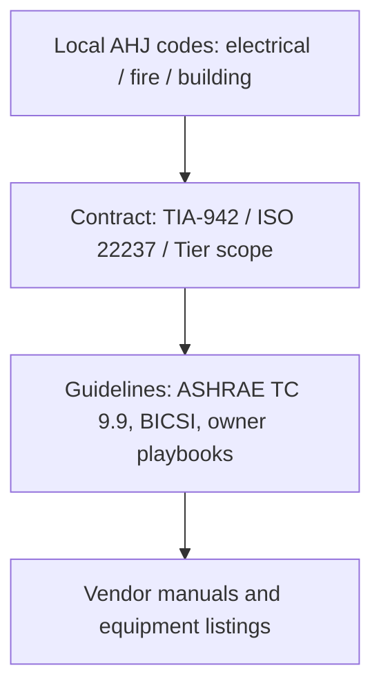

# Data Centre Standards and Guidelines

**Module ID:** `02-standards`  
**Depth:** Standard (interview-ready)  
**Audience:** Career-changers with network/deploy experience who need facilities-fluent language

---

## Learning objectives

By the end of this module you can:

- Explain what **ANSI/TIA-942** is for (facility design/classification language, cabling/pathways context) and how “Rated” concepts relate to redundancy at a conceptual level.
- Describe **Uptime Institute Tier I–IV** concepts at **awareness** level and clearly separate them from TIA ratings and from enforceable codes.
- Outline **ISO/IEC 22237** as the international multi-part data centre facilities series (what it covers, why it exists alongside TIA).
- Apply **ASHRAE thermal guidelines** (recommended vs allowable envelopes, class families) to white-space environmental design discussions.
- Distinguish **standard vs guideline vs code vs certification scheme**, and **national vs international** instruments—and say **which wins** when they conflict (usually the local Authority Having Jurisdiction).
- Name which body/domain typically governs power, fire, cabling, environment, and access, and list what you would open before a white-space fit-out.

---

## Why it matters (ops/design/TPM interview angle)

If you come from networking, you already live in standards (IEEE, IETF RFCs, TIA cabling). Facilities work the same way—except many “standards” are **not interchangeable**, and some famous brand names are **commercial rating systems**, not laws.

In interviews and on the floor, standards fluency does three jobs:

1. **Design language.** “We need concurrent maintainability on the UPS path” is clearer than “make power not fail.” TIA and Tier vocabularies encode that intent.
2. **Trade-off navigation.** An international owner may want ISO/IEC 22237-aligned design while the local **Authority Having Jurisdiction (AHJ)**—the fire marshal, building department, or electrical inspector—enforces **national electrical and fire codes**. You must know which document is mandatory and which is voluntary best practice.
3. **Avoiding false compliance.** Claiming “we’re Tier III” without Uptime certification, or “we’re TIA-942 Rated-3” without a proper assessment, is a common résumé and RFP red flag. Interviewers listen for whether you confuse **marketing language** with **auditable criteria**.

For a TPM or hybrid IT/facilities role: you will negotiate scope between IT (uptime SLAs, change windows) and facilities (codes, permits, cooling setpoints). Standards are the shared map.

---

## Core concepts

### 0. Vocabulary: standard, guideline, code, rating

| Term | What it means | Enforceability |
|---|---|---|
| **Standard** | Consensus technical document (often voluntary unless adopted by contract or law) | Binding if referenced in law, contract, or AHJ adoption |
| **Guideline** | Recommended practice (e.g. ASHRAE thermal envelopes) | Usually not law; often becomes “de facto design” via RFP/SLA |
| **Code** | Legal requirements adopted by a jurisdiction (electrical, building, fire) | **Mandatory** for occupancy/permit; inspection-backed |
| **Certification / rating scheme** | Third-party program assessing design/facility against published criteria (e.g. Uptime Tiers) | Contractual/market signal—not a substitute for code compliance |

**Rule of thumb:** Codes keep people safe and buildings legal. Standards/guidelines shape availability and operability. Ratings sell confidence to customers and boards.

### 1. ANSI/TIA-942 (Telecommunications Infrastructure Standard for Data Centers)

**TIA** is the **Telecommunications Industry Association** (US-based). **ANSI/TIA-942** is the widely referenced **data centre infrastructure** standard family covering architecture relevant to IT facilities—spaces, pathways, cabling, redundancy concepts, and related facility infrastructure expectations. Editions evolve (you will hear “TIA-942,” “TIA-942-A/B,” etc.); always check the edition year when citing.

**What it is good for:**

- **Structured approach** to data centre topology: computer room, entrance rooms, telecom rooms, equipment distribution areas, horizontal/backbone cabling concepts.
- **Facility classification language** using **Rated-1 through Rated-4** style concepts (wording has varied by edition—learn the *ideas*, not a memorized clause number). Higher ratings generally imply more fault tolerance and concurrent maintainability of critical systems.
- **Cabling and pathway** discipline that network engineers already recognize (media, pathways, separation, documentation).

**Conceptual Rated progression (awareness—not audit checklists):**

| Concept level | Intent (simplified) |
|---|---|
| **Rated-1 / basic** | Single path; planned work often requires downtime |
| **Rated-2** | Some redundancy components; still limited concurrent maintainability |
| **Rated-3** | Concurrently maintainable critical paths—maintain one side without taking IT offline (design intent) |
| **Rated-4** | Fault-tolerant design intent—survives single failure events without IT impact (highest cost/complexity) |

**Important caveats:**

- TIA-942 is a **voluntary consensus standard** unless a contract or jurisdiction adopts it.
- “Rated-X” claims should be grounded in a real assessment against the current document—not self-declared marketing.
- TIA language and **Uptime Tier** language are **related conceptually** (redundancy, concurrent maintainability) but are **not the same program**. Do not use the terms interchangeably.

**When TIA-942 applies well:** US-influenced enterprise/colo designs, cabling RFP language, multi-tenant facility classification discussions, hybrid IT/facilities teams that already speak TIA structured cabling.

### 2. Uptime Institute Tier concepts (I–IV) — awareness only

The **Uptime Institute** is a private organization. Its **Tier Classification System** (Tier I–IV) is a well-known **commercial rating methodology** for data centre infrastructure topology and (depending on the offering) design, constructed facility, or operational sustainability programs. Details and certification rules are owned by Uptime; this module stays at **public awareness**.

**Tier ideas (simplified topology intent):**

| Tier | Public conceptual idea | Maintainability / fault focus |
|---|---|---|
| **I** | Basic capacity; single path | Downtime for maintenance is expected |
| **II** | Redundant capacity components | Better component resilience; path still limited |
| **III** | Concurrently maintainable | Can maintain critical equipment without shutting IT load (design intent) |
| **IV** | Fault tolerant | Survives single failure + concurrent maintainability (highest bar) |

**Awareness-level truths interviewers want:**

- Tiers describe **infrastructure topology and capability**, not “better IT software” or “better security cameras.”
- Higher Tier ≠ automatically better for every business; cost, complexity, and human error risk rise sharply.
- **Certification** (if claimed) is a formal Uptime process. Saying “Tier III equivalent” is common in marketing and often **non-certified**—probe what that means in an RFP.
- Tiers do **not** replace local electrical/fire codes or life-safety systems.

**When Uptime language applies:** customer RFPs, colo marketing, board-level availability conversations, comparing facility offers. Use it as a **shared vocabulary**, then verify actual single points of failure on drawings.

### 3. ISO/IEC 22237 overview

**ISO/IEC 22237** is an **international multi-part standard series** for data centre facilities and infrastructures. It sits in the ISO/IEC world (International Organization for Standardization / International Electrotechnical Commission) and is often discussed as the modern international framework covering facility topics such as building construction, power distribution, environmental control, telecommunications cabling infrastructure, security systems, and management/operation aspects across its parts (exact part titles evolve—treat “22237 series” as the umbrella).

**Why it exists alongside TIA-942:**

- Global owners, multi-country portfolios, and European/Asian procurement often prefer **ISO/IEC** references.
- ISO/IEC 22237 provides a **structured, international** way to specify DC facilities without assuming US TIA adoption.
- Related historical context: European work (e.g. EN standards lineage for data centres) and ISO efforts converged toward international facility standardization; 22237 is the name you should recognize in 2020s RFPs.

**What you need at standard depth:**

- Know the **name and role**: international DC facilities series.
- Know it is **multi-part** (power, cooling/environment, cabling, security, etc.—do not pretend one thin pamphlet covers everything).
- Know it is **not** the same as ISO 27001 (information security management) or ISO 20000 (IT service management)—those are complementary, not substitutes for facility topology standards.
- For compliance claims, cite the **specific part and edition** in contracts.

**When ISO/IEC 22237 applies well:** international design packages, global enterprise standards libraries, projects where local codes are EN/IEC-centric, multi-region colocation procurement.

### 4. ASHRAE thermal guidelines

**ASHRAE** is the **American Society of Heating, Refrigerating and Air-Conditioning Engineers**. Its **Technical Committee 9.9** (Mission Critical Facilities) publishes **Thermal Guidelines for Data Processing Environments**—the de facto industry reference for **inlet air temperature, humidity/moisture, and environmental classes** for IT equipment.

**Core ideas:**

- **Recommended** envelope: tighter band where equipment is expected to operate efficiently and reliably under normal conditions.
- **Allowable** envelope: wider band the equipment is rated to tolerate for more extreme or short-duration conditions (still within manufacturer/class limits).
- **Equipment environmental classes** (you will hear class names such as A1–A4 and specialized classes for high-density/liquid-cooled or outdoor/telecom-like environments—class definitions evolve with editions). Higher-numbered “A” classes generally allow **warmer** inlet temperatures, enabling free cooling / economization in more climates at the cost of tighter coordination with IT hardware ratings.

**Why network people should care:**

- Cooling setpoints are not arbitrary comfort settings; they are **risk and energy decisions** tied to ASHRAE guidance + vendor specs.
- Raising temperature setpoints can save energy but may reduce **psychrometric margin**, increase fan power in servers, and change failure modes if humidity control is weak.
- Liquid cooling and high-density racks push you into **updated ASHRAE guidance** and vendor thermal specifications—do not assume 2008 setpoints forever.

**When ASHRAE applies:** almost every modern white-space environmental design discussion worldwide, even when electrical codes are local. ASHRAE is typically **guideline**, not law—yet it is contractually powerful.

### 5. National vs international standards — and when each applies

Think in **layers**:

```text
┌─────────────────────────────────────────────────────────┐
│  Local LAW / CODES (AHJ) — electrical, building, fire   │  ← MUST comply
├─────────────────────────────────────────────────────────┤
│  Contract / owner standards (TIA-942, ISO/IEC 22237,    │  ← MUST if signed
│  corporate design guides, Tier certification scope)     │
├─────────────────────────────────────────────────────────┤
│  Industry guidelines (ASHRAE TC 9.9, BICSI best practice)│  ← should / de facto
├─────────────────────────────────────────────────────────┤
│  Vendor installation manuals & equipment listings       │  ← warranty & listing
└─────────────────────────────────────────────────────────┘
```

**National / jurisdictional (examples of *types*, not exhaustive):**

- **Electrical codes** (e.g. NEC/NFPA 70 in the US; national wiring rules elsewhere)
- **Fire and life safety** (e.g. NFPA standards family in the US; national fire codes elsewhere)
- **Building codes**, accessibility, seismic, energy codes
- **Occupational safety** regulations

These are enforced by the **AHJ**. If TIA says one thing and the electrical code (as adopted) says another for life safety, **code wins**.

**International / industry voluntary:**

- **ISO/IEC 22237** series — DC facilities framework
- **TIA-942** family — especially strong in telecom/cabling-influenced DC design
- **IEC** power/quality related standards as referenced by design
- **ASHRAE** thermal guidelines — global engineering practice

**Regional:**

- **EN** (European Norm) standards may be adopted into national regulation in Europe; EN data-centre-related documents often appear in EU projects alongside ISO/IEC.

**Decision guide — “which document do I open?”**

| Situation | Primary instruments |
|---|---|
| Building permit, generator install, fire suppression | Local building/electrical/fire **codes** + AHJ |
| Cabling pathways, room topology, Rated language | **TIA-942** (esp. US/cabling-heavy) and/or **ISO/IEC 22237** parts |
| Customer wants “Tier III facility” | **Uptime** criteria (if certified) + validate on one-line diagrams |
| Inlet temp / humidity / free cooling policy | **ASHRAE** thermal guidelines + IT OEM specs |
| Multi-country portfolio standard | **ISO/IEC 22237** + local code annexes |
| Security cameras / access control | Local code + security standards/guidelines + corporate policy (ISO/IEC 22237 has security-related parts; ISO 27001 is governance for information security—not physical topology alone) |

**Sub-component standards (awareness):** Power equipment may reference IEEE/IEC listing standards; cabling has TIA-568/ISO 11801 families; fire detection/suppression has NFPA/EN product standards. The DC “umbrella” standard does not replace component product standards.

---

## Key diagrams

### A. Standards stack (who overrides whom)



If layers conflict on **life safety or legal occupancy**, resolve upward toward the AHJ. If layers conflict on **availability topology** only, resolve via owner risk acceptance and contract hierarchy.

### B. Mapping redundancy language (conceptual—not 1:1 equivalence)

```text
Business need              Facilities vocabulary
─────────────              ─────────────────────
"No downtime for maint." → Concurrent maintainability
                           (TIA higher Rated / Tier III idea)

"Survive a failure"      → Fault tolerance
                           (TIA highest Rated / Tier IV idea)

"Cheapest viable"        → Single path + spares
                           (basic Rated / Tier I idea)
```

**Do not treat TIA Rated-N as mathematically equal to Uptime Tier N.** Interview answer: “Same family of ideas; different owners, criteria, and certification processes.”

### C. Cabling hierarchy (TIA-oriented sketch)

```text
Campus / metro fiber
        │
   Entrance Room(s)  ── diverse paths ideally
        │
   Main Distribution Area (MDA) / core
        │
   Horizontal Distribution Area(s) (HDA)
        │
   Equipment Distribution Area (EDA) ── racks / cabinets
        │
   Equipment outlets / TOR-EOR as designed
```

Cooling and power have their own “hierarchies” (utility → switchgear → UPS → PDU → rack; chillers/CRAHs → containment → inlet). Standards bind these domains together so one discipline’s SPOF is not invisible to another.

### D. Thermal envelope (concept)

```text
            cooler ← temperature → warmer
  |---- ALLOWABLE (wider) ----|
     |-- RECOMMENDED (tighter) --|
              ▲
         design target
         (ops + energy + risk)
```

Humidity/dew point control matters as much as dry-bulb temperature—especially when economizing or changing setpoints.

---

## Formulas / rules of thumb

**Availability “nines” (review from mission-critical module):**

\[
\text{Annual downtime} \approx (1 - A) \times 8760\ \text{hours}
\]

Example: \(A = 0.999\) (three nines) → about **8.76 hours/year** theoretical. Standards/ratings **do not magically produce nines**; topology + operations + human factors do.

**Rules of thumb:**

1. **Code > contract marketing.** Never “Tier your way” past fire or electrical inspection requirements.
2. **Concurrent maintainability is a path property**, not a sticker on a single UPS.
3. **+1 redundancy without diverse paths** is still a single path dressed up.
4. **ASHRAE recommended is not “the only legal temperature.”** It is a risk/energy trade space—document the policy.
5. **Edition years matter.** “Per TIA-942” without a year is soft; RFPs should pin editions.
6. **Local climate + ASHRAE class + IT hardware generation** jointly decide free-cooling feasibility—not a slogan.

---

## Common failure modes and misconceptions

| Misconception | Reality |
|---|---|
| “Tier III certified means code-compliant everywhere” | Tier rating ≠ building permit. Codes still bind. |
| “TIA-942 Rated-3 = Uptime Tier III” | Conceptual cousins, different systems. |
| “ISO 22237 replaces ASHRAE” | Different jobs: facility series vs thermal guidelines for IT environments. |
| “Higher rating always better” | Over-engineering burns CapEx/OpEx; complexity can hurt MTTR and human reliability. |
| “Guidelines aren’t important” | ASHRAE setpoints show up in SLAs, colocation handbooks, and OEM support positions. |
| “International standard overrides local fire code” | Almost never for life safety. AHJ wins. |
| “We’re compliant—we bought Tier-looking gear” | Topology, operations, and maintenance access define the class—not logo’d hardware alone. |
| “Network standards are enough for the DC” | Structured cabling is necessary but not sufficient; power/cooling/fire dominate outage stats. |

**Ops failure mode:** Designing to a rating on paper, then blocking concurrent maintenance with procedures, locked cross-connects, or “never touch the A side” culture. The standard’s intent dies in change management.

**Design failure mode:** Mixing criteria—claiming ISO documentation package while drawings only mirror a US TIA template without local code adaptation (earthing, fire resistance, egress, fuel storage).

---

## Interview drills

**Q1. TIA-942 vs local electrical code—who wins?**  
**A:** The **local electrical code as enforced by the AHJ** wins for legal compliance and energization/occupancy. TIA-942 can drive design quality and contractual requirements, but it does not authorize violating code. Best practice: design to satisfy **both**—code minimums plus the owner’s TIA/ISO availability goals.

**Q2. Which standards would you check before a white-space fit-out?**  
**A:** (1) Local building/electrical/fire codes and any landlord house rules; (2) owner standard—**TIA-942 and/or ISO/IEC 22237** parts relevant to space, power, cooling, cabling, security; (3) **ASHRAE** thermal policy for inlet conditions; (4) cabling standards (TIA-568 / ISO 11801 family) and pathway plans; (5) fire detection/suppression listings compatible with the room; (6) OEM environmental specs for the actual IT load. If the facility is marketed with a **Tier** claim, verify what was actually certified (design vs facility) and inspect one-lines for SPOFs.

**Q3. Explain Tier III in one minute without reciting a brochure.**  
**A:** At awareness level, Tier III means the infrastructure is intended to be **concurrently maintainable**: you can take a redundant capacity component or distribution path out for maintenance **without shutting down the IT load**, because an alternate path remains. It is about topology and maintainability, not “better servers.” Certification is a separate commercial process; many sites say “Tier III equivalent” without that process.

**Q4. What is ISO/IEC 22237, and when would you prefer it over TIA-942 language?**  
**A:** ISO/IEC 22237 is the **international multi-part data centre facilities** series. Prefer it when the owner portfolio, consultants, or authorities are ISO/IEC-centric (common in multi-country programs and many non-US procurements). TIA-942 remains excellent—especially where US practice and telecom cabling culture dominate. Mature global programs often **map** requirements across both rather than arguing brand loyalty.

**Q5. How do ASHRAE thermal guidelines change an ops conversation?**  
**A:** They turn “make it cold” into a documented **envelope**: recommended vs allowable conditions, humidity/dew point control, and equipment class assumptions. Raising setpoints may enable economization and lower cooling energy, but you must align with **IT hardware ratings**, containment design, and monitoring. ASHRAE is a guideline; OEM warranties and SLA metrics still matter.

---

## Self-check quiz

1. **Which is typically mandatory for legal occupancy of a data hall?**  
   a) ASHRAE recommended envelope  
   b) Uptime Tier brochure language  
   c) Adopted local building/electrical/fire codes  
   d) Vendor white paper on free cooling  

2. **ANSI/TIA-942 is best described as:**  
   a) A fire code  
   b) A US-origin consensus standard for data centre infrastructure/telecommunications facilities design language  
   c) An information security management system  
   d) A European law that overrides national codes  

3. **Concurrent maintainability most closely means:**  
   a) Two people must approve every change  
   b) Critical systems can be maintained without stopping the IT load, via redundant paths/components  
   c) Generators start in under 10 seconds  
   d) All cables are dual-labeled  

4. **Uptime Tier IV (awareness) emphasizes:**  
   a) Lowest CapEx  
   b) Fault-tolerant infrastructure intent plus high maintainability expectations  
   c) Only software high availability  
   d) Exemption from fire codes  

5. **ISO/IEC 22237 is:**  
   a) Only about cybersecurity controls  
   b) An international multi-part series for data centre facilities and infrastructures  
   c) A replacement name for ASHRAE TC 9.9  
   d) A Tier certification brand  

6. **ASHRAE “recommended” vs “allowable” envelopes:**  
   a) Recommended is wider than allowable  
   b) Allowable is typically wider; recommended is the tighter everyday target band  
   c) They are identical terms  
   d) Only humidity is covered, never temperature  

7. **If an international corporate standard and the local AHJ fire code conflict on suppression design:**  
   a) Corporate standard always wins  
   b) ISO always wins  
   c) Resolve to satisfy the AHJ (legal) while negotiating corporate deviations formally  
   d) Ignore both and follow the UPS vendor  

8. **Saying “TIA Rated-3 equals Uptime Tier III” is:**  
   a) Always precisely true by law  
   b) A common oversimplification; related ideas, different systems and criteria  
   c) Required exam wording worldwide  
   d) True only for liquid-cooled halls  

### Answers

<details>
<summary>Click to reveal answers</summary>

1. **c** — Codes adopted and enforced by the AHJ are mandatory for legal occupancy; ASHRAE/Tier/TIA are not substitutes.  
2. **b** — TIA-942 is the ANSI/TIA data centre infrastructure standard family (voluntary unless adopted by contract/jurisdiction).  
3. **b** — Concurrent maintainability is a topology/ops capability, not a staffing rule.  
4. **b** — Tier IV is the fault-tolerant end of the public Tier spectrum (awareness-level).  
5. **b** — ISO/IEC 22237 is the international DC facilities multi-part series.  
6. **b** — Recommended ⊂ tighter band; allowable is broader tolerance guidance.  
7. **c** — Life-safety code compliance is non-negotiable; corporate standards adapt via formal exceptions if needed.  
8. **b** — Do not equate brands/systems; describe conceptual similarity carefully.

</details>

---

## Further free resources (public; no paywalled EPI content)

| Resource | Why use it |
|---|---|
| **TIA** — public store/overview pages for **ANSI/TIA-942** (title/scope; purchase full text if needed) | Authoritative scope statements and edition awareness |
| **ISO** — catalogue entries for **ISO/IEC 22237** parts | Part list and abstracts; international framing |
| **ASHRAE** — TC 9.9 public materials / thermal guidelines product pages; free ASHRAE Journal or overview articles where available | Thermal envelope literacy |
| **Uptime Institute** — public Tier Standard explanatory pages (marketing/education tier) | Awareness of Tier I–IV concepts and what certification means |
| **NFPA** — public education pages on electrical/fire code roles (e.g. NEC context in the US) | Code vs standard mental model |
| **BICSI** — public primers on data centre design/cabling best practice | Practitioner-oriented bridging of IT and facilities |
| **IEC / CENELEC / national standards body catalogues** (BSI, DIN, ANSI, Standards Australia, etc.) | Finding what your country actually adopts |
| **Vendor engineering primers** (UPS, CRAH/CRAC, containment, PDU makers—application notes) | How standards show up in real one-line and airflow designs |
| **National electrical code handbooks / AHJ published amendments** (jurisdiction-specific, often free summaries) | What inspectors will actually check |

**Study tip:** For each standard name above, practice a 20-second pitch: *owner, voluntary vs mandatory, problem it solves, when you would cite it in an RFP.*

---

## Module close-out

You should now be able to walk into a design review and say, without hand-waving: which documents are law, which are contract, which are guidelines, and which are commercial ratings—and map **TIA-942**, **Uptime Tiers**, **ISO/IEC 22237**, and **ASHRAE** onto the right conversations. Next modules apply this stack to site/building choices, then floors, power, and cooling in depth.

**Suggested next:** Module 03 — Location, Building & Construction (`modules/03-location-building-construction/`).
