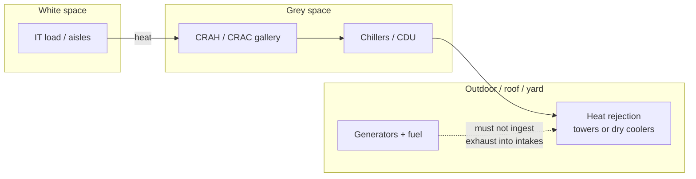

# Location, Building, and Construction

**Module ID:** `03-site-building`  
**Public CDCP domain:** Data Centre Location, Building and Construction  
**Depth:** standard (interview-ready)  
**Audience:** career-changers with network deploy experience; facilities terms are defined on first use.

---

## Learning objectives

By the end of this module you can:

1. Evaluate **site selection criteria** (power, fiber, risk, people, expansion, latency, zoning) and rank deal-breakers vs negotiable trade-offs.
2. Explain **flood, seismic, weather, and adjacency risks** and how they drive building design, insurance, and dual-site strategy.
3. Describe **supporting facilities** (grey space, NOC, staging, docks, utility yards, admin) and why undersizing them breaks operations even when white space looks fine.
4. Name **common location mistakes** that show up in colo tours, RFP responses, and outage post-mortems.
5. List **building requirements for high availability** (structure, height, floor load, dual paths, fire compartments, generator/fuel siting) at a design-interview level—not as a PE stamp.
6. Connect location and building choices to **time-to-repair (MTTR)**, spare logistics, dual utility feasibility, and long-term expansion cost.
7. Treat the **interconnect queue** (position, studies, financial security, years) as the 2026 **go/no-go** for whether a hall ever energizes—dual-feed lead times still matter and do not replace the queue.
8. Name a **behind-the-meter (BTM) / on-site generation campus** as a site *type* and a walk-away reason (Module 01 for the type noun; Module 06 for the power path—do not steal UPS/ATS/generator internals).
9. Speak **AI-factory / neocloud site criteria** as **power + water rights + fiber + queue**, not a brochure type list.

---

## Why it matters (ops / design / TPM interview angle)

Network engineers often inherit a site: “the colo on Main Street” or “the vacant warehouse IT found.” Facilities people know the inverse: **you can design a Tier-class power and cooling plant and still fail if the building floods, the roof can’t hold chillers, or the generator yard has no truck path.**

In interviews (ops engineer, DC design, TPM for infrastructure programs), location and building questions test whether you think in **business continuity**, not only rack elevation. Typical angles:

- **Ops:** “Would you put a second UPS room next to the first?” “How do we evacuate fuel after a spill?” “Where do we stage a 2,000-rack expansion without killing production airflow?”
- **Design:** structural load, clear height, column grid vs hot-aisle length, dual utility corridors, flood elevation vs raised floor.
- **TPM:** schedule risk (long-lead generators, utility upgrades, **interconnect queue years**), zoning/permits, neighbor complaints about noise and diesel smell, land for future halls **or a BTM generation campus**.

Location is one of the few decisions that is **hard to reverse**. Cabling and even cooling topologies can be renovated; moving a data centre is a multi-year capital program. Treat site choice as an availability control, not a real-estate convenience. In 2026 that control includes whether the **interconnect queue** will ever let the hall energize, and whether a **behind-the-meter campus** is the real path rather than a brochure dual-feed.

---

## Core concepts

### Site vs facility vs white space

| Term | Meaning |
|---|---|
| **Site / campus** | Land and outdoor plant: utility intake, generators, fuel, cooling towers/dry coolers, security perimeter, parking, future pads. |
| **Building / shell** | Structure, roof, slabs, exterior walls, loading docks, shaft/riser space, fire compartments. |
| **White space** | IT equipment area (racks, containment, cold/hot aisles)—what most networking people tour. |
| **Grey / mechanical-electrical space** | UPS rooms, switchgear, battery rooms, chillers, CRAH galleries, BMS closets—often larger than white space. |
| **Supporting facilities** | NOC, security ops center (SOC), staging, storage, workshops, offices, restrooms, break rooms, waste handling—needed to *run* the plant. |

**Rule of thumb:** if your floor plan is 80% white space and 20% everything else, you are almost certainly **underbuilding grey space and support**—a classic “IT-led” mistake.

### Site selection criteria (what to score)

Think of site selection as a **multi-factor risk and cost model**, not a single “cheap rent” decision.

**1. Power availability and quality**

- Can the **utility** deliver the load you need at **two independent feeds** (different substations/circuits where design targets demand it)?
- What is the **history of outages**, voltage sags, and planned maintenance blackouts?
- Is a **utility upgrade** required, and who pays? Lead times for new feeders can exceed equipment lead times.
- **Interconnect queue (2026 go/no-go):** dual-feed lead times still matter. They do not answer whether the **large-load interconnection** will happen. Ask: where is this project in the utility’s interconnection **queue**? What **studies** (feasibility / system impact) are open? What **financial security** is posted? Is energization measured in **years**, not feeder-SKU weeks? Land can close and the shell can be poured while the hall stays dark. The queue is the decision, not a resource-table noun. Do not memorize a gigawatt request-book figure as law; memorize the mechanism.
- Constrained grids can also refuse the *second* independent feed you need for 2N. “Power available” on a marketing slide is not a signed interconnection agreement.
- **Power quality** (harmonics, flicker) matters near heavy industrial neighbors.

**2. Connectivity and latency**

- Diverse **fiber routes** and carriers—ideally entering the building on **physically separate paths** (different sides, different manholes).
- Distance/latency to users, cloud on-ramps, internet exchanges, and partner sites.
- “Carrier hotel adjacency” is valuable for some workloads; rural cheap power is valuable for others. Match site to **workload**, not fashion.
- Treat fiber as a 2026 **outage path**, not only a siting checkbox: a metro cut is a long-duration IT-service event while the building still has power and cooling (see outage-path section below; Module 11 owns diversity *design*).

**3. Natural and environmental hazards**

- **Flood:** river/coastal flood plains, storm surge, pluvial (urban flash) flooding, dam failure zones. Check elevation relative to historical and projected flood maps (FEMA flood zones in the US; local equivalents elsewhere).
- **Seismic:** building code seismic design category; equipment anchorage and non-structural components often fail before the structure does.
- **Wind / tornado / hurricane:** roof uplift, debris, long utility outages after storms.
- **Wildfire / smoke:** air quality can force intake shutdown and filter loading.
- **Extreme temperature / humidity:** drives cooling design margins and water availability for evaporative systems.
- **Geotechnical:** soil bearing capacity, sinkholes, high water table (basement risk).

**4. Man-made and adjacency risks**

- Chemical plants, fuel pipelines, rail yards with hazmat, flight paths / airport approach zones.
- High-crime or high-threat environments (affects security design cost).
- **Electromagnetic** sources (broadcast towers, rail electrification, industrial RF)—preview of the EMF module.
- Flooding from **broken municipal water mains** or neighbor basements—often underestimated vs “river flood.”
- Future neighbors: zoning that allows a gas station or apartment tower next door can change risk and complaints over a 20-year lease.

**5. People, logistics, and MTTR**

- Access for **technicians 24×7**, emergency services, fuel trucks, and oversized electrical equipment.
- Proximity to **spares warehouses**, OEM field engineers, and airport/hotel for fly-in specialists.
- Labor market for facility engineers, electricians, and security staff.
- **Time-to-repair** after a major event is partly geography: a dual-site strategy in different risk basins beats a single “perfect” building.

**6. Expansion, zoning, and legal**

- Land for additional halls, generator pads, and cooling rejection equipment.
- **Zoning / land use** allowing continuous generator testing and diesel storage.
- Building height limits, setbacks, noise ordinances, emissions permits.
- Ownership: freehold vs long-term lease; who controls roof rights and risers?

**7. Water and heat rejection (often forgotten early)**

- Water rights/availability for cooling towers; drought risk.
- Space and acoustics for dry coolers / adiabatic coolers if water-constrained.
- Waste heat reuse opportunities or constraints.

### 2026 site types: AI-factory / neocloud / BTM campus

Module 01 owns the **type nouns** (neocloud / GPU colo / AI factory / behind-the-meter generation campus) as a type system next to enterprise / colo / hyperscale. This file owns what those types **do to site selection and walk-away**.

**AI-factory / neocloud site criteria (speakable answer):** score **power + water rights + fiber + queue**. Not a brochure list (“GPU colo,” “AI campus,” “dedicated hall”).

| Criterion | What you actually verify |
|---|---|
| **Power** | MW that can be *interconnected* (or generated BTM), not a marketing “power available.” Dual-feed independence still applies when the design claims it. |
| **Water rights** | Heat rejection at AI density needs water *rights* and a drought residual, or land/acoustics for dry/adiabatic rejection. Depth is Module 10; the site question is “do we have the right, not only a tap.” |
| **Fiber** | Diverse OSP into the campus—two logos on a slide are not two laterals. Module 11 owns diversity *design*. |
| **Queue** | Interconnect queue position / studies / financial security. This is the 2026 go/no-go. |

**Behind-the-meter / on-site generation campus** is a site *type*, not “we’ll add generators later.” The campus is planned around the plant: land for turbines / large BESS / fuel cells, fuel or gas lateral, emissions permits, switchyard, water for the plant if needed. Module 06 owns the **power path** (UPS / ATS / generator, BESS ≠ UPS batteries, microgrid/islanding). Do not steal that lesson here.

**Walk-away when:**

- The hall’s only energization story is BTM and the operator cannot show land, fuel/gas path, or permits for the plant.
- BTM is sold as “no grid risk.” On-site continuous generation is a **new failure mode** (the plant itself), not immunity. Grid interconnect often remains a hidden go/no-go for export, backup, or black-start.
- An “AI factory / neocloud” tour cannot speak the four criteria above.

### Grid, fiber, and interconnect as 2026 outage paths

These are not only siting footnotes. In 2026 they are **availability clocks**. Do not invent an outage percentage.

**The grid got worse as an input.** Constrained interconnect, clustered large loads, and two-way interaction (a large-load trip stresses the grid; curtailment / ride-through conditions stress the site) mean a building can have two laterals and still sit in a regime where the second independent feed will not be studied, or where energization is years out. The interview point is the *path*, not a pie slice.

**The switchover is often the outage, not “the utility died.”** When the grid hiccups, the facility event is usually the transfer / UPS / generator path. This module owns the *site* implication: independent rooms, independent outdoor plant, no shared fire zone (Rated-3 intent dies if both UPS rooms share a fire zone). **Module 06** owns the power-path lesson (ATS vs STS, “generator started ≠ load saved”). Do not steal it here.

**Fiber cuts are long-duration IT-service events.** The building can stay powered and cooled while a metro cut takes the workload offline for hours. Two carriers in one duct bank are one cut. **Module 11** owns diversity design; this module owns the site fact that pathway diversity is **real estate** you buy—or walk away from—at selection time.

### Flood, seismic, and other risk treatments

Risk treatment is not only “avoid the flood plain.” Options include:

| Risk | Prefer | If you must stay |
|---|---|---|
| Flood | Site above design flood elevation; no below-grade critical plant | Elevate generators/switchgear; dry floodproofing; flood doors; pumps; sealed conduits; no fuel/UPS in basements |
| Seismic | Lower seismic hazard where possible | Code-level structural design; equipment anchorage; flexible connections; seismic snubbers on spring isolators; battery rack restraint |
| Wind | Robust roof and cladding design | Redundant cooling paths; pre-positioned fuel; hardened outdoor plant |
| Fire (external) | Defensible space; non-combustible envelope | Compartmentation; outdoor plant separation from IT |

**Design flood elevation (DFE)** and **base flood elevation (BFE)** are civil/engineering concepts: critical equipment is often set **above** the regulatory flood elevation with freeboard (extra height margin). Raised access flooring is **not** a flood strategy—it is shallow and filled with cables that hate water.

**Seismic note for networking people:** after an earthquake, the building may stand while **batteries tip, chillers walk, and bus ducts shear**. Anchorage and flexible joints are part of “availability,” not decoration.

### Building requirements for high availability

High availability at the building level means the shell and layout **support dual-path MEP** (mechanical, electrical, plumbing) and safe, maintainable operations.

**Structural and geometric**

- **Floor loading:** IT areas need high **uniform distributed load (UDL)** and **concentrated load** capacity for racks; mechanical floors need higher loads for UPS, batteries, and chillers. **Rolling load** (moving a rack or transformer) often governs pedestal and slab more than static weight. **Magnitude oral (example-not-code, not a statute):** a typical office or light-storage live-load family is often in the **~50–125 psf (~2.4–6 kN/m²)** band—that is why a warehouse conversion fails the first load conversation. White-space slabs and access-floor systems are often discussed in a **~150–250 psf (~7–12 kN/m²)** UDL working band, with mechanical and battery rooms specified higher. Do **not** memorize “250 psf” as a universal code minimum. The project structural engineer and the **CISCA** (or **EN 12825**) class on the tile data sheet are the authority. **Module 04** owns the three load *types* and their units (UDL vs concentrated vs rolling).
- **Clear height:** free height from slab to underside of structure/obstructions must fit racks + containment + cable trays + lighting + fire detection, or raised floor plenum + same stack. Undersized height is a permanent tax.
- **Column grid:** columns that bisect hot aisles or block containment force inefficient layouts and wasted power capacity.
- **Slab vs multi-story:** multi-story saves land but complicates vertical power/cooling risers, fire compartments, and heavy equipment delivery. Ground-level heavy plant is often preferred.
- **Vibration isolation:** nearby rail/road or on-site generators; sensitive storage media and some mechanical equipment care.

**Envelope and water**

- Roof waterproofing, drainage, and **no single roof drain path** that dumps into electrical rooms.
- Exterior wall and window strategy: data halls often prefer limited glazing (security, solar load, blast/debris).
- Below-grade spaces: if used, treat as high risk for water and limit to non-critical functions where possible.

**Layout for concurrent maintainability and dual path**

Concepts you will hear in TIA-942-style and Uptime-style language (know the *idea*; rating schemes differ):

- **N:** capacity for full load; failure or maintenance of one unit may drop IT.
- **N+1:** one spare unit in a group; single-unit maintenance/failure survivable (topology-dependent).
- **2N / dual path:** two complete, independent distribution paths to the load so one path can be offline.

Building implications of dual path:

- Two **electrical rooms** (or clearly separated compartments) with independent feeds.
- Two **mechanical galleries** / CRAH rows with independent piping where design requires.
- Separate **cable pathways** and risers so a fire or construction event on path A does not take path B.
- **Fire compartments** that limit blast/fire propagation between redundant plants.
- Enough **service clearances** and pull space so maintenance does not require de-energizing the only path.

**Delivery and outdoor plant**

- Loading docks sized for transformers, generators, chillers—with **straight truck paths**, not hairpin turns.
- Generator yard: airflow, exhaust separation, fuel filling access, spill containment, noise barriers, security setback.
- Fuel storage: code limits, secondary containment, leak detection—often a zoning fight.
- Utility yard: space for future switchgear and medium-voltage gear without blocking fire lanes.

### Supporting facilities and functions

White space fails softly when support is wrong; operations fail hard.

| Support area | Why it exists |
|---|---|
| **NOC / ops center** | Visibility into BMS/DCIM/EMS, incident command, carrier escalation. |
| **Security ops / reception** | Access control, visitor handling, CCTV monitoring—layers before white space. |
| **Staging / burn-in** | Unbox, asset tag, rack-and-stack without cluttering production aisles or blocking egress. |
| **Secure storage** | Spares (PSUs, optics, fans), crates, empty pallets out of egress paths. |
| **Workshop / tool crib** | Facility and IT tools; soldering/testing without foreign-material risk in halls. |
| **Battery / UPS rooms** | Often separate fire, HVAC, and spill requirements from IT space. |
| **Admin, restrooms, break rooms** | 24×7 staffing; codes and human factors. |
| **Parking / emergency assembly** | Shift change, DR drills, first responders. |
| **Waste / recycling** | Cardboard is a fire load; continuous receiving generates continuous waste. |

**Supporting facilities mistake:** designing beautiful white space and then using the only staging room as permanent storage until egress is blocked and the AHJ (Authority Having Jurisdiction—fire marshal / inspector) fails you.

### Common location mistakes

1. **Cheap power, single substation story** — marketing said “redundant utility”; both feeds collapse to one substation or one transmission corridor.
2. **Fiber diversity on paper only** — two carriers, same duct bank, same manhole, same pole line.
3. **Basement generators / UPS “to save space”** — flood and firefighting water risk.
4. **No land for cooling rejection or generators** — day-one design is maxed; growth means rooftop engineering hell or new site.
5. **Ignoring flood maps and future climate** — “we’ve never flooded” is not a return period analysis.
6. **Adjacent hazards discounted** — rail, chemical plant, flight path, high-pressure gas line within blast/evacuation radius.
7. **People logistics ignored** — remote site with no housing or airport; MTTR becomes days for specialist failures.
8. **Zoning / noise / fuel storage discovered after design freeze** — generators cannot be tested or filled legally as planned.
9. **Column grid and clear height fixed by an office conversion** — racks and containment fight the building forever.
10. **Underbuilt grey space** — white space fills while electrical rooms cannot accept another UPS or switchboard.
11. **“Power available” with no queue position** — marketing MW; no interconnection study, no financial security, no years-to-energize.
12. **BTM campus treated as a generator add-on** — no land, no gas/fuel path, no emissions permit; or sold as “no grid risk.”
13. **AI-factory brochure without the four criteria** — type noun on the slide; power, water rights, fiber, and queue never walked.

### How location feeds high-availability design

```text
WORKLOAD & SLA
      │
      ▼
SITE RISK PROFILE ──► dual-site / DR region decision
      │
      ▼
UTILITY + FIBER REALITY ──► 2N paths feasible? or only N+1 local?
      │
      ▼
INTERCONNECT QUEUE / BTM ──► hall ever energizes? (2026 go/no-go)
      │
      ▼
BUILDING GEOMETRY ──► floor load, height, compartments, docks
      │
      ▼
MEP LAYOUT ──► power path, cooling loop, pathways
      │
      ▼
SUPPORT SPACES ──► ops can actually maintain without self-inflicted outages
```

A “Rated-3 / concurrently maintainable” *intent* fails if the building forces both UPS rooms through one fire zone or one choke-point corridor. It also fails the 2026 go/no-go if the interconnect queue will not energize the hall, or if the only path is a BTM campus the site cannot actually host.

---

## Key diagrams

### Dual-path building layout (conceptual plan)

```text
                    ┌──────────────────────────────────────┐
                    │              SITE PERIMETER           │
                    │  ┌────────┐              ┌────────┐  │
   UTILITY A ═══════╡  │ SWGR A │              │ SWGR B │  ╞═══════ UTILITY B
                    │  └───┬────┘              └───┬────┘  │
                    │      │                       │       │
                    │  ┌───▼────┐              ┌───▼────┐  │
                    │  │ UPS A  │              │ UPS B  │  │
                    │  └───┬────┘              └───┬────┘  │
                    │      │     FIREWALL          │       │
                    │  ┌───▼───────────────────────▼────┐  │
                    │  │         WHITE SPACE            │  │
                    │  │   (A+B feeds to dual-cord IT)  │  │
                    │  └────────────────────────────────┘  │
                    │  GEN A yard          GEN B yard      │
                    └──────────────────────────────────────┘
```

Interview talking point: **separation** (distance, fire barriers, independent outdoor plant) is as important as the number of UPS modules.

### Cooling plant vs building envelope (conceptual)



Place generator exhaust and cooling intakes so they do not **short-circuit** (hot exhaust into cooling or building air intakes)—a classic site layout failure.

### Vertical hierarchy (multi-story caution)

```text
ROOF:   heat rejection, some electrical, fall protection, leak risk ↓
UPPER:  possible IT or offices — riser capacity is finite
GROUND: preferred for heavy electrical, docks, security entry
BELOW:  high flood / water risk — avoid critical plant
```

### Cabling and pathway hierarchy (building-level)

```text
Campus duct banks / diverse manholes
        │
Building Entrance Facility (BEF) / MMR — dual preferred
        │
Main Distribution Area (MDA) / core
        │
Horizontal Distribution Area (HDA) / aggregation
        │
Equipment Distribution Area (EDA) / racks
```

Location choice affects whether you can buy **two diverse BEFs**; building construction affects whether risers and trays can stay diverse floor-to-floor. (Structured cabling depth is Module 11; here you only need the building implication: **pathway diversity is real estate**.)

---

## Formulas / rules of thumb

These are **orientation aids**, not design calculations. Always defer to the project engineer of record and local codes.

| Rule of thumb | Use |
|---|---|
| **Grey + support often ≥ white space** in high-density or highly redundant designs | Early programming / space budgets |
| **Plan expansion land** for ≥ next hall or ≥ 50–100% outdoor plant growth | Site shortlist scoring |
| **Critical equipment above design flood + freeboard** (often 1+ ft / ~300+ mm—project-specific) | Flood strategy |
| **Dual utility ≠ dual path** until traced to independent upstream sources and independent indoor rooms | RFP / colo due diligence |
| **Two carriers ≠ diverse fiber** until diverse OSP (outside plant) paths are verified | Connectivity due diligence |
| **Clear height early** — retrofitting height is nearly impossible | Building conversion deals |
| **Dock + path + elevator rating** must move the heaviest / largest planned equipment | Multi-story feasibility |
| **Noise ordinances** may limit generator test windows — affects maintenance compliance | Zoning check |
| **MTTR geography:** specialist + part same-day vs next-day flight | Single-site vs multi-site decision |
| **Interconnect queue is the 2026 go/no-go** — position, studies, financial security, years; dual-feed lead times still matter | Large-load / AI-hall due diligence |
| **BTM campus is a site type** — land, fuel/gas, permits; not “gens later”; Module 06 owns the path | Walk-away / type oral (Module 01 nouns) |
| **AI-factory / neocloud criteria** = power + water rights + fiber + queue | Speakable site answer, not a brochure list |
| **White-space UDL working band ~150–250 psf (~7–12 kN/m²)** — example-not-code; rolling often governs; Module 04 for types | Site vs warehouse conversion |

**Availability context (from Module 01):** more nines demand not only better UPS topology but **lower probability of site-wide events** (flood, long utility outage, regional fiber cut, interconnect that never comes). Building redundancy does not protect against a site-level disaster—**geographic diversity** does. Grid / fiber / interconnect are 2026 *outage paths* (above), not only siting scores. Do not invent an outage percentage.

---

## Common failure modes and misconceptions

| Misconception | Reality |
|---|---|
| “Raised floor protects against floods.” | Only inches of freeboard; floods and firefighting water defeat it. |
| “We’re dual-corded, so building layout doesn’t matter.” | Dual-corded IT still dies if both paths share one room fire or one flooded basement. |
| “Colo marketing ‘N+1’ means my app is safe.” | Shared infrastructure, maintenance windows, and human process still dominate; read the SLA and topology. |
| “Any warehouse with fiber is a data centre.” | Floor load, height, power density, and fire compartments usually are not. |
| “Seismic is only a structural engineer problem.” | Non-structural anchorage and tethered racks/batteries are frequent failure points. |
| “Support space is overhead; cut it to save CapEx.” | Staging clutter, blocked egress, and no spare storage create outages and failed inspections. |
| “We’ll add the second generator later.” | Yard space, fuel permits, and electrical room space often vanish by “later.” |
| “Latency to HQ is the only network factor.” | Carrier diversity and metro fabric matter as much as milliseconds for many enterprise designs. |
| “The interconnection guide in the resource table is the lesson.” | The lesson is the **queue**: position, studies, financial security, years. Dual-feed lead times stay. |
| “BTM / on-site generation means no grid risk.” | BTM is a site type and a new plant failure mode. Interconnect often remains a go/no-go. Module 06 for the path. |
| “AI factory is a brochure type.” | Speak **power + water rights + fiber + queue**. Module 01 owns the type nouns. |
| “250 psf is the data-centre floor code.” | Example-not-code working band. Ask which rating (UDL / concentrated / rolling) and which test (CISCA / EN 12825). Module 04. |
| “Fiber diversity is a siting checkbox; outages are power.” | A metro fiber cut is a long-duration **IT-service** outage with the building still up. Module 11 for design. |

**Human-factor failure:** beautiful dual-path design with a single shared choke point for **people**—one corridor, one badge door, one loading dock—creating operational single points of failure during incidents.

---

## Interview drills

**Q1. What would make you walk away from a potential colo site?**  
**A:** Site-level risks you cannot engineer around at acceptable cost: high flood exposure with critical plant below grade; single upstream utility corridor sold as “redundant”; no diverse fiber into the campus; no expansion path for power/cooling; or adjacency (chemical/rail) that insurance and risk teams reject. Also walk if the operator cannot show independent electrical rooms and maintenance procedures that match the marketed tier language. **2026 add:** walk if there is no honest **interconnect queue** story (position, studies, financial security, years-to-energize); if a **BTM / on-site generation campus** is the energization path and the site cannot host the plant (land, fuel/gas, permits)—or BTM is sold as “no grid risk”; if an AI-factory / neocloud pitch cannot speak **power + water rights + fiber + queue**.

**Q2. How can supporting spaces fail a design when white space looks fine?**  
**A:** No staging leads to cardboard and crates in production aisles (fire load, blocked egress). Undersized UPS/battery rooms block capacity growth. No secure spares storage extends MTTR. Missing dock/path capacity means generators and transformers cannot be replaced without extraordinary cost. Ops quality collapses even if PUE marketing slides look great.

**Q3. Utility A and Utility B both enter the building—are you dual-path?**  
**A:** Not until you verify **independence upstream** (different substations/transmission) and **independence indoors** (separate switchgear, UPS, distribution, and fire compartments) all the way to dual-corded loads. Shared transformer yards, shared basements, or a single ATS topology can collapse “A/B” into one failure domain.

**Q4. Why is clear height a first-order building criterion?**  
**A:** It constrains rack height, containment, cable tray layers, lighting, and detection/suppression. You can add UPS modules more easily than you can raise a roof. Low clear height forces compromised cooling airflow and cable management, which become chronic incident sources.

**Q5. Flood plain vs seismic zone—how do you discuss trade-offs?**  
**A:** Flood is often a **site reject or elevate** decision because water destroys electrical plant; residual risk needs civil measures and insurance. Seismic is frequently **mitigated by code design and anchorage** rather than abandoning a metro market. Many operators accept higher seismic design cost to stay near connectivity and customers, while hard-avoiding flood basements. Real decisions combine hazard frequency, business location needs, and dual-region DR strategy.

**Q6. What is the interconnect queue, and why is it a go/no-go rather than a lead-time footnote?**  
**A:** The large-load interconnection process: queue position, utility studies, financial security, and an energization date measured in years. Dual-feed *lead times* are still real. They do not decide whether the utility will interconnect you at all, or whether the second independent feed will even be studied. A closed land deal and a poured slab are not an energized hall. Do not quote a gigawatt request-book figure as law; quote the mechanism.

**Q7. What kind of site is an AI factory / neocloud / BTM campus, and when do you walk?**  
**A:** Module 01 owns the type nouns. Here: an AI-factory / neocloud site is scored on **power + water rights + fiber + queue**. A BTM / on-site generation campus is a site *type*—the plant (turbines, large BESS, fuel cells) is how the hall energizes, not a later generator add. Walk if those four criteria are brochure-only, if the BTM plant has no land/fuel/permit path, or if BTM is sold as immunity from the grid. Point at Module 06 for UPS/ATS/gen and islanding; do not draw the power path in this oral.

**Q8. Give a floor-load magnitude without inventing a code.**  
**A:** Example-not-code: office / light-storage families often sit around **~50–125 psf (~2.4–6 kN/m²)**—that is why the warehouse conversion fails. White-space slabs and access floors are often discussed in a **~150–250 psf (~7–12 kN/m²)** UDL working band; mechanical and battery rooms higher. **Rolling** often governs. Then ask *which* rating and *which* test (CISCA / EN 12825). Module 04 owns the types and units. There is no universal psf statute.

---

## Self-check quiz

1. **White space** primarily refers to:  
   a) Painted walls in the lobby  
   b) IT equipment areas (racks and aisles)  
   c) Only the UPS rooms  
   d) Outdoor generator yards  

2. Which is the best statement about **two different ISPs**?  
   a) Guarantees fiber path diversity  
   b) Guarantees dual utility power  
   c) May still share the same duct bank or manhole  
   d) Removes the need for dual BEFs  

3. Placing generators and UPS in a **basement** is risky mainly because of:  
   a) Higher latency  
   b) Water (flood / firefighting) and access/egress challenges  
   c) EMF from the sky  
   d) Column grid only  

4. **N+1** capacity generally means:  
   a) Two fully independent distribution paths to every load  
   b) Enough units that one can be offline and load is still served (topology-dependent)  
   c) Zero maintenance windows forever  
   d) Geographic dual-site only  

5. A strong reason to reject a cheap rural site for a low-latency trading workload:  
   a) Dirt is cheaper  
   b) Distance/latency and possibly sparse carrier diversity  
   c) Too much land for generators  
   d) Clear height is always higher rural  

6. **Supporting facilities** include:  
   a) Only CRAH units  
   b) Staging, NOC, security, storage, docks, admin  
   c) Only the MDM software  
   d) Hot aisle containment only  

7. Raised access floor as a flood strategy is:  
   a) Usually sufficient for river floods  
   b) Inadequate; flood design needs elevation and water management  
   c) Required by all global codes as the sole control  
   d) The same as freeboard above BFE  

8. Building dual-path electrical design is undermined when:  
   a) UPS A and UPS B sit in one common fire compartment with shared points of failure  
   b) Racks are dual-corded  
   c) Generators are tested monthly  
   d) Fiber enters on two sides of the building  

9. The 2026 go/no-go for whether a new hall ever energizes is usually:  
   a) The color of the brochure dual-feed diagram  
   b) The **interconnect queue** (position, studies, financial security, years)—dual-feed lead times still matter and do not replace it  
   c) Raised-floor height  
   d) Whether two ISPs have logos in the MMR  

10. A **behind-the-meter / on-site generation campus** is:  
    a) The same lesson as UPS/ATS/generator internals (Module 06)  
    b) A site *type* and a walk-away reason if the plant cannot be hosted (land, fuel/gas, permits); Module 01 for the type noun, Module 06 for the path  
    c) Proof that the grid cannot affect the site  
    d) A substitute for diverse fiber  

11. **AI-factory / neocloud** site criteria, as a speakable answer, are:  
    a) A brochure type list (GPU colo / dedicated hall / rural cheap land)  
    b) **Power + water rights + fiber + queue**  
    c) Only latency to HQ  
    d) Only the Uptime sticker on the door  

12. White-space floor-load working numbers in this module are:  
    a) A universal statute of 250 psf for every hall  
    b) Example-not-code: warehouse/office families often ~50–125 psf (~2.4–6 kN/m²); white-space UDL often discussed ~150–250 psf (~7–12 kN/m²); rolling often governs; Module 04 for types  
    c) Irrelevant if the raised floor is 24 inches  
    d) The same as flood freeboard  

### Answers

<details>
<summary>Click to reveal answers</summary>

1. **b** — White space is the IT equipment area.  
2. **c** — Carrier diversity must be validated in the outside plant, not assumed from logos.  
3. **b** — Water and constrained access make below-grade critical plant a frequent anti-pattern.  
4. **b** — N+1 is spare capacity in a set; it is not automatically 2N dual path.  
5. **b** — Workload latency and connectivity ecosystems often dominate pure land/power cost.  
6. **b** — Support spaces enable operations, maintenance, and growth.  
7. **b** — Raised floor is not a substitute for flood elevation and civil controls.  
8. **a** — Shared rooms/compartments can collapse A/B into one failure domain.  
9. **b** — The queue decides whether the hall energizes; dual-feed lead times stay and do not replace it.  
10. **b** — BTM campus is a site type and a walk-away; Module 06 owns the path.  
11. **b** — Speak power + water rights + fiber + queue, not a brochure type list.  
12. **b** — Example-not-code working band; no universal psf statute; Module 04 for types.

</details>

---

## Further free resources

Public standards and primers (names and free entry points—no paywalled EPI courseware):

| Resource | What to use it for |
|---|---|
| **ANSI/TIA-942** family (overview/public summaries; purchase full standard if designing) | Site, building, rated topology concepts, cabling spaces (BEF/MDA/HDA/EDA) |
| **ISO/IEC 22237** series (European EN 50600 is closely related) | Facilities and infrastructure class language in international contexts |
| **ASHRAE TC 9.9** thermal guidelines (public overview materials) | Environmental envelopes that influence building HVAC decisions |
| **NFPA 75** (IT equipment) / **NFPA 76** (telecom) — know they exist; local fire code + AHJ govern | Fire protection interfaces with building compartments (deeper in Module 12) |
| **Local building / electrical codes** (e.g. IBC, NEC/NFPA 70 in the US; IEC-based national codes elsewhere) | Enforceable requirements—**code beats brochure** |
| **FEMA flood maps** (US) or national flood mapping agencies | Site flood due diligence starting point |
| **USGS / national seismic hazard maps** | High-level seismic context before geotech/structural work |
| **Uptime Institute tier topology explanations (public marketing/education pages)** | Conceptual redundancy language—**distinct from TIA ratings**; do not conflate certification schemes |
| **Utility interconnection and large-load customer guides** (many IOUs publish PDFs) | Queue position, studies, financial security, dual-feed lead times—the **queue** is the 2026 go/no-go, not a footnote |
| **Vendor / hyperscale design primers** (e.g. open design papers on air paths, dual power)—use critically | How large operators think about site and shell; not a substitute for code |

**Study tip:** On your next colo tour, ignore the blinking switches for ten minutes. Photograph (with permission) or sketch: generator yards, fuel fill point, dual electrical rooms, fiber entry points, docks, staging, and where water would go if a pipe burst. Then ask **where they sit in the interconnect queue** and whether any hall is a **BTM campus**. That walk teaches this module faster than any slide deck.

---

*Module `03-site-building` — Location, Building, and Construction. Part of the free CDCP-domain self-study reconstruction; not affiliated with EPI®/EXIN.*
