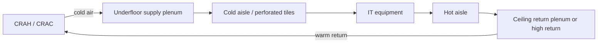

# Raised Access Floor and Suspended Ceiling

## Learning objectives

By the end of this module you can:

- Compare **raised-floor** vs **slab** (non-raised) white-space designs and explain when each is preferred today
- Distinguish the two main **types** of raised floors: **stringered** vs **free-standing / stringerless** understructure, and **wood-core** vs **cementitious** panels
- Define and apply **uniform**, **concentrated**, and **rolling** load ratings for access-floor systems
- Name the main public standards and industry references used for raised floors and bonding practice
- Explain **Signal Reference Grid (SRG)** / floor grounding concepts at a facilities interview level
- Specify safe access: **ramps**, landings, tile cuts, and cable egress
- Describe **suspended ceiling** roles (aesthetics, return-air plenum, cable pathway, fire/smoke trade-offs)
- Connect floor and ceiling plenums to **cooling efficiency**, airflow patterns, and common ops mistakes

---

## Why it matters (ops/design/TPM interview angle)

If you come from network deploy, think of the raised floor and ceiling as the **physical underlay** for power, copper/fiber, and cold air—not “just finishing.” A missing perforated tile, a crushed pedestal, or a cable dam under the floor can drop an entire row the same way a bad BGP policy drops a region: the failure looks sudden on monitoring, but the **contributing factors** were layout and discipline months earlier — **plural** (Module 15), never “root cause” singular.

**Ops:** You will walk white space, pull tiles, run carts with servers, and open cutouts. Knowing load ratings, ramp rules, and “never leave a tile out” is day-one safety and availability.

**Design / facilities TPM:** You choose plenum height, floor system type, containment strategy, and whether to skip raised floor for high-density or liquid-cooled halls. Interviewers use this domain to test whether you understand **air as a designed path**, not room temperature vibes.

**Career-changer angle:** Facilities terms (pedestal, stringer, SRG, underfloor static pressure) are the vocabulary of site surveys and change tickets. Master them and you can talk to mechanical, electrical, and cabling teams without guessing.

---

## Core concepts

### Raised access floor — what it is

A **raised access floor** (also called *access floor*, *computer floor*, or *raised floor*) is a modular walking surface elevated above the structural **slab** on adjustable **pedestals**. The void underneath is the **underfloor plenum**. Typical finished floor heights in data centres range from roughly **300–600 mm (12–24 in)** and sometimes higher for heavy cabling or air volume; always verify project specs—there is no single universal height.

**Components (define on first use):**

| Term | Meaning |
|------|---------|
| **Panel / tile** | Removable square (commonly 600×600 mm or 24×24 in) of steel, aluminum, wood-core, or cementitious core with a wearing surface |
| **Pedestal** | Vertical post anchored or adhered to the slab; height-adjustable; supports panels at corners |
| **Stringer** | Horizontal member connecting pedestals; improves lateral stability and load sharing (stringered vs free-standing systems) |
| **Understructure** | Pedestals + stringers (and sometimes grid) as a system |
| **Finished floor height (FFH)** | Distance from slab top to walking surface top |
| **Cutout / grommet** | Opening in a panel for cable or air; must be finished to control air leakage and protect cables |
| **Perforated / grille tile** | Panel with openings to deliver supply air into the cold aisle (in underfloor supply designs) |

**Why raise the floor historically:** route power and data cables out of the walking path; use the plenum as a **supply-air** duct for CRAH/CRAC units; reconfigure rows without trenching the slab.

**Why many modern halls reduce or skip raised floor:** overhead busway and ladder rack; **hot-aisle / cold-aisle containment**; higher rack densities where underfloor air cannot deliver enough volume cleanly; liquid cooling; lower CAPEX/OPEX and fewer trip/air-leak risks. **Slab + overhead distribution** is common in hyperscale and many new colo halls. Raised floor is still widely used in enterprise, telecom, and retrofit spaces—know both paradigms.

### Types of raised floors

The public heading (1.4.1) is “mention the two main types.” There are **two axes**. Do not collapse them into one pair, and do not answer with a load number.

**Understructure — stringered vs free-standing / stringerless**

| Type | What it is | Why it shows up |
|------|------------|-----------------|
| **Stringered** (often **bolted stringer**) | Horizontal **stringers** connect pedestals into a grid under the panels | Lateral stability and load sharing; common where rolling loads, frequent tile pulls, or seismic bracing matter |
| **Free-standing / stringerless** (corner-lock, gravity, snap-on heads) | Panels sit on pedestal heads; no stringer is the primary load path | Faster install and easier cable pulls; stiffness comes from the panel-to-head lock and the field of panels acting together |

Both are legitimate data-hall systems. A **corner-lock** head (panels locate on the pedestal) is a free-standing family. Ask which understructure the spec bought — not “which brand is a raised floor.”

**Panel construction — wood-core vs cementitious**

| Type | What it is | Why it shows up |
|------|------------|-----------------|
| **Wood-core** | Steel (or similar) skins over a wood-composite core | Lighter and easier to cut on site; more sensitive to humidity; still seen in offices and lighter equipment rooms |
| **Cementitious** | Welded steel shell filled with a lightweight cementitious core | Heavier and stiffer; the usual **data-hall** panel in North America (rolling load, dimensional stability, non-combustibility story) |

Aluminum and hollow all-steel panels exist; they are variants, not a third “main type” you must invent. When asked for the two main types, answer **stringered vs stringerless** first, then **wood-core vs cementitious**.

### Load types — uniform, concentrated, rolling

Floor systems are rated for how much weight they can carry **without excessive deflection or permanent damage**. Three ratings appear constantly in specs and interviews:

**1. Uniform load (distributed load)**  
Load spread evenly over the whole panel area, expressed as **force per unit area** (e.g. kN/m² or lb/ft²). Think “many light items” or the equivalent of a crowd of evenly spaced point loads. Useful for comparing systems and for light equipment distributions—not the number that usually governs a rack placement.

**2. Concentrated load (point load)**  
Load applied on a small area of one panel (classically related to a caster pad, equipment foot, or a defined contact area in the test method). Expressed as a **force** (kN or lbf) at a specified location (often panel center or weakest point per the test standard). **This is what matters for cabinets and PDUs.** A rack’s corner feet or casters can easily be the governing case even when the “average” kN/m² looks fine.

**3. Rolling load**  
Repeated load from a wheel or caster rolling across panels and joints—simulates **server lifts, pallet jacks, and equipment carts**. Specs often state a load **and** a number of passes (cycles). Rolling load is frequently the **most demanding** rating because it flexes panels and joints repeatedly and can loosen understructure or crack cores over time.

**Related terms:**

- **Ultimate load / safety factor:** ultimate capacity vs working (design) load; never treat ultimate as “what we can put on the floor every day.”
- **Deflection limits:** how much the panel may bend under rated load (comfort, equipment alignment, joint integrity).
- **Pedestal axial capacity:** vertical load the pedestal and its attachment can take; floor is a **system**, not only the panel face.
- **Seismic / lateral:** stringers, seismic pedestals, and bracing matter where codes require them—separate from static load ratings.

**Rule for practice:** When ops says “the floor is rated X,” ask **which rating** (uniform vs concentrated vs rolling), **per which standard/test**, and **what the governing equipment load path is** (casters, feet, isolation pads).

### Example working magnitudes (example-not-code)

A PM will ask “is **250 psf** / **12 kN/m²** / **1000 lbf** concentrated in the right *family*?” The family is real: **uniform** as force per area (**psf** or **kN/m²**), **concentrated** as a force (**lbf** or **kN**), **rolling** as a force **and** a pass count. **250 psf is not a statute.** Quote the sheet in front of you.

One public vendor row so the magnitudes are hearable:

**Source (example-not-code):** Tate Access Floors, *ConCore 1250 Access Floor Panel — LFFH PosiLock Understructure (Cornerlock)*, public specification, rev. 2026-02-02. One SKU, one understructure, CISCA methods on actual understructure. Not a code, not every hall, not the slab.

| Rating on that sheet | Working number | Unit family |
|----------------------|----------------|-------------|
| Design / concentrated | **1250 lbf** (≈ **5.56 kN**) on 1 in² | **lbf / kN** |
| Rolling, CISCA Wheel 1 | **1000 lbf**, **10** passes | **lbf × cycles** |
| Rolling, CISCA Wheel 2 | **800 lbf**, **10 000** passes | **lbf × cycles** |
| Ultimate (safety factor ≥ 2) | 2500 lbf | not a working load |
| Uniform | **not published as the governing figure on this spec** | **psf / kN/m²** — do not invent **250 psf** to fill the cell |

**Module 03 pointer:** “The warehouse floor is not enough” is a **site-selection** oral — the *building slab* needs UDL, concentrated, and rolling capacity (Module 03). This file rates the **access-floor system** that sits on that slab. Two surfaces; neither is “250 psf everywhere.”

### Floor standards and guidelines (public names)

You do not need to memorize proprietary exam wording. You do need to know **where industry looks**:

- **CISCA** (*Ceilings & Interior Systems Construction Association*) — widely referenced **recommended test procedures** for access floors (concentrated, uniform, rolling, impact, etc.). Vendor data sheets often cite CISCA-style methods.
- **ISO 22496** (and related access-floor product standards in some markets) — product/performance language for raised access floors (confirm current edition for your region).
- **EN 12825** — European standard for raised access floors (classification by load and deflection classes is commonly discussed in EU projects).
- **ANSI/TIA-942** (family) — data centre infrastructure standard; addresses facilities topics including pathways and spaces; use for **DC design context**, not as a substitute for structural or product load tests.
- **ASHRAE** thermal guidelines and data centre design guidance — not a floor product standard, but critical for **how the plenum is used for cooling**.
- **Local building / structural codes and the structural engineer of record** — slab capacity, seismic, firestopping of penetrations, and occupancy loads override marketing claims.
- **Electrical bonding practice** — national electrical codes (e.g. **NEC/NFPA 70** in the US, **IEC** and national wiring rules elsewhere) plus manufacturer bonding instructions for floor systems and equipment.

If a data sheet cites a rating without the **test method and deflection criteria**, treat it as incomplete for design decisions.

### Grounding, bonding, and the Signal Reference Grid (SRG)

**Grounding** (protective earth) and **bonding** (intentional low-impedance metallic interconnection) are related but not identical. In white space:

- Equipment racks, trays, and conductive floor components should be **bonded** into the site grounding system so fault current has a designed path and touch voltages stay controlled.
- **ESD** (electrostatic discharge) control may use static-dissipative floor finishes and proper footwear/procedures; that is related to surface resistance, not a substitute for equipment protective earthing.

**Signal Reference Grid (SRG)** (also discussed historically as a signal reference plane or equipotential bonding grid under/at the raised floor): a conductive grid (often copper conductors in a mesh pattern, or intentional bonding of conductive floor understructure) intended to provide a **low-impedance reference** and reduce noise/potential differences between equipment at high frequencies. In classic mainframe and raised-floor rooms, the SRG was a standard design conversation.

**Modern practice notes (interview-safe):**

- Many designs still **bond pedestals/stringers** and provide **equipment bonding conductors** to racks and trays per code and standards practice.
- High-frequency “noise” problems are often solved more by **cable management, shielding, separation of power and signal, and proper equipment grounding** than by folklore grids alone.
- Never invent a bonding scheme on the fly: follow the **electrical design**, manufacturer instructions, and AHJ (authority having jurisdiction). Incorrect bonding can create ground loops or unsafe conditions.
- Conductive floor systems are **not** automatically an SRG unless designed and installed as one.

**Practical ops takeaway:** When you lift tiles and see copper straps, braids, or bonded stringers, leave them intact; report damage; do not use bonding conductors as cable hangers.

### Ramps, landings, and accessibility

Raised floors create a **level change**. People and equipment must enter white space without trips, tip-overs, or cart drops at the threshold.

- **Ramp slope:** governed by accessibility and building codes (often discussed in terms of maximum rise/run, landings, and handrails). Data centre designs commonly provide equipment ramps rated for the same **rolling load** class as the floor (or better).
- **Landings:** level platforms at top/bottom of ramps and at doors so carts can stop and doors can swing without rolling back down the slope.
- **Transitions:** threshold plates and edge details must not become lip trip hazards or air-leak gaps into the plenum.
- **Tile management:** temporary ramps or bridging when tiles are open for work; barrier tape and “open floor” discipline.
- **Emergency egress:** ramps and exits must remain clear; raised floor edges at stairs/steps need guards where required.

If the floor height is large and space is tight, designers may use equipment lifts, docks, or **stage-down** rooms—still a facilities design problem, not only architecture aesthetics.

### Suspended ceiling — use in the data centre

A **suspended ceiling** (drop ceiling) is a secondary ceiling hung below the structural slab/roof on a grid, typically with removable tiles.

**Possible roles in DC space:**

1. **Aesthetics / light reflectance** — hide structure and services (more common in offices; less critical in pure white space).
2. **Return-air plenum** — the void above the ceiling collects warm return air toward CRAH intakes (classic raised-floor supply + ceiling return).
3. **Cable / service pathway** — less preferred for critical power in many modern designs vs dedicated tray, but still seen for lighting, sensors, and some low-voltage.
4. **Smoke management / detection** — ceiling height and plenum affect detector placement and smoke stratification; coordinate with fire design (see Fire module).
5. **Acoustic** — secondary benefit in some rooms.

**Trade-offs:**

| Approach | Pros | Cons |
|----------|------|------|
| Open to slab (no drop ceiling) | Max clear height; easier overhead busway/tray; simpler inspection | Returns and services fully visible; aesthetics; possible stratification management needed |
| Suspended ceiling as return plenum | Controlled return path; hides ducting | Leakage, tile displacement, limited height, maintenance access, firestop complexity |
| Partial / cloud ceilings | Zoning and aesthetics | Can disturb designed airflow if misapplied |

Many high-density and hyperscale rooms **omit** decorative suspended ceilings and use open structure with intentional overhead return or contained exhaust paths.

### Impact on cooling and airflow

Floor and ceiling are **air handlers’ ductwork** when used as plenums.

**Scope split:** this file owns the **floor-side** of plenum airflow (tiles, cutouts, cable dams, static pressure at the walking surface). **Module 09** owns the **plant and containment** side (CRAH/CRAC vs in-row, CAC/HAC, liquid families, heat rejection). A missing tile is a floor leak; whether the hall should have been contained or liquid-cooled is a Module 09 question.

**Classic underfloor supply pattern:**

1. CRAH/CRAC discharges cold air into the **underfloor plenum**.
2. Plenum develops **static pressure** (positive relative to the room).
3. Cold air exits through **perforated tiles / grilles** (ideally in cold aisles only).
4. Servers pull cold air front-to-back; hot exhaust enters hot aisle.
5. Hot air returns high (open room or **ceiling return plenum**) to CRAH intakes.

**What breaks cooling (common):**

- **Missing or open tiles** → pressure collapses locally; cold air dumps uselessly; hot spots appear elsewhere (“robbing” airflow from distant racks).
- **Cable dams / blocked plenum** → underfloor becomes a maze; uneven pressure; starved rows.
- **Perforated tiles in hot aisles** → cold air mixes with exhaust (bypass); CRAH works harder; ΔT across the coil suffers.
- **Too many openings / unsealed cutouts** → same as missing tiles; brush grommets exist for a reason.
- **Overfilled underfloor with copper** → air volume and cleanliness suffer; many designs move heavy data cabling **overhead**.
- **Ceiling tiles displaced in a return plenum** → short-circuit return paths; stratified heat; detector and airflow surprises.
- **Ignoring containment** → at higher kW/rack, floor tiles alone rarely fix recirculation; blanking panels and aisle containment become mandatory.

**Static pressure intuition:** Think of the plenum like a tire. Every uncontrolled leak lowers pressure available at the far end of the room. Balancing is done with tile maps, dampers, CRAH setpoints, and increasingly **CFD** and aisle sensors—not by “adding more CRAC” blindly.

**No-raised-floor cooling:** overhead supply, in-row coolers, rear-door heat exchangers, or liquid loops (plant detail in **Module 09**). The **ceiling/structure** still matters for return paths, clearances, and cable obstruction of airflow.

---

## Key diagrams

### Raised floor cross-section (supply plenum)

```text
  HOT AISLE          COLD AISLE           HOT AISLE
      ^                   ^                    ^
      | hot exhaust       | cold supply        |
  +--------+         +--------+          +--------+
  | RACK   |         | RACK   |          | RACK   |
  +--------+         +--------+          +--------+
=======#========*============#====================  walking surface
       | perforated     solid tiles          |
       v tile                               solid
  ~~~~ cold plenum (positive pressure) ~~~~~~~~~~~~
  [pedestal] [stringer] [cables / power whips]
  ===================== SLAB ======================
```

### Airflow loop (raised floor + ceiling return)



### Cabling hierarchy vs floor choice (conceptual)

```text
Legacy-leaning                    Modern-leaning
----------------                  ----------------
Underfloor: power + data          Underfloor: minimal / none
  + air supply plenum             Overhead: busway + fiber/copper
Ceiling: return plenum            Open ceiling / containment chimneys
Reconfigure by tile pull          Reconfigure by overhead pathway

Hybrid (common): power underfloor or busway; data overhead; air underfloor OR in-row
```

### Bonding sketch (simplified — not a design drawing)

```text
  Rack bonding bus ---- bonding conductor ----> room ground bar / GE
         |
  Cable tray bond ----/
         |
  Floor understructure / SRG mesh (if provided) ---- bonded per design
         |
  Pedestals ---- not a substitute for equipment earth
```

---

## Formulas / rules of thumb

| Topic | Rule of thumb | Caveat |
|-------|----------------|--------|
| Load conversation | Always ask **concentrated** and **rolling**, not only uniform kN/m² | Test method matters |
| Working magnitude | Quote the sheet in front of you (**example-not-code**) | Not a universal **250 psf** statute |
| Rack placement | Compare rack foot/caster load to **concentrated** rating with margin | Isolation pads change contact area |
| Cart traffic | Match cart + load to **rolling load** rating and path (use designated routes) | Repeated abuse fails floors slowly |
| Plenum height | More height ≠ automatic free cooling capacity if leaks and blockages dominate | CFD / measured static pressure wins |
| Perforated tile map | Cold aisle only (in classic UF supply); quantity from design/CFD, not copy-paste | Density changes require remap |
| Openings | Treat every cutout as an intentional orifice; seal unused openings | Brush grommets still leak some air |
| Pressure | If far-row tiles “go soft” (low flow), look for **leaks and blockages** before only adding CRAC tons | Control strategy and containment first |
| Ramp | Equipment path rated ≥ floor rolling class; landings at doors | Code slope/handrail rules apply |
| Ceiling return | Displaced tiles = uncontrolled bypass | Ops discipline same as floor tiles |

**Deflection (conceptual):** Designers care that panels remain flat enough under load that casters track and joints don’t open. Exact mm limits come from the product standard/class (e.g. discussions around EN 12825 classes)—quote the project spec, don’t invent numbers in an interview unless you have the data sheet.

---

## Common failure modes and misconceptions

| Failure / myth | Reality |
|----------------|---------|
| “Uniform load is all we need for racks.” | Racks are **concentrated** (and moves are **rolling**). |
| “Every DC floor is 250 psf.” | Not a statute. Ask **which rating** and **which test**; quote the sheet (**example-not-code**). |
| “The two types are wood-core and stringered.” | Those are different axes: **panel core** vs **understructure**. |
| “Any raised floor is fine for 20 kW racks.” | Air delivery and containment usually fail before the steel does; density is a **cooling architecture** problem. |
| “One missing tile is harmless.” | It can dump plenum pressure and create hot spots rooms away. |
| “Underfloor is always best for cabling.” | Cable dams kill airflow; many designs move data overhead. |
| “SRG means the floor is grounded enough for everything.” | Equipment still needs proper protective earthing/bonding design. |
| “Suspended ceiling is required in a DC.” | Often omitted; when used, it must be part of the airflow/fire design. |
| “Perforated tiles everywhere cool better.” | Wrong placement increases bypass and mixing. |
| “Pedestals never move.” | Seismic events, abuse, and poor installation cause rocking panels and trip hazards. |
| “Slab floor means no plenum issues.” | Overhead obstruction and containment gaps replace underfloor leaks as the failure mode. |
| “Rolling load is a one-time delivery concern.” | Daily ops carts and scissor lifts accumulate cycles. |

---

## Interview drills

**Q1. Why might a new high-density AI training hall skip raised floor?**  
**A:** Overhead power (busway), structured cabling on tray, and cooling via in-row, rear-door, or liquid systems often outperform underfloor air at high kW/rack. Skipping raised floor reduces cost, air-leak risk, and cable-dam problems, and simplifies heavy equipment roll-in on a structural slab designed for the load. Raised floor is not “wrong,” but it is no longer the default for every density class.

**Q1b. What are the two main types of raised floors?**  
**A:** Two axes. **Understructure:** stringered vs free-standing / stringerless (corner-lock). **Panel:** wood-core vs cementitious. Do not collapse those into one pair, and do not answer “250 psf vs 1000 lbf.”

**Q2. Explain uniform vs concentrated vs rolling load to a non-engineer PM.**  
**A:** Uniform is weight spread like a carpet of load across the tile. Concentrated is a heavy foot or cabinet corner pressing on one spot—the usual rack case. Rolling is a loaded cart wheel driving over tiles again and again—the delivery and maintenance case. You need all three in the conversation because the floor can pass one test and fail another in real life.

**Q3. How does a missing floor tile take down a row?**  
**A:** In an underfloor supply design, cold air is pushed by plenum static pressure through intentional openings. A missing tile is a large uncontrolled leak: nearby pressure drops, distant perforated tiles deliver less cold air, servers recirculate hot exhaust, inlet temperatures climb, and hardware throttles or trips. Monitoring may show “cooling alarm” on a row that is not even next to the open tile.

**Q4. What is an SRG, and what must you not do when working under the floor?**  
**A:** A Signal Reference Grid is a designed conductive grid/bonding scheme under or associated with the access floor to help keep equipment at a more uniform electrical reference and support bonding practice. When working underfloor: do not disconnect bonding straps casually, do not use them as hangers, restore all bonds and tiles after work, and escalate damaged conductors—protective earthing and design drawings govern, not improvisation.

**Q5. When is a suspended ceiling justified in white space?**  
**A:** When it is an intentional **return-air plenum**, improves maintainable concealment of services without blocking required access, or meets a specific architectural/acoustic need—**and** fire detection, smoke behavior, and leakage are engineered. It is not justified merely to “look like an office” if it steals height from overhead busway/tray or creates unmanageable bypass paths.

---

## Self-check quiz

1. **The load rating that best represents a cabinet foot sitting on one panel is:**  
   a) Uniform load  
   b) Concentrated load  
   c) Rolling load  
   d) Ultimate seismic load  

2. **Rolling load testing primarily simulates:**  
   a) Snow load on the roof  
   b) Wheeled equipment traffic over panels and joints  
   c) Only the weight of people standing still  
   d) Buoyant force of underfloor air  

3. **In a classic underfloor supply design, perforated tiles should generally be placed:**  
   a) Only in hot aisles  
   b) Randomly for “mixing”  
   c) In cold aisles per the airflow design  
   d) Under CRAH units only  

4. **A common ops mistake that collapses underfloor static pressure is:**  
   a) Using blanking panels in racks  
   b) Leaving tiles out or large unsealed openings  
   c) Hot-aisle containment  
   d) Metered rack PDUs  

5. **CISCA is best known in this domain for:**  
   a) Certifying Tier ratings  
   b) Access floor test methodology widely cited by manufacturers  
   c) Fiber polarity standards  
   d) Battery autonomy calculation  

6. **An SRG is primarily associated with:**  
   a) Chilled water chemistry  
   b) Equipotential / signal reference bonding concepts at the floor grid  
   c) Lux levels on the walking surface  
   d) Generator fuel polishing  

7. **Ramps into raised-floor white space must consider:**  
   a) Only paint color  
   b) Slope/landings per code and equipment rolling loads  
   c) Copper pair counts only  
   d) PUE targets only  

8. **Suspended ceilings in data halls are often used as:**  
   a) A substitute for fire suppression  
   b) A possible return-air plenum or service concealment—with airflow/fire trade-offs  
   c) The primary seismic brace for racks  
   d) A replacement for protective earthing  

9. **The two main types of raised floors (public heading 1.4.1) are best answered as:**  
   a) 250 psf vs 1000 lbf  
   b) Stringered vs free-standing/stringerless understructure, and wood-core vs cementitious panels  
   c) CISCA vs Uptime Tier  
   d) Raised floor vs the warehouse slab (that comparison is Module 03)

### Answers

<details>
<summary>Click to reveal answers</summary>

1. **b** — Concentrated load matches localized cabinet feet/casters (per test definition).  
2. **b** — Rolling load = wheeled traffic cycles over the system.  
3. **c** — Supply openings belong in the cold aisle path by design.  
4. **b** — Open tiles/cutouts are plenum leaks.  
5. **b** — CISCA recommended test procedures for access floors.  
6. **b** — Signal Reference Grid / equipotential bonding concept.  
7. **b** — Accessibility codes + safe equipment movement.  
8. **b** — Return plenum / concealment; not automatic and not a fire system.  
9. **b** — Two type axes (understructure and panel core), not a load number and not CISCA-as-Tier.

</details>

---

## Further free resources

Public standards and primers (no paywalled EPI courseware):

- **CISCA** — access floor recommended test procedures / industry references for load testing language  
- **EN 12825** — Raised access floors (European product/performance classification context)  
- **ISO 22496** — Raised access floors (product standard family; check current edition)  
- **ANSI/TIA-942** — Telecommunications Infrastructure Standard for Data Centers (pathways/spaces/facility context; obtain via TIA or institutional access)  
- **ASHRAE TC 9.9** — *Thermal Guidelines for Data Processing Environments* and related free ASHRAE overview materials where published  
- **BICSI** data centre design best-practice publications (library/institutional access varies; public white papers and conference summaries often available)  
- **Manufacturer engineering guides** (public PDFs) from major access-floor vendors — read load tables, pedestal systems, and bonding notes with the understanding they are vendor literature  
- **Tate Access Floors** — public ConCore 1250 LFFH PosiLock specification (the **example-not-code** row in this module; confirm the current revision at the vendor)  
- **National electrical code / IEC wiring rules** in your jurisdiction — bonding and earthing requirements  
- **U.S. Access Board / local accessibility codes** — ramp slope and landing concepts for level changes  

**Study tip:** On your next white-space tour, note: floor height, **stringered vs stringerless**, **wood-core vs cementitious**, perforated tile map, visible bonding, ramp details, ceiling type (open vs return plenum), and one airflow risk (cable dam, open tile, hot-aisle perforation). Explaining that tour in five minutes is the mastery test for this module.

---

*Module ID: `04-floor-ceiling` · CDCP self-study (unofficial educational reconstruction) · Standard depth*
