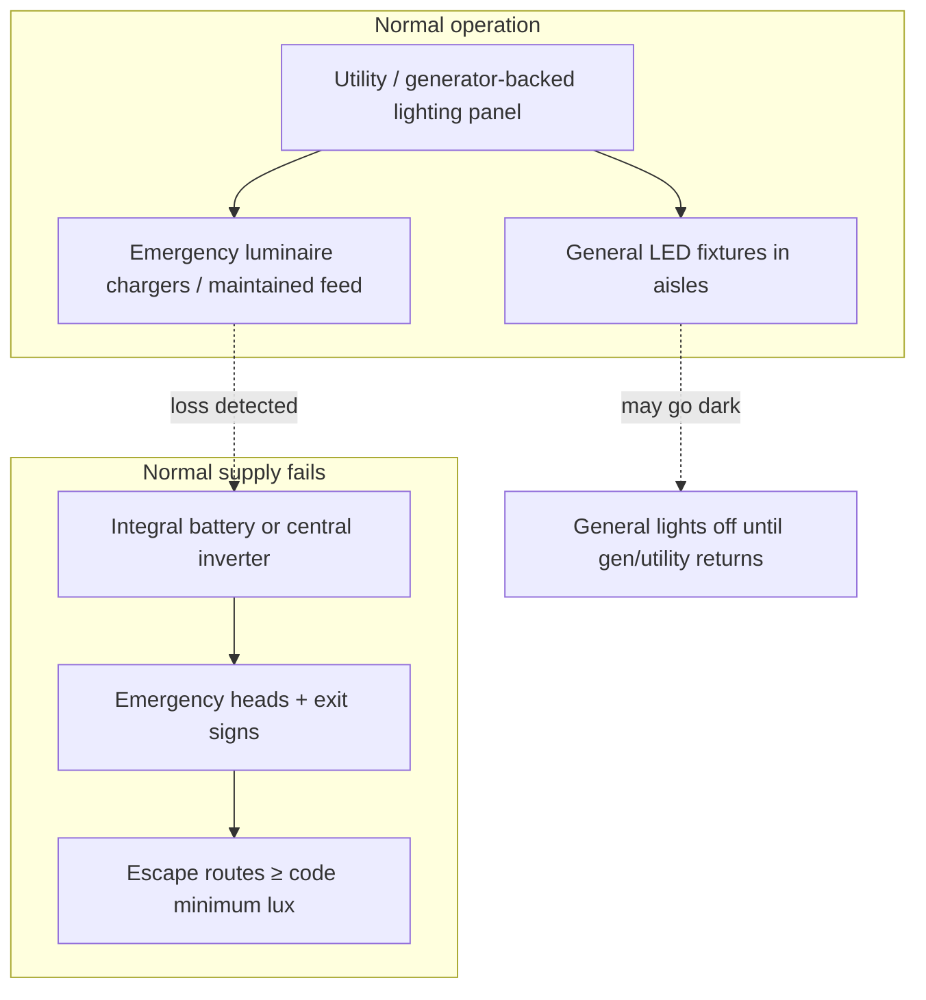

# Lighting Essentials

**Module ID:** `05-lighting`  
**Depth:** standard (interview-ready)  
**Public CDCP domain:** Light — measurements, standards, fixture placement, emergency lighting and power  
**Prerequisites:** Modules 01–04 (site, standards, building, floor/ceiling) help.  
The emergency-power path is previewed here; Module 06 owns the path.

---

## Learning objectives

By the end of this module you can:

1. Use basic photometric language (**lux**, **foot-candle**, **lumen**, **uniformity**, **glare**) in a facilities walkthrough without confusing light quantity with color or energy.
2. State **practical illuminance ranges** used in data-centre white space, plant rooms, and egress paths, and name the **primary public standards** families that set or influence those numbers (not invent proprietary exam values).
3. Apply **fixture placement** rules for aisles, containment, cable pathways, camera sightlines, and maintenance access.
4. Differentiate **normal**, **emergency/egress**, and **task/standby** lighting, including **maintained** vs **non-maintained** and self-contained vs central battery/inverter systems.
5. Explain **how emergency lights are powered** through a utility outage (battery, central inverter, generator, life-safety branch) and why “on the IT UPS” is not the same design decision as “code-compliant emergency lighting.”
6. Spot common **audit findings**: dark hot aisles, dead emergency heads, wrong power source, glare on consoles, and controls that leave the hall dark after a failure.

---

## Why it matters (ops / design / TPM interview angle)

Lighting is easy to treat as “the sparky’s problem” until three things collide:

| Stakeholder | Why lighting shows up |
|---|---|
| **Ops / NOC** | Night change windows, cable tracing, breaker hunting, and incident response all need **see-the-work** light—and **not** blinding LEDs aimed into eyes or camera lenses. |
| **Design / MEP** | Fixture layout must clear **cable trays, busway, containment, and fire suppression**. Emergency system type and autonomy must match **life-safety code** and the facility’s evacuation model. |
| **TPM / risk** | Lighting is a **small slice of kW** but a large slice of **human error risk**. Dark white space during a dual-utility event is how people open the wrong PDU, trip over cable ramps, or skip isolation steps. Auditors and customers notice dead exit signs and untested emergency packs. |

If you come from **network deploy**, think of lighting like **out-of-band management for humans**: when the primary path (daylight, normal circuits, BMS-controlled scenes) fails, a designed fallback must still let people **evacuate safely** and, where required, **finish critical local actions**. That fallback has its own power path, testing regime, and failure modes—independent of whether the IT UPS is green.

Interviewers use lighting to probe whether you understand **facilities vs IT power domains**, **code vs convenience**, and **how white-space layout (aisles, containment) affects every overhead system**.

---

## Core concepts

### 1. Photometric language (define every term on first use)

- **Luminous flux (lumen, lm):** Total visible light **output** of a source—how much light the fixture “produces,” not how bright a surface looks.
- **Illuminance (lux, lx):** Light **incident on a surface** — lumens per square metre. This is what meters measure when you hold a lux meter on the floor or a work plane.  
  **Foot-candle (fc):** Same idea in imperial units — lumens per square foot. **1 fc ≈ 10.76 lx** (rule of thumb: **×10** for rough conversion).
- **Luminance:** Light **leaving** a surface toward the eye (glare, “how bright that panel looks”). Different from illuminance; people mix these constantly.
- **Work plane:** Imaginary horizontal plane where you care about task light—often **floor** for egress, or **~0.75–1.0 m** height for bench work; data-hall specs often state **floor level in the aisle** or a stated height—read the design doc.
- **Uniformity:** How even the light is. Often expressed as **E<sub>min</sub> / E<sub>avg</sub>** (or similar ratios). Spots and deep shadows hide cable labels and trip hazards.
- **Glare:** Visual discomfort or disability from high luminance in the field of view—e.g. bare LED arrays aimed down a cold aisle into a tech’s face, or reflections on KVM/LCD screens.
- **Colour temperature (CCT, kelvin):** Warm (~2700–3000 K) vs **neutral (~4000 K)** vs cool (~5000–6500 K). White space commonly uses **neutral white** for alertness and colour discrimination of cable jackets.
- **Colour rendering index (CRI):** How faithfully colours appear under that light. Low CRI makes blue/green/orange cable ID harder—ops cares more than pure “brightness.”
- **Efficacy (lm/W):** Lumens per watt—LED vs legacy fluorescent/HID efficiency. Matters for PUE-adjacent load and heat in the room (every watt of light is roughly a watt of heat the cooling system must remove).
- **Normal lighting:** Everyday general illumination on the building electrical distribution (often lighting panels on raw/utility or generator-backed non-UPS power).
- **Emergency lighting:** Lighting that operates **when normal supply fails**, sized and placed for **life safety** (egress) and sometimes **high-risk task** continuity—not “keep the NOC cosy.”
- **Egress / escape-route lighting:** Illuminates the **path to exits** and exit doors.
- **Open-area (anti-panic) lighting:** Minimum light in larger open rooms so people can reach a defined escape route without panic.
- **Exit signage:** Internally or externally illuminated signs marking exits; part of the emergency/egress package and often on the same life-safety philosophy.
- **Maintained emergency luminaire:** Lamp is **on whenever the area is occupied** (or continuously); on mains failure it continues from battery/inverter. Common for exit signs and some corridors.
- **Non-maintained emergency luminaire:** Lamp is **off** in normal conditions; **energises only** on mains failure. Common for dedicated emergency heads in halls.
- **Self-contained (integral battery):** Battery and charger **inside** each emergency luminaire or conversion kit.
- **Central battery / central inverter system:** One battery room or inverter feeds many remote emergency luminaires over dedicated circuits—easier central testing, different single-point-of-failure and cable design.
- **Emergency duration (autonomy):** How long emergency lighting must run after mains failure (jurisdiction- and occupancy-dependent; often on the order of **1–3 hours**—confirm local code/AHJ; US life-safety commonly discusses **90 minutes** for many emergency systems under the National Electrical Code / NFPA framework—verify project jurisdiction).
- **Authority Having Jurisdiction (AHJ):** Local fire marshal / building official who interprets adopted code. Design intent loses to AHJ interpretation at occupancy.

### 2. Lighting standards and lux levels

Exact numbers belong to **adopted codes and project specifications**. Use the following as **interview-grade ranges and standard names**, not as a substitute for the stamped drawings.

#### What sets the bar

| Layer | Examples (public names) | Role |
|---|---|---|
| **Workplace lighting** | **EN 12464-1** (Europe — indoor workplaces); **IES** recommended practices (North America); **CIBSE** lighting guides (UK-influenced practice) | Task-appropriate illuminance, uniformity, glare limits for **normal** work |
| **Emergency lighting** | **EN 1838**, **ISO 30061**, national fire/life-safety codes; **NFPA 101** (Life Safety Code) egress illumination concepts in the US | Minimum light **along escape routes**, open areas, and sometimes high-risk tasks during failure |
| **Electrical / life-safety power** | **IEC** / **BS** emergency lighting wiring practices; **NEC** (NFPA 70) **Article 700** (Emergency Systems) and related articles in the US | How emergency loads are **classified, sourced, and tested** |
| **Data-centre facility standards** | **ANSI/TIA-942** family (facility considerations include lighting among many topics); **BICSI** data-centre best practices | Industry context for white-space design—not a replacement for life-safety code |
| **Equipment / testing** | **IEC 60598** (luminaires); **IEC 62034** (automatic test systems for battery-powered emergency escape lighting) | Product and automatic monthly/annual test frameworks |

#### Typical illuminance bands (order-of-magnitude, not “the exam answer”)

Always check the **basis of design** and **local code**. These ranges appear frequently in industry practice and training discussions:

| Area | Typical normal-lighting target (order of magnitude) | Notes |
|---|---|---|
| **White-space aisles (computer room)** | Often **~300–500 lx** average (roughly **30–50 fc**) at the stated work plane | Enough for rack work, label reading, and safe walking; higher may be specified for detailed work benches |
| **Hot aisle / cold aisle** | Same target **in the walking path**; containment can create **shadows** if fixtures only sit over one aisle | Design for the aisle people actually stand in |
| **Meet-me / staging / packing** | Similar to light industrial / warehouse task levels—often **200–500 lx** depending on detail work | Cable dressing and hardware assembly need decent CRI |
| **Electrical / UPS / battery / mechanical plant** | Often **200–300+ lx** (higher at panels and work faces) | Shadow behind cabinets is a classic complaint |
| **Corridors / circulation** | Lower than white space—often **~100–200 lx** | Must still meet egress emergency minima when dark |
| **Storage** | Often **~100–150 lx** | |
| **Emergency escape route (failure mode)** | Common **order of magnitude: ~1 lx average** along the centre line of the escape route under **EN 1838**-style guidance; US **NFPA 101** egress illumination is often discussed as about **1 fc average** (≈10 lx) with a defined minimum—**confirm adopted edition** | Emergency levels are **much lower** than normal task light—enough to leave safely, not to re-patch fibre |
| **Open-area emergency** | Often lower still (e.g. **~0.5 lx** class of requirement under EN-style emergency lighting) | Anti-panic, not task |
| **High-risk task emergency** | **Higher** emergency illuminance where a dangerous process must be made safe (more plant-room than typical IT rack work) | Rare in pure IT halls; relevant in hybrid industrial sites |

**Uniformity and measurement:** Quote **average and minimum**, state **height**, and note whether lights were **on full** or under daylight harvesting. A single “500 lux” claim without method is marketing, not evidence.

**Controls and energy:** LED + occupancy/daylight controls cut lighting kW and heat. In white space, **occupancy sensors that leave a pitch-black hall** can conflict with camera coverage and with “always enough light to see trip hazards.” Design usually keeps a **minimum background level** or uses vacancy logic carefully; security and ops must agree.

### 3. Fixture placement

Placement is a **coordination problem** with cooling, cabling, fire, and security—not just “even grid on the reflected ceiling plan.”

**Aisle-aligned layout**

- Run fixtures **along cold (and/or hot) aisles** so the walking and work zone is lit.
- In **contained aisles**, verify light **inside** the containment volume: doors, roofs, and chimney systems cast shadows; add fixtures or translucent panels per design.
- Avoid a single row of lights over the **cabinet tops only** with dark aisles between—common when layout was drawn before rack grid was fixed.

**Avoid glare and visual noise**

- Do not aim high-output LEDs straight into tech eyes walking the cold aisle; use appropriate **optics, lenses, or indirect** components.
- Keep strong sources out of **camera FOV** where possible (security false silhouettes / washed IR scenes).
- At consoles and KVM positions, control reflections on screens.

**Clearances and clashes**

- Coordinate with **ladder rack, basket tray, busway, and drop points**—fixtures that block a tray pull are a forever ops tax.
- Respect **sprinkler / gaseous suppression** coverage and manufacturer clearance to luminaires (heat and spray patterns).
- Leave **maintenance access**: replace drivers/batteries without standing on live busway or removing a whole row of blanking panels.
- In **raised-floor** rooms, lighting is usually **ceiling**; underfloor is for power/cooling—not a place for general luminaires. In **hard-floor** halls with high ceilings, mounting height drives both lux delivery and glare.

**Electrical grouping**

- Split lighting circuits so a single breaker does not black out an entire hall; match **fire zones / smoke compartments** where required.
- Separate **normal** lighting circuits from **emergency** luminaires’ permanent live / monitoring cores per wiring method.

**LED practicalities**

- Prefer quality drivers (flicker, harmonics) especially near sensitive measurement environments; coordinate EMF/power quality concerns with Module 07/06 thinking.
- Document **spare part** SKUs—emergency conversion kits and exit signs age out of production.

### 4. Emergency lighting (types and roles)

Emergency lighting answers: **If normal power is gone, can people see the way out, and can critical local actions be completed safely?**

| Type | Purpose |
|---|---|
| **Escape-route lighting** | Illuminates defined paths, stairs, level changes, fire doors |
| **Open-area (anti-panic)** | Minimum light so occupants reach an escape route |
| **High-risk task lighting** | Temporary light to shut down dangerous processes safely |
| **Exit signs** | Continuous wayfinding; maintained operation is common |
| **Standby / backup convenience lighting** (not always “emergency” in code sense) | Ops may want UPS- or generator-backed light to **work the incident**—this is a **design choice**, often separate from **minimum legal emergency lighting** |

**System architectures**

1. **Self-contained luminaires** — each head has charger + battery. Simple expansion; many distributed batteries to maintain; automatic self-test variants available (see IEC 62034-class systems).
2. **Central battery systems** — DC distribution from a battery room to slave luminaires.
3. **Central inverter (AC)** — UPS-like inverter feeds AC emergency luminaires; may look like a small UPS but is **life-safety classified** and tested as such.

**Modes**

- **Non-maintained:** dark until failure → saves lamp hours, depends on reliable failure detection.
- **Maintained:** on in normal use → immediate visibility; lamp life and energy trade-off (LEDs ease this).
- **Combined / sustained** variants exist product-by-product—read the data sheet.

**Testing and maintenance (ops reality)**

- **Functional test** (brief): monthly-class checks that lamps strike on simulated failure.
- **Duration test**: periodic full autonomy run (annual-class in many regimes)—proves batteries still deliver design time.
- Log results; failed packs are a **life-safety defect**, not a cosmetic ticket.
- After a real long outage, expect **recharge windows** during which coverage is degraded—procedures should account for this.

### 5. Power for emergency lights

This is the concept interviewers use to separate **“IT thinks everything is on UPS”** from **facilities design**.

```text
Normal lighting panel ──► general white-space lights (daily use)
         │
         │  (mains healthy: chargers topped up / maintained lamps fed)
         ▼
Emergency source path (pick architecture):
  A) Integral batteries in each emergency luminaire
  B) Central battery DC → emergency luminaires
  C) Central inverter / life-safety UPS → emergency luminaires
         │
         │  on mains fail: transfer is local (self-contained) or at central gear
         ▼
   Minimum illuminance on escape routes + exit signs for required duration
         │
         ▼  (optional, later)
   Generator / alternate source may restore normal lighting panels
   …but code emergency lighting must bridge the gap WITHOUT waiting for human-start gensets
```

**Key ideas**

1. **Emergency lighting power is a life-safety function.** In US terminology, it often sits under **emergency systems** concepts (NEC Article 700 family)—not the same paperwork as optional standby (generators for convenience) or IT UPS for servers.
2. **IT UPS ≠ automatic code compliance.** Putting some house lights on the IT UPS can help operators during an incident, but:
   - UPS autonomy may be **minutes**, not the emergency lighting duration required by code.
   - UPS maintenance bypass can **deliberately** de-energize IT UPS output.
   - Mixing life-safety and IT loads can create **coordination, selective trip, and inspection** problems.
3. **Generator backing helps normal lights return**, yet **transfer time** and start reliability mean **batteries or inverters still cover the black interval**.
4. **Dual supply awareness:** self-contained units need a **permanent live** (charging) supply monitored for failure; loss of that supply should start emergency mode—wrong switching or switched-live-only wiring is a classic defect.
5. **Segregation:** emergency circuits are identified, often fire-rated or protected routing depending on jurisdiction, and not casually borrowed for “temporary” rack power.
6. **Monitoring:** modern systems report via **BMS/DCIM/EMS** (Module 14 territory)—failed battery = ticket before the auditor finds it.

**Power path comparison (interview table)**

| Load | Typical source intent | Failure goal |
|---|---|---|
| Servers / network | IT UPS → generator | Ride-through + orderly or continuous IT |
| Normal white-space lights | Lighting panel (utility/gen) | Comfort/ops when building power healthy or on gen |
| **Code emergency lights / exit signs** | **Battery or life-safety inverter path** | **See to evacuate** for required duration from moment of loss |
| Optional “ops work lights on UPS” | Sometimes IT or house UPS | Work the breakers—**specify explicitly**, do not assume |

---

## Key diagrams

### A. Normal vs emergency lighting in the white space (concept)



### B. Power hierarchy (do not conflate branches)

```text
Utility
  ├─► IT power chain → UPS → PDUs → racks          (compute availability)
  ├─► Mechanical/cooling chain → CRAH/chillers     (environment)
  ├─► Normal lighting panels                       (daily illuminance)
  └─► Life-safety / emergency lighting source
           ├─ self-contained batteries at luminaires
           ├─ central battery
           └─ central inverter (life-safety class)
                 └─► emergency luminaires + exit signs
                       (egress illuminance + duration)

Generator (when present)
  └─► may re-feed normal lighting & recharge systems
        AFTER start + transfer — not a substitute for battery bridge
```

### C. Fixture / aisle coordination (ASCII plan)

```text
        COLD AISLE              HOT AISLE
   ▓▓▓  [light] [light]  ▓▓▓  (lights if work here)
   ▓▓▓                 ▓▓▓
   RACK   walk path    RACK    walk path / chimney
   ▓▓▓                 ▓▓▓
   ▓▓▓  [light] [light]  ▓▓▓

  Cable tray ═╤═══════╤═  ← fixtures must not block pulls
  Busway      │       │
  Sprinkler   *       *  ← clearance to luminaires
```

---

## Formulas / rules of thumb

| Rule | Use |
|---|---|
| **1 fc ≈ 10.76 lx** (≈ **×10** rough) | Convert US foot-candle talk ↔ lux meter readings |
| **Illuminance falls with distance and optics** | Higher mount → more fixtures or higher lumen packages for same floor lux |
| **Uniformity matters as much as average** | One bright spot + dark corners fails ops even if “average lux” looks fine |
| **Every lighting watt ≈ heat watt** | LED retrofit reduces room heat load slightly; still coordinate with cooling |
| **Emergency lux ≪ task lux** | Do not expect to do precision fibre work on egress-only lighting |
| **Duration test proves batteries; functional test only proves “it glowed once”** | Both are required in a mature program |
| **Design lux ≠ measured lux after containment retrofit** | Re-measure when aisle roofs/doors are added |

**Rough spacing intuition (not a design calc):** For a given mounting height and beam angle, manufacturers publish **spacing-to-height ratios**. Real designs use **lighting software** (e.g. photometric layout tools) plus mock-up measurements—field techs verify with a **calibrated lux meter**.

---

## Common failure modes and misconceptions

1. **“The UPS keeps the lights on.”** Only if **explicitly designed** that way—and still may not meet **life-safety duration/classification**. Emergency lighting is its own system.
2. **Dead emergency heads and glowing “healthy” LEDs on the charger.** Indicator ≠ full duration capability; skip duration tests and you discover failure during a real outage.
3. **Switched live feeding self-contained units** so chargers are off whenever someone kills the light switch—batteries never charge or system never sees a clean “mains fail” signal.
4. **Dark hot aisles / containment shadows** after a retrofit; design assumed open room.
5. **Glare and camera washout** from cheap high-bay LEDs with poor optics.
6. **Fixtures blocking tray or busway** — installed to the lighting drawing only, never clash-detected.
7. **Mixing fire zones on one lighting circuit** — one trip complicates evacuation and troubleshooting.
8. **Assuming EN numbers apply on a US AHJ site (or vice versa)** — always map to **adopted code edition**.
9. **Treating exit signs as decoration** — missing, wrong direction after a remodel, or taped over during paint work.
10. **Occupancy sensors that black out egress paths** or leave only emergency packs (if any) without verifying emergency coverage under that control scheme.
11. **Low CRI “warehouse” spectrum** making cable colour codes ambiguous under stress.
12. **After long outage, immediate second event** while batteries still recharging—procedures and redundancy matter.

---

## Interview drills

**Q1. What is the difference between lux and lumens, and which do you measure on a white-space walkdown?**  
**A:** **Lumens** measure total light output of a source; **lux** measures illuminance on a surface (lm/m²). On a walkdown you use a lux meter on the **floor or stated work plane** in the aisle, and you care about **average, minimum, and uniformity**—not the catalog lumen package alone.

**Q2. What illuminance order of magnitude would you expect for normal white-space lighting vs emergency escape lighting?**  
**A:** Normal computer-room aisle lighting is often designed around **a few hundred lux** (commonly discussed ~**300–500 lx**). Emergency escape-route lighting is far lower—**on the order of ~1 lx average** under EN 1838-style guidance, or about **1 fc average** in much NFPA 101 egress discussion—**confirm local code**. Emergency light is to **evacuate**, not to rebuild a spine switch.

**Q3. Maintained vs non-maintained emergency luminaires?**  
**A:** **Maintained** lamps are on during normal occupancy (typical for many exit signs) and continue on battery/inverter when mains fail. **Non-maintained** lamps are off until mains failure, then strike from the emergency source. Choice is product/application/code driven; both still need charged batteries and testing.

**Q4. Why might a designer refuse to put all white-space lighting on the IT UPS?**  
**A:** IT UPS is sized and classified for **IT availability**, often with **short autonomy**, maintenance bypass that kills output, and different inspection rules. **Life-safety emergency lighting** needs defined **duration**, wiring methods, and testing under emergency-system rules. Optional UPS-backed work lights can be added deliberately—but that is **not** a substitute for code emergency lighting and can create load/coordination issues if done casually.

**Q5. Name three coordination issues when placing fixtures in a modern contained data hall.**  
**A:** (1) **Shadows inside containment** if lights only sit outside the aisle volume; (2) **clash with cable tray/busway** and reduced maintenance access; (3) **fire-suppression clearances** and spray/obstruction rules; bonuses: camera glare, uniform lux in both hot and cold aisles, and sensor strategies that do not black out egress.

---

## Self-check quiz

1. **Approximately how many lux equal 1 foot-candle?**  
   a) 1  
   b) 3  
   c) 10.76  
   d) 100  

2. **Which quantity does a handheld meter report when pressed on the raised-floor tile in an aisle?**  
   a) Lumens  
   b) Illuminance (lux or fc)  
   c) CCT only  
   d) CRI only  

3. **EN 1838 / ISO 30061 are primarily associated with:**  
   a) Chiller efficiency  
   b) Emergency lighting performance concepts  
   c) Copper permanent link tests  
   d) PUE calculation methods  

4. **A non-maintained emergency luminaire:**  
   a) Is always on at full task brightness  
   b) Lights only when normal supply fails (plus tests)  
   c) Never needs a battery  
   d) Replaces the need for exit signs  

5. **Self-contained emergency lighting means:**  
   a) One inverter for the whole campus only  
   b) Battery/charger integrated at the luminaire  
   c) Powered exclusively from IT rack PDUs  
   d) Solar-only operation  

6. **Why is generator backup alone usually insufficient as the sole emergency lighting strategy?**  
   a) Generators always fail to start  
   b) Transfer/start delay leaves a dark interval that batteries/inverters must cover  
   c) Generators cannot power LEDs  
   d) Codes forbid generators near data centres  

7. **A common white-space placement mistake is:**  
   a) Aligning lights with aisles  
   b) Coordinating with tray and sprinkler layout  
   c) Installing fixtures that leave dark contained aisles or block cable pathways  
   d) Using neutral ~4000 K LED sources  

8. **Duration testing of emergency lighting is meant to prove:**  
   a) That LEDs are RGB tunable  
   b) That batteries/inverters still support required autonomy under load  
   c) That PUE is below 1.5  
   d) That lux equals lumens  

### Answers

<details>
<summary>Click to reveal answers</summary>

1. **c** — 1 fc ≈ 10.76 lx (≈×10 for rough mental math).  
2. **b** — Illuminance on the surface.  
3. **b** — Emergency lighting applications / performance concepts (use with local code).  
4. **b** — Off until failure (and during prescribed tests).  
5. **b** — Integral battery approach (vs central battery/inverter).  
6. **b** — Need a bridge through start/transfer; also classification/testing differ.  
7. **c** — Clash and shadow issues after real rack/containment layout.  
8. **b** — Autonomy under failure conditions, not just a momentary strike.

</details>

---

## Further free resources

Use **primary public names** and free primers; do not rely on paywalled courseware dumps.

| Resource | Why |
|---|---|
| **EN 12464-1** (title: Light and lighting — Lighting of work places — Indoor) | Workplace illuminance/glare framework widely referenced in Europe |
| **EN 1838** / **ISO 30061** | Emergency lighting performance concepts |
| **NFPA 101** Life Safety Code (overview materials; full text typically paid—use AHJ summaries and training outlines) | US egress illumination philosophy |
| **NFPA 70 National Electrical Code** — emergency systems articles (e.g. **Article 700** family) | How emergency power is classified in much of the US |
| **IEC 62034** | Automatic test systems for battery-powered emergency escape lighting |
| **IEC 60598** series | Luminaire safety/product framework |
| **ANSI/TIA-942** publicly described scope overviews | Data-centre facility standard family that includes environmental/fit-out considerations among many domains |
| **IES** (Illuminating Engineering Society) public education pages | Photometry vocabulary and recommended-practice culture (North America) |
| **CIBSE** public lighting knowledge extracts / society pages | UK-influenced lighting design culture |
| **BICSI** free webinars / public best-practice teasers | Data-centre fit-out coordination habits |
| Major **LED luminaire and emergency lighting vendors** (e.g. application notes on self-test, central inverter, data-hall high-bay optics) | Free application diagrams—treat as vendor education, not code |
| Manufacturer **photometric (IES/LDT) files + free layout tools** | Learn how spacing and mounting height change floor lux |

**Study tip:** On your next colo tour, ask: *Where is emergency lighting fed from? How often is duration tested? Show me a recent failed pack ticket.* That five-minute conversation cements this module better than memorizing a single lux number.

---

*Educational reconstruction for interview and on-the-floor competence. Not official EPI®/CDCP® material; not a certification path. Always defer to the project specification, stamped drawings, and the AHJ for compliance values.*
