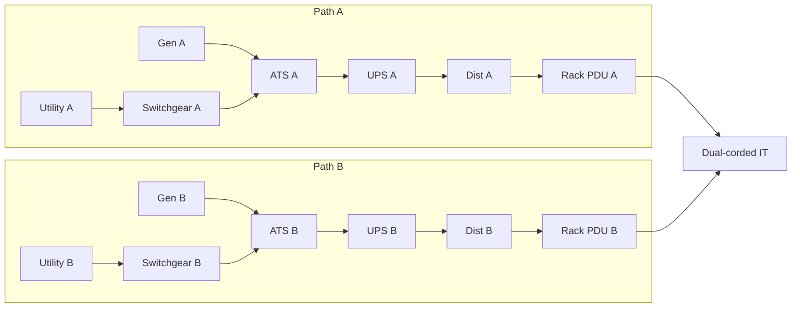
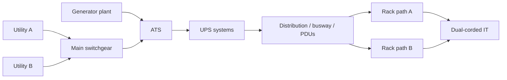

# Power Infrastructure

## Learning objectives

By the end of this module you can:

- Trace the **utility-to-rack power path** and name each major conversion, switch, and distribution point.
- Draw **A/B path independence** through the last common point, and refuse a dual-utility sketch that lands Utility A, Utility B, and the generator through **one ATS → one UPS**.
- Explain the role of **transformers** (including **isolation transformers** as a taught topic), **generators**, **ATS vs STS**, and when each is used.
- Compare redundancy topologies: **N, N+1, N+2, 2N, 2N+1** (and related “concurrent maintainability” language). **N+2** is two spare units *at that layer*, not a sticker, not Tier IV.
- Draw a **catcher bus** as a topology distinct from isolated-redundant and from 2N; say when an AI hall uses catcher vs 2N. **Isolate** lives in Module 15.
- Distinguish **single-phase vs three-phase** power and why data centres use both; write **P = V × I × PF** for single-phase.
- Describe **PDUs**, **busbar vs cable**, and **grounding/bonding** basics relevant to white space.
- Classify common **UPS** topologies and parallel arrangements; outline **battery / BESS** roles; name **Li-ion UPS vs BESS-yard** electrical/interconnect and point at Module 12 for the **NFPA 855 / UL 9540A** fire playbook.
- Treat the **interconnect queue** and **behind-the-meter / on-site continuous generation** as a *primary* energization path (Module 03 owns siting).
- Discuss **power quality**, basic **sizing** rules of thumb, **thermographic** maintenance, and **high-density / HPC** power implications, including the **80–120 kW rack-feed class**.

## Why it matters

**Ops:** Facility events that take a hall down are **power-path led**: utility events, transfer failures, UPS/battery issues, overloaded circuits, or human error during switching. That is a *mechanism* claim, not a pie. Public industry surveys (Uptime Institute annual outage analyses and peers) often rank power-path items high; figures, methodology, and clocks change year to year — cite the survey class; do not recite a percentage. If you run or support a site, you must know where power can fail *and* how the design is supposed to ride through or transfer. Module 01 owns the 2026 framing (power path leads; cooling is a cascade; human/process is contributing). This file owns the path.

**Design / capacity planning:** Every rack kW you add multiplies cooling load, UPS capacity, generator fuel burn, and distribution headroom. Wrong phase assumptions, undersized PDUs, or single points of failure in the path turn “room for growth” into an emergency project.

**TPM / interview angle:** Technical program and project managers who ship network hardware often inherit power constraints (“we can’t land another 20 kW row,” “maintenance window needs dual-corded equipment on A+B”). Interviewers want you to speak facilities language: path, redundancy, dual-cord, STS, generator test, IR scan—not only switch configs. Network deploy experience transfers well: power is also a *topology + capacity + failure-domain* problem.

## Core concepts

### Utility to rack — the power path

Think of power as a one-way pipeline with controlled transfers and quality cleanup:

1. **Utility / grid** — medium-voltage (MV) or low-voltage (LV) feed(s) from the electric company. In 2026 Source 1 may instead be a **behind-the-meter / on-site continuous plant** (below); the hops after this box do not disappear.
2. **Service entrance / main switchgear** — utility disconnect, metering, main breakers; often multiple feeds for redundancy.
3. **Transformers** — step voltage (e.g. MV → LV 480/277 V or 400/230 V, depending on region). May be utility-owned or customer-owned.
4. **Generators** (standby/prime) — on-site engines that start when utility is lost or on load-bank/test schedules.
5. **ATS or STS** — automatic transfer between sources (see below).
6. **UPS** — uninterruptible power supply: bridges the gap (batteries/flywheel) and conditions power for IT loads.
7. **Downstream switchgear / distribution boards** — feed PDUs, busway, or panelboards serving white space.
8. **PDU (power distribution unit)** — room/row-level or rack-level distribution (term is overloaded; context matters).
9. **Rack power** — rack PDUs (rPDUs / power strips), dual feeds for dual-corded IT gear.
10. **IT equipment PSUs** — convert AC (or sometimes DC) to internal DC rails.

**Grey space** = mechanical/electrical plant (generators, UPS rooms, switchgear). **White space** = IT floor (racks, cold/hot aisles). Power design links both.

**Independence check (draw this, do not assume it):** A and B are independent only through the **last common point**. If both utilities and the generator land on one ATS, one UPS, or one downstream bus, you have drawn a **SPOF**, not dual path. The failure-mode mermaid in Key diagrams is that anti-pattern, labeled as such.

```text
  UTILITY FEED(S)          GENERATOR(S)
        |                       |
        v                       v
   [Main switchgear] <--- ATS/STS ---> [Standby path]
        |
        v
   [Transformer(s) if needed]
        |
        v
   [UPS (with batteries/BESS)]
        |
        v
   [Downstream distribution / PDUs / busbar]
        |
        v
   [Rack PDU A]     [Rack PDU B]   <-- dual path for dual-corded gear
        \             /
         v           v
        [Server / switch PSUs]
```

### Transformers

A **transformer** transfers electrical energy between circuits via magnetic coupling, usually changing voltage. Key ideas:

- **Step-down** (MV → LV) is the common data-centre case at the site boundary or inside the building.
- Losses heat the transformer room—part of the facility thermal budget.
- Region and code dictate voltages (e.g. North America often 480 V three-phase plant → 208/120 V or 415/240 V at the rack in newer high-density designs; EMEA often 400/230 V). Always confirm local practice; do not assume US voltages worldwide.

#### Isolation transformers (taught topic — not a one-liner)

An **isolation transformer** has primary and secondary windings with **no metallic connection** (galvanic isolation). Energy crosses by magnetic coupling only. That is a *transformer* job, not a UPS job.

**When to use (interview-level):**

- You need a **separately derived system** — a local place to re-establish the **neutral–ground bond** and start a clean grounding reference (floor-PDU isolation transformers historically did this while also stepping 480 → 208/120).
- You need **common-mode noise** reduction or to break a **ground loop** / circulating-current path that bonding alone has not killed.
- The AHJ, a medical/industrial spec, or a vendor listing **requires** isolation at that hop.
- You need **step-down and isolation in one box**.

**Versus a UPS.** An isolation transformer does **not** store energy. It does not ride through a loss of upstream AC. A **VFI / double-conversion UPS** already isolates the load from many utility issues via AC→DC→AC. Parking an isolation transformer “for quality” *downstream of* a VFI UPS is often redundant unless you still need a separately derived system, a voltage change, or a specific grounding scheme. Isolation *ahead of* a UPS can help certain utility/ground problems; it also adds **losses, inrush, and another failure point**.

**Versus K-factor.** **K-factor / harmonic-rated** transformers are about *heating from non-linear load harmonics*, not galvanic isolation. A box can be isolation *and* K-rated, or neither. Historical IT loads (shared-neutral, early switch-mode PSUs) drove K-13 / K-20 floor-PDU transformers. Modern high-PF PSUs and VFI UPS change the picture — the rating still appears in older plants. Do not say “K-factor means isolation.”

**Failure modes to name:**

- **Inrush** can trip the upstream breaker on energization.
- **Losses** heat the room (thermal budget; IR still applies).
- Wrong **neutral–ground bond** if you treat the secondary as separately derived when it is not — or fail to bond when it is.
- A **single** isolation transformer on a “dual path” is a SPOF.
- Undersized / saturated isolation distorts voltage and overheats.

Not a substitute for a UPS. Not a substitute for code-compliant grounding/bonding.

### Generators

**Standby generators** (typically diesel; sometimes natural gas or dual-fuel) provide long-duration power when utility fails. They are **not** instantaneous: start time is often measured in seconds (commonly designed around ~10 s class for diesel start + transfer, design-dependent). That gap is why UPS batteries exist.

That is the **backup** story. It is still true. It is no longer the only story: **on-site continuous generation** (gas turbines, large BESS, fuel cells) can be **Source 1**. That path is taught under Interconnect queue and BTM below; siting stays in Module 03. Do not collapse BTM into “we have standby gens.”

Design and ops notes:

- **Fuel storage**, delivery contracts, and runtime hours at design load matter as much as nameplate kW.
- **Paralleling gear** allows multiple generators to share load and provide N+1 at the plant level.
- **Load bank testing** proves the generator under real load; no-load tests can miss problems (wet stacking on diesels is a classic concern with light-load running).
- Emissions, noise, and permitting constrain siting—especially urban sites.

### ATS vs STS

| | **ATS (Automatic Transfer Switch)** | **STS (Static Transfer Switch)** |
|---|---|---|
| **What it does** | Switches a load between two sources (e.g. utility ↔ generator, or two upstream feeds) | Transfers load between two independent AC sources using solid-state (SCR) switching |
| **Speed** | Mechanical/electro-mechanical; typically slower (cycles to seconds) | Very fast (often sub-cycle / few ms class—vendor-specific) |
| **Typical use** | Generator transfer, facility-level source selection | Preferential dual-source feed for sensitive loads; sometimes UPS output side or critical bus |
| **Make-before-break / break-before-make** | Often break-before-make for genset; design-specific | Designed for seamless transfer between live sources when in sync/tolerance |

**Interview takeaway:** ATS answers “select between sources that are not both continuously preferred for seamless IT transfer — classically utility and generator.” STS answers “I have two live sources and need almost-uninterrupted transfer between them.” Confusing them is a common interview fail. Do not rewrite the whole path back into “the utility died”: transfer, UPS, and a BTM Source 1 are first-class.

### Redundancy: N, N+1, N+2, 2N, 2N+1

**N** = capacity required to serve the full design IT (or critical) load **at that layer**. Everything else is how much spare and how paths are split. N is **capacity, not a sticker**. Always say “N of *what*” (UPS modules, generators, chillers). A plaque does not make N.

| Topology | Meaning (conceptually) | Implication |
|---|---|---|
| **N** | Exactly enough capacity; no spare | Any single component failure or maintenance can drop load |
| **N+1** | Full capacity plus **one** spare module/unit *at that layer* | One failure or concurrent maintenance of one unit possible *if* remaining capacity ≥ N |
| **N+2** | Full capacity plus **two** spare units *at that layer* | Two units at *this* layer can be down (failure + maintenance, or two failures) if remaining ≥ N. Says nothing about other layers. **Not a sticker. Not Tier IV.** |
| **2N** | Two independent systems each able to carry N | Dual path; one entire path can be down; supports dual-corded loads on separate paths |
| **2N+1** | Two full paths plus extra module(s) | Rare/expensive; extra margin on top of dual systems |

**N+2 is not Tier IV.** Tier / Rated language lives in Module 02 (topology of the *site*, plaques, Availability Class). N+2 is two spare units at the layer you just named. A hall can be N+2 at the UPS modules and N at the ATS. Do not let a student invent the sticker.

Related language you will hear:

- **Concurrent maintainability** — ability to maintain any single capacity component without interrupting the load (design intent; must be proven in procedure, not just on a slide).
- **Fault tolerance** — surviving a worst-case single failure without interruption (stronger than concurrent maintainability alone).
- **Catcher, isolated-redundant, and distributed-redundant** are **three drawings**, not one slash. Drawn below.

**Critical nuance:** Redundancy of *UPS modules* is useless if they all sit behind one utility feed, one ATS, or one downstream bus that is a **single point of failure (SPOF)**. Always ask: “What is the smallest component whose failure takes the load?”

Also: **dual-corded IT equipment** expects two independent sources (A+B). Single-corded gear needs an STS or automatic transfer PDU—or it remains a SPOF. Each cord should support **full** rack load if one path is lost (unless the design explicitly allows load shedding).

### Single-phase vs three-phase

- **Single-phase:** two wires (plus ground) for utilization—common for low-power outlets and some rack strips (e.g. 120 V or 230 V). Real power: **P = V × I × PF** (V is the utilization voltage you are measuring).
- **Three-phase:** three live conductors (plus neutral and/or ground depending on system)—standard for building distribution and higher-density racks. Delivers more power with smaller conductors for the same load and enables balanced loading. Real power: **P = √3 × V_L-L × I × PF**.

Why DCs care:

- Plant distribution is almost always **three-phase**.
- Rack PDUs may be three-phase input with single-phase branch circuits to outlets, or three-phase to the equipment where PSUs support it.
- **Phase balance** matters: uneven loading across phases wastes capacity and can trip breakers early.

### PDUs

**PDU** is ambiguous—always clarify level:

1. **Floor / room PDU** — large cabinet transforming and distributing (e.g. 480 V → 208 V) with many breakers; traditional raised-floor design.
2. **Remote Power Panel (RPP)** — breaker panel closer to the load, fed from upstream distribution.
3. **Rack PDU (rPDU / power strip)** — mounts in the rack; metered, switched, or basic; single or three-phase input.

Modern colo/hyperscale white space often favors **busway + rack PDUs** over many traditional floor PDUs, but legacy sites still have heavy floor PDU populations.

### Busbar vs cable

| | **Cable (conduit/tray)** | **Busbar / busway** |
|---|---|---|
| **What** | Discrete circuits in cables | Prefabricated enclosed conductors with tap-off boxes |
| **Change agility** | Slower; new runs for new circuits | Faster adds via tap-offs (when capacity reserved) |
| **Density / heat** | Congested trays in high density | Often cleaner overhead for high-density rows |
| **Failure domain** | Per-circuit; careful labeling essential | Section/joint/tap failures need clear isolation procedures |
| **Use case** | Flexible point-to-point, smaller loads | Row power backbone, frequent reconfig |

Neither is universally “better”—site standards, AHJ, maintainability, and density drive the choice.

### Grounding and bonding

- **Grounding (earthing):** connecting systems to earth for safety and reference.
- **Bonding:** connecting conductive parts so they are at the same potential (reduces shock and arcing risk).

In data centres, poor grounding/bonding shows up as safety hazards, nuisance trips, noise issues, and sometimes mysterious network/EMI problems (see EMF module). Practices follow **national electrical codes** (e.g. NEC/NFPA 70 in the US) and standards such as **IEEE** grounding guidance and **IEC** earthing arrangements (TN-S, TN-C-S, TT, IT—region-specific). Do not invent a “data centre ground” separate from code-compliant design.

**Equipment grounding conductor**, **equipotential bonding** of racks/cable tray, and correct **neutral-ground** bonding only at the designated point(s) are core discipline items. Wrong neutral-ground bonds create circulating currents—classic field defect.

### UPS types and parallel configs

**UPS (Uninterruptible Power Supply):** provides ride-through energy and usually power conditioning so IT sees clean power during utility glitches, transfers, and short outages.

Common topology language (IEC / industry shorthand):

| Type | Idea | Typical notes |
|---|---|---|
| **VFD / offline / standby** | Load on utility; transfers to inverter on failure | Cheap; transfer notch; rare for critical DC IT |
| **VI / line-interactive** | Regulates with inverter interaction; battery on deeper events | SMB / edge more than core DC |
| **VFI / double-conversion / online** | AC→DC→AC continuously; battery on DC bus | Gold standard for critical IT: isolation from many utility issues |

**Energy storage:** traditionally **VRLA** (valve-regulated lead-acid) or **wet cell** batteries; increasingly **lithium-ion** for footprint/runtime/weight; some sites use **flywheels** for short ride-through paired with generators.

**Parallel UPS configurations** (do not slash these):

- **Capacity parallel:** modules sum to N (failure can drop below need).
- **Redundant parallel (N+1 or N+2):** modules sum to more than N so one — or two — can leave *at this layer*.
- **Isolated redundant:** each primary UPS serves its own load; a **reserve** UPS sits idle and can be switched onto one failed or maintained primary (often via STS). The reserve is isolated from the load until selected. There is no plant-spine **catcher bus** in this drawing.
- **Catcher:** a dedicated reserve **plus a catcher bus** that can pick up a primary's load when that primary is isolated. The drawable difference from isolated-redundant is the **bus**. Drawn in Key diagrams.
- **Distributed redundant:** spare capacity is *spread across* several active UPS blocks (each oversized); any one can fail and the others pick up via cross-ties. There is no dedicated idle catcher machine. Not a catcher.

**Spoken path: isolate / transfer / catcher.**

| Verb | Who owns it | What you say |
|---|---|---|
| **Isolate** | **Module 15** | Can you lawfully isolate a UPS without dropping the floor? That is a one-line + MOP/LOTO question. Do not steal the procedure lesson here. |
| **Transfer** | This file | ATS / STS / catcher-bus switching. **Generator started ≠ load saved.** |
| **Catcher** | This file | The topology that lets isolate-without-drop happen without paying for 2N. |

**When an AI hall uses catcher vs 2N.** Catcher is capital-efficient when you have several similar N-sized blocks and one shared spare is enough (one primary in maintenance at a time) — common in enterprise and some colo. **2N** (or 2N-like dual path) is what a GPU / AI hall usually pays for once racks land in the **80–120 kW rack-feed class**: dual-corded IT wants A/B independence to the rack, ride-through is already ugly, and a shared catcher bus is another transfer plus a common mode. If the oral is “why not catcher for this GPU hall?” answer: because we will not share a transfer bus across the row.

**Autonomy time:** sized to cover generator start + transfer + margin (or longer if policy requires). **Often single-digit to low-teens minutes *at the stated kW*** — not “we have 15 minutes, always.” Runtime collapses if IT load grows without battery refresh. At 40–100 kW, *thermal* ride-through (cooling gone, UPS still up) collapses toward **seconds** — that clock is Module 09; do not steal the plant.

### Batteries and BESS

- **UPS batteries:** short-duration (minutes), high reliability, tightly coupled to the UPS **DC bus**. Indoor room or cabinets, on the ride-through path.
- **BESS (Battery Energy Storage System):** larger plant-scale storage—can support peak shaving, demand response, grid services, or extended backup depending on design and **interconnection agreements**. Outdoor yard / containers are typical. **BESS ≠ UPS batteries.** Mixing them in one sentence is how the oral goes wrong.
- **End of life, testing, and replacement cycles** are major opex items; IR and impedance/conductance testing programs matter for lead-acid fleets.

#### Li-ion UPS / BESS — electrical and interconnection (this file); fire playbook is Module 12

This file owns the **electrical / interconnection** side. **Module 12** owns the fire playbook. Name the documents here so you can ask for them; do not recite the playbook here; do not invent a fire percentage or an agent mass.

| Name | What you need it for *here* | What it is not |
|---|---|---|
| **NFPA 855** | The *installation* standard the AHJ will ask about for a Li-ion UPS room or a BESS yard. Confirm **adopted edition**. | Not a product listing. Not automatically the law. Not a quiz-first item in this module. |
| **UL 9540A** | The thermal-runaway fire-propagation *test method*. “We have 9540A” means *we have test data*. | **Not a certification.** UL 9540 is the listing path. |

**Electrical / interconnect questions (speak these):**

- **Where does it sit on the one-line?** Li-ion UPS strings are on the UPS **DC bus** (ride-through). A BESS yard is usually **AC-interconnected** — ahead of the ATS, on a dedicated bus, or as Source 1 on a BTM campus. Same chemistry, different hop.
- **Ride-through vs trip.** Does the BESS hold the critical bus through a grid event, or does the interconnect agreement require it to **trip**? UPS batteries have one job (continuity). BESS may have a conflicting grid-services job.
- **Export / import / island.** Interconnection agreement, protection, and AHJ/utility rules — not a sticker on the container.
- **Stranded energy.** Opening the AC breaker does **not** make a Li-ion string safe. The DC bus can still be live. Isolation of battery energy is a Module 15 LOTO problem; name it so you do not treat “AC off” as “dead.”
- **Yard vs UPS-room is an electrical siting choice *and* a fire-playbook split.** Indoor UPS-room Li-ion is people + box + ride-through path. Outdoor BESS yard is exposure to the next container, the transformer, the building face — and usually a different interconnect. **Module 12** draws the fire chain (off-gas, deflagration, water-on-Li-ion, LSFT). Point there by name.

**Thermal runaway (one electrical sentence, then stop):** a cell that is self-heating is a chemistry event that becomes a fire event. Detection, suppression, yard-vs-room, water-on-Li-ion — **Module 12**. Do not freestyle a MOP; the 2026 EOP lives in Module 15.

### Power quality

IT loads care about:

- **Voltage sags/swells, interruptions**
- **Frequency variation**
- **Harmonics** (distortion from non-linear loads)
- **Transients** (lightning, switching)
- **Imbalance** across phases

UPS double-conversion mitigates many upstream issues. Downstream problems (loose connections, overloaded neutrals in older shared-neutral designs, bad rack PDUs) still cause outages. **Power quality monitoring** at UPS output and critical distribution helps prove root cause after events.

Standards/guides often cited in industry discussion: **IEEE 519** (harmonics), **ITIC/CBEMA** curves (IT equipment voltage tolerance concepts)—use as public references, not as a substitute for site design specs.

### Power sizing basics

You will use these constantly:

- **Power (W or kW)** ≈ real work rate. IT nameplates are often optimistic; use measured or vendor **typical + peak** guidance.
- **Apparent power (VA or kVA)** = what distribution and UPS often rate in. Relationship:  
  **kW = kVA × power factor (PF)**.
- **Power factor** for modern PSU fleets is often high (near 0.9–1.0 with PFC), but design still checks PF and harmonics.
- **PUE (Power Usage Effectiveness)** = Total facility energy / IT energy. Not a “power path” component, but drives how much non-IT power (cooling, losses) you must provision.
- **Cooling coupling:** ~1 kW IT roughly needs on the order of 1 kW of cooling capacity *plus* inefficiencies—cooling module expands this; never size power without cooling.

Rough planning chain (conceptual):

```text
IT load (kW) → apply growth & diversity factors → UPS kW/kVA
→ generator kW (IT + cooling + losses + starting margins)
→ utility service size → distribution breaker hierarchy
→ per-rack kW budget → circuit and rPDU selection
```

**Branch circuit continuous load** rules (e.g. 80% of breaker rating for continuous loads under common US practice) drive why a “30 A circuit” is not 30 A of continuous IT draw. Confirm with local code and the AHJ; treat “80%” as a well-known rule of thumb, not universal law everywhere.

### Thermographic scanning

**Infrared (IR) thermography** of electrical equipment under load finds hot connections, overloaded phases, and failing breakers *before* they arc or open. It is a core predictive-maintenance practice for switchgear, UPS, PDUs, busway joints, and generator connections.

Good programs: scheduled under representative load, trained technicians, trend comparison, work orders for anomalies—not a one-time photo op after an outage.

### High-density / HPC power notes

- Rack densities moved from ~2–5 kW toward **20–40+ kW** and, for AI/HPC, **much higher**. Name the **80–120 kW rack-feed class** as a current GPU-hall landing, not a future footnote (liquid cooling often becomes the enabler—not power alone; Module 09 owns the plant).
- Higher density forces: **three-phase rack PDUs**, larger feeder cables or busway, careful **whips/connectors**, higher **UPS and generator** blocks, and **row-level** capacity management.
- **Diversity assumptions break**: a full GPU rack may actually run near nameplate under training load—do not apply enterprise “servers idle most of the day” diversity blindly.
- **Dual-path** still required for availability, but connector and bus ratings become the bottleneck.
- Power and cooling must be co-designed; stranded power (power without cooling) or stranded cooling is wasted capital.

### Interconnect queue and behind-the-meter as a *primary* path

Module 03 owns **siting**: queue as the 2026 go/no-go (position, studies, financial security, years-not-weeks); BTM campus as a site *type* and a walk-away; land / fuel / gas / permits. Do not steal that lesson. This file owns what those facts **do to the one-line**.

Two energization stories. Both are live. Do not collapse them.

```text
Path 1 — classic (still true)
  Utility is Source 1
       → standby gens + UPS ride-through
       → “utility died; start the plant”

Path 2 — 2026 BTM / on-site continuous
  On-site plant is Source 1 (gas turbines / large BESS / fuel cells)
       → utility may be backup, parallel, or not yet interconnected
       → the plant itself is a new failure mode
```

**Interconnect queue (electrical consequence).** Dual-feed *lead times* still matter. They do not decide whether the large-load interconnection happens. If the queue is years, the hall either stays dark or energizes on **Path 2**. A closed land deal and a poured slab are not an energized bus. Do not memorize a gigawatt request-book figure; memorize the mechanism (Module 03) and then draw which box is Source 1 (this file).

**BTM / on-site continuous generation is Source 1, not a microgrid sidebar.** Gas turbines, large BESS, and fuel cells running as the hall’s primary energization are a **new failure class**: the plant trips, the fuel/gas lateral is interrupted, the BESS interconnect trips when you needed ride-through, the turbine cannot accept the step load, protection islands you when you did not ask. “We have standby gens” does not describe this. “BTM means no grid risk” is the misconception — interconnect often remains a hidden go/no-go for export, backup, or black-start (Module 03).

**What to draw.** Put the continuous plant in the Source 1 box. Put the utility (if present) in the alternate or parallel box. Keep UPS = continuity and the plant = duration. Then mark the last common point the same way you would for dual utility. A BTM plant feeding **one ATS → one UPS** is the same SPOF as two utilities through one ATS.

### Sustainability, microgrids, and energy context

**PUE (Power Usage Effectiveness)** = total facility energy ÷ IT equipment energy. Lower is better overhead (cooling, losses, lighting, etc.). PUE is an **efficiency metric**, not an availability design. A site can have excellent PUE and still be single-path N.

**Microgrid (interview-level):** a local energy system that can manage **multiple sources** (utility, generators, solar/other renewables, BESS) and may **island** (run disconnected from the utility) under defined conditions. Data centres already look like proto-microgrids (utility + gens + UPS/BESS). Explicit microgrid controls add orchestration for peak shaving, demand response, renewable integration, and longer islanded operation—subject to interconnection agreements, protection engineering, and AHJ/utility rules. A BTM campus *may* be operated as a microgrid; BTM is the **energization path**, microgrid is the **controls story**. Do not use “microgrid” as a synonym for Source-1 turbines.

What to say on a tour or interview:

1. Generators + UPS alone are **backup continuity**; a microgrid adds **active energy management** and possibly intentional islanding. **BTM / on-site continuous** is a third sentence: the plant is Source 1 (above).
2. BESS can serve UPS-class ride-through *and/or* grid services—roles must be designed, not assumed identical.
3. Renewables rarely replace the need for firm capacity (genset/contracted supply / BTM plant) for 24×7 critical load without substantial storage and risk analysis.
4. Never greenwash: sustainability projects that cut fuel testing, disable redundant plant, or weaken MOPs can **hurt availability**.

### IP ratings (enclosure protection)

**IP code (Ingress Protection, IEC 60529)** rates how well an enclosure keeps out **solids (dust)** and **liquids (water)**. Format: **IP** + two digits (e.g. **IP54**, **IP65**). First digit = solid-object protection (0–6); second = water protection (0–9 class scale). “X” means that digit is unspecified (e.g. IPX5).

Why DCs care:

- Outdoor generators, switchgear, and busway joints need weather-appropriate enclosures.
- White-space rack gear is usually **indoor / dry**; do not overspec IP as a substitute for climate control.
- Battery rooms, wash-down areas, and cooling-tower gear may need higher liquid protection than office-grade panels.
- **IP ≠ NEMA type** (North American enclosure types are a related but different labeling system)—map carefully on multinational projects.

**Interview rule:** Quote the IP (or NEMA) required by the **environment and manufacturer**, not a universal “data centre IP number.” Wrong IP is a reliability and safety defect outdoors; irrelevant IP marketing indoors is noise.

## Key diagrams

### Dual-utility concept — A/B independence through the last common point

A and B stay independent until they meet at the **dual-corded load**. That load is the last common point. If they meet earlier, you have drawn a SPOF.



Interview check: name the last common point. If the answer is “the ATS,” “the UPS,” or “the downstream bus,” the sketch is not 2N.

### Failure mode — dual utility through one ATS (SPOF, not the dual-utility concept)

This is the anti-pattern. A student who draws this and calls it “dual utility” has drawn the SPOF the prose warns about. Utility A, Utility B, *and* the generator share **one ATS → one UPS**. Label it as the failure mode. Do not memorize it as the concept.



### Catcher bus (distinct from isolated-redundant and from 2N)

```text
CATCHER — dedicated reserve + catcher bus
(not isolated-redundant, not distributed-redundant, not 2N)

   Primary UPS A ----► Bus A ----► Load A
                         │
                         │  catcher-bus tie / transfer
                         ▼
                    [ CATCHER BUS ]  ◄----  Catcher UPS
                         ▲                   (one reserve,
                         │                    sized for one primary)
                         │  catcher-bus tie / transfer
                         │
   Primary UPS B ----► Bus B ----► Load B

Spoken path: isolate a primary (Module 15 MOP/LOTO)
          → transfer that load onto the catcher via the catcher bus (this file)
          → maintain the isolated machine.

ISOLATED-REDUNDANT — reserve UPS, no catcher-bus spine
   Primary A → Load A     Primary B → Load B
   Reserve UPS sits idle; switched onto ONE primary (often via STS) when needed.

DISTRIBUTED-REDUNDANT — spare is spread across active blocks
   UPS-1, UPS-2, UPS-3 each oversized; any one fails, the others pick up
   via cross-ties. No dedicated idle catcher.

2N — two independent full-N paths; no shared catcher bus.
   GPU / 80–120 kW halls often pay for this instead of a shared transfer.
```

### Redundancy sketch

```text
N:     [====LOAD====]   one chain; any X fails → outage risk

N+1:   [M][M][M][spare]           modules; lose one → still OK if sum ≥ N

N+2:   [M][M][M][spare][spare]    two spare units *at that layer*;
                                  still not a sticker; not Tier IV

2N:    Path A ======== LOAD
       Path B ========       each path full N; dual-corded preferred
```

### Cabling / distribution hierarchy (typical)

```text
Utility → MV/LV switchgear → UPS → Sub-boards
    → Busway run (or cable feeders)
        → Tap-off / RPP / floor PDU
            → Whip to rack PDU A / B
                → C13/C19 (or high-density connectors) → PSU
```

## Formulas / rules of thumb

| Item | Rule / formula | Caveat |
|---|---|---|
| Real vs apparent | \( P_{\mathrm{kW}} = S_{\mathrm{kVA}} \times \mathrm{PF} \) | UPS/gen nameplates may be kW or kVA—read the plate |
| Single-phase power | \( P = V \times I \times \mathrm{PF} \) | V is the utilization voltage you are measuring |
| Three-phase power | \( P = \sqrt{3} \times V_{L-L} \times I \times \mathrm{PF} \) | Use line-line voltage consistently |
| Continuous circuit loading | Often design ≤ **80%** of breaker rating (US-common continuous) | Verify local code; not universal law |
| UPS autonomy band | Often **single-digit to low-teens minutes *at the stated kW*** | Not “15 minutes, always”; runtime collapses if load grows |
| Battery runtime | Runtime falls roughly with load increase; not perfectly linear | Temperature and age matter a lot |
| Generator vs UPS | UPS: continuity (seconds–minutes); Gen: duration (hours–days with fuel) | Never plan gen without UPS ride-through unless special design |
| Density | **20–40+ kW**, then **80–120 kW rack-feed class**, then much higher | Liquid cooling changes the game; Module 09 owns the plant |
| Dual-cord | A and B each should support **full** rack load if one path is lost (unless design explicitly allows load shedding) | Many “A+B” installs are under-provisioned on each side |
| N+2 | Two spare units *at that layer*; remaining ≥ N | Not a sticker; not Tier IV; confirm what N is |

## Common failure modes and misconceptions

1. **“We have N+1 UPS, so we’re fine.”** — Upstream ATS, single bus, single generator, or shared controls may still be SPOFs.
2. **ATS vs STS confusion** — wrong device for the failure mode.
3. **Ignoring human error** — transfers and maintenance windows introduce risk; procedures and interlocks matter. Human/process is contributing (Module 15), not a pie slice.
4. **Nameplate IT load planning** — oversizing everything from max nameplate wastes capital; undersizing from idle measurements causes overload trips under peak.
5. **Single-corded critical gear on one rack PDU** — network “core” switches sometimes land this way; treat as a known risk.
6. **Battery neglected** — aged VRLA is a silent failure; runtime tests and replacement programs are not optional.
7. **Phase imbalance** — one phase hits limit while others have headroom; looks like “no capacity” wrongly.
8. **Assuming generator started = load saved** — failed transfer, open breakers, mis-synced paralleling, or UPS overload on retransfer still drop IT.
9. **Busway as magic** — still needs capacity management, IR scans, and disciplined tap-off work.
10. **HPC diversity myths** — AI loads can be simultaneous and high; legacy diversity factors may be unsafe.
11. **“Dual utility” drawn through one ATS → one UPS.** — That is the SPOF figure, not the concept. Last common point must be the dual-corded load.
12. **Catcher = isolated-redundant = distributed-redundant.** — Three drawings. Catcher has a catcher bus. Isolated-redundant has a reserve UPS without that spine. Distributed-redundant spreads spare across active blocks.
13. **“N+2 = Tier IV.”** — N+2 is two spare units at that layer. Tier / Rated is Module 02. Not a sticker.
14. **Isolation transformer = UPS.** — No stored energy; no ride-through. Not K-factor either.
15. **BESS = UPS batteries.** — Different hop, different interconnect, different job. Fire playbook is Module 12 (NFPA 855 / UL 9540A).
16. **BTM / on-site continuous is “just gens.”** — Source 1 is the plant. New failure mode. Queue + siting stay in Module 03.
17. **Reciting a survey percentage for “how many outages are power.”** — Cite the survey class; refuse a fake precise percentage.

## Interview drills

**Q1: Walk the power path from utility to a dual-corded server.**  
**A:** Utility → service/switchgear → (transformer as needed) → ATS with generator alternate → UPS with batteries → distribution (PDU/busway) → separate A and B feeds to rack PDUs → each PSU on a different path. Call out where redundancy is claimed and where a SPOF might still exist. Then name the **last common point**. If A and B meet at one ATS, one UPS, or one downstream bus, you have drawn the failure-mode mermaid, not 2N. If Source 1 is BTM, the first box is the on-site plant — hops after that stay.

**Q2: ATS vs STS—when do you use each?**  
**A:** ATS for automatic selection between sources that are not both continuously preferred for seamless IT transfer—classically utility and generator. STS for fast transfer between two independent live sources when you need minimal interruption (or to give single-corded gear a dual-source upstream). Different speed, technology, and use cases.

**Q3: What does 2N buy you that N+1 does not?**  
**A:** Two independent distribution paths each capable of N, enabling true dual-path feeding and maintenance of an entire path. N+1 often shares a common distribution path even if modules are redundant. 2N costs more capital and space.

**Q4: Why do we still need UPS if we have generators?**  
**A:** Generators take time to start and stabilize; utility glitches may be shorter than a start sequence. UPS provides ride-through and usually better power quality. Generators provide *duration*; UPS provides *continuity*.

**Q5: A row keeps tripping one breaker though total kW seems fine—what do you check?**  
**A:** Phase loading (imbalance), continuous vs breaker rating (80% rule where applicable), inrush/peaks, shared neutrals/harmonics in older plants, dual-cord imbalance (all load on A), and actual vs assumed diversity. Metered rack PDUs and power quality data beat guesswork.

**Q6: Draw a catcher. When does an AI hall use it vs 2N?**  
**A:** Primaries each feed their load; a **catcher bus** lets a dedicated reserve UPS pick up one isolated primary. Isolate (Module 15 MOP/LOTO) → transfer onto the catcher (this file). Isolated-redundant is a reserve UPS *without* that bus spine. Distributed-redundant spreads spare across active blocks — no idle catcher. Catcher is capital-efficient for several similar N-blocks with one spare. A GPU hall in the **80–120 kW rack-feed class** usually pays for **2N** because dual-corded IT wants A/B independence to the rack and will not share a transfer bus as a common mode.

**Q7: Someone sketches Utility A, Utility B, and the generator into one ATS → one UPS and calls it dual utility. What do you say?**  
**A:** That is the SPOF the notes label as the failure mode, not the concept. A/B independence has to be visible through the last common point — the dual-corded load, not the ATS. Redraw Path A (utility A, gen A, ATS A, UPS A, dist A, rack PDU A) and Path B as a separate chain.

**Q8: What is N+2?**  
**A:** Two spare units **at that layer**. N is still the capacity required to serve the design load at that layer — not a sticker. N+2 at the UPS modules says nothing about the ATS, the generators, or a Tier. **N+2 is not Tier IV.** Module 02 owns Tier / Rated / Availability Class.

## Self-check quiz

1. **Primary reason batteries sit with a UPS in a generator-backed site?**  
   a) Reduce generator fuel use permanently  
   b) Provide ride-through during start/transfer and short utility events  
   c) Replace the need for an ATS  
   d) Convert three-phase to single-phase  

2. **Which best describes 2N?**  
   a) One spare module only  
   b) Two full-capacity independent systems  
   c) No redundancy  
   d) Batteries only, no generators  

3. **An STS is primarily associated with:**  
   a) Slow mechanical generator transfer only  
   b) Fast transfer between two AC sources  
   c) Only DC plants  
   d) Cooling towers  

4. **kW vs kVA — which is true?**  
   a) They are always equal  
   b) kW = kVA × power factor  
   c) kVA = kW × power factor  
   d) UPS never uses kVA ratings  

5. **Floor PDU vs rack PDU — key distinction?**  
   a) No difference  
   b) Floor/room PDU is larger distribution/transform stage; rack PDU is in-rack outlet distribution  
   c) Rack PDU is always 480 V only  
   d) Floor PDUs are only for lighting  

6. **Thermographic scanning is most useful for:**  
   a) Measuring humidity only  
   b) Finding hot electrical connections under load  
   c) Replacing all breakers annually  
   d) Certifying software  

7. **Single-corded server in a 2N facility is still at risk if:**  
   a) It only plugs into one path without STS/AT-PDU  
   b) The building has two utilities  
   c) Generators are diesel  
   d) PUE is under 1.5  

8. **High-density GPU racks most often force which power change first?**  
   a) Removing all grounding  
   b) Higher kW/rack feeds, three-phase rPDUs, co-designed cooling  
   c) Eliminating UPS  
   d) Single-phase only distribution  

9. **Utility A, Utility B, and the generator drawn through one ATS → one UPS is:**  
   a) The dual-utility *concept* (true 2N)  
   b) A SPOF failure mode, not the dual-utility concept  
   c) N+2  
   d) An isolation transformer  

10. **A catcher topology is drawable as:**  
    a) The same thing as isolated-redundant and as distributed-redundant  
    b) A dedicated reserve plus a **catcher bus** that can pick up an isolated primary — distinct from isolated-redundant (reserve, no bus spine) and from 2N  
    c) Two full independent paths each sized to N  
    d) Tier IV  

11. **N+2 means:**  
    a) Tier IV  
    b) Two spare units *at that layer*; N is still capacity; not a sticker  
    c) Two utilities through one ATS  
    d) PUE below 1.2  

### Answers

<details>
<summary>Show answers</summary>

1. **b** — Ride-through bridges generator start and short disturbances.  
2. **b** — Two independent full-capacity systems/paths.  
3. **b** — Static (solid-state) fast transfer between sources.  
4. **b** — \(P = S \times \mathrm{PF}\).  
5. **b** — Different layers of the distribution hierarchy.  
6. **b** — IR under load finds thermal anomalies.  
7. **a** — Dual facility paths do not help a single plug on one strip.  
8. **b** — Density drives feed size, three-phase PDUs, and cooling co-design.  
9. **b** — Last common point at the ATS/UPS is the anti-pattern figure.  
10. **b** — Catcher is the bus + reserve; do not slash it onto the other two.  
11. **b** — Two spares at that layer; not Tier IV.

</details>

## Further free resources

Public standards and primers (names/topics to search—prefer free previews, AHJ codes you already have access to, and manufacturer application notes):

- **NFPA 70 (NEC)** — US electrical installation code (purchase/access via normal code channels; many jurisdictions adopt it).  
- **IEC 60364** series — low-voltage electrical installations (international).  
- **IEC 62040** series — UPS performance/terminology (VFI/VI/VFD language).  
- **IEEE 519** — harmonic control guidelines.  
- **IEEE** color books / grounding literature (e.g. grounding and powering sensitive equipment discussions).  
- **ASHRAE** thermal guidelines (power↔cooling coupling; free/public overview materials vary by edition).  
- **Uptime Institute** public tier *overview* materials (commercial rating system—know it exists; do not confuse with TIA-942).  
- **ANSI/TIA-942** public overviews — rated topology language for data centres (access level varies; use authorized summaries).  
- **EN 50600** family — European data centre facility standards (overview papers often public).  
- **ISO/IEC 22237** family — international twin of EN 50600 (Availability Class lives here too; Module 02 owns the lattice).  
- **NFPA 855** / **UL 9540A** — named here as the Li-ion installation standard and the thermal-runaway test method; **Module 12** owns the fire playbook (off-gas, yard vs room, water-on-Li-ion). Electrical / interconnect stays in this file.  
- Vendor **application notes** (APC/Schneider, Eaton, Vertiv, ABB, Siemens, etc.) on UPS topologies, busway, and dual-cord best practices—treat as educational, not as code.  
- Utility interconnection / generator primer material from major engine OEMs (Cummins, Caterpillar, MTU) on start times and paralleling concepts. Interconnect *queue* mechanism is Module 03; this file owns which box is Source 1.

**Study tip:** For interviews, draw the path from memory, mark A/B independence, and narrate one failure at each hop. That single habit outperforms memorizing brand model numbers.

---

*Module ID: 06-power · CDCP self-study (original educational content; not EPI courseware).*
