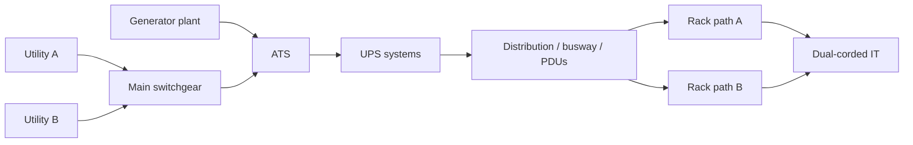

# Power Infrastructure

## Learning objectives

By the end of this module you can:

- Trace the **utility-to-rack power path** and name each major conversion, switch, and distribution point.
- Explain the role of **transformers**, **generators**, **ATS vs STS**, and when each is used.
- Compare redundancy topologies: **N, N+1, 2N, 2N+1** (and related “concurrent maintainability” language).
- Distinguish **single-phase vs three-phase** power and why data centres use both.
- Describe **PDUs**, **busbar vs cable**, and **grounding/bonding** basics relevant to white space.
- Classify common **UPS** topologies and parallel arrangements; outline **battery / BESS** roles.
- Discuss **power quality**, basic **sizing** rules of thumb, **thermographic** maintenance, and **high-density / HPC** power implications.

## Why it matters

**Ops:** Most severe data-centre outages still involve power—utility events, transfer failures, UPS/battery issues, overloaded circuits, or human error during switching. If you run or support a site, you must know where power can fail *and* how the design is supposed to ride through or transfer.

**Design / capacity planning:** Every rack kW you add multiplies cooling load, UPS capacity, generator fuel burn, and distribution headroom. Wrong phase assumptions, undersized PDUs, or single points of failure in the path turn “room for growth” into an emergency project.

**TPM / interview angle:** Technical program and project managers who ship network hardware often inherit power constraints (“we can’t land another 20 kW row,” “maintenance window needs dual-corded equipment on A+B”). Interviewers want you to speak facilities language: path, redundancy, dual-cord, STS, generator test, IR scan—not only switch configs. Network deploy experience transfers well: power is also a *topology + capacity + failure-domain* problem.

## Core concepts

### Utility to rack — the power path

Think of power as a one-way pipeline with controlled transfers and quality cleanup:

1. **Utility / grid** — medium-voltage (MV) or low-voltage (LV) feed(s) from the electric company.
2. **Service entrance / main switchgear** — utility disconnect, metering, main breakers; often multiple feeds for redundancy.
3. **Transformers** — step voltage (e.g. MV → LV 480/277 V or 400/230 V, depending on region). May be utility-owned or customer-owned.
4. **Generators** (standby/prime) — on-site engines that start when utility is lost or on load-bank/test schedules.
5. **ATS or STS** — automatic transfer between sources (see below).
6. **UPS** — uninterruptible power supply: bridges the gap (batteries/flywheel) and conditions power for IT loads.
7. **Downstream switchgear / distribution boards** — feed PDUs, busway, or panelboards serving white space.
8. **PDU (power distribution unit)** — room/row-level or rack-level distribution (term is overloaded; context matters).
9. **Rack power** — rack PDUs (rPDUs / power strips), dual feeds for dual-corded IT gear.
10. **IT equipment PSUs** — convert AC (or sometimes DC) to internal DC rails.

**Grey space** = mechanical/electrical plant (generators, UPS rooms, switchgear). **White space** = IT floor (racks, cold/hot aisles). Power design links both.

```text
  UTILITY FEED(S)          GENERATOR(S)
        |                       |
        v                       v
   [Main switchgear] <--- ATS/STS ---> [Standby path]
        |
        v
   [Transformer(s) if needed]
        |
        v
   [UPS (with batteries/BESS)]
        |
        v
   [Downstream distribution / PDUs / busbar]
        |
        v
   [Rack PDU A]     [Rack PDU B]   <-- dual path for dual-corded gear
        \             /
         v           v
        [Server / switch PSUs]
```

### Transformers

A **transformer** transfers electrical energy between circuits via magnetic coupling, usually changing voltage. Key ideas:

- **Step-down** (MV → LV) is the common data-centre case at the site boundary or inside the building.
- **Isolation transformers** provide galvanic isolation and can help with certain noise/ground issues; not a substitute for a proper UPS or grounding design.
- Losses heat the transformer room—part of the facility thermal budget.
- **K-factor** / harmonic-rated transformers address non-linear IT loads (historical concern; modern UPS/PSUs change the picture—still appears in older plants).
- Region and code dictate voltages (e.g. North America often 480 V three-phase plant → 208/120 V or 415/240 V at the rack in newer high-density designs; EMEA often 400/230 V). Always confirm local practice; do not assume US voltages worldwide.

### Generators

**Standby generators** (typically diesel; sometimes natural gas or dual-fuel) provide long-duration power when utility fails. They are **not** instantaneous: start time is often measured in seconds (commonly designed around ~10 s class for diesel start + transfer, design-dependent). That gap is why UPS batteries exist.

Design and ops notes:

- **Fuel storage**, delivery contracts, and runtime hours at design load matter as much as nameplate kW.
- **Paralleling gear** allows multiple generators to share load and provide N+1 at the plant level.
- **Load bank testing** proves the generator under real load; no-load tests can miss problems (wet stacking on diesels is a classic concern with light-load running).
- Emissions, noise, and permitting constrain siting—especially urban sites.

### ATS vs STS

| | **ATS (Automatic Transfer Switch)** | **STS (Static Transfer Switch)** |
|---|---|---|
| **What it does** | Switches a load between two sources (e.g. utility ↔ generator, or two upstream feeds) | Transfers load between two independent AC sources using solid-state (SCR) switching |
| **Speed** | Mechanical/electro-mechanical; typically slower (cycles to seconds) | Very fast (often sub-cycle / few ms class—vendor-specific) |
| **Typical use** | Generator transfer, facility-level source selection | Preferential dual-source feed for sensitive loads; sometimes UPS output side or critical bus |
| **Make-before-break / break-before-make** | Often break-before-make for genset; design-specific | Designed for seamless transfer between live sources when in sync/tolerance |

**Interview takeaway:** ATS answers “utility died—start generator and switch.” STS answers “I have two live sources and need almost-uninterrupted transfer between them.” Confusing them is a common interview fail.

### Redundancy: N, N+1, 2N, 2N+1

**N** = capacity required to serve the full design IT (or critical) load. Everything else is how much spare and how paths are split.

| Topology | Meaning (conceptually) | Implication |
|---|---|---|
| **N** | Exactly enough capacity; no spare | Any single component failure or maintenance can drop load |
| **N+1** | Full capacity plus one spare module/unit | One failure or concurrent maintenance of one unit possible *if* remaining capacity ≥ N |
| **2N** | Two independent systems each able to carry N | Dual path; one entire path can be down; supports dual-corded loads on separate paths |
| **2N+1** | Two full paths plus extra module(s) | Rare/expensive; extra margin on top of dual systems |

Related language you will hear:

- **Concurrent maintainability** — ability to maintain any single capacity component without interrupting the load (design intent; must be proven in procedure, not just on a slide).
- **Fault tolerance** — surviving a worst-case single failure without interruption (stronger than concurrent maintainability alone).
- **Distributed redundant / catcher** — advanced UPS arrangements that share capacity across systems (vendor/topology specific).

**Critical nuance:** Redundancy of *UPS modules* is useless if they all sit behind one utility feed, one ATS, or one downstream bus that is a **single point of failure (SPOF)**. Always ask: “What is the smallest component whose failure takes the load?”

Also: **dual-corded IT equipment** expects two independent sources (A+B). Single-corded gear needs an STS or automatic transfer PDU—or it remains a SPOF.

### Single-phase vs three-phase

- **Single-phase:** two wires (plus ground) for utilization—common for low-power outlets and some rack strips (e.g. 120 V or 230 V).
- **Three-phase:** three live conductors (plus neutral and/or ground depending on system)—standard for building distribution and higher-density racks. Delivers more power with smaller conductors for the same load and enables balanced loading.

Why DCs care:

- Plant distribution is almost always **three-phase**.
- Rack PDUs may be three-phase input with single-phase branch circuits to outlets, or three-phase to the equipment where PSUs support it.
- **Phase balance** matters: uneven loading across phases wastes capacity and can trip breakers early.

### PDUs

**PDU** is ambiguous—always clarify level:

1. **Floor / room PDU** — large cabinet transforming and distributing (e.g. 480 V → 208 V) with many breakers; traditional raised-floor design.
2. **Remote Power Panel (RPP)** — breaker panel closer to the load, fed from upstream distribution.
3. **Rack PDU (rPDU / power strip)** — mounts in the rack; metered, switched, or basic; single or three-phase input.

Modern colo/hyperscale white space often favors **busway + rack PDUs** over many traditional floor PDUs, but legacy sites still have heavy floor PDU populations.

### Busbar vs cable

| | **Cable (conduit/tray)** | **Busbar / busway** |
|---|---|---|
| **What** | Discrete circuits in cables | Prefabricated enclosed conductors with tap-off boxes |
| **Change agility** | Slower; new runs for new circuits | Faster adds via tap-offs (when capacity reserved) |
| **Density / heat** | Congested trays in high density | Often cleaner overhead for high-density rows |
| **Failure domain** | Per-circuit; careful labeling essential | Section/joint/tap failures need clear isolation procedures |
| **Use case** | Flexible point-to-point, smaller loads | Row power backbone, frequent reconfig |

Neither is universally “better”—site standards, AHJ, maintainability, and density drive the choice.

### Grounding and bonding

- **Grounding (earthing):** connecting systems to earth for safety and reference.
- **Bonding:** connecting conductive parts so they are at the same potential (reduces shock and arcing risk).

In data centres, poor grounding/bonding shows up as safety hazards, nuisance trips, noise issues, and sometimes mysterious network/EMI problems (see EMF module). Practices follow **national electrical codes** (e.g. NEC/NFPA 70 in the US) and standards such as **IEEE** grounding guidance and **IEC** earthing arrangements (TN-S, TN-C-S, TT, IT—region-specific). Do not invent a “data centre ground” separate from code-compliant design.

**Equipment grounding conductor**, **equipotential bonding** of racks/cable tray, and correct **neutral-ground** bonding only at the designated point(s) are core discipline items. Wrong neutral-ground bonds create circulating currents—classic field defect.

### UPS types and parallel configs

**UPS (Uninterruptible Power Supply):** provides ride-through energy and usually power conditioning so IT sees clean power during utility glitches, transfers, and short outages.

Common topology language (IEC / industry shorthand):

| Type | Idea | Typical notes |
|---|---|---|
| **VFD / offline / standby** | Load on utility; transfers to inverter on failure | Cheap; transfer notch; rare for critical DC IT |
| **VI / line-interactive** | Regulates with inverter interaction; battery on deeper events | SMB / edge more than core DC |
| **VFI / double-conversion / online** | AC→DC→AC continuously; battery on DC bus | Gold standard for critical IT: isolation from many utility issues |

**Energy storage:** traditionally **VRLA** (valve-regulated lead-acid) or **wet cell** batteries; increasingly **lithium-ion** for footprint/runtime/weight; some sites use **flywheels** for short ride-through paired with generators.

**Parallel UPS configurations:**

- **Capacity parallel:** modules sum to N (failure can drop below need).
- **Redundant parallel (N+1):** modules sum to more than N so one can leave.
- **Isolated redundant / catcher:** primary systems with a shared reserve UPS.
- **Distributed redundant:** complex multi-bus designs common in large facilities.

**Autonomy time:** minutes of battery at design load—sized to cover generator start + transfer + margin (or longer if policy requires). Runtime collapses if IT load grows without battery refresh.

### Batteries and BESS

- **UPS batteries:** short-duration (minutes), high reliability, tightly coupled to UPS DC bus.
- **BESS (Battery Energy Storage System):** larger plant-scale storage—can support peak shaving, demand response, grid services, or extended backup depending on design and interconnection agreements. Not automatically the same as “UPS batteries.”
- **Thermal runaway / fire risk** for lithium systems drives detection, segregation, and fire-protection design (coordinate with fire module).
- **End of life, testing, and replacement cycles** are major opex items; IR and impedance/ conductance testing programs matter for lead-acid fleets.

### Power quality

IT loads care about:

- **Voltage sags/swells, interruptions**
- **Frequency variation**
- **Harmonics** (distortion from non-linear loads)
- **Transients** (lightning, switching)
- **Imbalance** across phases

UPS double-conversion mitigates many upstream issues. Downstream problems (loose connections, overloaded neutrals in older shared-neutral designs, bad rack PDUs) still cause outages. **Power quality monitoring** at UPS output and critical distribution helps prove root cause after events.

Standards/guides often cited in industry discussion: **IEEE 519** (harmonics), **ITIC/CBEMA** curves (IT equipment voltage tolerance concepts)—use as public references, not as a substitute for site design specs.

### Power sizing basics

You will use these constantly:

- **Power (W or kW)** ≈ real work rate. IT nameplates are often optimistic; use measured or vendor **typical + peak** guidance.
- **Apparent power (VA or kVA)** = what distribution and UPS often rate in. Relationship:  
  **kW = kVA × power factor (PF)**.
- **Power factor** for modern PSU fleets is often high (near 0.9–1.0 with PFC), but design still checks PF and harmonics.
- **PUE (Power Usage Effectiveness)** = Total facility energy / IT energy. Not a “power path” component, but drives how much non-IT power (cooling, losses) you must provision.
- **Cooling coupling:** ~1 kW IT roughly needs on the order of 1 kW of cooling capacity *plus* inefficiencies—cooling module expands this; never size power without cooling.

Rough planning chain (conceptual):

```text
IT load (kW) → apply growth & diversity factors → UPS kW/kVA
→ generator kW (IT + cooling + losses + starting margins)
→ utility service size → distribution breaker hierarchy
→ per-rack kW budget → circuit and rPDU selection
```

**Branch circuit continuous load** rules (e.g. 80% of breaker rating for continuous loads under common US practice) drive why a “30 A circuit” is not 30 A of continuous IT draw. Confirm with local code and the AHJ; treat “80%” as a well-known rule of thumb, not universal law everywhere.

### Thermographic scanning

**Infrared (IR) thermography** of electrical equipment under load finds hot connections, overloaded phases, and failing breakers *before* they arc or open. It is a core predictive-maintenance practice for switchgear, UPS, PDUs, busway joints, and generator connections.

Good programs: scheduled under representative load, trained technicians, trend comparison, work orders for anomalies—not a one-time photo op after an outage.

### High-density / HPC power notes

- Rack densities moved from ~2–5 kW toward **20–40+ kW** and, for AI/HPC, **much higher** (liquid cooling often becomes the enabler—not power alone).
- Higher density forces: **three-phase rack PDUs**, larger feeder cables or busway, careful **whips/connectors**, higher **UPS and generator** blocks, and **row-level** capacity management.
- **Diversity assumptions break**: a full GPU rack may actually run near nameplate under training load—do not apply enterprise “servers idle most of the day” diversity blindly.
- **Dual-path** still required for availability, but connector and bus ratings become the bottleneck.
- Power and cooling must be co-designed; stranded power (power without cooling) or stranded cooling is wasted capital.

### Sustainability, microgrids, and energy context

**PUE (Power Usage Effectiveness)** = total facility energy ÷ IT equipment energy. Lower is better overhead (cooling, losses, lighting, etc.). PUE is an **efficiency metric**, not an availability design. A site can have excellent PUE and still be single-path N.

**Microgrid (interview-level):** a local energy system that can manage **multiple sources** (utility, generators, solar/other renewables, BESS) and may **island** (run disconnected from the utility) under defined conditions. Data centres already look like proto-microgrids (utility + gens + UPS/BESS). Explicit microgrid controls add orchestration for peak shaving, demand response, renewable integration, and longer islanded operation—subject to interconnection agreements, protection engineering, and AHJ/utility rules.

What to say on a tour or interview:

1. Generators + UPS alone are **backup continuity**; a microgrid adds **active energy management** and possibly intentional islanding.
2. BESS can serve UPS-class ride-through *and/or* grid services—roles must be designed, not assumed identical.
3. Renewables rarely replace the need for firm capacity (genset/contracted supply) for 24×7 critical load without substantial storage and risk analysis.
4. Never greenwash: sustainability projects that cut fuel testing, disable redundant plant, or weaken MOPs can **hurt availability**.

### IP ratings (enclosure protection)

**IP code (Ingress Protection, IEC 60529)** rates how well an enclosure keeps out **solids (dust)** and **liquids (water)**. Format: **IP** + two digits (e.g. **IP54**, **IP65**). First digit = solid-object protection (0–6); second = water protection (0–9 class scale). “X” means that digit is unspecified (e.g. IPX5).

Why DCs care:

- Outdoor generators, switchgear, and busway joints need weather-appropriate enclosures.
- White-space rack gear is usually **indoor / dry**; do not overspec IP as a substitute for climate control.
- Battery rooms, wash-down areas, and cooling-tower gear may need higher liquid protection than office-grade panels.
- **IP ≠ NEMA type** (North American enclosure types are a related but different labeling system)—map carefully on multinational projects.

**Interview rule:** Quote the IP (or NEMA) required by the **environment and manufacturer**, not a universal “data centre IP number.” Wrong IP is a reliability and safety defect outdoors; irrelevant IP marketing indoors is noise.

## Key diagrams

### End-to-end path (dual utility concept)



### Redundancy sketch

```text
N:     [====LOAD====]   one chain; any X fails → outage risk

N+1:   [M][M][M][spare]  modules; lose one → still OK if sum ≥ N

2N:    Path A ======== LOAD
       Path B ========       each path full N; dual-corded preferred
```

### Cabling / distribution hierarchy (typical)

```text
Utility → MV/LV switchgear → UPS → Sub-boards
    → Busway run (or cable feeders)
        → Tap-off / RPP / floor PDU
            → Whip to rack PDU A / B
                → C13/C19 (or high-density connectors) → PSU
```

## Formulas / rules of thumb

| Item | Rule / formula | Caveat |
|---|---|---|
| Real vs apparent | \( P_{\mathrm{kW}} = S_{\mathrm{kVA}} \times \mathrm{PF} \) | UPS/gen nameplates may be kW or kVA—read the plate |
| Three-phase power | \( P = \sqrt{3} \times V_{L-L} \times I \times \mathrm{PF} \) | Use line-line voltage consistently |
| Continuous circuit loading | Often design ≤ **80%** of breaker rating (US-common continuous) | Verify local code |
| Battery runtime | Runtime falls roughly with load increase; not perfectly linear | Temperature and age matter a lot |
| Generator vs UPS | UPS: seconds–minutes; Gen: hours–days with fuel | Never plan gen without UPS ride-through unless special design |
| Density | If rack kW doubles, cooling and distribution often more than double in *complexity* | Liquid cooling changes the game |
| Dual-cord | A and B each should support **full** rack load if one path is lost (unless design explicitly allows load shedding) | Many “A+B” installs are under-provisioned on each side |

## Common failure modes and misconceptions

1. **“We have N+1 UPS, so we’re fine.”** — Upstream ATS, single bus, single generator, or shared controls may still be SPOFs.
2. **ATS vs STS confusion** — wrong device for the failure mode.
3. **Ignoring human error** — most transfers and maintenance windows introduce risk; procedures and interlocks matter.
4. **Nameplate IT load planning** — oversizing everything from max nameplate wastes capital; undersizing from idle measurements causes overload trips under peak.
5. **Single-corded critical gear on one rack PDU** — network “core” switches sometimes land this way; treat as a known risk.
6. **Battery neglected** — aged VRLA is a silent failure; runtime tests and replacement programs are not optional.
7. **Phase imbalance** — one phase hits limit while others have headroom; looks like “no capacity” wrongly.
8. **Assuming generator started = load saved** — failed transfer, open breakers, mis-synced paralleling, or UPS overload on retransfer still drop IT.
9. **Busway as magic** — still needs capacity management, IR scans, and disciplined tap-off work.
10. **HPC diversity myths** — AI loads can be simultaneous and high; legacy diversity factors may be unsafe.

## Interview drills

**Q1: Walk the power path from utility to a dual-corded server.**  
**A:** Utility → service/switchgear → (transformer as needed) → ATS with generator alternate → UPS with batteries → distribution (PDU/busway) → separate A and B feeds to rack PDUs → each PSU on a different path. Call out where redundancy is claimed and where a SPOF might still exist.

**Q2: ATS vs STS—when do you use each?**  
**A:** ATS for automatic selection between sources that are not both continuously preferred for seamless IT transfer—classically utility and generator. STS for fast transfer between two independent live sources when you need minimal interruption (or to give single-corded gear a dual-source upstream). Different speed, technology, and use cases.

**Q3: What does 2N buy you that N+1 does not?**  
**A:** Two independent distribution paths each capable of N, enabling true dual-path feeding and maintenance of an entire path. N+1 often shares a common distribution path even if modules are redundant. 2N costs more capital and space.

**Q4: Why do we still need UPS if we have generators?**  
**A:** Generators take time to start and stabilize; utility glitches may be shorter than a start sequence. UPS provides ride-through and usually better power quality. Generators provide *duration*; UPS provides *continuity*.

**Q5: A row keeps tripping one breaker though total kW seems fine—what do you check?**  
**A:** Phase loading (imbalance), continuous vs breaker rating (80% rule where applicable), inrush/peaks, shared neutrals/harmonics in older plants, dual-cord imbalance (all load on A), and actual vs assumed diversity. Metered rack PDUs and power quality data beat guesswork.

## Self-check quiz

1. **Primary reason batteries sit with a UPS in a generator-backed site?**  
   a) Reduce generator fuel use permanently  
   b) Provide ride-through during start/transfer and short utility events  
   c) Replace the need for an ATS  
   d) Convert three-phase to single-phase  

2. **Which best describes 2N?**  
   a) One spare module only  
   b) Two full-capacity independent systems  
   c) No redundancy  
   d) Batteries only, no generators  

3. **An STS is primarily associated with:**  
   a) Slow mechanical generator transfer only  
   b) Fast transfer between two AC sources  
   c) Only DC plants  
   d) Cooling towers  

4. **kW vs kVA — which is true?**  
   a) They are always equal  
   b) kW = kVA × power factor  
   c) kVA = kW × power factor  
   d) UPS never uses kVA ratings  

5. **Floor PDU vs rack PDU — key distinction?**  
   a) No difference  
   b) Floor/room PDU is larger distribution/transform stage; rack PDU is in-rack outlet distribution  
   c) Rack PDU is always 480 V only  
   d) Floor PDUs are only for lighting  

6. **Thermographic scanning is most useful for:**  
   a) Measuring humidity only  
   b) Finding hot electrical connections under load  
   c) Replacing all breakers annually  
   d) Certifying software  

7. **Single-corded server in a 2N facility is still at risk if:**  
   a) It only plugs into one path without STS/AT-PDU  
   b) The building has two utilities  
   c) Generators are diesel  
   d) PUE is under 1.5  

8. **High-density GPU racks most often force which power change first?**  
   a) Removing all grounding  
   b) Higher kW/rack feeds, three-phase rPDUs, co-designed cooling  
   c) Eliminating UPS  
   d) Single-phase only distribution  

### Answers

<details>
<summary>Show answers</summary>

1. **b** — Ride-through bridges generator start and short disturbances.  
2. **b** — Two independent full-capacity systems/paths.  
3. **b** — Static (solid-state) fast transfer between sources.  
4. **b** — \(P = S \times \mathrm{PF}\).  
5. **b** — Different layers of the distribution hierarchy.  
6. **b** — IR under load finds thermal anomalies.  
7. **a** — Dual facility paths do not help a single plug on one strip.  
8. **b** — Density drives feed size, three-phase PDUs, and cooling co-design.

</details>

## Further free resources

Public standards and primers (names/topics to search—prefer free previews, AHJ codes you already have access to, and manufacturer application notes):

- **NFPA 70 (NEC)** — US electrical installation code (purchase/access via normal code channels; many jurisdictions adopt it).  
- **IEC 60364** series — low-voltage electrical installations (international).  
- **IEC 62040** series — UPS performance/terminology (VFI/VI/VFD language).  
- **IEEE 519** — harmonic control guidelines.  
- **IEEE** color books / grounding literature (e.g. grounding and powering sensitive equipment discussions).  
- **ASHRAE** thermal guidelines (power↔cooling coupling; free/public overview materials vary by edition).  
- **Uptime Institute** public tier *overview* materials (commercial rating system—know it exists; do not confuse with TIA-942).  
- **ANSI/TIA-942** public overviews — rated topology language for data centres (access level varies; use authorized summaries).  
- **EN 50600** family — European data centre facility standards (overview papers often public).  
- Vendor **application notes** (APC/Schneider, Eaton, Vertiv, ABB, Siemens, etc.) on UPS topologies, busway, and dual-cord best practices—treat as educational, not as code.  
- Utility interconnection / generator primer material from major engine OEMs (Cummins, Caterpillar, MTU) on start times and paralleling concepts.

**Study tip:** For interviews, draw the path from memory, mark A/B independence, and narrate one failure at each hop. That single habit outperforms memorizing brand model numbers.

---

*Module ID: 06-power · CDCP self-study (original educational content; not EPI courseware).*
