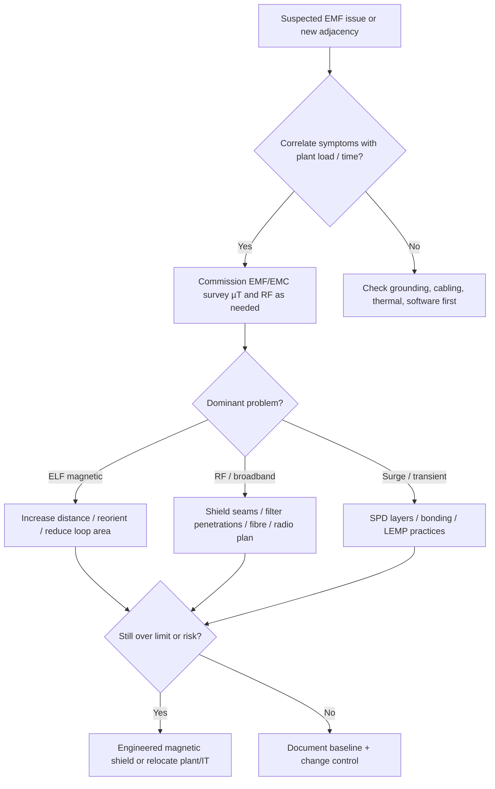

# Electromagnetic Fields (EMF)

## Learning objectives

By the end of this module you can:

1. Distinguish **electric fields**, **magnetic fields**, and **electromagnetic radiation**, and say which dominate at power frequency vs RF.
2. Name common data-centre EMF sources (transformers, busbars, UPS, elevators, RF, adjacent industrial load) and why layout matters.
3. Explain effects on IT equipment at a practical level: interference risk, distance fall-off, myths vs real failure modes.
4. Apply mitigation hierarchy: **separation → orientation → routing → bonding → shielding** (and when to call a surveyor).
5. Describe **(H)EMP** awareness for operators and designers without claiming military-grade design competence.

---

## Why it matters (ops/design/TPM interview angle)

As a network deploy engineer you already live in a world of copper noise, ground loops, and “bad patch, weird CRC.” Facilities EMF is the same physics scaled up: high current in busbars and transformers produces **strong low-frequency magnetic fields**; radios and lightning produce **broadband RF energy**. Put a row of SAN heads or a copper backbone too close to a UPS room, and you can get intermittent errors that look like software bugs.

Interviewers and site walk-throughs use EMF to test whether you think in **adjacency and failure modes**, not only racks and cables:

- “Would you put the network core next to the UPS?” → usually **no** (magnetic field + heat + access traffic).
- “Does a multi-kA AI busway change the physics?” → **no**. Same physics at higher current; **adjacency / distance-first still wins**. Do not invent a milligauss statute.
- “What triggers an EMF survey?” → human exposure complaints, unexplained I/O errors clustered near electrical plant, new high-current gear, or site due diligence next to rail/substation/radar.
- TPMs and designers care because **rework is expensive**: moving a 2 MW transformer after fit-out is a multi-week project; leaving three metres of clear zone at design time is free.

EMF is also where **health/safety language** and **equipment EMC language** get confused. Keep them separate: ICNIRP-style limits protect people; IEC 61000 / product EMC ratings protect (and describe) equipment immunity. Both can drive layout; they are not the same numbers. This file teaches equipment coupling, not a health syllabus.

---

## Core concepts

### What “EMF” means in a data centre

**Electromagnetic field (EMF)** is an umbrella term for the coupled electric and magnetic phenomena around charges and currents. In DC facilities work, people usually mean one of three practical problems:

| Concern | Dominant field | Typical frequency | What it affects |
|---|---|---|---|
| Power-frequency magnetic field | **B** (magnetic flux density) | 50/60 Hz (plus harmonics) | Nearby IT, displays, some sensors; human exposure metrics |
| Power-frequency electric field | **E** (electric field strength) | 50/60 Hz | Less often a white-space IT issue; more overhead lines / HV rooms |
| RF / broadband EMI | Propagating EM wave | kHz–GHz | Radios, copper links, poorly shielded electronics |
| Transient / pulse | Fast E and H | ns–s | Surge damage, upset, latch-up; extreme case: EMP |

Define the fields carefully on first use:

- **Electric field (E-field):** force field produced by electric charge (and changing magnetic fields). Unit: **volts per metre (V/m)**. Strong near high **voltage** relative to local ground, even with little current.
- **Magnetic field:** produced by **current** (moving charge) and permanent magnets. Often discussed as:
  - **H-field** in A/m, or
  - **B-field** (magnetic flux density) in **tesla (T)** or **microtesla (µT)**; older DC literature also uses **milligauss (mG)** where **1 µT = 10 mG**.
- **Electromagnetic radiation / radio-frequency (RF) field:** when E and H are coupled and radiate away from the source as a wave (far field). Described by frequency (Hz), wavelength, and often **power density** (W/m²).
- **EMI (electromagnetic interference):** unwanted energy that degrades a victim circuit’s performance.
- **EMC (electromagnetic compatibility):** the discipline of equipment neither emitting too much noise nor being too susceptible—product standards (e.g. IEC/EN 61000 family, CISPR emissions) and facility practices.

### Near field vs far field (intuition)

Close to a source (roughly within a wavelength, and for 50 Hz that wavelength is **thousands of kilometres**), the “near field” dominates. At power frequency you almost never have true radiated far-field behaviour inside a building: you have **quasi-static** E and B that fall off quickly with distance. At Wi‑Fi / cellular frequencies, wavelengths are centimetres to metres, so room-scale radiation and multipath matter.

**Rule of thumb:** for power-frequency **magnetic** problems in white space, think **distance and current**, not “RF shielding paint.”

### Static, ELF, and RF

- **Static / DC fields:** permanent magnets, DC bus in some UPS/battery plants, MRI (not typical DC). Hard-disk drives historically disliked strong static B; modern enterprise gear still has limits in product manuals.
- **ELF (extremely low frequency):** includes 50/60 Hz and low harmonics. **This is the main facilities magnetic-field story.**
- **RF:** radios, microwave links, wireless AP density, radar, broadcast, intentional jamming / IEMI (intentional EMI).

### Sources inside and outside the site

**Internal (grey space / plant):**

- **Dry-type and oil-filled transformers** — high current, often the strongest local B-fields.
- **Busbars, busway, switchgear, PDU/RPP feeds** — field strength scales with current; multi-kA bus is a classic culprit.
- **UPS modules and battery rooms** — large transformers/inductors, high DC and AC currents, switching harmonics.
- **Generators and ATS rooms** — high current, vibration, and electromagnetic noise when on load.
- **Elevators, CRAC/CRAH compressors, pumps, large motors** — intermittent fields and conducted noise.
- **Welding / maintenance tools** — transient EMI during fit-out and “hot work.”
- **Dense wireless** (APs, private LTE/5G) — usually manageable with design, but can interact with poorly shielded serial gear, sensors, or poorly planned copper runs.

**External / site-adjacency:**

- Utility **substations**, overhead HV lines
- **Rail / metro** traction systems (strong, intermittent magnetic fields)
- Broadcast towers, radar, airports
- Adjacent industrial process loads
- **Lightning** (LEMP — lightning electromagnetic pulse) and switching surges on the power grid

### Effects on equipment (evidence-based)

Speak carefully: many “EMF ate my packets” stories are really **grounding, shared neutrals, bad terminations, or thermal issues**. Still, real mechanisms exist:

1. **Induced noise on copper** — time-varying B-field induces voltage in loops (Faraday’s law). Large cable loops under floor or poorly separated power/data paths increase pick-up.
2. **Immunity limit exceeded** — commercial IT has finite RF and power-frequency immunity (product EMC). Above that, expect CRC errors, link flaps, sensor false trips, UPS control glitches, or rare reboots.
3. **Legacy magnetic-sensitive devices** — CRTs (historical), some magnetic media, unshielded analog sensors, older tape libraries.
4. **SSD / flash era nuance** — solid-state storage is far less worried about ambient 50 Hz magnetic fields than spinning media; **do not** claim modern servers fail from “any nearby transformer.” Claim risk when **surveys show high B**, **symptoms correlate with plant load**, or **vendor environmental limits** are violated.
5. **People vs product** — operator discomfort or policy-driven exposure limits may force equipment relocation even when IT still works.

**Data corruption myths:** “Walk past a magnet and wipe the SAN” is mostly cinema. Real risk is **sustained high B near plant**, **conducted surge**, or **RF intentional interference**, not a phone magnet on a rack door.

### Units and “how strong is strong?”

You do not need to memorize every limit table, but you must speak units correctly:

- Magnetic: **µT** (or mG). Ambient Earth field ~25–65 µT static (depends on location); power-frequency **AC** fields of interest in rooms are often discussed from fractions of a µT up to tens or hundreds of µT near transformers/bus.
- Electric: **V/m**.
- RF: V/m or W/m², plus frequency band.

Human exposure guidance is published by bodies such as **ICNIRP** and standards such as **IEEE C95.1** (revisions evolve—cite the current edition when on a real project). For the data-centre power-frequency case (50/60 Hz magnetic fields from distribution equipment), pin the citation to the [ICNIRP 2010 low-frequency guidelines (1 Hz–100 kHz)](https://www.icnirp.org/cms/upload/publications/ICNIRPLFgdl.pdf); the [ICNIRP 2020 RF guidelines (100 kHz–300 GHz)](https://www.icnirp.org/cms/upload/publications/ICNIRPrfgdl2020.pdf) are the RF document. An unqualified “ICNIRP” citation does not identify the applicable frequency band. These are human-exposure guidelines, not equipment-immunity test standards or a universal site threshold. Equipment immunity is a different stack: **IEC/EN 61000-4-x** test methods (e.g. radiated RF immunity, magnetic field immunity, surge, EFT). Facility design standards (**ANSI/TIA-942** family, **EN 50600** series) discuss separation and environmental conditions at a design level; always check the edition your customer claims compliance to.

**When to call a specialist survey:** unexplained errors that track electrical plant load; white space planned against a transformer vault or rail line; health/safety inquiries; acceptance testing after major electrical install; any HEMP/IEMI hardening scope (specialist domain).

### Mitigation hierarchy (best practices)

Prefer cheap geometry over exotic materials.

1. **Separation (distance)** — strongest tool for ELF magnetic fields. Field from a simple line-like current falls roughly as **1/r**; compact sources (transformer-like) often closer to **1/r² to 1/r³** in the near zone. Doubling distance often cuts field **dramatically**. Keep UPS, transformers, and high-current bus **out of white space** and off the other side of a shared wall from row ends when possible.
2. **Orientation** — magnetic field patterns are directional. Rotating a transformer or routing bus so the strongest lobe does not point at copper-dense rows helps (survey-informed).
3. **Current geometry** — run supply and return **close together** (busway phase geometry, twisted pairs, enclosed bus) so fields partially cancel. Avoid large loop areas in power routing under IT.
4. **Cable hierarchy & media choice** — separate power and data pathways; use **fibre** for long or noise-prone runs; maintain bonding/grounding practices that avoid noisy ground loops (coordinate with electrical design—do not freestyle grounds).
5. **Bonding and shielding integrity** — continuous conductive enclosures, proper connector backshells, screened cables terminated correctly (360° where specified). A shield grounded only at one “wrong” point for the application can become an antenna.
6. **Shielding materials**
   - **E-field / RF:** conductive sheets, mesh, conductive gaskets, Faraday-cage style rooms. Apertures (doors, windows, cable entries) dominate performance—seams matter more than wall thickness once conductivity is adequate.
   - **Low-frequency magnetic:** hard. Ordinary aluminium is poor for 50 Hz B-shielding. **Steel**, high-permeability alloys (**mu-metal** and similar), and thick conductive plates with careful design are used; cost and saturation matter. Often **cheaper to move the load or the victim** than to build a magnetic shield room.
7. **Operational controls** — no hot work (welding) near live sensitive rows without isolation plans; control portable radios if legacy gear is susceptible; change management when adding high-current plant.

### (H)EMP awareness

**(EMP) electromagnetic pulse** is a short, intense burst of EM energy. Contexts:

- **LEMP** — lightning electromagnetic pulse (common risk class; addressed by bonding, SPDs, shielding practices in normal codes).
- **IEMI** — intentional EMI / high-power microwave weapons or crude jammers (security threat model for high-value sites).
- **NEMP / HEMP** — nuclear EMP; **HEMP** is **high-altitude EMP** from a nuclear detonation at altitude, coupling energy over a very large geographic footprint.

HEMP is often described in three time regimes (vocabulary you should recognize; detailed waveforms live in military/IEC literature such as **IEC 61000-2-9** concepts and hardening docs like **MIL-STD-188-125** for fixed facilities—specialist territory):

For a public primary reference at the fixed-facility protection level, the [DLA ASSIST record for MIL-STD-188-125-1, Revision A, document date 26-Jul-2021](https://quicksearch.dla.mil/qsDocDetails.aspx?ident_number=204459) states minimum performance, testing, and hardness-maintenance requirements and says the standard does not mandate a specific design solution. That record supports a verification-program claim; detailed E1/E2/E3 waveform or field-threshold claims remain **blocked-on-sourcing** here because no public clause has been resolved for them. No invented HEMP value or commercial-site badge is taught.

| Component | Character (conceptual) | Typical concern |
|---|---|---|
| **E1** | Very fast, high amplitude | Electronics upset/damage, coupling into cables/antennas |
| **E2** | Intermediate (lightning-like timescales) | Similar to lightning stress if E1 already weakened protection |
| **E3** | Slow geomagnetic-like | Long conductive paths, transformers, grid—more bulk power than single servers |

**What CDCP-level operators should take away:**

- Commercial colocation “standard” designs are **not** HEMP-hardened. Claiming otherwise without a hardening program is incorrect.
- Practical resilience overlapping EMP *awareness*: layered surge protection, robust bonding grid, fibre where possible, redundant diverse paths, spare equipment offline/spares strategy, and for true HEMP/IEMI scopes—**shielded enclosures, filtered penetrations, tested points of entry**, and certified design/test partners.
- Policy and insurance may treat EMP as an exclusion; design response is a **business risk decision**, not a generic white-space checklist item.

If uncertain on limits or waveforms for a real project, say so and point to primary documents by name: **ICNIRP 2010** (LF, 1 Hz–100 kHz) for power-frequency exposure and **ICNIRP 2020** for RF, **IEEE C95.1**, **IEC/EN 61000** series, **IEC 61000-2-9/-2-10/-2-11** (HEMP environments—editions matter), **MIL-STD-188-125-1** (military fixed-site HEMP), local electrical code, and the customer’s stated standard (**TIA-942**, **EN 50600**, etc.).

---

## Key diagrams in ASCII or mermaid where helpful

### Separation beats shielding (ELF magnetic)

```text
  [ Transformer / UPS ]==== high current bus ====
           |
           |  strong B near plant
           v
      ~~~~ B-field falls with distance ~~~~
           |
           |  aim for clear zone / corridor / grey space
           v
      +------------------+
      |   WHITE SPACE    |  IT rows, copper aggregation
      |   (victim gear)  |
      +------------------+
```

### Mitigation decision flow



### Cabling hierarchy (noise hygiene)

```text
  Utility / Gen
       |
    Switchgear  ----SPD----  bonding network
       |
      UPS
       |
   PDU / Busway  ====== keep loop area small; phase geometry
       |
   Rack PDU ---- A+B paths
       |
   Servers / switches
       |
   Copper short runs | Fibre for noisy / long / between buildings
```

---

## Formulas / rules of thumb

- **Induced loop voltage (concept):** a changing magnetic flux through a loop induces emf. Larger loop area + faster dB/dt + stronger B → more noise. **Keep power and signal loop areas small.**
- **Distance:** for ELF magnetic issues, **move it** before you **shield it**. Rough intuition: if you can triple the distance from a compact source, field often drops by roughly an order of magnitude class of improvement (geometry-dependent—verify by measurement).
- **Current matters:** field scales with **amps**. A lightly loaded bus is quieter than the same bus at full load—symptoms that appear only at peak IT load are a clue. Density does not change the physics; a 2026 GPU-hall multi-kA bus raises **magnitude** only.
- **First-pass ELF B (long straight conductor):** B = μ₀I/(2πr) with μ₀ = 4π×10⁻⁷ H/m. This is a magnitude estimate, not an ICNIRP 2010 limit and not a compliance result; return-path cancellation and bus geometry can change the measured field by a large factor. Verify by survey.
- **Cancellation:** supply and return close together reduce net field; single-conductor wide separations create strong fields.
- **Shielding frequency dependence:** conductive shields work better as frequency rises (skin effect); **50 Hz magnetic shielding is the expensive special case.**
- **Units:** 1 µT = 10 mG. Do not mix AC power-frequency readings with DC Earth-field numbers without saying which you mean.
- **Survey before blame:** one calibrated measurement near the suspect row beats a week of board swaps.

---

## Common failure modes and misconceptions

| Failure / misconception | Reality |
|---|---|
| “Any EMF near IT is catastrophic.” | Commercial gear has immunity; risk is about **magnitude, frequency, coupling path**, not the word EMF. |
| “Aluminium foil / paint fixes transformer hum fields.” | Poor for ELF **magnetic** shielding. Distance and steel/engineered shields are the real toolkit. |
| “SSDs make EMF irrelevant.” | Storage media sensitivity dropped; **copper links, clocks, and analog sensors** can still couple noise. |
| “Problems started after UPS install → must be magnetic field.” | Could be bonding changes, neutral issues, harmonics, heat, or airflow from the same project. Measure. |
| “Human exposure limits = equipment limits.” | Different standards, different goals. |
| “HEMP = put SPDs on the PDU and you’re done.” | HEMP E1 coupling and facility hardening are far beyond ordinary surge practice. |
| “Elevator next to MDF is fine.” | Intermittent motor/drive noise and peak currents can create hard-to-reproduce glitches—treat as adjacency risk. |
| “Shield ground it anywhere.” | Incorrect shield termination creates antennas and ground loops. Follow the cabling system’s rules. |

---

## Interview drills (5 Q&A pairs with model answers)

**Q1. Would you put a UPS room on the other side of a gypsum wall from the network core?**  
**A:** Prefer not to. UPS and associated transformers/bus produce elevated **50/60 Hz magnetic fields** and heat, and create maintenance traffic. Even if fields prove acceptable by survey, operational adjacency is poor. Put grey space electrical plant with separation, use the wall only if survey and layout leave adequate distance and copper aggregation is not hard against that wall.

**Q2. What would trigger an EMF survey on a live site?**  
**A:** Clustered unexplained network/storage errors near electrical rooms; new high-current equipment; employee exposure concerns; due diligence beside rail/substation/radar; commissioning after major electrical work; or a customer requirement in the facility spec (TIA-942 / EN 50600 style environmental diligence).

**Q3. Why is low-frequency magnetic shielding harder than RF shielding?**  
**A:** At 50/60 Hz, skin depth in ordinary conductors is large, so thin conductive foils barely attenuate B-fields. You need high-permeability materials, thick steel, careful seams, and attention to saturation—or simply more distance. RF Faraday practices that stop GHz energy can fail completely against ELF magnetic fields.

**Q4. How do you explain EMP vs normal lightning protection to a risk committee?**  
**A:** Lightning (LEMP) is a frequent, localized threat addressed by bonding, grounding, and coordinated SPDs per electrical code and best practice. HEMP is a rare, wide-area, multi-timescale threat (E1/E2/E3) that can stress electronics and long conductors beyond commercial design basis. Treat HEMP as an explicit mission requirement with specialist design—not as a free byproduct of normal SPD installation.

**Q5. Fibre vs copper from an EMF perspective?**  
**A:** Fibre is dielectric: it does not pick up induced loop currents the way copper pairs do, so it is preferred for noisy pathways, building-to-building, and high-EMI zones. Copper remains fine for short, well-separated, standards-compliant runs inside a quiet white space. EMF never removes the need for correct power grounding and surge protection of the powered endpoints.

---

## Self-check quiz

1. **At 50/60 Hz inside a data centre, the dominant IT adjacency concern from a loaded busway is usually:**  
   a) Far-field ionizing radiation  
   b) Quasi-static **magnetic** field from current  
   c) Ultraviolet corona only  
   d) Acoustic noise alone  

2. **Magnetic flux density is commonly expressed in:**  
   a) V/m only  
   b) µT or mG  
   c) Celsius  
   d) Lux  

3. **Best first mitigation for ELF magnetic fields from a transformer near planned racks:**  
   a) Wallpaper with aluminium foil  
   b) Increase separation / relocate rows or plant  
   c) Raise room temperature  
   d) Disable UPS redundancy  

4. **1 µT equals:**  
   a) 1 mG  
   b) 10 mG  
   c) 1000 mG  
   d) 0.1 mG  

5. **ICNIRP-type guidance primarily addresses:**  
   a) RAID rebuild times  
   b) Human exposure limits  
   c) BGP convergence  
   d) PUE calculation  

6. **HEMP E1 is best described as:**  
   a) Slow geomagnetic induction only  
   b) A very fast, high-amplitude early-time pulse stressing electronics/cabling  
   c) Steady 60 Hz hum  
   d) Only a thermal effect  

7. **Why run supply and return conductors close together?**  
   a) To maximize loop area for cooling  
   b) To promote field cancellation and reduce net B  
   c) To increase induced noise on purpose  
   d) To avoid needing overcurrent protection  

8. **A credible response to “magnets wipe all modern enterprise SSDs through the rack door” is:**  
   a) Agree without qualification  
   b) Challenge it—static fridge magnets are not a realistic SAN wipe mechanism; discuss real coupling paths and measured fields instead  
   c) Recommend foil on every SSD  
   d) Disable all wireless  

### Answers

<details>
<summary>Click to reveal answers</summary>

1. **b** — Power-frequency problems are quasi-static magnetic fields from current, not ionizing radiation.  
2. **b** — µT (SI) or mG (legacy).  
3. **b** — Distance/layout first; ELF magnetic shielding is expensive.  
4. **b** — 1 µT = 10 mG.  
5. **b** — Human exposure; equipment EMC is a separate standards stack.  
6. **b** — E1 is the fast early-time HEMP component.  
7. **b** — Close supply/return geometry reduces net field.  
8. **b** — Push back on cinema physics; stay measurement- and path-based.

</details>

---

## Further free resources (public standards names, vendor primers — no paywalled EPI content)

- **ICNIRP 2010** — [low-frequency guidelines (1 Hz–100 kHz)](https://www.icnirp.org/cms/upload/publications/ICNIRPLFgdl.pdf): the document for 50/60 Hz power-frequency exposure. **ICNIRP 2020** — [RF guidelines (100 kHz–300 GHz)](https://www.icnirp.org/cms/upload/publications/ICNIRPrfgdl2020.pdf). Do not cite “ICNIRP” without the document and band. Neither is a site law or an equipment-immunity table.  
- **IEEE C95.1** — safety levels with respect to human exposure to electric, magnetic, and electromagnetic fields (know it exists; use the current revision on projects).  
- **IEC/EN 61000** series — EMC: emissions, immunity test methods (e.g. 61000-4-3 radiated RF, 61000-4-8 power-frequency magnetic field, surge/EFT parts).  
- **IEC 61000-2-9 / -2-10 / -2-11** — HEMP environment and related descriptions (specialist; edition-aware).  
- **MIL-STD-188-125** (public overviews/discussions) — HEMP protection for fixed ground-based facilities (military hardening reference point).  
- **ANSI/TIA-942** family — data centre infrastructure standard (site/facility practices; EMF treated in the broader environmental/adjacency sense—use official TIA sources).  
- **EN 50600** series — European data centre facilities and infrastructures standards family.  
- **ITU / CISPR** publications — radio disturbance and EMC vocabulary useful when RF is in scope.  
- **Vendor application notes** (ABB, Schneider, Eaton, Siemens, etc.) on transformer placement, busway magnetic fields, and UPS room layout—use manufacturer public white papers, not scraped courseware.  
- **National electrical codes / AHJ rules** (e.g. NEC in the US, BS 7671 in the UK, local equivalents) for bonding, SPDs, and clearances—always win over informal “best practice” when they conflict.

**Study tip:** On a white-space tour, stand at the UPS/transformer wall and at row ends: ask yourself what copper aggregation lives there, what the separation is, and whether any intermittent ticket history lines up with generator tests or peak load. That operational habit matters more than memorizing obscure µT tables.

---

*Module 07 · Electromagnetic Fields (EMF) · CDCP self-study (unofficial educational reconstruction) · standard depth*
