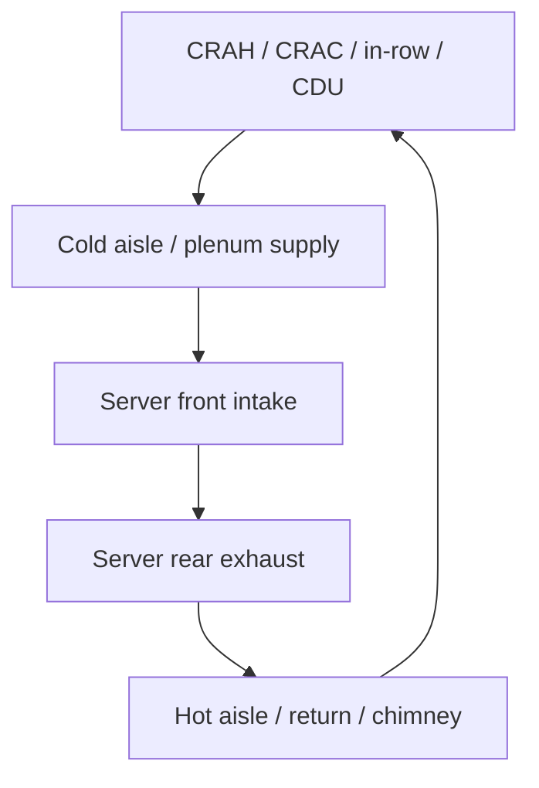

# Equipment Racks

**Module ID:** `08-racks`  
**Domain:** Equipment Racks (CDCP public syllabus)  
**Depth:** Standard (interview-ready)  
**Prerequisites:** Modules 04 (raised floor / airflow context), 06 (power path to the rack), 07 (EMF basics)

---

## Learning objectives

By the end of this module you can:

1. State the main **rack standards and dimensions** (width, depth, height in **rack units (U)**) and explain why “19-inch” is a mounting standard, not a cabinet footprint.
2. Differentiate common **rack and enclosure types** (open frame, four-post, cabinet/enclosure, wall-mount, specialized network vs server vs high-density) and when each fits.
3. Describe **physical security** options at the rack (doors, side panels, locks, sensors, cage/cabinet zoning) and how they relate to multi-tenant and compliance designs.
4. Explain **power strips and rails** (PDU types, A/B feeds, zero-U vs rack-mount, metering/switching, plug types and branch-circuit limits) in plain operational language.
5. Apply **airflow and mounting** rules of thumb: front-to-rear cooling, blanking panels, cable management, weight/U spacing, seismic and grounding considerations.

---

## Why it matters (ops/design/TPM interview angle)

The rack is where **IT**, **facilities**, and **operations** meet. Every design decision upstream—UPS, CRAH placement, raised floor, fire zones—fails or succeeds at the **cabinet row**. For a career-changer from network deploy, think of the rack as the last-mile “cell site” of the data centre: power, cooling, physical access, labeling, and change control all concentrate here.

Interviewers use racks to test whether you understand **integration**, not just product SKUs:

- **Ops:** Can you power a new chassis without tripping a breaker or blocking exhaust? Do you know A/B PDU discipline?
- **Design:** Will the enclosure fit the aisle pitch, floor loading, and service clearances? Is U-space wasted on cabling or poorly planned PDUs?
- **TPM / project:** Who owns the bill of materials—IT, facilities, or colo provider? What is in the colo “cage ready” vs “cabinet ready” scope?

Racks also drive **density economics**. Wrong depth, missing blanking panels, or side-breathing gear in a hot-aisle/cold-aisle room create hot spots that no CRAC set point can fully fix. Security choices (open frames vs locked cabinets) change who can touch production hardware. Getting the rack layer right is one of the highest leverage, lowest-glamour skills in data centre work.

---

## Core concepts

### 1. Rack standards and dimensions

#### The 19-inch standard

**EIA-310** (Electronic Industries Alliance; often cited as EIA-310-D/E and related updates; IEC **60297** covers the metric mechanical structure for the same family of practice) defines the familiar **19-inch rack** mounting system. Important precision for interviews:

- **19 inches** refers to the **horizontal spacing between the outer edges of the mounting flanges** (the rail faces where you bolt equipment), **not** the outer width of the cabinet.
- Equipment faceplates are designed so mounting ears land on those rails; the usable equipment width is slightly less than 19″ between the rail faces.

**Cabinet outer width** is commonly about **600 mm** (~24″) for many server/network enclosures, or **800 mm** when you need extra side space for vertical cable managers, high copper density, or larger side-access PDUs. Colos and enterprise designs mix 600 and 800 mm in the same row; 800 mm is often preferred for network/distribution rows.

#### Rack unit (U)

A **rack unit (U or RU)** is a vertical height increment of **1.75 inches (44.45 mm)**. Equipment is sold as 1U, 2U, 4U, etc. A full-height enclosure is often marketed as **42U** or **45U–48U** usable; always confirm **usable U** after rails, roof, floor, and any non-U accessories.

**U numbering:** Industry practice is to number U positions from the **bottom up** (U1 at the bottom). Confirm site standard—some teams mark top-down on labels, which confuses MACs (moves/adds/changes). Pick one convention and stick to it in the DCIM and physical labels.

#### Depth

**Depth** is independent of the 19″ standard. Typical usable rail-to-rail depths for servers are in the **1000–1200 mm** class for modern deep servers; network racks may be shallower. Always check:

- Server chassis depth **plus** cable bend radius **plus** PDU protrusion **plus** door clearance.
- Whether the manufacturer quotes **external cabinet depth** or **mounting depth** (rail adjustment range).

#### Height, clearance, and floor interface

Full cabinets sit on the slab or raised floor. Mind:

- **Door swing and service clearance** (front and rear aisles—see airflow section).
- **Ceiling height** for tall 48U frames and overhead busway/cable tray.
- **Leveling feet vs casters**; casters are for staging, not permanent load distribution on raised floor without design review.
- **Weight**: static and rolling loads on raised floor (Module 04). A populated 42U cabinet can easily exceed **1000–1500+ kg** depending on gear; treat vendor weights as planning inputs, not marketing fluff.

#### Hole patterns and mounting hardware

Rails use a repeating hole pattern (often **square holes** for cage nuts, or **threaded** rails). Common fasteners:

- **Cage nuts + screws** (M6 common in many regions; also #10-32 / 12-24 in some North American gear—**match the rail and the ear holes**).
- **Tool-less** rail kits for many server vendors (slide rails that clip into square holes).

**Do not** mix random screws that only partially engage threads; stripped rails and “mystery vibration” start there.

#### Related standards you should name (not memorize clause numbers)

| Standard / body | Role (conceptual) |
|---|---|
| **EIA-310** / **IEC 60297** | 19″ mechanical mounting structure family |
| **ANSI/TIA-942** | Data centre infrastructure guidelines including space, cabling pathways, environmental context for racks/rows |
| **ISO/IEC 22237** / **EN 50600** | International / European data centre facility series (space, power, environmental control framing) |
| **ASHRAE TC 9.9** thermal guidelines | Recommended inlet air temperatures / environmental envelopes for IT equipment |
| Local electrical code (e.g. **NEC** in US, **IEC** national adoptions) | Branch circuits, receptacles, PDU electrical safety—**code wins** over brochure |

If you are uncertain of an exact dimension for a project, **use the cabinet and IT OEM drawings**—standards set the mounting grammar; the BOM sets the reality.

---

### 2. Types of racks and enclosures

#### Open-frame (two-post and four-post)

- **Two-post relay racks:** Common in telecom/MDF/IDF for patch panels and shallow network gear. Posts provide front mounting; deep/heavy servers generally need **four-post** support or shelves. Seismic two-post variants exist for telecom.
- **Four-post open frame:** Rails front and rear, excellent airflow and access, **minimal physical security**. Often used in locked cages or rooms with strong perimeter control.

#### Cabinet / enclosure (four-post with sides and doors)

A **cabinet** (enclosure) adds side panels, front/rear doors, roof options, and often integrated cable entry. Benefits: security, directed airflow, noise containment, cleaner appearance, better cable sealing. Costs: heat if doors/panels are wrong for the cooling design, more weight, more SKUs.

**Perforation:** Front/rear doors for air-cooled IT should be highly perforated (vendor data often cites high open area percentages). Solid doors belong with **contained** or **chimney/rear-exhaust** designs—or non-IT use—not with random gear in a classic cold-aisle layout.

#### Wall-mount and specialty

- **Wall-mount cabinets:** Small IDFs, edge closets; limited U and weight; watch swing clearance and wall structure.
- **Seismic-rated racks:** Designed and often **certified** for earthquake zones; may need floor anchors per structural engineer and local code.
- **Sound-damped / office-adjacent enclosures:** Trade cooling capacity for noise control—easy to mis-apply in real data halls.
- **Network vs server vs storage density:** Marketing labels; the engineering questions are depth, cable volume, PDU kW, and airflow path.

#### Row architecture (how racks become a system)

- **Hot aisle / cold aisle:** Cabinets face each other so cold supply is shared in one aisle and exhaust in the other.
- **Containment:** Cold-aisle or hot-aisle containment (doors, roofs, chimney) raises efficiency and raises the cost of **wrong** door blanking or missing side panels.
- **In-row cooling adjacency:** Some rows include in-row CRAH/CRDX units as “racks” in the lineup—plan power, condensate, and weight accordingly (detail in Module 09).

```text
COLD AISLE (supply)          HOT AISLE (return)
        |                           |
   +----+----+                 +----+----+
   | IT | IT |  front←→front   | IT | IT |
   |    |    |  rear → heat →  |    |    |
   +----+----+                 +----+----+
   perforated fronts typically face COLD aisle
```

---

### 3. Security

Rack security is **layered**. The cabinet lock is not a substitute for room access control; it is a **zone of last resort** and a compliance control.

#### Physical measures

- **Doors and side panels:** Lockable front/rear; removable sides for service with controlled reinstallation.
- **Lock types:** Keyed alike/keyed different, combination, electronic swing-handle, padlock hasps. Electronic locks integrate with **badge / DCIM / BMS** for audit trails.
- **Sensors:** Door-open contacts, optional intrusion to BMS/DCIM; useful in colo multi-tenant rows.
- **Cable locks / device locks:** Niche; more common for high-value portable assets than full servers.
- **Cages and mesh:** In colocation, the **cage** is the tenant security boundary; cabinets may still lock for dual-control or regulated workloads.
- **Mantraps, cameras, visitor escort:** Facility layer (Module 13)—mention in interviews so you do not sound rack-myopic.

#### Operational security

- **Who has keys / badges to which row?** Least privilege; key control logs.
- **Change windows and two-person rules** for high-sensitivity environments.
- **Tamper evidence** during shipping and receiving (seals on cabinets/crates).
- **Secure wipe / decommission** is data security; physical disposal path still needs chain of custody.

#### Design trade-off

Open frames maximize cooling and speed of touch labor; locked cabinets maximize control and can **slow** MTTR if keys or electronic access fail. Match the threat model: hyperscale floor with strong perimeter ≠ multi-tenant colo with competing tenants inches apart.

---

### 4. Power strips and rails (rack PDUs)

Terminology:

- **Rack PDU (rPDU / power strip):** Distributes one or more input feeds to many outlets at the cabinet.
- **UPS / floor PDU / RPP / busway:** Upstream distribution (Module 06). The rack PDU is **not** a substitute for building UPS design; it is the last distribution and often the last metering point before the PSU.

#### Form factors

| Form | Notes |
|---|---|
| **Zero-U vertical** | Mounts in side channel; saves U; common in dense server cabinets; watch finger space and outlet blocking by rails/cables |
| **Rack-mount horizontal** | Consumes 1U (or more); simple; often for network racks or low density |
| **Modular / blade PDU frames** | Swappable outlet modules; enterprise/colo flexibility |

#### Electrical concepts you must speak fluently

- **A/B dual cord:** Critical servers have two PSUs. Feed **PSU-A from PDU-A (path A)** and **PSU-B from PDU-B (path B)** on independent upstream paths. Never land both cords on one strip “for convenience.”
- **Single-cord devices:** Use **transfer switches** (ATS/STS at rack or device) only with clear failure-mode understanding—or accept single-path risk.
- **Voltage and phase:** 120/208 V (common NA), 230/400 V (common IEC regions), single-phase vs three-phase rack PDUs. Three-phase vertical PDUs feed many outlets but require **phase balance** planning so one phase is not overloaded while others idle.
- **Input plug / inlet:** e.g. IEC 60309 industrials, NEMA (L6-30, etc.), or hardwired. **The plug defines the branch circuit ampacity conversation** with facilities.
- **Outlet types:** IEC C13/C19 common on IT; locking variants exist. High-power GPUs may need C19 or proprietary whips—check before the truck arrives.
- **Derating:** Continuous loads are often planned at **80% of breaker rating** (common electrical design practice under continuous-load rules—confirm with local code and the electrician of record). A 30 A circuit is not a free 30 A continuous budget.
- **Metered vs switched vs basic:**
  - **Basic:** outlets only.
  - **Metered:** aggregate and/or per-outlet power (kW, A, sometimes energy kWh)—gold for capacity planning.
  - **Switched:** remote outlet on/off (change control and safety procedures required—do not power-cycle shared gear casually).
- **Environmental sensors:** Optional temp/humidity probes on intelligent PDUs—useful if DCIM is mature enough to act on the data.

#### Power path (rack-centric)


```text
Upstream path A ──► Rack PDU A ──► PSU A ──┐
                                           ├── Server
Upstream path B ──► Rack PDU B ──► PSU B ──┘
```

#### Cabling hierarchy (power + data at the rack)

```text
Overhead busway / basket tray
        │
        ▼
   Drop / whip to rack
        │
   ┌────┴────┐
   │  PDUs   │  (vertical zero-U sides)
   │  A & B  │
   └────┬────┘
        │ short power cords to PSUs
   ┌────┴────────────────────┐
   │  IT gear (front intake) │
   │  data cords → managers  │──► horizontal → vertical → row fiber/copper
   └─────────────────────────┘
```

**Rule:** Power and copper data can share a cabinet carefully; keep bend radius, separation best practices for sensitive circuits, and service loops tidy. Overhead vs underfloor power is a **site standard**—follow it so the next tech is not guessing.

---

### 5. Airflow and mounting considerations

#### Airflow patterns

Most modern volume servers are **front-to-rear** cooled: cold air in front, hot air out rear. Design implications:

1. Face cold aisle at the **front** of IT equipment.
2. Do not install **rear-facing** intakes without a deliberate exception design.
3. **Side-breathing** network switches historically conflicted with cabinet side panels and dense cable bundles—many newer switches offer front-to-rear options or port-side intake/exhaust selectable airflow. **Read the airflow arrow on the SKU.**

#### Blanking panels and sealing

**Blanking panels** (1U/2U fillers) cover unused U-space so cold air is not stolen into the hot aisle (or hot air recirculated to the intake). Missing blanking is one of the most common, cheapest-to-fix thermal defects in real rooms.

Also seal:

- Floor cutouts under cabinets (if raised floor supply).
- Oversized cable openings in cabinet roofs/floors with brushes or grommets.
- Gaps between cabinets in contained aisles (filler panels / cabinet-to-cabinet kits).

#### Cooling loop (how the rack participates)



#### Mounting and mechanical best practices

- **Install heavier equipment lower** for stability and safer service (batteries, dense storage)—with airflow and rail kit constraints respected.
- **Rail kits:** Use the vendor kit for that chassis; third-party rails are a support and safety risk.
- **Cable management arms** vs free cables: arms can block exhaust or side PDUs; plan deliberately.
- **Torque and ground:** Bond cabinet to the grounding system per site electrical design (equipment grounding conductor / bonding grid—do not invent a “quiet ground” for IT).
- **Seismic anchors:** Where required, follow engineered anchorage; free-standing tall cabinets can tip.
- **Clearances:** Maintain front/rear service clearances from OEM and AHJ/egress rules; do not “gain U-density” by blocking exits.
- **U planning:** Reserve U for future, for horizontal managers, and for out-of-band consoles; a 42U cabinet is never 42U of servers in a well-run network row.

#### Capacity planning triad

At every rack, track three coupled limits:

1. **Power (kW)** — breaker, PDU, and UPS chain.
2. **Cooling (kW thermal ≈ kW electrical for IT)** — aisle and room capability at that location.
3. **Space (U and depth)** — including cable and PDU volume.

The first of these three to exhaust **is** the rack’s real capacity. Smart PDUs and blanking discipline make the triad visible; hero installs that ignore it create the next incident.

---

## Key diagrams in ASCII or mermaid where helpful

### Cabinet dimensions (conceptual)

```text
        ◄──────── outer width (e.g. 600 or 800 mm) ────────►
       +--------------------------------------------------+
       |  side   |  19" mounting rails  |   side          |
       | cable / |  ◄─ EIA mounting ─►  |   PDU zero-U    |
       | manager |                      |                 |
       |         |   equipment U-space  |                 |
       |         |   (1U = 1.75")       |                 |
       +--------------------------------------------------+
        ◄────────────── external depth ──────────────────►
              (rails adjust within this depth)
```

### Hot aisle / cold aisle row

```text
         COLD                         HOT
    =================  fronts   =================
    ||R||R||R||R||R||  ←gear→   ||R||R||R||R||R||
    =================  rears    =================
         ↑ supply air                exhaust → return
```

### Dual-path power at the rack

```text
     [Path A UPS]              [Path B UPS]
          |                         |
     [RPP/Bus A]               [RPP/Bus B]
          |                         |
      [PDU-A]                   [PDU-B]
       |  |                      |  |
      PSU1 PSU2 on dual-cord loads only as designed
```

---

## Formulas / rules of thumb

| Rule of thumb | Guidance |
|---|---|
| **1U height** | 1.75 in = 44.45 mm |
| **19-inch rails** | Mounting standard; cabinet is wider |
| **Continuous load budget** | Often plan ~**80%** of branch-circuit rating (confirm code/design) |
| **Thermal ≈ electrical** | IT heat rejection ≈ IT power draw (kW) at steady state |
| **Blank every open U** | No open U in the airflow path on cold/hot aisle designs |
| **A/B never merged** | Dual PSUs → two PDUs on two upstream paths |
| **Nameplate vs draw** | Size circuits on **expected diversified load + headroom**, not only nameplate stacking (nameplate alone overbuilds; ignoring peaks underbuilds—use measurement when possible) |
| **Weight** | Check raised-floor **concentrated load** under cabinet feet/levelers |
| **Phase balance** | On 3-phase PDUs, balance outlet loading across L1/L2/L3 |
| **Service clearance** | Follow OEM + egress; typically full front/rear access for hot-swap |

**Simple U budget example:** 42U cabinet − 2U patch − 2U managers − 1U KVM/console − 4U future reserve = **33U** for compute. Announce the reserve in design reviews so “empty U” is not treated as waste.

**Simple power example:** Two 30 A, 208 V single-phase PDUs (A/B). Rough apparent power per PDU ≈ \(V \times I\) = 208 × 30 ≈ 6.2 kVA; continuous planning often uses 80% → ~5 kVA class per path. **Real** outlet derates, plug type, and load PF matter—treat this as interview-level intuition, then use the electrical design package.

---

## Common failure modes and misconceptions

1. **“19-inch rack means 19-inch wide cabinet.”** False—19″ is the mounting standard; outer width is larger.
2. **Missing blanking panels.** Causes recirculation, false high inlet temps, and “we need more CRAC” tickets that are really airflow hygiene.
3. **Both PSUs on one PDU.** Silently destroys redundancy; shows up on the first path-A maintenance window.
4. **Oversized nameplate math only.** Leads to stranded power capacity or, conversely, random breaker trips if diversity was fantasy.
5. **Deep servers in shallow network cabinets.** Doors will not close; cords crush; warranties and airflow suffer.
6. **Solid doors on front-to-rear gear without chimney/containment design.** Instant thermal event.
7. **Side-breathing switch in a fully paneled cabinet with vertical PDUs blocking intake.** Classic network-row outage pattern.
8. **Ignoring cable volume.** “We still have 10U free” but cannot dress copper/fiber—or rear doors will not close.
9. **Casters left as permanent support on raised floor.** Point loads and instability; use designed pedestals/levelers/anchors.
10. **Keys-for-everyone cabinet security.** No audit trail; lost keys equal permanent open access.
11. **Treating rack PDU remote power-cycle as harmless.** Shared PDUs and dual-cord mistakes take out more than the target host.
12. **Assuming colo “full cabinet” includes unlimited kW.** Colo sells **kW and U**; the lower limit wins.

---

## Interview drills

**Q1. What does “19-inch rack” actually specify?**  
**A:** It specifies the **equipment mounting width standard** (rail/flange geometry per EIA-310 / related IEC practice), not the exterior width of the cabinet. Cabinets are typically ~600 mm or ~800 mm wide externally to leave room for rails, PDUs, and cable management.

**Q2. How would you wire a dual-PSU server for availability?**  
**A:** Connect PSU-A to a rack PDU fed from **power path A**, and PSU-B to a PDU fed from **path B**, with independent upstream UPS/distribution as designed. Verify both PSUs share load, monitor both paths, and never land both cords on one strip.

**Q3. Why are blanking panels a facilities issue, not just cosmetics?**  
**A:** Open U-spaces let cold air bypass IT intakes or allow hot exhaust to recirculate to the front, raising inlet temperatures, reducing usable density, and wasting CRAH energy. They are part of the airflow seal of the row, especially with containment.

**Q4. Vertical zero-U PDU vs 1U horizontal PDU—when do you pick each?**  
**A:** Zero-U saves mounting U and suits dense server cabinets with side channels; watch installation clearance and outlet obstruction. Horizontal 1U is simple for low-density or network racks where side space is consumed by cable managers or the frame lacks zero-U channels.

**Q5. A row has free U-space but new servers still cannot deploy. What do you check first?**  
**A:** The capacity triad: **remaining kW** on A/B breakers and PDUs, **cooling capability** at that rack position (hot spots, containment integrity), and **usable depth/cable/PDU space**. Also confirm rail kits, weight loading, and that “free U” is not already reserved for networking or future growth in DCIM.

---

## Self-check quiz

1. **One rack unit (1U) equals:**  
   a) 1.00 inch  
   b) 1.75 inches  
   c) 2.00 inches  
   d) 25 mm exactly only (no imperial definition)

2. **The “19-inch” in 19-inch racks primarily describes:**  
   a) Outside cabinet width  
   b) Maximum server depth  
   c) Mounting flange / rail standard width  
   d) Aisle pitch between rows

3. **Best practice for dual-cord servers is:**  
   a) Both cords in adjacent outlets on PDU-A for neatness  
   b) One cord to PDU-A (path A), one to PDU-B (path B)  
   c) Both cords to a single metered outlet via Y-cable  
   d) Alternate cords weekly for even wear

4. **Blanking panels are used to:**  
   a) Increase cabinet weight for seismic stability  
   b) Control airflow by closing unused U-spaces  
   c) Replace the need for CRAH units  
   d) Meet the 19-inch standard

5. **A zero-U PDU typically:**  
   a) Mounts in the side space and consumes no equipment U  
   b) Replaces the building UPS  
   c) Must be three-phase  
   d) Is only allowed in hot aisles

6. **Which is a common misconception?**  
   a) EIA-related practice defines mounting geometry  
   b) Cabinet outer width is always exactly 19 inches  
   c) ASHRAE provides thermal guidance for IT environments  
   d) Raised-floor loading must consider cabinet weight

7. **Front-to-rear cooled servers should generally:**  
   a) Face their intakes into the hot aisle  
   b) Face their intakes into the cold aisle  
   c) Always exhaust upward only  
   d) Require solid front doors

8. **If a 30 A branch circuit feeds a rack PDU, continuous load planning often starts from:**  
   a) 100% of 30 A with no further review  
   b) About 80% of rating, subject to code and design  
   c) 50% by universal international law  
   d) Unlimited if the PDU is switched

---

### Answers

<details>
<summary>Click to reveal answers</summary>

1. **b** — 1.75 inches (44.45 mm).  
2. **c** — Mounting standard, not outer cabinet width.  
3. **b** — Diverse A/B paths.  
4. **b** — Airflow management.  
5. **a** — Side-mounted, saves U.  
6. **b** — Outer width is not 19 inches.  
7. **b** — Intakes to cold aisle.  
8. **b** — Common continuous-load planning practice; confirm with electrical design/code.

</details>

---

## Further free resources

Public standards and primers (no paywalled EPI courseware):

- **EIA-310** family / **IEC 60297** — mechanical structures for 19″-type practice (obtain via standards bodies/libraries; use OEM rail drawings for install dimensions).
- **ANSI/TIA-942** — data centre infrastructure standard (overview materials and public summaries; full text via TIA / licensed access).
- **ISO/IEC 22237** series and **EN 50600** series — data centre facilities framework (European/international).
- **ASHRAE Technical Committee 9.9** — *Thermal Guidelines for Data Processing Environments* (public overview articles and ASHRAE publications list; use for inlet temp / environmental class literacy).
- **IEC 60320** — appliance couplers (C13/C19 family) familiarization via manufacturer application notes.
- **IEC 60309** — industrial plugs/sockets often used as rack PDU inlets in higher-current designs.
- Vendor **rack/PDU installation guides** (major enclosure and rPDU manufacturers publish free PDF install and airflow white papers—use as practical detail after standards framing).
- **Uptime Institute** public tier *concept* overviews and industry blogs — for redundancy language literacy (note: Tier is a commercial rating system, not a substitute for TIA/ISO design standards).
- National electrical code handbooks’ *public* educational summaries and licensed electrician guidance for branch-circuit and grounding topics in your jurisdiction (**NEC** in the US; local IEC-based codes elsewhere).

**Study tip:** Walk a real row with a checklist—U labels, blanking, A/B PDU landing, door perforation, cable entry seals, and weight plaques. Touch labor teaches faster than another diagram.

---

*End of module 08-racks — Equipment Racks. Next logical modules: 09 Cooling Infrastructure (row/room cooling that the rack airflow depends on), 11 Scalable Network Infrastructure (rack cabling hierarchies), 13 Physical Security & Safety (facility envelope around the cabinet).*
