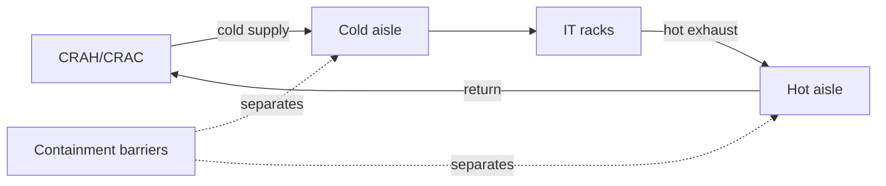

# Cooling Infrastructure

**Module ID:** `09-cooling`  
**Depth:** Standard (interview-ready)  
**Audience:** Career-changers with network/deploy experience who need facilities fluency  
**Est. study time:** 5–7 hours (including drills)

---

## Learning objectives

By the end of this module you can:

1. Distinguish **sensible heat** from **latent heat** and explain which one dominates IT loads.
2. Contrast **precision cooling** with **comfort cooling** and why office HVAC is the wrong tool for white space.
3. Describe **CRAC** vs **CRAH** units, chilled-water loops, and heat rejection to the outdoors.
4. Compare **raised-floor** and **non-raised / hard-floor** cooling strategies and when each is used.
5. Explain **hot-aisle / cold-aisle** layout and **containment** (CAC vs HAC) as airflow management tools.
6. Outline **liquid cooling** options at interview level: rear-door heat exchangers, direct-to-chip, immersion, and the role of a **CDU**.
7. Apply **ASHRAE**-style temperature/humidity envelopes conceptually (recommended vs allowable).
8. State what **STES / STER** (seasonal thermal energy storage) means as an efficiency concept.
9. Discuss why **AI / high-density** racks change the cooling conversation (kW/rack, liquid, failure blast radius).

---

## Why it matters

Cooling is the twin of power. Every watt delivered to IT becomes heat that must leave the building, or equipment fails. Interviewers (ops leads, design engineers, TPMs for infrastructure programs) use cooling questions to test whether you understand:

- **Availability:** A cooling outage can force load shed as fast as a power event. Thermal runaway in dense racks is measured in minutes, not hours.
- **Capacity planning:** “We have power headroom but no cooling headroom” is a common blocked expansion story.
- **Energy cost:** Cooling often consumes 20–40%+ of facility energy (site-dependent). Free cooling, setpoints, and containment are real PUE levers.
- **AI density:** Network-era thinking (5–10 kW/rack) fails at 40–100+ kW/rack. You must speak liquid and containment without hand-waving.
- **Cross-team translation:** Facilities owns plant; IT owns rack density and blanking panels. TPMs who can join those languages prevent expensive redesigns.

If you only remember one framing: **heat path = chip → air or liquid → room terminal units → plant → outdoors**. Anything that breaks that chain is a cooling incident.

---

## Core concepts

### Heat and the data centre job

**Heat** is energy transferred because of a temperature difference. IT equipment converts electrical energy almost entirely into heat. The cooling system’s job is continuous **heat removal** and **transport**, not “making the room cold” as a vibe.

Two important heat forms:

| Term | Definition | DC relevance |
|---|---|---|
| **Sensible heat** | Heat that changes **temperature** of air or equipment (no phase change of moisture) | **Dominant** IT load. Servers heat air; sensors show °C/°F rise. |
| **Latent heat** | Heat associated with **phase change** of moisture (evaporation/condensation) without the same kind of dry-bulb temperature change | Present when humidifying/dehumidifying. IT loads produce little moisture; people, doors, and outdoor air do. |

**Rule of thumb:** Treat white-space cooling as primarily **sensible**. Latent control still matters for static discharge, corrosion, and condensation risk—but do not design as if you were cooling a humid gym.

Related psychrometric vocabulary (definitions on first use):

- **Dry-bulb temperature:** Ordinary air temperature from a dry thermometer.
- **Relative humidity (RH):** Moisture content relative to saturation at that temperature (%).
- **Dew point:** Temperature at which moisture condenses from air. If cold surfaces (pipes, coils, floor tiles over cold plenum) are **below dew point**, you get condensation—water risk next to electricity.
- **Enthalpy:** Total heat content of moist air (sensible + latent). Used in free-cooling and economizer discussions.

### Precision cooling vs comfort cooling

| | **Comfort cooling** | **Precision cooling** |
|---|---|---|
| Designed for | People, offices, retail | Continuous high sensible IT loads |
| Sensible heat ratio | Lower (more latent capacity built in) | High (mostly dry cooling) |
| Runtime | Occupied hours, seasonal | 24×7, often N+1 or better |
| Temperature control | Wider bands, slow drift OK | Tight bands, high airflow |
| Humidity | Rough control | Active humidify/dehumidify when required |
| Examples | Building AHU, VRF office units | CRAC/CRAH, in-row coolers, RDHx |

**Misuse pattern:** Putting servers in a telecom closet with building comfort HVAC. It may “work” at low density until summer peak, filter clogging, or after-hours setback trips a thermal event.

### The cooling chain (air-cooled baseline)

1. **IT equipment** exhausts hot air (or transfers heat to a liquid cold plate).
2. **Room terminal units** (CRAC/CRAH, in-row, overhead) absorb heat into a refrigerant or water loop.
3. **Plant** (chillers, pumps, heat exchangers) moves heat toward outdoor rejection.
4. **Heat rejection** (cooling towers, dry coolers, condensers, radiators) dumps heat to ambient air or water bodies.
5. **Controls** (BMS/DCIM, unit controllers) modulate fans, valves, and compressors to hold setpoints.

```text
  [IT LOAD] --hot air--> [CRAH/CRAC] --CHW or DX--> [PLANT]
      ^                      |                           |
      |                      v                           v
  cold supply <---------- fans/coils              [Heat rejection
                                                   outdoor]
```

### CRAC vs CRAH

- **CRAC — Computer Room Air Conditioner:** Typically a **direct-expansion (DX)** unit. Refrigerant evaporates in the room coil; a compressor is part of the system (on unit or remote). Heat is rejected at a condenser (air-cooled outdoor, or water-cooled via condenser water).
- **CRAH — Computer Room Air Handler:** Usually a **chilled-water (CHW)** air handler. No compressor on the unit itself; a central **chiller** produces cold water that flows through the CRAH coil. Fans push air across the coil into the room or underfloor plenum.

**Interview shorthand:** CRAC ≈ local refrigerant cooling; CRAH ≈ fan+coil on a chilled-water plant. Large sites favor CRAH + central plant for efficiency and scale; smaller/edge sites often use DX CRAC or packaged units.

Other terminal types you should recognize:

- **In-row cooler:** Sits in the row; short air path, good for medium-high density.
- **Rear-door heat exchanger (RDHx):** Door-mounted coil on the rack rear; cools exhaust before it enters the room.
- **Overhead / close-coupled:** Ducted or open discharge above cold aisles.
- **CDU — Coolant Distribution Unit:** Pumps and heat-exchanges secondary (often facility water or dielectric loop) for liquid-cooled racks; isolates IT loop from primary plant.

### Raised-floor vs non-raised (hard-floor) cooling

**Raised floor (access floor):** A plenum under perforated tiles supplies cold air. CRAH/CRAC discharge into the underfloor; cold aisle tiles open; hot air returns high or via ceiling plenum.

Pros: classic cable + air dual use; familiar ops model.  
Cons: plenum leaks, cable dams, tile mismanagement, fire/air balancing complexity; declining preference for very high density without containment.

**Non-raised / slab / hard floor:** Air supplied from CRAHs, in-row units, or overhead; often with **containment**. Power and network run overhead.

Pros: better for high density + modular growth; no underfloor “mystery airflow.”  
Cons: needs disciplined aisle design and containment; overhead congestion if poorly planned.

Both can work. Modern high-density designs lean **hard floor + containment** (or liquid). Raised floor remains common in existing estates and some telecom/enterprise rooms.

### Airflow management and containment

**Hot aisle / cold aisle:** Racks face each other so fronts (intakes) share a cold aisle and rears (exhausts) share a hot aisle. Prevents immediate short-circuit of exhaust into the next rack’s intake.

**Bypass air:** Cold supply that never goes through IT (open tiles in wrong places, missing blanking panels). Wastes capacity.

**Recirculation:** Hot exhaust that re-enters intakes without being cooled. Causes high inlet temperatures and hotspots even when the room “average” looks fine.

**Containment:** Physical barriers that separate hot and cold streams.

| Type | Idea | Notes |
|---|---|---|
| **CAC — Cold Aisle Containment** | Enclose cold aisle; supply cold air into a sealed cold corridor | Protects inlet air; fire/egress codes matter |
| **HAC — Hot Aisle Containment** | Enclose hot aisle; exhaust to return or chimney | Keeps room ambient cooler for people/ops |
| **Chimney / ducted exhaust** | Rack exhaust ducts into ceiling plenum | Variant of hot-path control |
| **Full room flooded** | No tight aisle pairing | Only low density; avoid for modern IT |

**Blanking panels** fill empty RU spaces so exhaust cannot loop to the front inside the rack. Cheap, high ROI. Same spirit as closing cable cutouts and sealing floor penetrations.



### Temperature, humidity, and controls

Setpoints are a **policy + risk** choice, not a single magic number.

- **Higher cold-aisle setpoints** (within ASHRAE guidance) often save energy (chiller efficiency, free cooling hours) but leave less thermal buffer if cooling fails.
- **Overcooling** wastes energy, can push toward condensation if humidity is mismanaged, and is a common “we’ve always done 18°C” habit.
- **Humidity extremes:** Too dry → electrostatic discharge (ESD) risk; too wet → corrosion and condensation risk.
- **Sensors:** Measure **server inlet** (or cold-aisle) temperatures, not only wall thermostats far from the load. One bad average can hide a 35°C inlet hotspot.

**Controls stack:** Unit-level controllers + **BMS** (Building Management System) + often **DCIM** environmental maps. Redundant sensors and alarming on temperature rate-of-rise matter as much as absolute thresholds.

### ASHRAE envelopes (conceptual)

**ASHRAE** (American Society of Heating, Refrigerating and Air-Conditioning Engineers) publishes **Thermal Guidelines for Data Processing Environments** (TC 9.9). Facilities and OEMs use these envelopes when discussing “recommended” vs “allowable” conditions.

Conceptual model (always verify against the current published edition—numbers evolve):

- **Recommended** envelope: preferred long-term operating band for reliability and energy balance.
- **Allowable** classes (e.g. A1–A4 style classes in recent editions): wider bands equipment should tolerate for short periods or by class rating—**not** an invitation to run forever at the edge without OEM agreement.

What you must say in interviews:

1. Use **inlet air** conditions at the IT equipment, not “middle of room.”
2. Recommended is tighter; allowable is wider; class depends on equipment rating.
3. Humidity is often discussed via dew point / RH limits to manage ESD and condensation.
4. Raising setpoints is a **controlled** efficiency move after containment and airflow hygiene, not instead of them.

Do **not** memorize a single °C pair as eternal truth; cite “current ASHRAE TC 9.9 recommended/allowable envelopes” and confirm with the site’s ASHRAE class and OEM specs.

### Liquid cooling overview

Air has limited heat capacity and requires large volume flow. As rack density rises, liquid becomes attractive because liquids carry far more heat per unit volume.

| Approach | Mechanism | Typical use |
|---|---|---|
| **Air + containment** | Improved air path efficiency | Up to moderate-high density |
| **Rear-door HX** | Facility water cools exhaust at rack door | High density without full liquid-to-chip redesign |
| **Direct-to-chip (D2C)** | Cold plates on CPUs/GPUs; liquid loop | AI/HPC nodes; needs CDU, leak strategy |
| **Immersion (single-phase)** | Servers in dielectric fluid bath; fluid pumped to HX | Extreme density / specialized deployments |
| **Immersion (two-phase)** | Fluid boils at components; vapor condenses | Highest conceptual density; specialized ops |

**CDU** interfaces facility water (primary) and IT coolant (secondary), often with isolation HX so a facility water chemistry problem does not destroy servers.

**Leak detection:** Cable sensors, drip pans, automatic isolation valves, and procedures. Liquid near power is manageable with design—not with denial.

**Hybrid rooms:** Many AI halls mix air-cooled networking with liquid-cooled compute. Plan both heat paths.

### STES / STER awareness

**STES — Seasonal Thermal Energy Storage** (sometimes discussed in training outlines as **STER / seasonal thermal energy storage** concepts): store thermal energy (coolth or heat) across seasons in a medium such as aquifer, borefield (ground heat exchanger), or large water tanks, then use it later to reduce chiller load or enable free cooling.

Interview level—not PE design:

- Climate- and geology-dependent; not universal.
- Ties to sustainability, peak shaving, and free-cooling strategy.
- Distinct from short-term thermal mass (building slab, small buffer tanks).
- If asked: “Seasonal storage of cooling or heating energy to improve annual efficiency where site conditions allow.”

Spelling note: course outlines may say **STER** or **STES**; industry literature more often uses **STES**. Know the idea, not the acronym fight.

### AI density cooling challenges

Traditional enterprise: ~5–15 kW/rack. AI training/inference racks: **tens to 100+ kW/rack** depending on generation and liquid assist.

Challenges:

1. **Air only may be insufficient** at the top end—even with perfect containment.
2. **Hotspots** form faster; fewer minutes to critical temperature after loss of cooling.
3. **Power and cooling must be co-designed**—you cannot add GPUs first and “find cooling later.”
4. **Blast radius:** One CDU or row-level failure can threaten an expensive pod; redundancy models change.
5. **Retrofit pain:** Legacy raised-floor CRAC rooms struggle; liquid retrofit needs structural, water, leak, and ops program changes.
6. **WUE and water:** Evaporative heat rejection may conflict with water constraints; dry coolers trade water for energy/noise/land.
7. **Network gear** may remain air-cooled beside liquid compute—mixed environments need clear air management still.

TPM language: density is a **facility product constraint**. The roadmap for GPU fleets is a cooling roadmap.

---

## Key diagrams

### Cooling loop (chilled water + CRAH)

```text
 Outdoor heat rejection          Indoor white space
 -------------------------       -------------------------
 [Cooling tower / dry cooler]
           ^
           | condenser water
      [Chiller]
           |
      chilled water supply
           v
      [Pumps / headers] -----> [CRAH coils] --cold air--> cold aisle --> racks
           ^                         |
           |                         +-- hot return air
      chilled water return <---------+
```

### Raised-floor supply path

```text
  CRAH fan
     |
     v
  underfloor plenum ===== perforated tiles =====> cold aisle
  (seal leaks!)                |                    |
                               |                    v
                          cable dams            rack intakes
                          kill airflow             |
                                                   v
                                              hot aisle --> return
```

### Liquid-cooled rack sketch

```text
  Facility water --> [ CDU ] --> secondary coolant --> cold plates / RDHx
                        |                                  |
                        +------ heat exchange <-------------+
                        |
                   heat to plant / dry cooler
```

---

## Formulas / rules of thumb

These are **planning heuristics**, not substitutes for engineered heat-load calculations.

1. **Heat ≈ power:** Steady-state, IT electrical kW ≈ heat kW to remove (plus UPS/PDU and lighting losses that also become heat).
2. **1 kW ≈ 3,412 BTU/h** (conversion awareness for mixed US/metric docs).
3. **Air ΔT and flow:** More heat or less airflow → larger temperature rise across the rack.  
   Rough air-side relation often taught: heat removal scales with **mass flow × specific heat × ΔT**. If fans cannot move enough air, ΔT explodes → hotspots.
4. **Tons of cooling:** 1 refrigeration ton ≈ 3.5 kW heat removal (≈12,000 BTU/h). Handy when reading older capacity sheets.
5. **Containment before tons:** Fix bypass/recirculation before buying more CRAC capacity. Many “lack of cooling” tickets are **air management** failures.
6. **Redundancy language:** N, N+1, 2N apply to CRAHs, chillers, pumps, towers—not only UPS. Cooling often needs concurrent maintainability like power.
7. **Thermal ride-through:** After power loss, UPS may keep IT alive while chilled-water inertia and generator start matter—but **fans and pumps** must return quickly. Flywheels/short UPS on CRAH fans exist in some designs.
8. **Density bands (order of magnitude only):**  
   - Low: &lt;5 kW/rack — flooded room possible  
   - Medium: ~5–15 kW — hot/cold aisle + good sealing  
   - High: ~15–40 kW — containment, close-coupled, RDHx  
   - Extreme / AI: 40–100+ kW — liquid-dominant strategies  

   Always validate with actual equipment and site CFD/engineering.

9. **PUE link:** Improving cooling efficiency (free cooling, higher setpoints, VFD fans, containment) often moves facility PUE more than swapping a few servers.

---

## Common failure modes and misconceptions

| Failure / myth | Reality |
|---|---|
| “Room is 22°C so we’re fine” | Averages hide inlet hotspots. Measure at **rack inlet**. |
| More CRAC units fix heat | Without airflow discipline, new units fight each other (simultaneous heat/cool, fighting humidifiers). |
| Comfort HVAC is “good enough” | Wrong sensible ratio, wrong runtime, wrong filtration and control. |
| Raised floor always best | Often legacy. High density prefers containment / hard floor / liquid. |
| Cold = safe | Overcooling wastes energy; condensation risk if dew point ignored. |
| Humidity “doesn’t matter for servers” | ESD and corrosion are real; so is condensation on cold coils/pipes. |
| Liquid cooling = immersion only | RDHx and direct-to-chip are far more common stepping stones. |
| Cooling is facilities-only | Blanking panels, cable management, and rack layout are IT/ops hygiene with facility impact. |
| Generators up = cooling up | Chillers, towers, and pumps must sequence correctly; black-start of cooling plant is a designed procedure. |
| “AI is just denser air” | At some kW/rack, physics forces liquid or specialized close-coupled solutions. |

**Operational classics:** clogged filters, stuck economizer dampers, control sensor calibration drift, open containment doors, missing tiles, underfloor blocked by copper “spaghetti,” simultaneous humidify and dehumidify across units, VFD set wrong, cooling tower basin/biological issues, low condenser water flow.

---

## Interview drills

### 1) Sensible vs latent—why do TPMs care?

**Q:** “What’s the difference between sensible and latent heat in a data centre?”  
**A:** Sensible heat changes temperature and is essentially the entire IT electrical load turning into heat. Latent heat relates to moisture phase change—humidification/dehumidification. Precision cooling is built for high sensible loads; if we oversize latent capacity or mismanage RH, we waste energy and can create condensation or ESD risk. I care because capacity, setpoints, and unit selection all assume a high sensible heat ratio.

### 2) CRAC vs CRAH

**Q:** “CRAC or CRAH—what’s the difference?”  
**A:** A CRAC is typically DX/refrigerant-based with compressors in the cooling path. A CRAH is a chilled-water air handler; compressors live at the central chiller. Large campuses usually prefer CRAH + plant for efficiency and maintainability; edge rooms often use packaged CRAC/DX.

### 3) Containment vs more tons

**Q:** “We’re hot in the cold aisle—buy more CRACs or contain?”  
**A:** First fix airflow: blanking panels, seal bypass, verify tile openings, check for recirculation, then containment. Adding tons into a leaky airflow design often yields fighting units and poor PUE. After air is disciplined, re-check actual sensible load vs installed capacity and redundancy.

### 4) ASHRAE envelopes

**Q:** “What does ASHRAE mean for white-space environment?”  
**A:** ASHRAE TC 9.9 thermal guidelines define recommended and allowable inlet environmental envelopes by equipment class. We control to recommended for steady operations, understand allowable as wider tolerance, and always align with OEM ratings. I use inlet metrics, not room averages, and I treat dew point/RH as condensation and ESD controls.

### 5) AI density

**Q:** “How does liquid cooling change the facilities conversation for AI racks?”  
**A:** Density jumps from ~10 kW/rack air problems to 40–100+ kW problems where air volume and ΔT become impractical. We introduce CDUs, secondary loops, leak detection, water quality, and different maintenance skills. Power and cooling must be co-planned; failure domains shrink in time-to-critical. Networking may stay air-cooled, so hybrid halls still need containment discipline.

---

## Self-check quiz

1. **Most IT load heat is:**  
   a) Latent  
   b) Sensible  
   c) Radiant only  
   d) Stored in batteries

2. **A CRAH typically cools air using:**  
   a) Only free outdoor air with no coil  
   b) A chilled-water coil fed by a chiller plant  
   c) Diesel combustion  
   d) Hot-aisle heaters

3. **Precision cooling differs from comfort cooling mainly because it:**  
   a) Runs only during business hours  
   b) Targets high sensible, continuous IT loads with tighter control  
   c) Ignores humidity entirely  
   d) Cannot use chilled water

4. **Cold aisle containment primarily:**  
   a) Heats generators  
   b) Separates supply air so rack inlets see managed cold air  
   c) Removes the need for CRAHs  
   d) Replaces fire detection

5. **Dew point matters because:**  
   a) It sets UPS runtime  
   b) Surfaces colder than dew point can condense water  
   c) It is identical to dry-bulb  
   d) It only applies outdoors

6. **A CDU is best described as:**  
   a) A copper data unit for fiber  
   b) A coolant distribution unit interfacing facility water and IT liquid loops  
   c) A type of raised-floor tile  
   d) A fire extinguisher class

7. **STES / seasonal thermal storage is:**  
   a) Mandatory in all Tier IV sites  
   b) Storing thermal energy across seasons to improve efficiency where viable  
   c) A brand of CRAC  
   d) The same as a 5-minute buffer tank only

8. **First response to rack inlet hotspots with spare CRAH capacity is often:**  
   a) Immediately lower chiller setpoints by 10°C  
   b) Airflow management: blanking, sealing, containment, tile discipline  
   c) Disable humidity control forever  
   d) Remove all perforated tiles

### Answers

<details>
<summary>Click to reveal answers</summary>

1. **b** — Sensible (temperature-driving) heat dominates IT loads.  
2. **b** — CRAH = chilled-water air handler.  
3. **b** — High sensible, 24×7 precision control.  
4. **b** — Isolates/manages cold supply path to inlets.  
5. **b** — Condensation risk when surface T &lt; dew point.  
6. **b** — Coolant Distribution Unit for liquid cooling loops.  
7. **b** — Seasonal thermal energy storage concept.  
8. **b** — Fix bypass/recirculation before brute-force overcooling.

</details>

---

## Further free resources

Public standards, guidelines, and primers (no paywalled EPI courseware):

| Resource | Why read it |
|---|---|
| **ASHRAE TC 9.9** — *Thermal Guidelines for Data Processing Environments* (purchase/summary articles; vendor explainers of recommended vs allowable) | Authoritative thermal envelopes language |
| **ASHRAE** handbooks / free overview articles on data center cooling | Psychrometrics, free cooling concepts |
| **ISO/IEC 22237** / **EN 50600** series overviews (national body summaries) | Facility design framework context |
| **ANSI/TIA-942** public overviews | Where environmental and architectural requirements sit relative to rating language |
| **Uptime Institute** public papers on cooling, PUE, and concurrent maintainability (free blogs/webinars vary) | Ops and tier *thinking* (commercial rating ≠ code) |
| **DOE / LBNL / Energy Star** data center energy resources | Free cooling, airflow management, PUE |
| **Open Compute Project (OCP)** advanced cooling / liquid cooling project docs | Hyperscale liquid practices at public detail |
| **Vendor primers (conceptual):** Schneider Electric Data Center Science Center, Vertiv, Stulz, Munters, CoolIT, Motivair application notes | CRAC/CRAH, containment, RDHx, CDU explainers |
| **EPA / local water authority** guidance on cooling towers and water use | WUE and treatment context (pair with Module 10) |

**Study tip:** After this module, walk any real or colo white space and narrate: cold path, hot path, terminal units, plant, heat rejection, sensors, and what fails first at your rack density. If you cannot point to the heat path end-to-end, re-read the core concepts section.

**Links to adjacent modules:** Power (M6) co-design; Raised floor (M4) plenum behavior; Water (M10) makeup and towers; Racks (M8) blanking and airflow; Fire (M12) interaction with containment; Auxiliary/BMS (M14) monitoring points.
