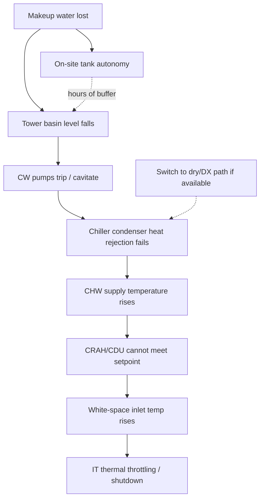

# Water Supply

**Module ID:** `10-water`  
**Domain:** Water Supply (CDCP-aligned self-study)  
**Depth:** Standard (interview-ready)  
**Prerequisites:** Module 09 — Cooling Infrastructure (chilled water, towers, CRAH/CRAC, free cooling)  
**Est. study time:** ~1–1.5 hours

---

## Learning objectives

By the end of this module you can:

1. Explain **why water is a mission-critical utility** in many data centres—not “just for bathrooms.”
2. Map **where water enters the cooling plant** (makeup, blowdown, humidification, heat rejection) and what fails if it stops.
3. Distinguish **process water** (cooling/humidification) from **potable / domestic** and from **fire water**, and why they are often separate systems.
4. Describe **backup water supply techniques** (storage tanks, dual municipal feeds, wells, reclaimed water, prioritization) and when each is realistic.
5. Connect water risk to **availability**, **WUE** (water usage effectiveness), and design choices that **minimize or eliminate** on-site water use.
6. Answer interview questions on municipal outages, boil-water notices, cooling-tower chemistry, and “dry” vs evaporative cooling trade-offs.

---

## Why it matters (ops/design/TPM interview angle)

If you come from **network deploy**, you already treat diverse fiber and dual power as non-negotiable. **Water is the same class of dependency for many cooling designs**—just less visible until the city main breaks or the tower basin runs dry.

**Ops angle.** A multi-hour municipal water outage can force evaporative cooling plants into **capacity derate or shutdown** long before UPS batteries are relevant. Ops must know: which systems need continuous makeup, how many hours of on-site storage exist, what load you can support on dry coolers / DX backup, and who to call (facilities, city utilities, chemical vendor).

**Design / capacity angle.** Designers choose among:

- **Water-intensive** heat rejection (open cooling towers, adiabatic/evaporative free cooling) → excellent energy efficiency in many climates, higher **WUE** and municipal dependency.
- **Water-light / waterless** (air-cooled chillers, dry coolers, DX) → higher electrical load / different climate limits, lower water risk.

That choice is a **business continuity and sustainability** decision, not only a PUE decision.

**Siting-permission answer, with a boundary check.** A non-evaporative closed-loop heat-rejection design (for example, a liquid loop rejecting to a dry cooler) can reduce dependence on evaporative makeup water, so it may change a water-availability question in site selection. It is not an automatic permit and it is not proof of zero site water. The [U.S. Department of Energy FEMP cooling-water guidance](https://www.energy.gov/cmei/femp/cooling-water-efficiency-opportunities-federal-data-centers) distinguishes evaporative tower losses from the closed loop on the IT side; the [NREL ESIF 2018 report](https://www.nrel.gov/docs/fy19osti/73025.pdf) documents a project-specific thermosyphon dry-cooling design; and the [EPA Quincy case study](https://www.epa.gov/waterreuse/water-reuse-case-study-quincy-washington) shows that even a closed-loop water-reuse system still had makeup-water, water-rights, discharge, and permit interfaces. Use [ISO/IEC 30134-9:2022](https://www.iso.org/standard/77692.html) for the WUE measurement boundary, not for an invented benchmark. M10 should name every remaining interface (fill or makeup, humidification, fire and domestic water, discharge, chemistry, and local approvals) and hand site water-rights questions to M03.

**TPM / program angle.** When you site a colo, negotiate an SLA, or plan an AI hall expansion, ask: *Is the cooling plant water-dependent? How many hours of makeup storage? Dual feed? Tower chemistry program? Fire water separate?* Interviewers use water questions to test whether you understand **MEP (mechanical, electrical, plumbing)** coupling—not just racks and switches.

**Link to unavailability.** Water is often the **hidden input** to cooling capacity. Losing makeup looks like a “cooling failure” on the ticket because that is the Module 09 cascade: basin empty → condenser heat rejection gone → CHW supply rising → white-space inlet climbing. The municipal cut, empty tank, chemistry trip, and missing runbook are **contributing factors, plural** (Module 15) — never “root cause” singular. At GW-scale AI campuses the same dependency is also **water rights and AHJ politics**, not only a broken main; **facility water on a W-class liquid loop** and **tower makeup** are two different water problems (W-classes stay in Module 09).

---

## Core concepts

### 1. Why water matters in a data centre

Water appears in several **independent** roles. Name them separately in interviews:

| Role | Typical use | Continuous makeup needed? | Notes |
|---|---|---|---|
| **Heat rejection (evaporative)** | Open cooling towers, evaporative condensers, some adiabatic coolers | Yes (evaporation + blowdown) | Largest ongoing process water consumer in many campuses |
| **Chilled-water loop makeup** | Closed CHW / condenser loops lose volume to leaks, maintenance | Small continuous / occasional | Closed loops still need fill water and quality control |
| **Humidification** | Steam or evaporative humidifiers for white-space RH control | Intermittent | More critical in dry climates and with high air-change rates |
| **Fire protection** | Wet pipe, pre-action, water mist, hydrants, tanks | Standby storage + reliable refill | Usually **separate** from process water; governed by fire code / AHJ |
| **Domestic / potable** | Restrooms, kitchens, eye wash, janitorial | Low for IT load | Still life-safety and occupancy-related |
| **Special systems** | Battery rooms (some), wash-down, construction | Varies | Project-specific |

**Key idea:** IT equipment does not “run on water,” but **many cooling plants do**. If your site uses evaporative heat rejection, **water availability ≈ cooling capacity over multi-hour horizons**.

**WUE — Water Usage Effectiveness.** Industry metric (popularized alongside PUE via The Green Grid and related industry guidance): roughly **annual site water use ÷ IT energy use** (units often L/kWh). Lower is better for water intensity. Useful for comparing designs and reporting sustainability; does **not** replace availability engineering. Pair with local water stress context (arid region vs abundant surface water).

### 2. Cooling plant dependency (how water keeps chillers alive)

Recall from Module 09: heat must leave the building. A common large-plant path:

1. **IT load** → CRAH/CRAC or liquid cooling CDU rejects heat into a **chilled water (CHW)** loop.  
2. **Chillers** cool the CHW by rejecting heat to a **condenser water (CW)** loop or to air-cooled condensers.  
3. **Open cooling towers** reject heat from condenser water to outdoor air by **evaporation** (and some sensible heat transfer).

**Makeup water** replaces water lost to:

- **Evaporation** — primary heat-rejection mechanism; water leaves as vapor (heat of vaporization carries heat away).
- **Blowdown (or bleed)** — intentional discharge of concentrated basin water so dissolved solids do not scale and foul heat-exchange surfaces.
- **Drift** — fine droplets carried out with tower exhaust (modern drift eliminators keep this small).
- **Leaks / maintenance drains**.

Without makeup, the **tower basin level drops**. Low level → pumps cavitate or interlock off → condenser heat rejection fails → chiller high-head / high-pressure trip → CHW supply temperature rises → white-space inlet temperatures climb → IT thermal shutdown risk.

**Closed-loop systems** (e.g. dry coolers, air-cooled chillers, sealed glycol loops) need **little ongoing water** but still need **fill water quality**, freeze protection, and leak response. They shift risk from municipal water continuity to **electrical capacity and ambient wet-/dry-bulb limits**.

**Hydronic leak — immediate sequence.** A zone leak alarm at a CRAC/CRAH hydronic connection (a slow packing drip, not a ruptured pipe) is still an electrical and IT-plant hazard. The immediate sequence is:

1. **Contain and isolate** the leak (stop the source from feeding the drip; catch what is already out).
2. **Protect nearby electrical and IT assets** (power, cable, and equipment in the splash/drip path).
3. **Notify the response chain** (do not wait for Monday staffing).
4. **Document** what was found and what was done.

Deferring a “small” weekend drip is the realistic wrong choice: packing leaks worsen unattended, and the risk is electrical continuity, not waiting until the puddle is impressive. Do not use CRAH airflow as an evaporator while the valve stays in service, and do not discharge fire pre-action water as a cleanup tool.

**Humidification dependency.** ASHRAE thermal guidelines (TC 9.9 family—use current published envelopes for design) address temperature and humidity ranges for IT equipment. Very low RH raises ESD risk and can affect some media/tape environments; very high RH raises condensation risk. Sites that actively humidify depend on **treated water** (often reverse osmosis / deionized for steam canisters—mineralized water scales equipment). A boil-water notice or dirty feed can foul humidifiers even when cooling towers still run.

**Water quality (process), not just quantity.** Cooling towers concentrate minerals. Control programs manage:

- **Cycles of concentration** — how much evaporation is allowed before blowdown.  
- **Scaling** (hardness, silica), **corrosion**, **biological growth** (including Legionella risk in open systems—public health / OSHA / local health codes matter).  
- **Filtration and chemical feed** (biocides, inhibitors) — continuous ops discipline.

Poor quality → fouled fill and heat exchangers → **loss of thermal capacity at the same water flow**—another “invisible” derate.

### 3. Backup water supply techniques

Treat backup water like backup power: **define autonomy (hours), quality, path diversity, and test regimen.**

**A. On-site storage tanks**

- Elevated or ground tanks (and sometimes basements) hold **process makeup**, **fire water**, or both (usually **not** shared without careful design and code review).  
- Size for **hours of full evaporative load** under design outdoor conditions—not average day.  
- Include level sensors, low-level alarms to BMS/DCIM, fill automation, and **turnover / treatment** so stored water does not stagnate.  
- Fire tanks/pumps follow **NFPA** (e.g. NFPA 13/20 concepts for sprinklers/pumps—region-specific codes apply) and AHJ rules; do not repurpose fire water for towers without explicit design intent.

**B. Dual / diverse municipal feeds**

- Two service connections from **different mains or pressure zones** reduce single-cut street work risk.  
- Still fails on **city-wide** drought restrictions, major contamination events, or shared upstream treatment plant outages.  
- Verify **hydraulic capacity** of each feed at peak simultaneous demand (process + fire + domestic)—diversity on paper is useless if both feeds are undersized.

**C. Wells and groundwater**

- Independent of street mains where hydrogeology and permits allow.  
- Requires pumps (often on generator-backed power), water rights, quality treatment, and environmental compliance.  
- Drought and aquifer limits still apply; not universal.

**D. Reclaimed / non-potable / industrial water**

- Treated wastewater or industrial grey water for towers where **local code and chemistry** allow.  
- Improves sustainability story and can reduce potable demand; needs robust filtration and monitoring.  
- Not a free pass on storage—plant upsets still happen.

**E. Operational prioritization and load management**

- Document which loads get water first: **fire life-safety** → **critical cooling makeup** → humidification → domestic non-essential.  
- Pair with **IT load shed / thermal ride-through** plans: what inlet temperature / time window can you tolerate?  
- Some sites switch heat rejection to **dry mode / DX / air-cooled chillers** (if installed) during water emergencies—know the **nameplate derate** at high ambient.

**F. Design-out dependency (strategic backup)**

- Air-cooled chillers, dry coolers, rear-door HX with dry rejection, immersion with dry CDUs—**reduce makeup demand toward zero** for normal operation.  
- Trade-off: often higher **PUE** or limited free-cooling hours; may still use water for humidification or adiabatic assist in heat waves.  
- Hyperscale and water-stressed regions increasingly publish water-positive / low-WUE design goals—know the trend even if your site is tower-based.

**G. Temporary / emergency logistics**

- Tanker truck contracts, portable tanks, mutual aid—useful for **planned main work** or short crises; poor as sole strategy for continuous tower makeup at scale (volume and fill rate).  
- Validate **connection fittings**, chemical compatibility, and security for temporary hoses.

### 4. Related facility terms (define-once glossary)

- **Makeup water** — water added to replace process losses.  
- **Blowdown / bleed** — intentional drain to control dissolved solids.  
- **Basin** — tower sump holding condenser water.  
- **CHW / CW** — chilled water / condenser water.  
- **Open vs closed loop** — open contacts air (towers); closed is sealed from atmosphere (mostly).  
- **AHJ** — Authority Having Jurisdiction (fire marshal, building official, etc.).  
- **BMS** — Building Management System (often monitors tank levels, valve positions, water meters).  
- **Legionella control program** — risk management for aerosolizing water systems (public-health driven).  
- **Potable vs process water** — drinking-quality vs industrial use streams; cross-connection control (backflow preventers) is mandatory where they interface.

### 5. Standards and guidance (public names—not exam banks)

Use **primary documents by name** when you need authoritative detail; editions and local adoption vary:

- **ASHRAE** thermal guidelines for data processing environments (TC 9.9); ASHRAE handbooks for HVAC/towers.  
- **The Green Grid** — PUE, WUE metric definitions and white papers.  
- **NFPA** standards family for water-based fire protection and pumps (where used).  
- **Local plumbing codes**, **cross-connection / backflow** rules, health department cooling-tower registration (many cities require tower registration and sampling).  
- **ISO/IEC** data centre facility standards families and **EN** European norms as regional context (pair with local code).  
- **TIA-942** addresses facility rating concepts at a site level—water is part of supporting infrastructure reliability thinking, not a substitute for mechanical design standards.

If you are unsure of an exact code section for a jurisdiction, **say so and escalate to a licensed MEP/fire professional**—literacy is the goal, not unlicensed design.

---

## Key diagrams

### A. Where water supports cooling (conceptual)

```text
                    MUNICIPAL / WELL / RECLAIMED
                              |
                     [ backflow prevention ]
                              |
              +---------------+----------------+
              |               |                |
         PROCESS MAKEUP   DOMESTIC         FIRE WATER
              |           (potable)         (often tank)
              v
     +------------------+
     | Cooling tower    |---- evaporation + drift ----> atmosphere
     | basin + pumps    |---- blowdown ---------------> drain / treatment
     +--------+---------+
              | condenser water
              v
         [ Chillers ] ---- chilled water ----> CRAH / CDU / process
              |
         heat from IT load (via white space)
```

### B. Failure cascade (water outage → IT risk)



### C. Backup water options (decision sketch)

```text
                    Need continuous evaporative rejection?
                              |
              yes ------------+------------ no
               |                            |
    Storage hours + dual feed          Air-cooled / dry design
    (+ well/reclaim if viable)         (water risk mostly humidification
               |                        + domestic + fire)
               v
    Document: autonomy, quality, power to pumps,
    blowdown path, tanker plan, load shed curve
```

---

## Formulas / rules of thumb

These are **order-of-magnitude ops/design intuition**, not substitutes for engineered heat-balance calculations.

1. **Evaporation scales with heat rejected.** Rough classic thumb-rule often cited in HVAC training: on the order of **~1–3 m³ of water evaporated per MWh of heat rejected** depending on conditions and how much heat is rejected evaporatively vs sensibly—**verify with plant data** (make-up meter vs IT kWh and weather). Use site meters, not memorized constants, for real capacity planning.

2. **Blowdown depends on cycles of concentration (CoC).**  
   Higher CoC → less blowdown water → more risk of scale if chemistry is wrong.  
   Conceptual: blowdown fraction falls as CoC rises; chemistry program sets safe CoC.

3. **Tank autonomy (hours)**  
   \[
   t_{\text{hours}} \approx \frac{V_{\text{usable tank}}}{\dot{V}_{\text{makeup at design load}}}
   \]  
   Use **design-day** makeup rate, not annual average. Usable volume excludes sediment heel and low-level pump NPSH margins.

4. **WUE (conceptual)**  
   \[
   \text{WUE} \approx \frac{\text{Annual site water (L)}}{\text{Annual IT energy (kWh)}}
   \]  
   Compare like-for-like (same boundary: source water vs including energy-water upstream—be explicit).

5. **Closed-loop ≠ zero risk.** Small makeup still required; a major CHW leak can empty a buffer tank quickly. Detection matters, and the immediate response is contain/isolate, protect nearby electrical/IT, notify, and document—not “leave it until Monday.”

6. **Fire water is not free cooling water.** Code, pressure, and cleanliness requirements differ; never assume cross-use.

---

## Common failure modes and misconceptions

| Failure / misconception | Reality |
|---|---|
| “We have UPS, so water outages don’t matter.” | UPS covers **power**, not heat rejection water. Thermal ride-through is minutes to low tens of minutes without cooling—not hours—unless designed otherwise. |
| “Closed chilled-water loop means no water dependency.” | True for **ongoing evaporation** if heat rejection is dry; false if you still have open towers on the condenser side. |
| “Dual city feeds = invulnerable.” | Shared upstream treatment or drought restrictions can hit both. |
| “Bigger tower = more safety.” | Without makeup, basin volume only buys **time**. Capacity and autonomy are different. |
| Ignoring water **quality** | Scaling/biofouling derates the plant while “flow looks normal.” |
| Using fire tanks for process makeup casually | Often illegal/unsafe without engineered dual-purpose design and AHJ approval. |
| No low-level alarming / no runbook | Operators discover empty basins after chillers trip—too late. |
| “Small packing drip, IT still up — wait until Monday.” | Contain and isolate, protect nearby electrical/IT, notify, document. Packing leaks worsen unattended; the hazard is electrical, not volumetric. |
| Humidifier scale after water event | Boil-water / turbidity events foul RO and canisters; track water incidents in change log. |
| “Liquid-cooled IT removes water risk.” | Liquid cooling moves heat to a CDU/plant; the **plant** may still be evaporative. Ask where heat ultimately goes. |
| Confusing WUE optimization with availability | Zero water use can still fail on power or dry-cooler ambient limits. Optimize both dimensions. |

---

## Interview drills

**Q1. Why does water matter in a data centre if servers don’t consume water?**  
**A:** Servers reject heat. Many plants reject that heat with **evaporative cooling towers** that continuously need **makeup water**. Lose makeup long enough and condenser water systems trip, chillers stop cooling, and white-space temperatures rise. Water also supports humidification, domestic needs, and often **fire protection** storage—separate but critical systems.

**Q2. Walk through what happens if municipal water fails for eight hours at a tower-based site.**  
**A:** Basin level falls as evaporation and blowdown continue. On-site **storage autonomy** determines when low-level alarms and pump/chiller interlocks occur. If tanks are undersized and there is no dry heat-rejection path, CHW temperatures rise and you enter thermal emergency procedures (raise setpoints carefully, shed IT load, emergency tankers if contracted). Dual feeds only help if the outage is not city-wide. After restoration, check chemistry and strainer/filter condition before returning to full CoC.

**Q3. City issues a boil-water notice. What in the DC “cares”?**  
**A:** **Potable** uses and any process streams without adequate treatment. Cooling towers often use non-potable process water but still care about **turbidity, biological load, and chemical control**. Humidifiers and steam systems with RO/DI pre-treatment may foul or require service. Domestic sinks/eyewash policies change. Fire water is usually stored/separate—follow fire protection SOP. Log the event for audit and equipment health.

**Q4. Name three backup water techniques and one limitation of each.**  
**A:** (1) **On-site tanks**—finite hours, need treatment/turnover and pump power. (2) **Dual municipal feeds**—fails on shared upstream or drought. (3) **Wells**—permits, aquifer limits, pump power. Bonus: **reclaimed water** (plant quality variability); **tanker trucks** (logistics/rate limits); **design-out** with dry coolers (energy/ambient trade-offs).

**Q5. How do you explain water vs energy trade-offs to a non-technical executive?**  
**A:** Evaporative plants often use **less electricity** for the same cooling in suitable climates but **consume water** and depend on the city (or wells). Dry plants use **more electricity** or have climate limits but cut water risk and WUE. The right answer depends on **local water stress, power cost/carbon, climate, and SLA**. Report both **PUE-class energy metrics and WUE**, plus **hours of water autonomy** as a resilience KPI.

---

## Self-check quiz

1. **Primary reason large tower-based DCs continuously consume water:**  
   a) Servers spray-cool CPUs  
   b) Evaporation (and blowdown) at heat-rejection equipment  
   c) Fiber optic cleaning  
   d) Raised-floor humidification only  

2. **Makeup water mainly replaces losses from:**  
   a) Only pump seal leaks  
   b) Evaporation, blowdown, drift, and leaks  
   c) UPS battery watering  
   d) Condensate from every CRAH only  

3. **WUE is best described as:**  
   a) Water used per unit of IT energy over time  
   b) Watts per square foot  
   c) Same as PUE  
   d) Fire-pump pressure  

4. **A closed chilled-water loop with open cooling towers:**  
   a) Has zero water risk  
   b) Still depends on tower makeup for heat rejection  
   c) Never needs water treatment  
   d) Cannot support CRAHs  

5. **Strongest statement about dual municipal water feeds:**  
   a) Guarantee 100% availability  
   b) Reduce single-main cut risk but not all city-level failures  
   c) Replace the need for fire tanks  
   d) Eliminate blowdown  

6. **On-site process water tanks should be sized primarily against:**  
   a) Average night load only  
   b) Design-load makeup rate and desired autonomy hours  
   c) Number of racks × 1 liter  
   d) Generator fuel hours only  

7. **Boil-water notices are most likely to affect:**  
   a) Dark fiber latency  
   b) Potable uses and sensitive water-treatment / humidifier trains  
   c) BGP convergence  
   d) Transformer oil level  

8. **Designing with air-cooled chillers / dry coolers primarily reduces:**  
   a) Need for any electrical power  
   b) Ongoing evaporative makeup dependency  
   c) Need for fire detection  
   d) Network diversity requirements  

### Answers

<details>
<summary>Click to reveal answers</summary>

1. **b** — Evaporative heat rejection drives ongoing makeup (plus blowdown).  
2. **b** — Evaporation, blowdown, drift, leaks.  
3. **a** — Water intensity metric vs IT energy (boundary definitions matter).  
4. **b** — Condenser side towers still need makeup.  
5. **b** — Path diversity, not omniscience.  
6. **b** — Usable volume ÷ design makeup rate ≈ hours.  
7. **b** — Potable policy + treatment/humidifier fouling risk.  
8. **b** — Shifts away from continuous process water (trade energy/climate limits).

</details>

---

## Further free resources

**Standards & industry bodies (public pages / purchasable standards by name):**

- **ASHRAE TC 9.9** — thermal guidelines for data processing environments; ASHRAE educational materials on cooling plants and towers.  
- **The Green Grid** — free/public white papers on **PUE**, **WUE**, and data centre metrics.  
- **NFPA** — public overviews of water-based fire protection concepts; full standards are published documents (fire design is licensed work).  
- **U.S. EPA / local environmental agencies** — cooling tower chemistry, drift, and water efficiency guidance (jurisdiction-specific).  
- **OSHA / CDC** (and local health departments) — Legionella and building water system risk awareness.  
- **ISO/IEC** data centre facilities standards family and **EN 50600** series — facility infrastructure context (obtain via standards bodies).  
- **ANSI/TIA-942** — data centre infrastructure rating/concepts at site level (purchase via TIA; use official summaries carefully).  
- Manufacturer **application guides** (cooling tower, chiller, CRAH vendors) — free engineering handbooks on makeup, basins, and free cooling (treat as vendor education, not code).

**Study tips:**

- On your next site tour, find: **water service entrance, backflow preventers, process tanks, tower basins, water meters, chemical feed skids, fire tanks/pumps.** Ask for **makeup autonomy hours** and whether heat rejection can run **dry**.  
- Pair this module with **09-cooling** (plant types) and **12-fire-protection** (water-based suppression is a different system with different rules).

---

*Educational reconstruction for self-study. Not EPI®/EXIN courseware; not a certification. For credentials, take authorized training and exams. When designing or modifying real systems, use licensed MEP/fire professionals and the AHJ.*
