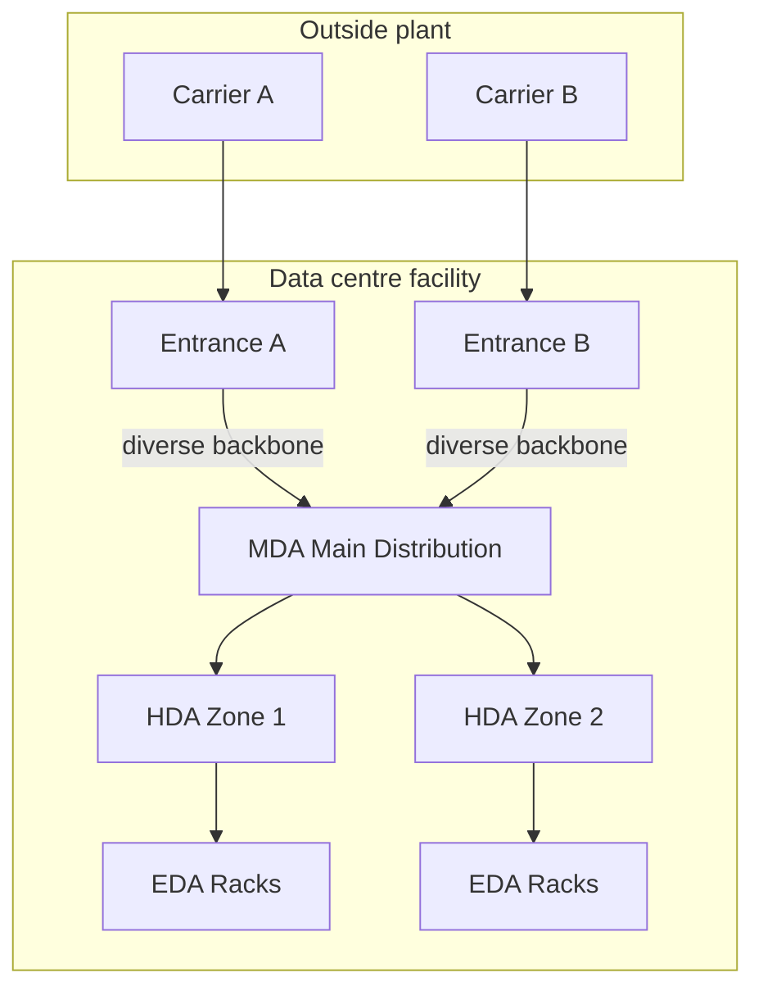

# Scalable Network and Cabling Infrastructure

**Module ID:** `11-network`  
**Public CDCP domain:** Designing a Scalable Network Infrastructure  
**Depth:** standard · **Est. study time:** 3–4 hours

---

## Learning objectives

By the end of this module you can:

1. Explain why **structured cabling** is a multi-decade facility asset, not a one-time “network install.”
2. Compare **copper** and **fibre** (multimode / single-mode) for reach, bandwidth, density, and cost trade-offs.
3. Describe **TIA-942-style cabling topology** at conceptual level: spaces (entrance, MDA, HDA, EDA, optional ZDA), hierarchical distribution, and pathway redundancy — as previewed in Module 01; this module is the home.
4. List **testing and verification** basics: certification vs qualification, copper parameters, optical loss/polarity, labeling, and as-builts.
5. Design for **network redundancy**: dual paths, dual carriers, dual meet-me / carrier entry, and logical diversity that actually maps to physical diversity.
6. Relate **building connectivity** (campus, metro, dark fibre, waves, IP transit) to site selection, SLA risk, and the 2026 **IT-service availability path** (Modules 01 / 03 own the outage clock; this file owns the design).
7. State **monitoring requirements** for the physical and logical network layers that facilities and network teams share.
8. Treat **GPU-cluster east-west fabric** (InfiniBand / RoCE, 400/800G) as an **availability path** equal to power: one fabric cut is one training job. In this file, **interconnect** still means fewer patch points.

---

## Why it matters (ops / design / TPM interview angle)

Power and cooling get the drama; **cabling kills projects quietly**. A data centre (DC) can have N+1 chillers and still fail a customer or audit because:

- pathways are full and the next 40 racks have no legal route;
- copper and fibre are mixed without a standards plan, so upgrades require recabling;
- “redundant” uplinks share one conduit or one street vault;
- nobody can find the as-built, so every change is exploratory surgery;
- monitoring covers BGP and SNMP, but not tray temperature, door alarms on the entrance room, or fibre OTDR baselines.

That project-hygiene truth stays. In 2026, **fibre / connectivity is also a first-class IT-service availability path**, not only a tray-and-label problem. Public outage trackers treat metro and provider cuts as **long-duration** events while the hall still has power and cooling. **Module 01** owns the per-service vs per-site **outage clock**; **Module 03** owns fibre as a site / walk-away fact. **This module owns the design** (entries, rooms, trays, and the GPU-cluster fabric below). Do not invent an outage percentage.

**Ops angle:** Structured cabling is change-control heavy. Patching without process creates “spaghetti” that raises mean-time-to-repair (MTTR) and human-error risk.  
**Design angle:** Trays, shafts, firestops, separation from power, and entrance facilities are **building** decisions locked in early—often before the first switch PO.  
**TPM / interview angle:** You will be asked how you scale from 50 to 500 racks without recabling the spine, what “diverse fibre entry” means on a site plan, and how you prove the plant still meets the design after five years of moves-adds-changes (MACs). A 2026 GPU-hall oral adds a second availability question: treat the **east-west fabric** (IB / RoCE, 400/800G) as equal to power — **one cut = one training job**.

Structured cabling is typically planned for **10–15+ years**. Switches refresh in 3–7 years. Design the **permanent plant** for the longer horizon; design **active gear** for refresh cycles.

---

## Core concepts

### Structured cabling (definition first)

**Structured cabling** is a standards-based, hierarchical cabling system with defined spaces, pathways, media types, connectors, labeling, and administration rules—so any authorized outlet or port can be connected through a predictable path without ad-hoc point-to-point runs.

Contrast with **unstructured / point-to-point cabling**: each device linked with whatever cable fits today. It works at small scale and collapses under growth, documentation debt, and concurrent work.

Key sub-ideas:

| Term | Meaning |
|------|---------|
| **Pathway** | Physical route for cable: ladder rack, basket tray, conduit, underfloor, overhead raceway. |
| **Space** | Room or area dedicated to cabling/equipment distribution (entrance room, MDA, HDA, etc.). |
| **Horizontal cabling** | Permanent links from distribution area to equipment outlets / rack positions in the white space. |
| **Backbone cabling** | Links between distribution spaces (MDA↔HDA, building-to-building, entrance↔MDA). |
| **Patch cord / equipment cord** | Relatively short, frequently moved jumpers—**not** the permanent plant. |
| **Cross-connect** | Patching between termination fields so circuits can be rearranged without touching permanent links. |
| **Interconnect** | Direct connection of equipment into a termination field (fewer patch points; less flexible). |
| **Fill ratio** | How full a pathway is (by cross-sectional area). Overfill blocks future adds and violates fire/code practice. |
| **Separation** | Distance / barrier rules between power and data cables to limit EMI (electromagnetic interference) and safety issues. |

**Administration** (labeling, records, work orders) is part of structured cabling standards (e.g. TIA-606 family for labeling/admin). A cable that works electrically but cannot be identified is an ops liability.

### Copper vs fibre

#### Copper balanced twisted pair

Common categories in DC work (conceptual; always verify project specs and current TIA/ISO classes):

- **Cat 6A** — workhorse for 10GBASE-T to 100 m channels when properly installed and certified; still common for management, out-of-band, some storage, and short runs.
- **Cat 6 / Cat 5e** — legacy or lower-speed; avoid for new permanent plant unless constrained.
- **Cat 8 / short-reach copper** — high speed, short distance (often channel ≤ ~30 m class depending on category)—used in some top-of-rack or machine-room niches; not a campus backbone media.

**Pros of copper:** power delivery options (**PoE / PoE++** for cameras, APs, sensors), familiar tooling, lower transceiver cost at lower speeds, good for many edge/OT devices.  
**Cons:** distance limits, larger bundle diameter and heat in dense trays, alien crosstalk concerns at high rates, heavier weight on overhead pathways, more EMI coupling risk near power.

#### Optical fibre

- **Multimode fibre (MMF)** — larger core; cheaper optics historically for short–medium reaches inside a hall or building. OM3/OM4/OM5 grades support successive Ethernet speeds over limited distances (exact metres depend on speed, optic type, and standard—**do not memorize a single number as universal**). **15-second OM4 / 100G oral:** “It is **application-and-optic specific**; I will not quote a single metre as universal; I will look up the Ethernet reach table.” Same refusal for OM3 / OM5 / OS2 at any speed. Do not invent a reach statute.
- **Single-mode fibre (SMF)** — small core; preferred for long reach, campus, metro, and increasingly **inside** large DCs because optics and density economics shifted (especially 100G+ and beyond). OS2 is a common designation for indoor/outdoor single-mode plant.

Connectors you will hear: **LC** (very common duplex), **MPO/MTP** multi-fibre for parallel optics and high-density trunks, **SC** still in some plants.

**Pros of fibre:** reach, bandwidth headroom, EMI immunity, lighter/smaller for capacity, electrical isolation between spaces.  
**Cons:** need for correct polarity management (especially MPO), dirt sensitivity (cleanliness culture), higher skill for splicing, optical power budgets, and the cost of wrong-optic mistakes.

**Rule of design intent:** Use copper where distance, PoE, and cost of ports dominate; use fibre for backbone, longer horizontals, high-speed aggregation, and any path that must survive EMI or electrical isolation requirements. Many modern designs run **fibre-heavy horizontal** (ToR/EoR fibre) with copper only for management/PoE islands.

### TIA-942 cabling topology (conceptual)

**ANSI/TIA-942** is a data centre infrastructure standard covering site, architectural, electrical, mechanical, and **telecommunications** aspects. For cabling, think in **spaces + hierarchy + redundancy**—not clause memorization.

MDA / HDA / EDA (and optional ZDA) — as previewed in Module 01; this module is the home.

#### Core spaces (vocabulary)

| Space | Role (conceptual) |
|-------|-------------------|
| **Entrance Room / Entrance Facility** | Where external providers and outdoor plant enter; demarcation, protection, handoff to internal backbone. Often dual for higher ratings. |
| **MDA — Main Distribution Area** | Primary cross-connect / core distribution; core routers/switches and main fibre/copper fields often land here (or adjacent computer room). |
| **HDA — Horizontal Distribution Area** | Intermediate distribution serving a zone of cabinets; houses LAN/SAN/KVM aggregation and horizontal cross-connects. |
| **EDA — Equipment Distribution Area** | Cabinet/rack row where IT equipment lives; equipment outlets and patching at the rack. |
| **ZDA — Zone Distribution Area** (optional) | Intermediate consolidation point in the white space for flexible zone cabling. |
| **Telecommunications Room / Enclosure** | Supporting building telecom spaces (campus/building distribution) when the DC is part of a larger facility. |

**Computer room** white space is organized so that horizontal runs stay within design length limits and so that **backbone** links MDA↔HDA scale cleanly as rows are added.

```text
  CARRIER A ──┐                    CARRIER B ──┐
              ▼                                ▼
         ENTRANCE A                       ENTRANCE B
              \                                /
               \          DIVERSE PATHS       /
                ────►  MDA (core)  ◄─────────
                          │
              ┌───────────┼───────────┐
              ▼           ▼           ▼
            HDA-1       HDA-2       HDA-3
              │           │           │
           EDA rows    EDA rows    EDA rows
           (racks)     (racks)     (racks)
```

#### Topology patterns (logical + physical)

- **Hierarchical star** — classic structured approach: EDAs home-run or zone to HDA; HDAs home to MDA. Scales with clear failure domains.
- **End-of-row (EoR) / middle-of-row (MoR)** — aggregation switches in a row distribution rack; copper or short fibre within the row.
- **Top-of-rack (ToR)** — leaf switch in each cabinet; fibre uplinks to spines (often in MDA or dedicated network rows). Reduces copper bulk in trays; increases switch count and optics count.
- **Spine-leaf (active architecture)** — modern switching fabric. Cabling must support **many equal-cost leaf–spine links** with consistent lengths where latency/symmetry matters and with pathway capacity for growth.

TIA-942 **rating / redundancy language** (Rated-1…Rated-4 style concepts at interview level): higher classes expect **redundant distribution paths and spaces**, concurrent maintainability, and protection against single pathway failures—not merely dual NICs on a server sharing one tray.

### Pathways, separation, and building fabric

- **Overhead** ladder/basket is common in modern slab-on-grade / non-raised designs; **underfloor** still used where raised floor is present—mind cooling airflow conflicts (perforated tiles vs cable dams).
- Maintain **power/data separation** (distance or barrier). Parallel runs of high-current power next to copper data is a classic EMI and audit issue; fibre is more forgiving electrically but still needs physical protection and firestopping.
- **Firestopping** at every penetration; do not leave temporary foam as permanent.
- Plan **spare capacity** in trays, conduits, and shaft verticals on day one. Reopening a full shaft is months of coordination.

### Testing and verification

**Installation testing** is not the same as “link light is green.”

| Layer of proof | What it means |
|----------------|---------------|
| **Wire map / continuity** | Basic pinout, opens, shorts, splits (copper). |
| **Certification** | Field tester proves permanent link/channel against a category/class limit (NEXT, return loss, insertion loss, delay skew, etc. for copper). |
| **Qualification / bandwidth tests** | Some tools estimate support for applications; not a substitute for certification when the contract requires it. |
| **Optical loss test set (OLTS)** | Measures insertion loss end-to-end against a **loss budget**. |
| **OTDR** | Characterizes events (splices, connectors, breaks) along the fibre; excellent for baselining and fault location. |
| **Polarity verification** | Critical for duplex LC and especially MPO array trunks (Types A/B/C and method-dependent schemes—project standard must be explicit). |
| **Visual / end-face inspection** | IEC-style cleanliness criteria; dirty connectors are the #1 fibre “mystery” failure. |

**Acceptance package** should include: tester reports tied to cable IDs, labeling matching TIA-606-style scheme, pathway drawings, rack elevations, and as-built redlines. Without this, every future MAC is archaeology.

**Length budgets:** Permanent links have maximum lengths in standards (classically ~90 m permanent link + patch allowances for 100 m copper channels—confirm against the category and topology you are building). Fibre is loss- and application-limited more than a single magic length.

### Network redundancy (physical first, then logical)

Redundancy fails when logical diversity hides **shared risk**.

Checklist for real diversity:

1. **Dual building entries** separated geographically (different sides of the building / different vaults / different streets)—not two conduits in one trench for the entire lateral.
2. **Dual entrance rooms** or dual pathways into a single entrance with clear separation (higher-tier designs push dual rooms — *higher-tier* here is **colloquial room-count English**, not an Uptime plaque and not a TIA Rated number; no nines-to-Tier or Rated=Tier crosswalk).
3. **Dual paths MDA↔HDA↔EDA** in separate trays/risers so maintenance or a tray failure does not take both.
4. **Dual meet-me / carrier ecosystems** (in colo: dual MMRs if offered); dual providers that do not lease the same last-mile dark fibre without disclosure.
5. **Equipment diversity:** dual ToRs or dual NICs **only help** if upstream leaves, spines, power feeds, and pathways are also diverse.
6. **Control plane:** routing (e.g. BGP multi-homing), MLAG/ECMP designs, and DNS/anycast strategies must match the physical map—or failover is fictional.

**Common shared-fate traps:** same manhole; same riser; same cable tray “A and B” painted on one ladder; same optical distribution frame shelf; same UPS room for both “diverse” network racks; same software image bug on all leaves.

### GPU-cluster east-west fabric (availability path)

The two-laterals oral above stays the **building** oral. Do not flatten it. This section is a different 2026 availability path: the **cluster fabric** inside the hall.

In this file, **interconnect** still means a patching term — direct connection of equipment into a termination field (**fewer patch points**; less flexible). Do not reuse that word for the AI campus.

A 2026 GPU / AI-factory / neocloud hall (Module 01 owns the type nouns) has an **east-west fabric** — GPU-to-GPU and GPU-to-storage — that is as load-bearing as the UPS:

- **InfiniBand (IB)** and **RoCE** (RDMA over Converged Ethernet) are the two names you will hear. Treat them as *low-latency cluster fabrics*, not as “just another LAN.”
- **400G / 800G** (and climbing) is the current speed class. Density, MPO, SMF vs MMF, and polarity from earlier in this file are how that plant is actually built. Do not invent a reach table here.
- **Blast radius:** one fabric cut, one shared tray, one polarity mistake on a spine trunk, or one over-subscribed leaf can take **a training job**, not “a NIC.” Power-green and cooling-green with a dark east-west fabric is still a failed job. Treat the fabric as an **availability path equal to power**.

```text
BUILDING PATH (Q2 — keep it)         CLUSTER PATH (this section)
Street W ──► Entry-A                 GPU ══ 400/800G IB/RoCE ══ GPU
Street E ──► Entry-B                 one shared tray / one trunk cut
two logos ≠ two laterals             = one training job
```

Design implications (this file’s job):

- Dual building laterals do **not** protect a single-path GPU fabric inside the hall.
- Pathway diversity MDA↔HDA↔EDA / leaf–spine still applies — a 400/800G mesh collapsed onto one tray is one cut.
- Spine-leaf plant demand (strand count, MPO, length consistency) is how you keep the fabric *maintainable*. The availability claim is the **job**, not the logo on the NIC.

**Module 01** / **Module 03** own the *clock* (IT-service vs hall; fibre as a long-duration public-tracker event). This module owns the *plant*.

### Building connectivity (site and campus)

A scalable DC network includes **outside plant** thinking:

- **Dark fibre** — customer or DC operator lights their own wavelengths/optics; maximum control, needs ops skill.
- **Wavelength / spectrum services** — provider lights the path; you buy capacity.
- **IP transit / DIA** — Layer 3 handoff; simplest, least path control.
- **Metro Ethernet / private interconnects** — common for enterprise dual-site and cloud on-ramps.
- **Campus backbone** — between halls or buildings: treat as backbone cabling with outdoor-rated media, lightning/surge protection at entrances, and diverse routes around single points (loading dock digs, generator yards).

**Site selection** should score fibre routes as carefully as power feeds: how many carriers on-net, duct ownership, historical dig-ups, latency to user clusters and cloud regions.

**2026 clock (owned elsewhere; designed here):** a metro fibre cut is a long-duration **IT-service** outage with the building still up. Public trackers treat connectivity that way; do not invent a share. **Module 01** owns whose clock; **Module 03** owns the site / walk-away fact. This file owns diverse entries, rooms, trays, and the fabric section above.

### Monitoring requirements

Split monitoring into what **facilities**, **network engineering**, and **NOC** each own—but design so signals meet in one incident model.

**Physical / environmental (often missed):**

- Entrance room and MDA **door / camera / access** events  
- Pathway and room **temperature/humidity** (optics and copper bundles both care)  
- **Water leak** detection near underfloor cabling and entrance conduits  
- **Power** to network racks (ATS, dual PDU state, branch circuit)  
- Fire/VSS integration so network rooms are not “orphaned” zones  

**Optical / transport:**

- Optical power levels on critical spans (where DDMs/DOM available)  
- Periodic OTDR baseline comparison after major work  
- Dark fibre “keep-alive” or spoof monitoring if unlit spare  

**Active network:**

- Interface errors, CRC/FCS, optics alarms, flap dampening  
- Capacity trending (not only peak utilization—microburst awareness where relevant)  
- Control-plane health (BGP sessions, fabric underlay/overlay)  
- Synthetic transactions for critical east-west and north-south paths  

**Documentation as a live control:** cable management database / DCIM network module updated on every MAC; stale docs are a monitoring failure mode of their own.

---

## Key diagrams

### Cabling hierarchy (TIA-942-style spaces)



### Pathway redundancy (good vs bad)

```text
GOOD — dual paths, dual entries
  Street W ═══conduit═══► Entry-A ══tray-A══► MDA
  Street E ═══conduit═══► Entry-B ══tray-B══► MDA

BAD — dual labels, single fate
  Street W ═══both providers in one duct bank═══► one Entry
                         ══one riser "A+B"═══► MDA
```

### Copper channel vs permanent link (conceptual)

```text
[Switch port]--patch--[Patch panel]====permanent link====[Outlet/panel]--patch--[NIC]
                 |<-------- permanent link (certified) -------->|
|<---------------------------- channel (application limit) ---------------------------->|
```

### ToR vs EoR cable bulk (why architecture matters)

```text
EoR:  many copper runs in row tray  →  aggregation rack  →  fibre to spine
ToR:  short in-rack copper          →  leaf in cabinet   →  fibre to spine
```

---

## Formulas / rules of thumb

These are **interview and planning heuristics**, not substitutes for engineered calculations or the current standard tables.

1. **Copper channel length (classic 100 m class):** often ~**90 m permanent link** + patch cords totaling ~**10 m** for a 100 m channel—**confirm** for category and test limit used.  
2. **Design for growth:** size backbone fibre strand counts and tray cross-section for **≥2×** day-1 need if refresh cycles and density are uncertain; strand count is cheap compared to pulling a second trunk later.  
3. **Loss budget (fibre):**  
   \(\text{budget} \approx \text{Tx min power} - \text{Rx sensitivity} - \text{penalties/margins}\)  
   Subtract connector and splice losses; leave margin for aging and dirty connectors. If uncertain, demand vendor application notes + measured OLTS.  
4. **Pathway fill:** many practices target **well under hard maximum** fill so MACs remain possible; treat “tray is full” as a capacity incident, not normal operations.  
5. **Separation:** follow project electrical/telecom standards for power-data separation; when in doubt, increase distance or use barriered tray—**do not invent millimetre figures from memory in an interview**; say you would apply TIA/BICSI/project specs.  
6. **Label once, reuse forever:** every permanent link ID appears on both ends, on the tester report, and in DCIM—**one namespace**.  
7. **Diversity metric:** if both paths can be cut by one backhoe or one fire event, diversity = **0** regardless of dual BGP sessions.  
8. **Optics dirt:** assume contamination until inspection proves clean—especially MPO.  
9. **PoE heat:** high PoE bundle counts raise cable temperature and can affect insertion loss; bundle sizing is an engineering input, not an afterthought.  
10. **Documentation lag SLA:** treat “as-built older than last MAC window” as a **P2 process defect**.
11. **OM4 / 100G (15 seconds):** “**Application-and-optic specific**; I will not quote a single metre as universal; I will look up the Ethernet reach table.” Same refusal at any speed / grade. Copper 90+10=100 m (item 1) is the one length oral that *is* scoped.

---

## Common failure modes and misconceptions

| Failure / myth | Reality |
|----------------|---------|
| “Dual NICs = redundant network” | Shared ToR, shared uplink tray, or shared spine = shared fate. |
| “Any second fibre is diverse” | Same duct/manhole is not diverse. Map **physical** routes. |
| “Green link light certifies the plant” | Certification/OLTS/OTDR prove the permanent infrastructure. |
| “We’ll run structured cabling later” | Pathways and entrances are hardest later; retrofits cost multiples. |
| “Copper is dead in DCs” | Still vital for PoE, OOB management, and many edge devices; media is use-case driven. |
| “MMF is always cheaper” | At high speeds / long rows, SMF + optics TCO often wins—run the numbers for *this* design. |
| “MPO just works” | Wrong polarity method or gender/type mismatch = dark links and finger-pointing. |
| “Fill the tray; cable is flexible” | Overfill blocks cooling, fire code practice, and future pulls; damages cable. |
| “Labeling is cosmetic” | Unlabeled plant extends outages from minutes to hours. |
| “Network monitoring is only SNMP on switches” | Entrance facilities, environmental sensors, and optical levels catch failures SNMP sees late. |
| “TIA-942 is only about tiers/ratings” | It is a multi-discipline DC standard; cabling topology is one major piece. |
| “COLO ‘redundant MMR’ guarantees my diversity” | Still verify **your** cross-connect paths and provider laterals. |
| “One IB/RoCE cut is just a link” | On a GPU cluster it is **one training job**. East-west fabric is an availability path equal to power. Dual laterals do not save a single-path fabric. |
| “OM4 is always N metres at 100G” | **Application-and-optic specific.** Do not quote a single metre as universal; look up the Ethernet reach table. |
| “Higher-tier dual rooms means Uptime Tier III” | *Higher-tier* in the dual-rooms line is **colloquial room-count English**, not an Uptime plaque and not a TIA Rated number. No nines crosswalk. |

---

## Interview drills

**Q1. How do you keep cabling from becoming spaghetti by year three?**  
**A:** Enforce structured hierarchy (MDA/HDA/EDA), permanent links only in certified plant, all changes via work order with labeling/DCIM updates, reserve tray capacity, separate A/B paths visually and physically, and ban “temporary” under-floor runs without expiry and owner. Patch cords are disposable; permanent links are not free-form art.

**Q2. What does diverse fibre entry mean on a site plan?**  
**A:** Two (or more) **geographically separated** building penetrations fed from **different outside routes** (different streets/duct banks/providers as required), landing in separated entrance facilities or clearly separated pathways, continuing on separated internal routes to the MDA. Two conduits in one trench for 500 m are not diverse.

**Q3. When do you choose single-mode over multimode inside a data hall?**  
**A:** When distances, target Ethernet rates, optic ecosystem, and future-proofing favor SMF—common for long rows, multi-hall campuses, and high-speed fabrics. MMF may still win for short, cost-sensitive links. Decision is application + TCO + existing plant, not ideology.

**Q4. What do you require at cabling handover before racks go live?**  
**A:** Certified copper reports and/or optical loss (and OTDR baselines for backbone), polarity documentation for MPO, labeling both ends, pathway as-builts, rack elevations, spare capacity record, and a sample audit pulling random IDs from DCIM to the physical port.

**Q5. Spine-leaf is an active design—what does it demand of the physical plant?**  
**A:** High strand-count fibre, clean MPO/LC management, pathway capacity for dense leaf–spine meshes, consistent practices for length/polarity, and dual-path options so fabric redundancy is not collapsed onto one tray or one intermediate panel.

**Q6. Why is a GPU-cluster fabric an availability path, not just a faster LAN?**  
**A:** East-west **InfiniBand / RoCE** at **400/800G** carries the training job. One cut, one shared tray, or one polarity miss is **one job** — the hall can still have power and cooling. Treat that fabric as equal to power. In this file, **interconnect** still means fewer patch points. Dual laterals remain a different oral (Q2). Module 01 / 03 own the outage clock.

**Q7. How far is OM4 at 100G?**  
**A:** **Application-and-optic specific.** I will not quote a single metre as universal. I will look up the Ethernet reach table.

---

## Self-check quiz

1. **Structured cabling primarily differs from point-to-point cabling because it:**  
   a) Always uses fibre only  
   b) Defines hierarchical spaces, pathways, and administered permanent links  
   c) Eliminates the need for testing  
   d) Removes the MDA  

2. **In TIA-942-style vocabulary, the MDA is best described as:**  
   a) A single server cabinet  
   b) The main distribution / core cross-connect area  
   c) Only the outdoor manhole  
   d) A type of multimode fibre  

3. **A classic reason to keep copper in a modern DC is:**  
   a) Unlimited distance at 400G  
   b) Immunity to all EMI  
   c) PoE and many OOB/management use cases  
   d) Zero need for certification  

4. **“Dual BGP feeds” without route mapping can still fail because:**  
   a) BGP cannot use two peers  
   b) Both peers may share one physical lateral or manhole  
   c) Fibre cannot carry BGP  
   d) MDA cannot terminate carriers  

5. **Certification testing of copper permanent links is meant to:**  
   a) Replace labeling  
   b) Prove performance against category/class limits with a field tester  
   c) Only check that LEDs light  
   d) Measure chilled-water flow  

6. **MPO trunk mis-polarity typically results in:**  
   a) Higher PoE wattage  
   b) Correct links with slower speed only  
   c) No link or incorrect lane mapping until polarity/method is fixed  
   d) Automatic OTDR repair  

7. **A practical monitoring gap in many DCs is lack of:**  
   a) Any switch SNMP  
   b) Environmental/access monitoring of entrance and distribution spaces  
   c) Power meters on chillers  
   d) DNS  

8. **Tray overfill is a problem mainly because it:**  
   a) Improves cooling  
   b) Makes MACs harder, risks cable damage, and can violate design/code practice  
   c) Increases fibre core size  
   d) Removes the need for HDAs  

9. **A single cut on a GPU-cluster east-west fabric (IB / RoCE, 400/800G) is best treated as:**  
   a) A LAN upgrade inconvenience; dual building laterals already cover it  
   b) An **availability-path** failure equal to power — **one cut = one training job**  
   c) Proof the hall has no UPS  
   d) An Uptime Tier change  

10. **Asked “how far is OM4 at 100G?” the 15-second answer is:**  
    a) A single universal metre you memorized  
    b) Always the same as the copper 100 m channel  
    c) **Application-and-optic specific**; do not quote a single metre as universal; look up the Ethernet reach table  
    d) Irrelevant because multimode has no reach limit  

### Answers

<details>
<summary>Click to reveal answers</summary>

1. **b** — Hierarchy + administration + permanent plant discipline.  
2. **b** — Main Distribution Area.  
3. **c** — PoE and management/OOB remain copper-heavy.  
4. **b** — Logical diversity ≠ physical diversity.  
5. **b** — Field certification against limits.  
6. **c** — Polarity/method errors break links or lanes.  
7. **b** — Physical spaces are often under-monitored.  
8. **b** — Capacity, damage, compliance, and future pulls suffer.  
9. **b** — Fabric is an availability path; laterals are a different oral.  
10. **c** — Look up the Ethernet reach table; no invented metre.

</details>

---

## Further free resources

Public standards and primers (names / free entry points—not paywalled EPI courseware):

- **ANSI/TIA-942** family — data centre infrastructure (telecommunications spaces/pathways concepts). Obtain via TIA or organizational access; use public overviews from TIA and authorized presenters for orientation.  
- **TIA-568** series — generic balanced twisted-pair and optical cabling requirements (category/classes, channel/link concepts).  
- **TIA-569** — pathways and spaces.  
- **TIA-606** — administration / labeling.  
- **TIA-607** — bonding and grounding for telecommunications.  
- **ISO/IEC 11801** — international generic cabling (classes/channels analogous to TIA categories).  
- **ISO/IEC 22237** series — data centre facilities and infrastructures (European/international DC framework; cabling-related parts in the series).  
- **BICSI** free webinars / glossary-level publications and **BICSI N1/N3** practice awareness (full manuals often paid; free primers and event slides exist).  
- **IEEE 802.3** Ethernet standards family — reach and media related to PHYs (public abstracts; drafts/standards via IEEE).  
- Vendor **public** design guides (use as primers, not as law): e.g. major switch vendors’ spine-leaf / data centre interconnect overviews; optical vendors’ MPO polarity guides; tester vendors’ (Fluke, VIAVI, EXFO, etc.) application notes on certification vs OLTS/OTDR.  
- **FCC / local AHJ** — pathway and firestop are also code issues; know your authority having jurisdiction.  
- Cloud provider **public** regions/colo interconnect docs — useful for “building connectivity” interview stories (on-ramps, diversity language).

**Study tip:** Pair this module with **02-data-centre-standards** (who governs what) and **08-equipment-racks** (where EDA patching and ToR/EoR actually land). For power diversity parallels, compare pathway diversity here with dual cords/PDUs in the power module—same shared-fate logic. For the 2026 **IT-service clock** on a fibre cut, read **Module 01** (whose clock) and **Module 03** (site / walk-away); this file is the design home, including the GPU-cluster fabric.

---

*Self-study notes for CDCP-oriented interview readiness. Educational synthesis of public industry practice; not an EPI publication and not a substitute for the current text of named standards or a licensed design professional.*
