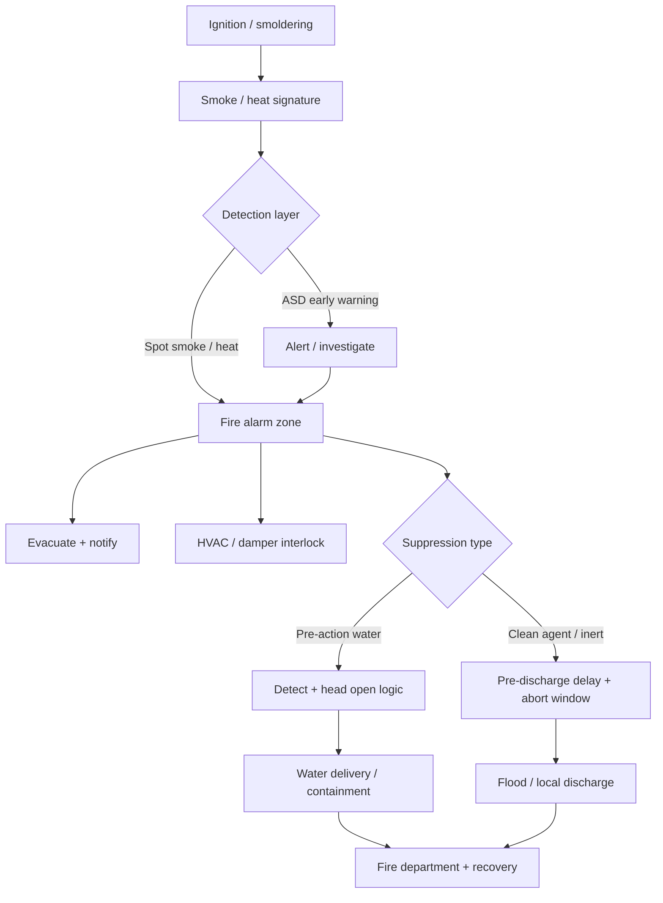

# Fire Protection

**Module ID:** `12-fire`  
**Depth:** standard (interview-ready)  
**Audience:** career-changers with network deploy experience who need facilities literacy for data-centre roles

---

## Learning objectives

By the end of this module you can:

1. List common **causes of fire** in data centres and how prevention culture reduces them.
2. Explain **detection layers** (spot smoke, aspirating/early-warning smoke, heat, flame) and why early warning matters for IT spaces.
3. Compare **water-based** vs **gas / clean-agent** suppression families and name when each is typically chosen.
4. Use **fire classes** (A/B/C and regional variants) to select the right **handheld extinguisher** at safety-briefing level.
5. Describe **signage**, egress, abort switches, and HVAC/fire **interlocks** as life-safety interfaces—not optional niceties.
6. State the **regulatory reality**: the Authority Having Jurisdiction (AHJ) and licensed fire professionals own design/discharge decisions; your job is literate collaboration.
7. Apply **best practices** that balance asset protection, human life, and continuous availability.

---

## Why it matters (ops / design / TPM interview angle)

Fire is low-frequency, high-impact. A single event can destroy multi-million-dollar compute, corrupt recovery timelines, and—most importantly—kill people. Interviewers and facility owners care less about you memorizing agent chemical formulas and more about whether you:

- **Protect people first.** Suppression and detection are life-safety systems. “Don’t discharge over servers” is never an excuse to trap people or disable egress.
- **Understand the trade-off.** Water can damage electronics; gas needs enclosure integrity and safe egress time; wet pipe over white space is often avoided for accidental-discharge risk.
- **Speak the integration language.** Fire alarm ties into BMS, HVAC dampers, EPO philosophy, access control, and on-call runbooks. A network-only engineer who ignores that stack becomes a liability during drills and real events.
- **Respect the license boundary.** Fire protection engineers, NICET/equivalent technicians, and the AHJ design and commission these systems. You specify *requirements* and *operational constraints*; you do not freestyle pipe schedules.

For a TPM or ops interview: be ready to walk through “smoke detected in white space → who is notified → what dampers do → pre-action or gas logic → when people evacuate → how you recover the room.”

---

## Core concepts

### Causes of fire in data centres

**Fire** needs fuel, oxygen, and heat (the classic fire triangle). In a data centre the fuels and ignition sources are distinctive:

| Cause category | Examples | Notes for IT people |
|---|---|---|
| **Electrical** | Overheated PDUs, loose lugs, overloaded circuits, failing PSUs, arc faults | Still a leading ignition class; thermal imaging and torque discipline matter |
| **Batteries / energy storage** | VRLA thermal runaway, lithium-ion battery rooms/cabinets, UPS battery strings | Battery rooms often get dedicated detection and different suppression strategies |
| **Hot work** | Welding, cutting, soldering during fit-out or cable tray mods | Permit-to-work culture; fire watch; temporary detection impairments |
| **Combustibles left in white space** | Cardboard, wooden pallets, foam packaging, paper stores | Staging discipline is a fire control, not just “tidy ops” |
| **Cooling / plant spaces** | Oil in chillers, filter media, diesel generator rooms, fuel systems | Generator yards and day tanks are high-consequence zones |
| **External / adjacent** | Neighboring tenant fire, vehicle fire at loading dock, wildfire smoke | Detection may respond to smoke ingress even when the DC is not the origin |
| **Human error / arson** | Improper storage, smoking, intentional damage | Physical security and process control reduce risk |

**Prevention** is primary: proper electrical design and maintenance, battery management systems (BMS for batteries), cable management that does not block airflow or create ignition nests, housekeeping, change control for hot work, and separating high-risk plant from white space with rated construction.

### Classes of fire

Fire **class** describes the fuel type and drives extinguisher / suppression choice. Labeling is **region-dependent**—know that US and EU notations differ slightly.

**Common US / NFPA-style framing (conceptual):**

| Class | Fuel | Typical concern in DC |
|---|---|---|
| **A** | Ordinary combustibles (paper, wood, fabric, many plastics) | Packaging, cable jackets in bulk, office materials |
| **B** | Flammable liquids / gases | Fuel oil, solvents, some process chemicals |
| **C** | Energized electrical equipment | Live racks, panels—**de-energize when safe**, then treat as A/B residue |
| **D** | Combustible metals | Rare in white space; specialized industrial contexts |
| **K** (or kitchen class) | Cooking oils | Cafeteria / break areas, not white space |

**European EN 2 classes** use A, B, C (gases), D, F (cooking oils)—**there is no separate “electrical” class** in EN; electrical risk is handled by agent suitability and de-energization guidance. In interviews, say: “Class C means energized electrical in North American labeling; in Europe, pick agents safe for electrical use and isolate power when possible.”

### Detection

**Detection** discovers smoke, heat, or flame early enough for evacuation, investigation, or automatic suppression. Layers:

1. **Spot smoke detectors** — photoelectric or ionization (photoelectric common for smoldering cable/plastic smoke). Mounted on ceilings or under raised floors / above ceilings per design. Good baseline; may be slower for very dilute smoke in high airflow rooms.
2. **Aspirating smoke detection (ASD)** — often called **VESDA**-type systems generically (VESDA is a brand; the technology is aspirating/early-warning smoke detection). Pipes continuously sample air and analyze particulate at very low concentrations. Favored in high-value white space because **high air-change rates** dilute smoke before spot detectors trip.
3. **Heat detectors** — fixed temperature or rate-of-rise. Used where smoke is expected (kitchens, some plant) or as backup; generally **too late** as primary protection for electronics.
4. **Flame detectors** — optical (IR/UV). Generator rooms, fuel areas, some industrial plant—not typical over server aisles.
5. **Linear heat / cable-type** — along cable trays, tunnels, or battery rows in some designs.

**Alarm stages (conceptual):** many ASD systems support **Alert → Action → Fire** thresholds so operators can investigate before full evacuation or discharge. Spot systems may go straight to fire alarm depending on zoning and programming.

**Cross-zoning / double-knock:** critical spaces often require **two independent detectors** (or two zones) in alarm before automatic suppression releases. That reduces accidental discharge from a single dirty or failed device.

**Where detectors live:** ceiling, underfloor (raised floor is a plenum and a cable fuel path), sometimes return-air paths. Commissioning and **annual testing** keep them honest; dusty construction periods need impairment procedures.

### Water-based vs gas suppression

#### Water-based systems

| Type | How it works | DC relevance |
|---|---|---|
| **Wet pipe** | Pipes always charged with water; sprinkler head opens on heat | Simple and reliable for offices, corridors, some support spaces; **accidental discharge or pipe leak over servers is a major risk** |
| **Dry pipe** | Pipes filled with air/nitrogen; water released after valve trips | Unheated spaces (loading docks, warehouses); slower water delivery than wet pipe |
| **Pre-action** | Pipes dry or supervised; water admitted only after detection event (and often open head) | **Common over white space** where water is still the chosen agent—reduces “random leak dumps water on servers” scenarios |
| **Deluge** | Open heads; large water volume on detection | High-hazard industrial, not typical IT white space |
| **Water mist** | Fine droplets cool and displace oxygen locally with less total water | Growing option; still engineered specialty—verify listing and design for the occupancy |

**Pre-action detail (interview gold):**  
Often **single-interlock** (detection fills pipes; head must open for water out) or **double-interlock** (detection *and* head operation required to fill—maximum accidental-discharge resistance, slightly more complex). Know the phrase: “Pre-action protects against pipe failure and false trip more than wet pipe does.”

Water **does** damage electronics, but it also **saves buildings and lives**. Many owners accept water for structural protection and use gas or mist in the highest-value rooms—or use pre-action with careful drainage and recovery plans.

#### Gas / clean-agent and inert systems

These systems flood or locally protect a volume with agents that suppress fire primarily by **heat absorption**, **oxygen reduction**, or both—chosen to leave less residue than water or older “halon” approaches.

| Family | Concept | Operational implications |
|---|---|---|
| **Inert gas** (e.g. IG-541, IG-55 blends—nitrogen/argon/CO₂ mixes as designed) | Lowers oxygen concentration below combustion support, still breathable for short egress at design concentration | Needs **room integrity** (sealed enclosure); loud discharge; pressure venting; people must evacuate on alarm |
| **Chemical clean agents** (e.g. FK-5-1-12 / Novec-type fluids, HFC-227ea / FM-200-class agents historically common) | Interrupt combustion chemically and/or cool | Room integrity still critical; agent cost and environmental regulations vary by chemistry; residual liquid agents may require clean-up vs inert gases |
| **CO₂ total flooding** | Effective but **lethal** at design concentrations for occupied spaces | Generally **not** for normally occupied white space; industrial/unoccupied hazards with strict personnel procedures |

**Halon** (halon 1301, etc.) was historically used in IT spaces; production is phased out under ozone regulations. Existing systems may still be encountered in legacy sites—treat as **grandfathered specialist systems**, not a modern design default.

**Gas system non-negotiables:**

- **Enclosure integrity test** (door fan / room integrity): leakage paths defeat hold time.
- **Egress time** and **pre-discharge alarm / delay**: people leave before full concentration.
- **Abort switch** (where code and design allow): supervised means to delay discharge during investigation—**never** a casual “mute forever” button.
- **HVAC shutdown / damper closure**: stop dumping agent into the return path and stop feeding the fire with oxygen-rich air.
- **Pressure relief** venting so discharge does not blow out walls or doors.

**Water vs gas decision drivers (conceptual):** asset value and water sensitivity, room sealability, human occupancy, environmental/regulatory limits on agents, refill cost and downtime after discharge, multi-story building water strategy, insurer and AHJ preferences, battery chemistry hazards.

```text
Typical white-space fire chain (simplified)

  Fuel + ignition  →  smoke / heat  →  DETECT (ASD / spot)
                              │
                              ├─→ alarm, notify, evacuate
                              ├─→ HVAC dampers / AHU interlock
                              └─→ suppress logic
                                    ├─ pre-action / mist / wet (water path)
                                    └─ clean agent / inert (gas path)
                              │
                              └─→ investigation, recovery, agent refill / dry-out
```

### Handheld extinguishers

Portable extinguishers are for **incipient** (just-started) fires and trained personnel—not a substitute for automatic systems or the fire department.

| Agent type | Typical use | DC notes |
|---|---|---|
| **Water / water mist** | Class A | Not for energized equipment |
| **CO₂** | B and energized electrical (leaves little residue) | Short range; asphyxiation risk in confined pits; cold discharge |
| **Dry chemical** (ABC, BC) | Multi-class; fast knock-down | **Corrosive / residue** can destroy electronics—often discouraged as first choice *inside* white space |
| **Clean agent portables** | Sensitive equipment areas | Preferred where residue is unacceptable—follow manufacturer listing |
| **Wet chemical** | Class K kitchens | Cafeteria only |

**Placement & use (PASS):** Pull pin → Aim at base → Squeeze → Sweep. Maintain clear access; check gauges/seals on rounds; know **travel distance** limits from code (do not invent numbers in interviews—say “per NFPA 10 / local code placement”).

### Signage and life safety interfaces

- **Egress maps**, illuminated **EXIT** signs, emergency lighting (tied to life-safety power).
- **Suppression warning signs**: “Clean agent system—evacuate on alarm,” agent type, cylinder locations.
- **Manual pull stations** at exits; **abort** and **release** stations labeled and accessible only as designed.
- **Fire doors** and **rated barriers** between fire zones—do not prop open; do not run cables that void ratings without proper firestopping.
- **Impairment tags** when systems are offline for maintenance—compensatory measures (fire watch) required by policy/code.

**Interlocks you should expect:**

- Fire alarm → **AHU/CRAC fan stop or smoke-control mode** (design-specific).
- Fire alarm → **damper close** on ducts penetrating rated walls.
- Gas discharge countdown → **doors free for egress** (maglocks release on fire alarm—security cannot override life safety).
- Elevator recall, stair pressurization in multi-story buildings.

### Regulatory notes (high level—verify locally)

Exact requirements are **jurisdiction-specific**. Speak in terms of **families of rules**, not invented exam numbers.

| Source type | Examples of public names | Role |
|---|---|---|
| **Building / fire code** | International Building Code (IBC), International Fire Code (IFC), local amendments | Occupancy, construction type, means of egress |
| **Installation standards** | NFPA 13 (sprinklers), NFPA 70 (NEC), NFPA 72 (fire alarm), NFPA 75 (IT equipment fire protection guidance), NFPA 76 (telecom), NFPA 2001 (clean agent), NFPA 10 (portables) | How systems are designed/installed/maintained (US-centric names—EU uses EN standards and national codes) |
| **AHJ** | Local fire marshal / building department | Final say on acceptance, variances, inspections |
| **Insurer / owner standards** | FM Global data sheets, corporate design standards | Often stricter than minimum code |
| **Data-centre standards landscape** | ANSI/TIA-942 (references fire among many facility topics), ISO/IEC data-centre facilities context, EN 50600 series in Europe | Classification and best-practice frameworks—not a replacement for the fire code |

**EU note:** EN 15004 (gaseous fire-extinguishing systems) and national building regs apply; agent environmental rules (F-gas regulations historically affecting HFCs) influence agent selection over time.

**Your professional boundary:** “We need pre-action over white space, ASD sampling underfloor and ceiling, double-interlock preference, and HVAC interlock reviewed with the fire engineer and AHJ”—not “I’ll calculate the agent mass tonight from a blog.”

### Best practices

1. **Life safety over silicon.** Evacuation, clear exits, and trained response beat clever discharge delay tricks that confuse people.
2. **Early detection + staged response.** ASD + investigate procedures reduce both false discharge and late discovery.
3. **Match suppression to occupancy and seal.** Gas without integrity testing is theater.
4. **Separate high-risk fuel loads.** Battery rooms, generators, fuel—dedicated detection/suppression and construction ratings.
5. **Housekeeping is engineering.** No bulk cardboard in white space; no blocked extinguishers; no taped-open fire doors.
6. **Change control for impairments.** Hot work permits, fire watch, system bypass logging, restored and retested.
7. **Train and drill.** Abort switch misuse, ignored strobes, and “we thought it was a test” are operational failures.
8. **Plan recovery.** Water: dry-out, corrosion control, insurance. Gas: agent refill lead time, integrity re-test, root-cause before re-occupy.
9. **Document zones.** Which detection zone maps to which suppression zone, which CRACs shut down, who gets the page.
10. **Collaborate, don’t freestyle.** Fire PE / certified installers commission; facilities and IT own operational readiness.

---

## Key diagrams

### Detection → decision → suppress



### Cabling / space hierarchy (where fire risk hides)

```text
Building fire compartment
└── Data hall (rated walls/doors as designed)
    ├── Ceiling void ........ detectors / ASD pipes / cable trays (fuel + smoke path)
    ├── White space aisles .. racks (electrical load), extinguishers, pull stations
    ├── Raised floor ........ power/data cabling, underfloor smoke detection
    └── Adjacent plant
        ├── Battery room .... thermal runaway risk, dedicated detection
        ├── UPS / switchgear . electrical fire risk
        └── Generator / fuel . Class B risk, flame/heat detection more common
```

### Pre-action vs wet pipe (mental model)

```text
Wet pipe:     [water in pipe] --heat opens head--> WATER OUT
Pre-action:   [air/N2 in pipe] --detect fills pipe--> [water ready] --head opens--> WATER OUT
              (double-interlock: both detect AND head action before fill)
```

---

## Formulas / rules of thumb

Fire design calculations (agent mass, sprinkler density, end-head pressure) belong to **licensed designers**. Useful **rules of thumb** for non-designers:

| Rule of thumb | Why it helps |
|---|---|
| **Smoke moves with airflow** | High CFM white space dilutes smoke → favor ASD / careful detector placement |
| **Two signals before dump** | Cross-zone / double-knock reduces false discharge |
| **Gas needs a box** | If you can feel a draft under the door, integrity may fail hold time |
| **Water follows gravity and cable paths** | Leak trays, rope leak detection, and drip pans are recovery partners—not optional décor |
| **PASS for portables; get out if not incipient** | Heroics without SCBA and training create fatalities |
| **Impairment = elevated risk** | Compensatory measures scale with duration and zone criticality |
| **Battery chemistry changes the playbook** | Li-ion thermal runaway is not “a normal Class A trash can fire”—design and response differ |

No invented “exam formula” for agent pounds per cubic foot—those come from manufacturer listings and NFPA 2001 / EN 15004 design methods.

---

## Common failure modes and misconceptions

| Failure / myth | Reality |
|---|---|
| “Gas systems mean we never need water.” | Building code and structural protection often still require sprinklers in many occupancies; gas is frequently **supplemental** or zone-specific. AHJ decides. |
| “Clean agent is harmless to people—stay and watch.” | Design concentrations and decomposition products still require **egress**. Treat as evacuate-on-alarm. |
| “Dry chemical ABC is fine on servers.” | Residue is often catastrophic for electronics; prefer CO₂ or clean-agent portables in IT areas per policy. |
| “We can disable the abort or detection for a quiet night.” | Unauthorized impairment is a compliance and life-safety violation. |
| “Spot detectors alone are enough in high-airflow halls.” | Dilution can delay detection; ASD is widely preferred for early warning. |
| “Fire doors propped open for airflow/cable pulls are temporary and fine.” | They defeat compartmentation—the core building defense. |
| “Class C fire means use only Class C extinguisher forever.” | De-energize when safe; remaining fuel may be Class A plastics. |
| “If sprinklers didn’t go off, there was no fire risk.” | Sprinklers respond to **heat**, often after smoke has already damaged gear and threatened life. |
| “I can design agent quantity from a vendor brochure in a meeting.” | Requires engineered calculation, listing, and acceptance testing. |
| “Security maglocks can stay locked during fire alarm.” | Life safety releases access control on alarm—non-negotiable in proper designs. |

---

## Interview drills

**Q1. Why might a data hall use pre-action sprinklers instead of wet pipe?**  
**A:** Wet pipe keeps water in the piping above the space continuously, so a broken fitting, frozen pipe (in some climates), or mechanical damage can flood equipment without a fire. Pre-action keeps pipes dry (or supervised) until a **detection event** (and often a head opening) admits water, lowering accidental discharge risk while still providing water-based structural/fire control when heat opens heads.

**Q2. What is aspirating smoke detection and why is it popular in white space?**  
**A:** ASD continuously draws air through sampling pipes to a central detector that senses very low smoke concentrations. Data halls have high airflow that dilutes smoke, so ceiling spot detectors may alarm late. Early warning lets operators investigate, shut down safely, or evacuate before a full suppression event.

**Q3. Water vs clean-agent gas—how do you discuss the trade-off?**  
**A:** Water is proven, relatively inexpensive to restore, and excellent at cooling structure—but it damages electronics and needs drainage/recovery. Clean agent / inert gas minimizes water damage and can extinguish without residue (agent-dependent) but requires room integrity, safe egress timing, expensive refill, and careful HVAC interlock. Choice is multi-factor: occupancy, sealability, asset value, AHJ, insurer, and battery/plant hazards.

**Q4. What happens to cooling on a fire alarm?**  
**A:** Design-specific, but typically fire alarm interlocks **stop or reconfigure AHUs/CRACs** and **close smoke/fire dampers** so the system does not spread smoke or vent gaseous agent. Operators must understand whether “cooling failed” is a fire interlock vs a mechanical fault—runbooks should say so.

**Q5. How do fire classes affect extinguisher choice next to a live rack?**  
**A:** For energized electrical equipment (North American Class C context), use agents rated safe for electrical use (e.g. CO₂ or listed clean-agent portables)—not water and preferably not residue-heavy dry chemical on IT gear. Best practice: de-energize if safe, fight only incipient fires, and evacuate if the fire grows. In EN regions, there is no separate electrical class—select electrically suitable agents and isolate power when possible.

---

## Self-check quiz

1. **Which ignition category is especially associated with UPS rooms and modern high-density backup?**  
   a) Cooking oil Class K only  
   b) Battery thermal events / energy storage  
   c) Raised-floor tile static only  
   d) LED lighting color temperature  

2. **ASD / aspirating detection primarily improves:**  
   a) Generator fuel efficiency  
   b) Early smoke sensing in high-airflow spaces  
   c) Copper cable Category rating  
   d) PUE by reducing CRAH count  

3. **A double-interlock pre-action system generally requires:**  
   a) Only a manual pull, no detection  
   b) Detection and sprinkler-head operation logic before water fills / discharges as designed  
   c) Gas cylinders under the floor only  
   d) Continuous water in every branch line at all times  

4. **In North American labeling, Class C relates to:**  
   a) Combustible metals  
   b) Cooking appliances only  
   c) Energized electrical equipment  
   d) Flammable gas storage exclusively  

5. **Clean-agent total flooding most critically depends on:**  
   a) Matching paint color of cylinders to the brand guidelines only  
   b) Room / enclosure integrity and designed hold time  
   c) Using cardboard to seal cable penetrations temporarily  
   d) Disabling EXIT signs to save power  

6. **Dry chemical ABC extinguishers in white space are often discouraged because:**  
   a) They are too quiet  
   b) Residue can severely damage electronics  
   c) They only work on Class D metals  
   d) They increase humidity setpoints  

7. **Who typically has final acceptance authority over fire protection design in a jurisdiction?**  
   a) The social media marketing team  
   b) The AHJ (e.g. fire marshal) along with applicable codes  
   c) Only the network vendor SE  
   d) The cabling contractor alone  

8. **On fire alarm, access-control maglocks on egress doors should:**  
   a) Stay locked to protect servers at all costs  
   b) Release / fail safe for life-safety egress as designed  
   c) Randomly unlock only after gas discharge completes  
   d) Require a second biometric for exit  

### Answers

<details>
<summary>Click to reveal answers</summary>

1. **b** — Battery/UPS energy storage is a major DC-specific fire concern.  
2. **b** — ASD targets dilute smoke and early warning.  
3. **b** — Double-interlock ties water admission to detection + head/operation logic.  
4. **c** — Class C ≈ energized electrical (US-style).  
5. **b** — Integrity and hold time make gaseous systems work.  
6. **b** — Corrosive/particulate residue harms IT equipment.  
7. **b** — AHJ + code; insurers may add requirements.  
8. **b** — Life safety overrides security locking on egress paths.

</details>

---

## Further free resources

Public standards and primers (names and free educational entry points—not paywalled EPI materials):

| Resource | What to use it for |
|---|---|
| **NFPA** public pages / standards catalog (NFPA 10, 13, 72, 75, 76, 2001) | Official scope statements and purchase/access options; know the *names* even when full text is paid |
| **International Code Council (ICC)** — IBC / IFC overviews | How building and fire codes frame occupancy and protection |
| **SFPE** (Society of Fire Protection Engineers) public education articles | Conceptual fire dynamics and protection strategies |
| **Manufacturer application guides** (open white papers from major ASD, clean-agent, and pre-action vendors) | How systems are applied in IT rooms—treat as vendor-informed, not code |
| **FM Global** publicly available data sheet summaries / loss prevention topics (where free) | Insurer-driven best practices often seen in enterprise DCs |
| **EN 15004 / EN 50600** public abstracts and national standards body catalogs | European gaseous systems and data-centre facility framework awareness |
| **OSHA / HSE** (US/UK) fire extinguisher and evacuation guidance | Worker safety framing for portable extinguishers and egress |
| **ASHRAE** / industry thermal guideline public summaries | Not fire standards, but airflow context for why smoke dilutes |
| **Local fire department public education + your site’s fire safety plan** | The only “exam” that matters on a real site |

**Study tip:** On your next colo tour, ask: detection type (spot vs ASD), suppression type (pre-action / gas / mist), abort location, last room-integrity test date, and what CRAHs do on alarm. That five-question tour beats memorizing agent molecular weights.

---

*Module `12-fire` — Fire Protection. Educational reconstruction for interview and on-floor literacy; not an official EPI®/CDCP® course or exam item bank.*
