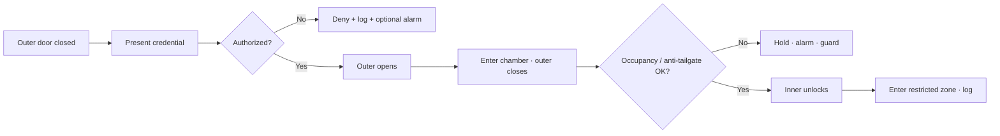

# Physical Security and Safety

**Module ID:** `13-security`  
**Domain:** Physical Security and Safety  
**Depth:** standard (~2 hours study)

---

## Learning objectives

By the end of this module you can:

1. Explain **defense-in-depth** (layered physical security) from perimeter to rack and why one “strong door” is never enough.
2. Describe **access control** methods (something you have / know / are), authentication vs authorization, and common data-centre credentials and readers.
3. Map **zoning** (public → controlled → restricted → highly restricted) and explain **mantraps**, airlocks, and anti-passback at a design-interview level.
4. Outline **surveillance** roles (deterrence, detection, investigation), camera placement basics, and integration with access logs and alarms.
5. Apply **safety protocols** that interact with security: emergency egress, interlocks, lone-worker rules, lockout/tagout (LOTO), and visitor escort policy.
6. Spot common failure modes: tailgating, shared badges, camera blind spots, security vs life-safety conflicts, and “security theatre.”

---

## Why it matters (ops / design / TPM interview angle)

Network deploy experience gets you comfortable with VLANs, ACLs, and zero-trust *on the wire*. Physical security is the same idea in concrete, doors, and process: **assume one control fails** and design so the next layer still works.

In interviews and design reviews you will be asked:

- How do people (and boxes) get from the street into the white space without creating an outage or a theft path?
- Who can open a cage, a CRAC plant room, or a MDF—and how is that proven after the fact?
- What happens when security and **life safety** conflict (e.g. maglocks that must release on fire alarm)?

For ops, most “security incidents” in enterprise DCs are not Hollywood break-ins—they are **tailgating**, mis-issued badges, contractors in the wrong zone, or doors propped open during a maintenance window. For design/TPM roles, physical security is a **space and cost driver**: mantraps, guard posts, camera density, card readers on every critical door, and separation of loading dock from data floor all consume square metres and CAPEX.

Public standards and frameworks that often appear in RFPs and colo contracts (by *name*, not exam trivia — pin edition/year when you cite them): **ISO/IEC 27001** (information security management, includes physical controls; pin the adopted edition), **ISO/IEC 27002** control guidance (same), **NIST SP 800-53** family PE (Physical and Environmental Protection), **ANSI/TIA-942-C** (2024; facility-oriented rated concepts including security zones at a high level), local building/fire codes (AHJ—Authority Having Jurisdiction), and industry best-practice documents from owners and hyperscalers’ public security white papers. **EN 50600** (European data centre facilities series — pin the adopted part and year) also addresses security concepts in the facility context. Treat Uptime Institute Tier language as a commercial rating system—do not conflate it with ISO certification.

---

## Core concepts

### 1. Layers of physical security (defense-in-depth)

**Physical security** is the set of measures that protect people, equipment, and data by controlling *who and what* can approach, enter, move through, and leave a facility—and by detecting and responding when something is wrong.

**Defense-in-depth** means stacked, independent layers so compromise of one layer does not equal total compromise. A useful outer-to-inner stack for a data centre:

| Layer | Typical elements | Intent |
|---|---|---|
| **Site / perimeter** | Fencing, vehicle barriers, lighting, setback, CCTV on approaches, vehicle access control, landscaping that does not hide approach | Delay and detect external threat; control vehicle bomb / ram risk where required |
| **Building envelope** | Hardened façade, limited glazed openings on critical rooms, roof/hatch control, loading dock doors, intrusion detection on shell | Force entry through *known* portals |
| **Site entry / reception** | Guard station or lobby, visitor management, package screening, photo ID check | Authenticate *people* before deeper access |
| **Internal zoning** | Progressive security zones, mantraps, badge + PIN, biometrics on high zones | Least privilege by space |
| **Room / cage / cabinet** | Room-level readers, cage locks, cabinet locks/sensors, asset tags | Contain blast radius of a stolen or misused credential |
| **Operational controls** | Escort policy, two-person rule (where used), change windows, CCTV review, audit of access logs | Catch process failures that hardware alone misses |

Think of layers the way you think of network segmentation: perimeter firewall → DMZ → internal VLAN → host firewall → encryption at rest. Each layer has a different **owner** (security ops, facilities, IT, colo provider) and a different **failure mode**.

**Deterrence, delay, detection, response, recovery** is a classic physical-security sequence:

1. **Deter** — visible cameras, lighting, signage, professional appearance of controls.  
2. **Delay** — fences, locks, mantraps, reinforced doors (buy time for response).  
3. **Detect** — door contacts, motion, video analytics, forced-door alarms, tailgate sensors.  
4. **Respond** — guard force, remote SOC, police, on-call facilities.  
5. **Recover** — forensics, re-key/badge revoke, process fix, insurance/compliance reporting.

A lock without detection is only a delay. A camera without someone watching (or reviewing on alarm) is mostly deterrence and post-event evidence.

### 2. Zoning awareness

**Zoning** partitions the building into areas of increasing sensitivity. Names vary by operator; a common conceptual model:

```
PUBLIC / UNRESTRICTED
  └─ CONTROLLED (lobby, some offices, meeting rooms)
       └─ RESTRICTED (data centre support areas, NOC, staging)
            └─ HIGHLY RESTRICTED (white space, MDF/IDF, critical plant)
                 └─ CRITICAL / VAULT (cages, HSM rooms, tape vaults, SCIF-like spaces if any)
```

**White space** — the raised-floor or slab area where IT racks live.  
**Grey space** (sometimes “gray space”) — MEP plant: UPS rooms, battery rooms, switchgear, chillers, generators. Grey space is often *as sensitive* as white space for availability (sabotage or error here takes down IT without touching a single server). Do not treat “only plant” as low security.

**Zoning rules of practice:**

- **Progressive access** — you should not be able to badge from the parking lot straight into white space with one door if design allows better. Each zone transition is a checkpoint.
- **Need-to-be-there** — access lists are role-based (facilities tech, network tech, customer remote hands, cleaner with day-window only).
- **Separation of flows** — people, goods, and refuse ideally do not share the same uncontrolled path into white space. Loading dock → staging → security check → white space is healthier than dock doors opening onto the data floor.
- **Adjacency** — restrooms, break rooms, and high-traffic corridors should not force constant door holds into restricted zones.

**Colo-specific zoning:** multi-tenant facilities add **customer cages/suites**, shared corridors, and provider-managed common plant. Your badge may open the lobby and your cage—but *not* the UPS room (provider only) or a neighbour’s cage. Interview language: “shared responsibility model, physical layer.”

### 3. Access control

**Access control** decides whether a person (or vehicle) may pass a portal and records the attempt.

**Authentication** — proving identity (badge, PIN, biometric, face-to-photo at desk).  
**Authorization** — what that identity is allowed to open (ACL on doors/zones, time schedules).  
**Accounting / audit** — logs of grant/deny, door forced, door held open.

**Three factors** (same idea as network MFA):

| Factor | Examples in DC physical world |
|---|---|
| Something you **have** | Badge/card (prox, smart card), physical key, mobile credential |
| Something you **know** | PIN, password at console |
| Something you **are** | Fingerprint, iris, facial biometric (privacy and false-accept rates matter) |

**Multi-factor physical access** on high zones often means **badge + PIN** or **badge + biometric**. Dual factor on every broom closet is rare; dual factor on white-space and critical plant is common in serious designs.

**Electronic Access Control System (EACS / ACS):**

- **Credential** — the token (card UID, mobile cert).  
- **Reader** — at the door (Wiegand/OSDP to panel—OSDP is preferred in modern designs for encryption and supervision).  
- **Controller / panel** — decides grant based on downloadable schedules and groups.  
- **Electric locking hardware** — maglock, electric strike, electrified mortise/cylindrical lock, exit device.  
- **Request-to-exit (REX)** and **door position switch (DPS)** — free egress sensing and open/closed status.  
- **Software / head-end** — provisioning, reports, integration with HR (joiner/mover/leaver).

**Anti-passback** — a rule that a badge cannot re-enter a zone without a recorded exit (or soft anti-passback that only alarms). Hard anti-passback reduces **badge sharing** and **tailgating** helpers but can lock out legit users if sensors miss an exit—ops must understand the policy.

**Time zones / schedules** — cleaners 22:00–06:00 only; vendors Tue window; emergency override for fire/security with audit.

**Visitor management:** pre-registration, government ID check, temporary badge (visibly different colour), **escort required** in restricted zones, sign-in/out, badge return. Contractors need the same rigor as employees—often more.

**Keys and mechanical locks:** still exist for battery rooms, exterior hatches, and failsafe scenarios. **Key control** (issued inventory, no uncontrolled master key sprawl) is part of physical security, not “legacy leftovers.”

**Interlocks with IT identity:** best practice is joiners/movers/leavers automation—HR termination should disable the badge the same day, not “next badge audit.”

### 4. Mantraps and portal design

A **mantrap** (also called a security vestibule or airlock in some docs) is a pair of interlocking doors forming a small chamber: door A must close and lock before door B can open. Only one person (or one authorized group, depending on design) should occupy the chamber.

**Purposes:**

- Stop **tailgating** / **piggybacking** (unauthorized person following an authorized one).  
- Create a controlled inspection point (guard can see both doors, camera coverage 100%).  
- Support biometric or higher-assurance checks in a confined space.  
- In high-security designs, weigh scales or occupancy sensors detect two people in a “one-person” mantrap.

**Design awareness (interview-useful):**

- **Fail safe vs fail secure** — see Safety below; life-safety egress usually requires free exit even if power is lost.  
- **Throughput** — mantraps limit people-per-minute; shift change and evacuation drills must still work.  
- **ADA / accessibility** — larger chambers, longer timers, alternative accessible routes that remain secure.  
- **Material path** — large equipment cannot fit a person mantrap; use a **material airlock** or dock protocol with dual control instead of propping the mantrap.

Related portals:

- **Turnstiles / speed gates** — higher throughput, optical sensors for tailgate detection; not a full mantrap but common at lobby.  
- **Sally port** — vehicle equivalent (two gates for trucks).  
- **Revolving doors / full-height turnstiles** — strong anti-tailgate if configured correctly.

### 5. Surveillance

**Surveillance** is continuous or event-driven observation—primarily **CCTV / VMS** (Video Management System), sometimes supplemented by guard tours and intrusion sensors.

**Goals:**

1. **Deter** opportunistic misuse.  
2. **Detect** abnormal behaviour (often via analytics: loitering, line-cross, object left behind—use carefully; false positives are common).  
3. **Investigate** after incidents (who was at rack row 12 at 03:14?).  
4. **Support** access control (video verify on alarm: door forced).

**Coverage priorities** (not an exhaustive camera schedule):

- Perimeter approach and vehicle entry.  
- All exterior doors and roof access.  
- Lobby / reception and badge desks.  
- Mantraps and zone transitions.  
- Loading dock and staging.  
- White-space aisles and cage entries (privacy vs security—colo customers may restrict inward-cage views).  
- Critical plant rooms (UPS, generators, fuel fill points).  
- Cross-connect / MMR if sensitive.

**Technical basics for facility literacy:**

- **Resolution and retention** — policy-driven (e.g. 30–90 days is common discussion range; regulated environments may differ). Retention is storage cost.  
- **Frame rate** — higher for entry points; lower for static corridors if storage-bound.  
- **Lighting and IR** — dark generator yards need designed lighting or IR-capable cameras.  
- **Time sync (NTP)** — camera timestamps must match access-control logs or forensics fails.  
- **Network isolation** — camera VLAN, no default passwords, patch discipline (cameras are computers).  
- **Privacy / labour** — recording staff areas may be regulated; know that legal review exists even if you are not the lawyer.

**Integration:** door forced → VMS bookmark + SOC alert + guard dispatch is far more valuable than cameras that only record in a silo.

### 6. Safety protocols (where security meets life safety)

**Safety** here means protecting human life and health in a hazardous industrial environment (electrical energy, batteries/hydrogen risk, rotating equipment, cold aisles, noise, fire suppression). Security controls **must not trap people** during emergencies.

Key terms:

- **Life safety** — code-driven requirements for egress, fire alarm, emergency lighting, exit signage. In a conflict between asset protection and life safety, **life safety wins** (and the AHJ enforces that).  
- **Means of egress** — continuous path out of the building; exit doors generally require free egress from the occupied side.  
- **Fail-safe (lock)** — loss of power **unlocks** (common for maglocks on egress paths so people are not trapped).  
- **Fail-secure (lock)** — loss of power **stays locked** (used where security outweighs free entry from outside; egress side still needs a mechanical or listed free-exit path). Do not casually reverse these terms in interviews.  
- **Fire alarm interface** — access-controlled egress doors typically unlock or free-exit on fire alarm as required by code/listing.  
- **Emergency power-off (EPO)** — big red buttons that kill power to IT or UPS input; security may limit casual access to EPO but **trained staff must reach them**. Misuse and accidental press are classic outage causes—guards and procedures matter.  
- **Lockout/Tagout (LOTO)** — OSHA-style (US) / equivalent procedures to de-energize equipment before work; physical locks on breakers, not only a badge rule. See Module 15 for the energy-control regime on UPS/switchgear (Subpart S).  
- **Confined space / battery rooms / fuel areas** — special entry permits, gas detection (e.g. hydrogen near VRLA/flooded batteries in some rooms), PPE.  
- **Lone worker** — no solo work in high-risk plant without check-in; two-person rule for some critical actions (varies by operator).  
- **Suppression system safety** — clean-agent or other systems may require pre-discharge alarms and egress time; security doors must not impede evacuation. (See fire-protection module for agent details.)  
- **Visitor escort** — both security *and* safety: untrained people near live bus bars are a hazard.

**Security vs safety anti-patterns:**

- Chaining locks or deadbolts that block egress.  
- Mantrap both doors locked on fire without listed emergency release.  
- Cameras/guards as a substitute for proper electrical safety training.  
- Propping fire doors for convenience (kills compartmentation *and* security).

### 7. People, process, and the “soft” layer

Hardware fails open if process is weak:

- **Background checks** and access sponsorship for permanent staff.  
- **Badge inventory** — lost badge = immediate disable + incident ticket.  
- **Tailgating culture** — holding the door is polite in an office and wrong on a data floor; culture + sensors + training.  
- **Change management** — temporary access for projects with automatic expiry.  
- **Loading dock chain of custody** — delivery matches PO, seal checks, no unattended gear in public corridors.  
- **Secure disposal** — drive destruction / degauss policy for decommissioned media (physical path from rack to destroyer).  
- **Drills** — evacuation *and* security incident response; both need muscle memory.

---

## Key diagrams

### Layered security (conceptual)

```text
                    ┌─────────────────────────────────────┐
                    │         PERIMETER / SITE            │
                    │  fence · barriers · lighting · CCTV │
                    └─────────────────┬───────────────────┘
                                      │ vehicle / pedestrian
                    ┌─────────────────▼───────────────────┐
                    │      BUILDING / LOBBY / GUARD       │
                    │   visitor mgmt · turnstile · ID     │
                    └─────────────────┬───────────────────┘
                                      │ mantrap / speed gate
              ┌───────────────────────┼───────────────────────┐
              │                       │                       │
    ┌─────────▼─────────┐   ┌─────────▼─────────┐   ┌─────────▼─────────┐
    │  GREY SPACE       │   │  SUPPORT / NOC    │   │  WHITE SPACE      │
    │  UPS · gens ·     │   │  staging · store  │   │  aisles · cages   │
    │  switchgear       │   │                   │   │  cabinets         │
    └─────────┬─────────┘   └───────────────────┘   └─────────┬─────────┘
              │                                               │
              └──────────── more restrictive credentials ─────┘
```

### Mantrap logic (happy path)



### Access control stack (analogy to network)

```text
Person  →  Credential  →  Reader  →  Controller  →  Lock hardware
              │              │           │
              │              │           └── schedules, anti-passback, fire input
              │              └── supervised line (prefer encrypted OSDP-class links)
              └── revoke on leaver; dual-factor on high zones

Parallel:  Door contact / REX / camera alarm  →  SOC / guard response
```

### Zoning flow for people vs materials

```text
PEOPLE:   Street → Parking → Lobby → Mantrap → Corridor → White space → Cage → Cabinet
MATERIALS: Truck → Sally port/dock → Staging/inspect → Secure corridor → White space → Rack
                        ✗ avoid dock door dumping straight onto data floor
```

---

## Formulas / rules of thumb

These are **order-of-magnitude design/ops heuristics**, not code-substitutes. Always defer to AHJ, owner standards, and engineer of record.

| Rule of thumb | Why it helps |
|---|---|
| **Least privilege on doors** | Default deny; open only zones needed for role + time window. |
| **One credential identity per human** | Shared badges destroy audit and anti-passback. |
| **N+ layer thinking** | Badge + camera + process; never “camera only” for high-value zones. |
| **Time sync everywhere** | ACS, VMS, and syslog within ~1 s; otherwise investigations fail. |
| **Leaver same-day revoke** | Target: badge dead before laptop is collected—or sooner. |
| **Mantrap throughput planning** | Estimate peak people/hour at shift change; if mantrap cannot clear, people prop doors (security collapse). |
| **Fail-safe on egress, fail-secure on perimeter entry** | Mental model—verify actual hardware schedule per door with life-safety designer. |
| **Grey space ≈ white space** for access rigor | Taking down power is as bad as unplugging servers. |
| **Retention vs cost** | Doubling camera retention roughly doubles storage (codec/analytics dependent). |
| **Tailgate is the #1 casual breach** | If budget is limited, fund portal design + culture before exotic biometrics. |
| **Two-person for high-impact actions** (where policy requires) | EPO procedures, certain fuel/electrical tasks, dual custody of master keys. |
| **Visitor badge visually distinct** | At-a-glance detection of unescorted visitors. |

---

## Common failure modes and misconceptions

1. **“We’re a locked building, so we’re secure.”** One perimeter lock with shared keys and no logging is weak. Layers and audit matter.  
2. **Tailgating ignored as “polite.”** Primary real-world bypass of badge systems.  
3. **Shared or loaned badges.** Destroys non-repudiation; anti-passback becomes noise.  
4. **Cameras without lighting, time sync, or retention policy.** Evidence quality collapses.  
5. **Security locks that trap people on fire alarm.** Code violation and liability; design fail.  
6. **Propped doors during “just this change window.”** Temporary becomes permanent; sensors go into alarm fatigue.  
7. **Treating cleaners/vendors as out of scope.** Third parties cause a large share of physical incidents and accidents.  
8. **Badge access to EPO without procedure.** Accidental outages; conversely, EPO blocked by over-zealous security.  
9. **Mantrap that equipment cannot pass.** Ops prop doors or defeat interlock—design must include material path.  
10. **Conflating ISO 27001 certificate with good day-2 ops.** Certification is a management system; doors still get propped.  
11. **Believing biometrics alone solve lost cards.** Biometrics have error rates, hygiene, privacy, and spoof considerations; still need process.  
12. **No integration between HR and ACS.** Ghost badges of former staff.  
13. **Alarm fatigue.** Forced-door and door-held alarms ignored because thresholds/noise are wrong.  
14. **Colo customer assumes provider cameras see inside the cage.** Often they do not—or must not; clarify contractually.  
15. **Security theatre** — impressive lobby scanners while roof hatches and generator yards are soft.

---

## Interview drills

**Q1. Explain defense-in-depth for a data centre campus in under two minutes.**  
**A:** Start at the site perimeter (barriers, lighting, CCTV, vehicle control), then building envelope and lobby identity check, then progressive internal zones with electronic access control, then room/cage/cabinet locks, then operational controls (escort, anti-passback, log review). Each layer should deter, delay, or detect independently so one failure—lost badge, propped door, camera outage—does not equal free run of white space and grey space.

**Q2. What is a mantrap, and when would you use one vs optical speed gates?**  
**A:** A mantrap is two interlocking doors forming a chamber so the outer door closes before the inner opens, limiting tailgating and enabling high-assurance checks. Use mantraps at transitions into highly restricted white space or critical plant where throughput is moderate and assurance is high. Optical speed gates suit higher-volume lobby entry with good detection but less absolute containment. Always design a separate material path so the mantrap is not defeated for equipment moves.

**Q3. Fail-safe vs fail-secure—how do they relate to fire alarm?**  
**A:** Fail-safe unlocks on power loss (typical for maglocked egress paths so occupants are not trapped). Fail-secure remains locked on power loss (often used to protect entry from the unsecured side) while still providing listed free egress from the secure side. Fire alarm integration generally forces free egress / unlock behaviour as required by code and product listing. Asset security never overrides life safety.

**Q4. How would you investigate “someone was in our cage last night” in a colo?**  
**A:** Pull ACS logs for cage and corridor doors (grants, denies, door forced/held), align timestamps with VMS clips (NTP!), confirm escort and visitor badges, check provider remote-hands tickets, and verify whether neighbouring work or shared corridor access could explain presence. Revoke compromised credentials, re-key if mechanical, and close process gaps (temporary access expiry). Clarify what the provider’s cameras legally/contractually cover.

**Q5. Why is grey-space access control as important as white-space?**  
**A:** UPS, generators, switchgear, and cooling plant are single points that can darken or overheat the entire IT load. Unauthorized or untrained access risks sabotage, accidents, and configuration errors. Many serious outages are “physical + process” in plant rooms, not malware in the rack. Apply zoning, dual control where appropriate, CCTV, and strict joiner/leaver hygiene to grey space equal to white space.

---

## Self-check quiz

1. **Defense-in-depth in physical security primarily means:**  
   a) Using the strongest possible single door  
   b) Stacking independent layers so one failure is not total compromise  
   c) Relying only on CCTV recording  
   d) Outsourcing all guards  

2. **Authentication differs from authorization because:**  
   a) Authentication grants door schedules; authorization checks identity  
   b) Authentication proves identity; authorization decides which doors/zones that identity may open  
   c) They are synonyms in ACS design  
   d) Authorization only applies to biometrics  

3. **A mantrap is best described as:**  
   a) A camera blind spot  
   b) Interlocking doors forming a controlled chamber to reduce tailgating  
   c) A type of raised-floor pedestal  
   d) An emergency power-off station  

4. **Grey space typically includes:**  
   a) Only customer cages  
   b) MEP plant such as UPS, switchgear, generators, cooling equipment  
   c) Public parking only  
   d) The corporate marketing office  

5. **On an egress door, life-safety design generally prioritizes:**  
   a) Maximum lock delay during fire  
   b) Free egress / code-compliant release even if that weakens asset security during alarm  
   c) Disabling all cameras  
   d) Removing door position sensors  

6. **Anti-passback is intended to:**  
   a) Cool the hot aisle  
   b) Reduce badge sharing and enforce enter/exit sequences  
   c) Replace fire extinguishers  
   d) Increase UPS runtime  

7. **The most common casual bypass of badge control in live sites is:**  
   a) Quantum computing attacks  
   b) Tailgating / piggybacking and propped doors  
   c) EMF interference with cards  
   d) Incorrect PDU firmware  

8. **Why must ACS and VMS clocks be synchronized?**  
   a) To reduce power usage  
   b) So access events and video can be correlated during investigations  
   c) Biometrics will not enroll otherwise  
   d) Mantraps will not mechanically close  

### Answers

<details>
<summary>Click to reveal answers</summary>

1. **b** — Layers (perimeter → envelope → zones → cabinets → process).  
2. **b** — Identity proof vs permission set.  
3. **b** — Interlock vestibule / airlock portal.  
4. **b** — Critical plant; protect it like white space.  
5. **b** — Life safety over asset lock-in during emergency.  
6. **b** — Policy/tech control on re-entry without exit.  
7. **b** — Social/process failures dominate.  
8. **b** — Forensics needs aligned timelines (NTP).  

</details>

---

## Further free resources

Use **public** standards titles, government publications, and vendor primers—not proprietary exam banks.

| Resource | What to use it for |
|---|---|
| **ISO/IEC 27001 / 27002** (overview articles and national body summaries; pin the adopted edition/year) | Physical security as part of an ISMS; control families for secure areas, entry controls, cabling security |
| **NIST SP 800-53** — PE family (Physical and Environmental Protection) | Free US baseline control language for access, monitoring, visitor control, emergency lighting, etc. |
| **NIST SP 800-116** (and related PIV guidance) | High-assurance identity badges concepts (useful background even if you do not run federal PIV) |
| **ANSI/TIA-942-C** (2024) public overviews / owner summaries | Facility rating context and security zoning mentioned at architecture level |
| **EN 50600** series public summaries (pin the adopted part and year) | European DC facility framework including security-related facility topics |
| **NFPA** public educational material on means of egress / fire alarm interfaces | Why doors unlock/release on alarm (pair with your fire-protection module) |
| **OSHA** (US) lockout/tagout and electrical safety overview pages | LOTO mindset for plant rooms (local equivalents elsewhere) |
| **CPTED** (Crime Prevention Through Environmental Design) primers | Natural surveillance, territoriality, lighting—perimeter design vocabulary |
| **Manufacturer primers** (Axis, Bosch, Genetec, Lenel, HID, Assa Abloy, etc. — public white papers) | CCTV/VMS concepts, OSDP vs legacy reader wiring, lock hardware types |
| **Cloud / hyperscaler public compliance docs** (e.g. physical security sections of SOC reports summaries, AWS/Azure/Google security whitepapers) | How large operators describe layers, cameras, and access logging at high level |
| **Local building code / fire code commentary** from AHJ education pages | Fail-safe egress and occupancy rules that override “keep it locked at all costs” |

**Study tip:** Walk a real facility (or a detailed colo tour) and narrate the zones aloud: “Here is public → here is the first badge → here is where grey and white diverge → here is who can touch EPO.” If you cannot name the layer, you do not yet own the topic.

---

*End of module 13-security — Physical Security and Safety. Pair with fire protection (egress/suppression interfaces) and location/building construction (perimeter and envelope) for a full site-security picture. Part of free CDCP-domain self-study (not official EPI®/CDCP® certification material).*
