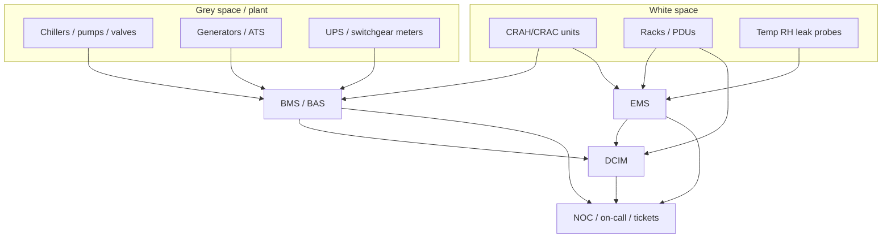

# Auxiliary Systems (BMS, EMS, DCIM)

## Learning objectives

By the end of this module you can:

1. Explain why monitoring and control systems are a primary ops risk surface—not “nice-to-have dashboards.”
2. Distinguish **BMS** (Building Management System), **EMS** (Environmental Monitoring System), and **DCIM** (Data Center Infrastructure Management) by scope, typical data, and who owns them.
3. List what a mission-critical site must sense and alarm: power chain, cooling plant, room environment, leaks, fire, security, and capacity (kW / space / ports).
4. Describe **water leak detection** placement, technology types, and response design under raised floors and around chilled-water plant.
5. Design a practical **alarm and notification** model: severity tiers, escalation, on-call hygiene, and defenses against alarm fatigue.
6. Relate auxiliary systems to change control, sensor calibration, and runbooks so interviews and floor ops stay grounded in process—not just tools.

---

## Why it matters (ops/design/TPM interview angle)

If you come from network deploy, you already know that **visibility without action is theater**. A rack switch that pages the wrong on-call is as bad as a silent fiber cut. Auxiliary systems are the facilities equivalent of NMS, IPMI, and SIEM rolled into overlapping products—often installed by different vendors, owned by different teams, and trusted with **life-safety and availability**.

**Ops angle.** Most multi-hour outages that “should have been caught earlier” involve a sensing or notification gap: a chilled-water valve leak under the floor that nobody saw until humidity and temperature cascaded; a UPS battery room thermal alarm that was silenced; a CRAC unit in local-manual mode while the BMS still showed “auto/OK.” Monitoring is how you convert latent failures into **time to act**.

**Design angle.** Sensors, panels, and integrations are not free—every point needs power, network (or serial/modbus), labeling, baselining, and a named owner. Over-instrumentation creates noise; under-instrumentation creates blind spots. Good design starts from **failure modes and response paths**, then places sensors where they buy response time.

**TPM / hybrid IT-facilities interview angle.** Interviewers love “BMS says fine, DCIM says hot rack—who do you trust?” The answer is not a brand preference; it is **which measurement is closer to the physics of the problem**, what the last calibration said, and how you reconcile conflicting systems without freezing. Career-changers who can narrate that reconciliation sound like they have been in a real NOC/facilities bridge call.

---

## Core concepts

### Monitoring challenges (why this is hard)

A data centre is a **coupled cyber-physical system**. Power feeds cooling; cooling protects IT; IT load changes power and heat; people change setpoints and bypasses. Monitoring challenges include:

| Challenge | What it means in practice |
|---|---|
| **Heterogeneous protocols** | Modbus, BACnet, SNMP, dry contacts, proprietary vendor APIs, OPC-UA—often all in one site. |
| **Multiple truth sources** | Building plant on BMS; rack environment on EMS; asset/capacity on DCIM; IT metrics on NMS/observability. |
| **Latency and sampling** | A 15-minute average can hide a 2-minute thermal spike that trips equipment. |
| **False positives / alarm fatigue** | Too many emails → people mute; real events get ignored. |
| **False negatives** | Sensor offline, dead battery in a wireless node, sticky float switch, “acked forever” alarm. |
| **Human process gap** | Alarm fires but no runbook, no spare, no authority to shut a valve. |
| **Security of the control plane** | BMS/DCIM on flat networks is a lateral-movement target; treat OT/IT boundary seriously. |
| **Drift** | Sensors age; thresholds copied from another site; as-built drawings lag reality. |

**Rule of thumb for interviews:** *If you cannot name the sensor, the setpoint, the owner, and the next human action for a critical alarm, you do not yet have monitoring—you have wallpaper.*

### EMS vs BMS vs DCIM

These acronyms are used loosely in marketing. For CDCP-level clarity, use **scope of control and purpose**:

#### BMS — Building Management System (also BAS: Building Automation System)

**Definition:** A control and supervision platform for **building mechanical and electrical plant**—HVAC plant (chillers, CRAH/CRAC at plant level, AHUs), pumps, valves, generators and transfer switches (often via integration), lighting in some designs, and sometimes access or fire **status** points (not as a substitute for life-safety systems).

**Typical owners:** Facilities / MEP / building engineering.

**Typical functions:**

- Sequence of operations for chillers, free-cooling modes, pump lead/lag
- Setpoint management for supply air / chilled water temperatures
- Trending of plant performance and energy
- Integration to electrical meters, ATS/generator status (site-dependent)
- Graphics of plant one-line / P&ID style screens

**What BMS is not (usually):** Per-rack IT inventory, ticket workflow for server moves, cable plant management, or primary fire alarm / life-safety logic (those remain on listed fire/life-safety panels per code).

#### EMS — Environmental Monitoring System

**Definition:** A system focused on **room and micro-environment conditions** that threaten IT equipment: temperature, humidity (or dew point), differential pressure (for containment), airflow (less common at rack), smoke/water **sensing** at the space level, and often door contacts on cabinets.

**Typical owners:** Facilities ops, sometimes NOC, sometimes colo customer for their cage.

**Typical functions:**

- Temperature/humidity probes at cold aisle, hot aisle, rack inlets (ASHRAE-oriented placement)
- Water leak ropes / spot sensors
- Cabinet-level environment for high-value rows
- Simple threshold alarms and SMS/email/webhook notifications
- Sometimes PDU environmental ports or IP-connected probe hubs

**EMS vs BMS:** EMS is usually **lighter and closer to white space**. It may not command chillers; it *detects* that the white space is drifting. BMS may *command* the plant that caused the drift. Many sites buy EMS modules that integrate **into** a BMS or DCIM rather than standing alone.

**Naming collision:** In some energy contexts, “EMS” means **Energy Management System**. In data-centre auxiliary-system syllabi, **environmental** is the intended meaning. In interviews, clarify which you mean.

#### DCIM — Data Center Infrastructure Management

**Definition:** Software (and sometimes hardware gateways) that connects **IT asset / capacity / change** views with **facilities telemetry**—ideally a single operational picture of space, power, cooling capacity, and inventory.

**Typical owners:** Data centre ops, capacity planning, sometimes hybrid facilities + IT ops teams.

**Typical functions:**

- Asset inventory (rack, U-position, serial, owner)
- Power capacity (UPS → PDU → rack → outlet) and planned load
- Floor plans / 3D or 2D heat maps fed by sensors
- Workflow for installs/moves/changes (IMAC)
- Reporting for utilization, stranded capacity, PUE-related inputs (when metered)
- Integrations to BMS, EMS, intelligent PDUs, network discovery (maturity varies widely)

**What DCIM is not automatically:** A replacement BMS, a certified fire system, or a guarantee that “the dashboard is correct.” DCIM quality equals **data hygiene + integration depth + process discipline**.

#### Comparison table (use this in interviews)

| | **BMS** | **EMS** | **DCIM** |
|---|---|---|---|
| **Primary question** | Is the **plant** healthy and in the right sequence? | Is the **environment** safe for IT? | What do we have, where is it, and **what capacity remains**? |
| **Control** | Often closed-loop plant control | Mostly sensing + alarm; limited local control | Mostly management; control via integrations |
| **Time scale** | Seconds–minutes plant loops | Seconds–minutes environment | Hours–months capacity/planning + live overlays |
| **Classic data** | Chiller kW, CHW temp, valve position, generator state | °C/RH, leak, door, pressure | kW/rack, free U, circuit ID, asset owner |
| **Failure if weak** | Wrong plant mode, delayed recovery | Hot spots, silent leaks | Stranded power, double-booked space, bad change |

**Integration pattern (modern sites):** BMS owns plant control → EMS densifies white-space sensing → DCIM aggregates for capacity and ops workflows → NOC/observability tools handle IT service impact. Best practice is **northbound APIs / normalized events**, not three separate email storms.



### What must be monitored (minimum mental checklist)

Think in **chains**, not gadgets:

1. **Power path:** Utility status → ATS → generator ready/running/fuel → UPS input/output/battery → main distribution → PDU/RPP → rack PDU (branch circuits where intelligent PDUs exist).
2. **Cooling path:** Outdoor conditions → heat rejection → chillers/DX → pumps → CRAH/CRAC status → containment integrity → aisle and inlet temperatures.
3. **Environment:** Temp/RH (or dew point), underfloor or overhead where design requires, high-density row sensors.
4. **Water / leak:** See next section.
5. **Fire / life safety:** Supervisory points *to* ops dashboards; primary detection/suppression remains on listed systems (see fire module).
6. **Security:** Door forced/held, mantrap faults, camera health (often separate VMS).
7. **Capacity:** Planned vs measured kW, free U, network port/power port availability—DCIM domain.
8. **System health of the monitors themselves:** Heartbeats, sensor online/offline, last calibration date.

### Water leak detection

Water is both a **cooling asset** (chilled water, condenser water, humidification) and a **damage vector** (leaks under raised floors, above cabinets on pipe routes, around CRAHs, CRAC condensate drains, restrooms adjacent to white space, roof leaks into pathways).

**Technologies (industry common knowledge):**

| Type | How it works | Typical use |
|---|---|---|
| **Spot / probe sensors** | Conductive pins or optical sensors at a point | Under a CRAC, at a drip pan, valve station |
| **Sensing cable (rope)** | Continuous cable that detects moisture along length; often zoned | Under raised floor grids, around perimeters of rooms |
| **Zone controllers** | Multiplex ropes/spots into panels with zone IDs | Map “Row 12 west zone” instead of whole room only |
| **Flow / pressure instrumentation** | Plant-side metering of unexpected flow or pressure loss | Detects large pipe events faster than floor rope alone |

**Placement rules of thumb:**

- Around **chilled-water valve manifolds**, CRAH/CRAC bases, and **condensate** paths.
- In **lowest points** and along likely flow paths under raised floor (water follows gravity and floor structure).
- Near **humidifiers** and any **make-up water** equipment in or adjacent to IT space.
- **Do not** rely on a single room-level rope if high-value rows or liquid-cooled racks exist—zone granularity should match response time you need.
- After any floor work, **verify ropes are reconnected** and tested; cable breaks are a classic false-negative.

**Response design matters as much as sensing:** Who gets paged? Who has authority to shut isolation valves? Is the isolation valve labeled and accessible without crawling under a hot row? Leak detection without isolation drills is incomplete.

```text
Example underfloor leak layout (conceptual):

  [CHW valves]====rope zone A====[CRAH-1]====rope zone B====[CRAH-2]
       |                              |                         |
    spot pan                       spot pan                  spot pan
       \________________ zone controller / EMS panel ___________/
                              |
                         BMS / DCIM / NOC
```

### Alarm panels

“Alarm panel” in facilities language spans several boxes that must not be conflated:

1. **Fire alarm control panel (FACP)** — Code-listed life-safety; AHJ-regulated. Supervisory and alarm states may be monitored by BMS/DCIM, but **life-safety logic stays on the FACP**.
2. **BMS alarm / annunciator** — Plant and building alarms with graphics and trends.
3. **EMS / leak detection panel** — Local zone LEDs, audible, and network reporting.
4. **Electrical protection / EPMS** (Electrical Power Monitoring System) — Often separate from BMS; meters, PQ events, breaker status. Sometimes marketed under DCIM/power modules.
5. **Security intrusion panel** — Door/motion; integrates to SOC.

**Design points:**

- **Local annunciation** still matters: network outage must not silence a critical plant room.
- **Point naming** should be human-readable (`CHW-VALVE-ROW12-LEAK` not `DI_047`).
- **Priority / class** must map to response SLAs (see notification).
- **Inhibit / maintenance mode** is necessary for work—but must time-out and be logged; “left in bypass” is a top ops failure mode.
- **Time sync (NTP)** across panels so incident timelines reconstruct.

### Notification best practices

Notification is where technical systems meet human reliability.

**Severity model (example—tune to site policy):**

| Severity | Meaning | Example | Notification |
|---|---|---|---|
| **P1 / Critical** | Imminent or active service/safety risk | Fire, multiple CRAH fail, UPS on battery + utility loss, major leak | Immediate multi-channel page; conference bridge |
| **P2 / Major** | Degraded redundancy or rising risk | N+1 cooling lost (still cooled), single PDU branch high, localized leak | On-call page; time-bound ack |
| **P3 / Minor** | Non-urgent deviation | Sensor battery low, single probe out of range slightly | Ticket / queue; business hours OK |
| **P4 / Info** | State change | Generator test start (scheduled), door held with escort | Log only or SOC channel |

**Best practices:**

1. **Alarm only what you will act on.** Orphan alarms train people to ignore everything.
2. **Thresholds with hysteresis and dwell time.** Avoid flapping at 24.9 / 25.1 °C.
3. **Correlate before fan-out.** “Utility fail + ATS transfer + UPS on battery” can be one incident, not twenty texts.
4. **Escalation ladders.** Unacked P1 → secondary on-call → manager within defined minutes.
5. **Runbook links in the alert.** “Open SOP-CHW-ISO-03; valves V-12A/B.”
6. **Quiet hours discipline for non-critical only.** Critical alarms never respect sleep.
7. **Test the path.** Tabletop and live notification tests (like fire drills for paging).
8. **Separate channels by role.** Facilities plant alarms should not drown pure IT on-call—and vice versa—unless the incident is joint.
9. **Post-incident: tune.** Every false page either fixes a threshold/integration or documents why it stays.
10. **Security & privacy:** SMS to personal phones can leak site status; use approved ops tools where policy requires.

**Alarm fatigue** is not soft psychology—it is a measurable precursor to missed critical events. Targets used in mature ops programs include tracking **alarm rate per operator-hour**, % auto-cleared, % never-acked, and mean time to acknowledge (MTTA) / mean time to recover (MTTR).

### Change control, calibration, and “single pane of glass”

- **Setpoints** are production config: changing CHW supply temperature or CRAC setpoints via BMS is a change-controlled act with thermal risk.
- **Calibration:** Temperature/humidity sensors drift; leak ropes age; document interval and method. After floor tile work, re-verify.
- **Single pane of glass** is a goal, not a purchase order. Prefer **single incident workflow** (one ticket, one bridge) even if multiple source systems feed it.
- **Mapping:** Every critical alarm → asset location → isolation procedure → spare parts → owner. DCIM helps only if data is kept current.

---

## Key diagrams

### Power + environment sensing (where systems attach)

```text
Utility ──► ATS ──► UPS ──► PDU/RPP ──► Rack PDU ──► IT load
  │          │       │         │            │
  └─ meters ─┴─ status/fuel    │            ├─ kW (DCIM / intelligent PDU)
       │         (BMS/EPMS)    │            └─ temp at inlet (EMS)
       └─────────────┬─────────┘
                     ▼
              BMS / EPMS trends
                     │
                     ▼
              DCIM capacity view

Cooling plant (BMS control) ──► CRAH ──► cold aisle ──► rack inlet (EMS)
                     │                      │
                     └──── CHW pipes / valves ── leak rope (EMS) ──► NOC
```

### Cabling / integration hierarchy (conceptual)

```text
Field devices (sensors, actuators, meters)
        │  BACnet / Modbus / dry contact / SNMP
        ▼
Local controllers / EMS hubs / leak panels
        │  IP (segmented OT network)
        ▼
BMS server / EPMS / DCIM collectors
        │  APIs, traps, webhooks
        ▼
NOC tooling / ITSM / on-call (PagerDuty-class) / historian
```

---

## Formulas / rules of thumb

| Rule | Guidance |
|---|---|
| **Sense where failure starts** | Plant instrumentation for plant faults; inlet temperature for IT thermal risk—not only return-air at CRAH. |
| **Zone granularity** | Leak zones small enough that techs can find the wet area within response SLA (often row- or aisle-scale in raised floor). |
| **Dwell before page** | Short for life-safety and power loss; longer for noisy humidity if humidity swings are known. Document exceptions. |
| **N+1 visibility** | Monitoring must show **loss of redundancy**, not only total loss of cooling/power. |
| **Heartbeat** | Treat “sensor missing” as at least P3; for critical rows, elevate. |
| **Capacity headroom** | Plan alarms before breaker or UPS limits—e.g. warn at planned utilization bands used by site policy (often discussed in 70–80%+ planning contexts; **use your site’s engineered limits**, not a universal number). |
| **ASHRAE thermal context** | Inlet conditions and recommended/allowable envelopes are guided by **ASHRAE TC 9.9** thermal guidelines (public summaries). Align EMS thresholds to the class of equipment you host. |
| **One incident, many points** | Correlation > raw point count. |

*If you are uncertain of a local code or listing requirement for a specific panel type, defer to the AHJ and the listed fire/life-safety design—do not invent compliance from a monitoring syllabus.*

---

## Common failure modes and misconceptions

| Misconception / failure | Reality |
|---|---|
| “We bought DCIM, so we are covered.” | DCIM without clean asset data and live integrations is a CMDB with pretty maps. |
| “BMS green = white space OK.” | Plant can be green while a blocked aisle, failed fan tray, or closed vent overheats one row—EMS/inlet sensors tell that story. |
| “EMS red = shut the chiller.” | Local hot spot may be airflow/containment; wrong plant reaction can worsen humidity or efficiency. Diagnose, then act. |
| **Alarm left in maintenance/bypass** | Classic path to silent failure after planned work. |
| **Wireless sensors with dead batteries** | False sense of coverage. |
| **Email-only critical alerts** | Email is not an on-call system. |
| **Mashing life-safety into BMS control** | Monitoring supervisory points is fine; **replacing** listed fire logic is not. |
| **Ignoring OT security** | Default passwords on environmental units and flat BMS VLANs are recurring audit findings. |
| **No labeling after fit-out** | “Zone 3 leak” with no floor map wastes the entire detection investment. |
| **Thresholds copied from another climate** | Coastal humidity and desert dry-bulb need different thinking (dew point awareness). |

---

## Interview drills

**Q1. BMS says plant is normal; DCIM heat map shows a hot rack. What do you do first?**  
**A:** Trust the measurement closest to the **IT inlet and airflow path**. Verify with a calibrated handheld or a second sensor if available; check containment, blanking panels, CRAH local status/alarms, and recent changes (cable bundle blocking perforated tiles, failed rack fans). Use BMS to confirm plant-side supply temps and unit run status. Do not “average away” a single rack—row-level thermal events are real. Open a joint bridge if load is critical; document which system was wrong or incomplete afterward (sensor placement, missing blanking, stale DCIM mapping).

**Q2. How do you stop alarm fatigue when 500 emails mean zero response?**  
**A:** Cut volume and raise signal quality: severity tiers, correlation, dwell/hysteresis, remove orphan points, route by role, require runbooks for pages, track MTTA and false-page rate, and ban permanent mutes without change tickets. Move critical alerts to an on-call platform with escalation; leave informational noise in tickets or dashboards.

**Q3. Where do you put water leak detection in a raised-floor chilled-water hall?**  
**A:** Sensing cable in zones under floor along likely flow paths; spots under CRAHs/CRAHs condensate and at valve manifolds; clear zone map to physical location; integrate to EMS/BMS and on-call; pair with isolation valve knowledge and drills. Re-test after any floor work.

**Q4. What is the difference between BMS and DCIM in one sentence each?**  
**A:** **BMS** automates and supervises **building plant** (sequences, setpoints, equipment status). **DCIM** manages **data-centre capacity, assets, and often facilities telemetry** for IT-space operations and planning—not a full substitute for plant control.

**Q5. Why monitor loss of redundancy, not only total failure?**  
**A:** Availability designs (N+1, 2N) spend capital so a single failure is survivable. If monitoring only pages when the last unit dies, you have converted a maintainable fault into an outage. Redundancy-loss alarms create time for repair under load.

---

## Self-check quiz

1. **Which system most typically implements chiller lead/lag sequences and CHW setpoint control?**  
   a) EMS only  
   b) BMS/BAS  
   c) DCIM inventory module  
   d) FACP  

2. **In CDCP-style data-centre usage, EMS most nearly means:**  
   a) Energy market settlement  
   b) Environmental monitoring of IT space conditions  
   c) Exclusive replacement for fire detection  
   d) Only generator fuel gauging  

3. **A primary risk of “email for everything” critical alerting is:**  
   a) Higher PUE  
   b) Alarm fatigue and missed events  
   c) Faster MTTA always  
   d) Automatic valve isolation  

4. **Water sensing cable under a raised floor should be designed so that:**  
   a) One zone covers the entire campus  
   b) Zones map to findable physical areas and response SLAs  
   c) It replaces condensate pans  
   d) It is never tested after install  

5. **DCIM’s strongest differentiator vs pure EMS is usually:**  
   a) Listed fire suppression release  
   b) Asset/capacity/workflow context tied to infrastructure data  
   c) Replacing the ATS  
   d) Providing utility medium-voltage protection  

6. **“Sensor offline” on a critical row is best treated as:**  
   a) Safe to ignore if last value looked fine  
   b) A monitoring fault that can hide real conditions—ticket/page per policy  
   c) Proof that cooling is healthy  
   d) A reason to disable all alarms  

7. **Life-safety fire alarm logic should:**  
   a) Be fully rewritten inside DCIM for convenience  
   b) Remain on listed fire systems; ops tools may supervise status  
   c) Only exist as SNMP traps  
   d) Be muted during all maintenance  

8. **Best first instrumentation for IT thermal risk at the rack is typically:**  
   a) Only outdoor wet-bulb  
   b) Cold-aisle / equipment **inlet** temperature (per thermal guidelines practice)  
   c) Only generator jacket water temp  
   d) Only UPS battery room ambient  

### Answers

<details>
<summary>Click to reveal answers</summary>

1. **b** — Plant sequences/setpoints are classic BMS/BAS territory.  
2. **b** — Environmental monitoring (note energy-management naming collision).  
3. **b** — Noise destroys response.  
4. **b** — Zoning and findability are the point of detection.  
5. **b** — Capacity/assets/process; EMS is environment-centric.  
6. **b** — Blindness is a fault mode.  
7. **b** — Supervisory integration ≠ replacing listed systems.  
8. **b** — Inlet conditions drive equipment risk; align with ASHRAE TC 9.9 guidance classes.

</details>

---

## Further free resources

Public standards, guidelines, and primers (no paywalled EPI courseware):

| Resource | Why it helps |
|---|---|
| **ASHRAE TC 9.9** thermal guideline overviews (ASHRAE public summaries / technical committee materials) | Temperature/humidity envelopes that EMS thresholds should respect. |
| **ANSI/TIA-942** family (public overviews; purchase full standard if needed) | Data centre infrastructure rating concepts; monitoring often appears in operational readiness discussions. |
| **ISO/IEC 22237** series (European EN 50600 family context) | Facility design availability classes; useful vocabulary alongside TIA. |
| **EN 50600** public abstracts / national body summaries | EU data centre facility standard series overview. |
| **NFPA 75** (IT equipment) and **NFPA 76** (telecom) public scopes; **NFPA 72** for fire alarm concepts | Boundaries between IT fire protection and alarm systems (use with local code). |
| **NIST SP 800-82** (OT/ICS security guide) | Securing BMS and industrial control-style networks. |
| **Uptime Institute** public papers on management & operations (free articles; Tier standard itself is commercial) | Ops process framing—not a substitute for code. |
| Vendor primers (read critically): Schneider Electric / APC DCIM & cooling monitoring intros; Vertiv environmental monitor docs; Siemens/JCI BAS overviews; Panduit or similar intelligent PDU + environment notes | Concrete point lists and architecture diagrams; separate marketing from principles. |
| **The Green Grid** public PUE guidance | How facility metering feeds efficiency metrics often shown in DCIM. |

**Study tip:** On your next colo or server-room tour, ask to see **one real alarm path**: sensor → panel → ticket/page → human action. If that story is crisp, the auxiliary systems design is doing its job.

---

*Module ID: `14-auxiliary` · Depth: standard · Part of free CDCP-domain self-study (not official EPI®/CDCP® certification material).*
